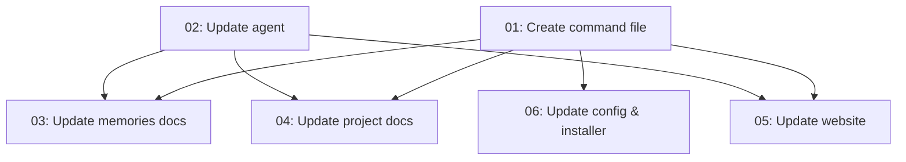

# Spec: /crux-forget Command

## Status
Completed

## Overview
Add a `/crux-forget` command to the CRUX memories system, providing users with a direct way to remove incorrect, outdated, or unwanted memories from the corpus. Currently, memory deletion is only available as a secondary action within `/crux-mindreader`'s post-display menu. The `/crux-forget` command offers a first-class, purpose-built interface for memory removal — accepting memory IDs, slugs, file paths, or search queries as arguments.

## Key Decisions
- Decision 1: The command spawns a `crux-cursor-memory-manager` subagent (consistent with `/crux-dream` and `/crux-mindreader`)
- Decision 2: Deletion always requires user confirmation — no `--yolo` auto-delete mode, since forgetting is destructive and irreversible
- Decision 3: The command delegates to the existing `crux-skill-memory-crud` Delete operation, which already handles memory file removal and reference tracker cleanup
- Decision 4: The memory index is rebuilt after every delete batch via `crux-skill-memory-index`
- Decision 5: The command file (`.cursor/commands/crux-forget.md`) will be added to `RELEASE_FILES` and `standard_files` in `install.py`, and to `DEFAULT_MEMORIES_CONFIG` commands list. Per the zip-contents-protection rule, the agent must **not** add it to `scripts/create-crux-zip.py` or `version-bump.yml RELEASE_PATHS` without explicit user request — the subtask should flag this for the user.

## Requirements
1. Create `.cursor/commands/crux-forget.md` command definition file
2. Add Forget mode to the memory manager agent (`.cursor/agents/crux-cursor-memory-manager.md`)
3. Add the forget command to the commands table in `docs/crux-memories.md`
4. Add the forget command to the Memory Commands table in `README.md`
5. Add the new command file to the distributed files tables in `CONTRIBUTORS.md`
6. Update `AGENTS.md` to mention Forget in the memory manager's purpose column
7. Add the forget command to the commands grid on `web/compress.md/memories.html`
8. Add a `forget` entry to the `commands` section in `.crux/crux-memories.json`
9. Update `install.py` to include the new command file in `RELEASE_FILES`, `standard_files`, and `DEFAULT_MEMORIES_CONFIG`
10. Regenerate `install.crux.md` after `install.py` changes

## Subtask Manifest

Every subtask is listed here with its file, assigned agent, dependencies, and phase.
Subtask IDs are numbered in dependency order — lower IDs never depend on higher IDs.

| ID | File | Subagent | Dependencies | Phase | Status |
|----|------|----------|-------------|-------|--------|
| 01 | `subtask-01-crux-forget-create-command-20260406.md` | generalPurpose | — | 1 | Done |
| 02 | `subtask-02-crux-forget-update-agent-20260406.md` | generalPurpose | — | 1 | Done |
| 03 | `subtask-03-crux-forget-update-memories-docs-20260406.md` | generalPurpose | 01, 02 | 2 | Done |
| 04 | `subtask-04-crux-forget-update-project-docs-20260406.md` | generalPurpose | 01, 02 | 2 | Done |
| 05 | `subtask-05-crux-forget-update-website-20260406.md` | generalPurpose | 01, 02 | 2 | Done |
| 06 | `subtask-06-crux-forget-update-config-installer-20260406.md` | generalPurpose | 01 | 2 | Done |

## Subtask Dependency Graph

## Execution Order

Phases are derived from the dependency graph. Subtasks within a phase have no
dependencies on each other and may run in parallel. A phase starts only after
all subtasks in prior phases are complete.

### Phase 1 (Parallel)
| ID | Subagent | Description |
|----|----------|-------------|
| 01 | generalPurpose | Create the `/crux-forget` command definition file |
| 02 | generalPurpose | Add Forget mode to the memory manager agent |

### Phase 2 (after Phase 1)
| ID | Subagent | Description |
|----|----------|-------------|
| 03 | generalPurpose | Update `docs/crux-memories.md` with forget command documentation |
| 04 | generalPurpose | Update `README.md`, `CONTRIBUTORS.md`, and `AGENTS.md` |
| 05 | generalPurpose | Update `web/compress.md/memories.html` with forget command |
| 06 | generalPurpose | Update `.crux/crux-memories.json`, `install.py`, and regenerate `install.crux.md` |

## Definition of Done
- [x] `.cursor/commands/crux-forget.md` exists and follows the pattern of existing commands
- [x] Memory manager agent has a Forget mode section
- [x] All documentation files updated (README, CONTRIBUTORS, AGENTS, crux-memories docs)
- [x] Website memories page includes the forget command
- [x] Config and installer include the new command
- [x] All subtasks completed
- [x] No linter errors in modified files

## Execution Notes
- **Executed**: 2026-04-06 22:59:05 – 23:09:37 UTC (10m 32s)
- **All 6 subtasks**: Done and adversarially verified
- **Tests**: 247 passed, 0 failed
- **Linter**: Clean across all 10 modified files
- **Outstanding**: `.cursor/commands/crux-forget.md` not yet in release zip — requires explicit user request per zip-contents-protection rule
