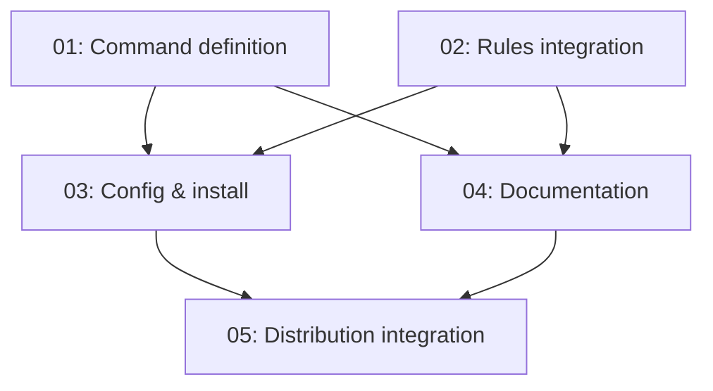

# Spec: CRUX Amnesia — Session-Scoped Memory Suppression

## Status
Completed

## Overview

`/crux-amnesia` is a session-scoped toggle that suppresses ambient CRUX memory usage without modifying any persistent state. It is architecturally unique among memory commands because it operates entirely within the chat session — it does **not** spawn the `crux-cursor-memory-manager` agent, does **not** write to disk, and does **not** modify configuration. It exists as a lightweight override that takes precedence over `enableMemories: "true"` in `.crux/crux-memories.json`.

### Design Rationale

The amnesia command addresses a common user need: temporarily disabling the memory system during sessions where ambient memory loading, annotation, and reference tracking would be distracting or unwanted — without permanently disabling the feature via config. Because it is session-scoped, closing the chat window implicitly restores normal behavior.

### What Amnesia Suppresses

When amnesia mode is active, the following ambient behaviors are suppressed for the remainder of the chat session:

1. **Memory discovery** — agents do not read `.crux/memory-index.yml` to find relevant memories
2. **Memory loading** — agents do not load `*.memory.md` or `*.memory.crux.md` files
3. **Output annotation** — agents do not add `[memory:{title}]` markers to their output
4. **Reference tracking** — agents do not increment reference counters via the reference-tracker skill
5. **Dream nudges** — agents do not suggest `/crux-dream` automatically after ordinary work
6. **Subagent inheritance** — subagents spawned for ordinary work inherit the amnesia state and suppress ambient memory usage too

### What Amnesia Does NOT Suppress

Explicit user intent to interact with the memory system is always respected. The following commands work normally even under amnesia:

- `/crux-dream` — extract or rebalance memories
- `/crux-recall` — inspect memories
- `/crux-forget` — remove memories
- `/crux-remember` — create ad-hoc memories
- `/crux-meditate` — recursive memory-informed exploration

### Invocation Modes

| Invocation | Behavior |
|------------|----------|
| `/crux-amnesia` | Toggle amnesia on/off |
| `/crux-amnesia on` | Enable amnesia for this session |
| `/crux-amnesia off` | Disable amnesia for this session |
| `/crux-amnesia status` | Show current amnesia state |

### Response Format

The command responds with a short status confirmation:
- **Session memory mode**: `amnesia-on` or `config-driven`
- **Scope**: current chat session only
- **Subagents**: inherit the same session memory mode unless the user explicitly invokes a memory-management command
- **Repo config**: unchanged (`.crux/crux-memories.json` was not modified)

### Key Architectural Properties

1. **No agent spawn** — unlike `/crux-dream`, `/crux-recall`, `/crux-remember`, `/crux-meditate`, and `/crux-forget`, amnesia does NOT delegate to the `crux-cursor-memory-manager` subagent
2. **No persistent state** — amnesia NEVER modifies `.crux/crux-memories.json`, memory files, trackers, or the memory index
3. **Session-only scope** — closing the chat implicitly restores normal behavior
4. **Override precedence** — amnesia ON takes precedence over `enableMemories: "true"` in config
5. **Config fallback** — amnesia OFF returns to config-driven behavior; if `enableMemories` is `"false"`, memories remain disabled

## Changes Made in This Session (20260425)

1. Added `/crux-remember` and `/crux-meditate` to the amnesia override exceptions list in `.cursor/commands/crux-amnesia.md` and `.cursor/rules/crux-memories-integration.md`
2. Added `crux-amnesia.md` to `DIST_FILES` in `scripts/create-crux-zip.py` (was previously missing from the distribution zip)
3. Updated cross-references in Related sections of sibling commands

## Implementation Across Files

| File | Role |
|------|------|
| `.cursor/commands/crux-amnesia.md` | Command definition — usage, argument handling, behavior spec |
| `.cursor/rules/crux-memories-integration.md` | Source rule — amnesia override section defines suppression behavior |
| `.cursor/rules/crux-memories-integration.crux.mdc` | CRUX-compressed rule — generated from source, includes `Φ.amnesia` block |
| `.crux/crux-memories.json` | Config — `commands.amnesia` entry with file path and description |
| `install.py` | Installer — amnesia in `MEMORY_FILE_PREFIXES`, fallback file list, and `DEFAULT_MEMORIES_CONFIG` |
| `README.md` | User documentation — amnesia command rows, session override prose |
| `docs/crux-memories.md` | Detailed documentation — contract table, platform mappings |
| `web/compress.md/memories.html` | Web documentation — command reference |
| `evals/USER_EVAL_CHECKLISTS.md` | Testing — amnesia eval scenarios |
| `scripts/create-crux-zip.py` | Distribution — `DIST_FILES` entry ensures inclusion in release zip |

## Subtask Manifest

| ID | File | Subagent | Dependencies | Phase | Status |
|----|------|----------|-------------|-------|--------|
| 01 | `subtask-01-crux-amnesia-command-definition-20260425.md` | crux-software-engineer | — | 1 | Done |
| 02 | `subtask-02-crux-amnesia-rules-integration-20260425.md` | crux-software-engineer | — | 1 | Done |
| 03 | `subtask-03-crux-amnesia-config-install-20260425.md` | crux-software-engineer | 01, 02 | 2 | Done |
| 04 | `subtask-04-crux-amnesia-documentation-20260425.md` | crux-platform-architect | 01, 02 | 2 | Done |
| 05 | `subtask-05-crux-amnesia-dist-integration-20260425.md` | crux-software-engineer | 03, 04 | 3 | Done |

## Subtask Dependency Graph

## Execution Order

### Phase 1 — Core Definition (Parallel)
| ID | Subagent | Description |
|----|----------|-------------|
| 01 | crux-software-engineer | Command file — session toggle, on/off/status/toggle modes, no agent spawn |
| 02 | crux-software-engineer | Rules integration — amnesia override section in `crux-memories-integration.md`, compressed rule |

### Phase 2 — Config, Install & Documentation (Parallel, after Phase 1)
| ID | Subagent | Description |
|----|----------|-------------|
| 03 | crux-software-engineer | Config entry in `crux-memories.json`, `MEMORY_FILE_PREFIXES` and fallback list in `install.py` |
| 04 | crux-platform-architect | README, docs, web, evals, cross-references in sibling commands |

### Phase 3 — Distribution (after Phase 2)
| ID | Subagent | Description |
|----|----------|-------------|
| 05 | crux-software-engineer | Added to `DIST_FILES` in `scripts/create-crux-zip.py` |

## Definition of Done
- [x] All subtasks completed
- [x] Command file exists at `.cursor/commands/crux-amnesia.md` with full behavior spec
- [x] Amnesia override section exists in `.cursor/rules/crux-memories-integration.md`
- [x] CRUX-compressed rule includes `Φ.amnesia` block
- [x] Config entry exists at `commands.amnesia` in `.crux/crux-memories.json`
- [x] Installer includes amnesia in `MEMORY_FILE_PREFIXES` and fallback list
- [x] Documentation updated in README, docs, web, and evals
- [x] All five explicit memory commands listed as amnesia exceptions
- [x] Command included in distribution zip via `DIST_FILES`

## Rollback Plan
All changes are additive text changes and file list additions. Rollback via `git checkout` of the affected files.

## Execution Notes
This is a reverse-engineered spec documenting the complete `/crux-amnesia` feature as implemented. The feature was built incrementally across multiple sessions. This spec captures the final state including session-day updates (adding `/crux-remember` and `/crux-meditate` to exceptions, adding the command to the distribution zip).
