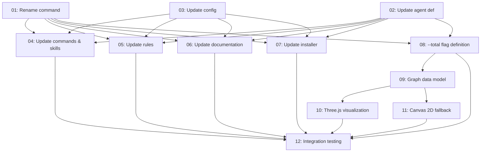

# Assessment: CRUX Recall — Rename & Memory Visualization

**Assessed**: 2026-04-25
**Assessor**: zoto-spec-judge (adversarial, fresh context)
**Spec**: `specs/20260425-crux-recall/spec-crux-recall-20260425.md`

## Verdict: Conditional (3.3 / 5.0)

The subtask content is well-researched and detailed, with thorough file coverage for the rename operation and thoughtful architectural decisions for the visualization feature. However, a **critical structural defect** — the spec index manifest is completely out of sync with the actual subtask files on disk — must be fixed before execution. The executor will fail on filename lookups and dependency resolution.

---

## Dimension Scores

| Dimension | Score | Weight | Weighted |
|-----------|-------|--------|----------|
| Completeness | 4.0 | 20% | 0.80 |
| Feasibility | 3.5 | 20% | 0.70 |
| Structure | 2.0 | 20% | 0.40 |
| Specificity | 4.5 | 15% | 0.68 |
| Risk Awareness | 3.0 | 15% | 0.45 |
| Convention Compliance | 3.0 | 10% | 0.30 |
| **Overall** | | | **3.3** |

---

## Critical Findings

### FINDING-1: Manifest/File Mismatch (Severity: BLOCKER)

The spec index manifest table lists 8 subtasks with specific filenames, but 12 subtask files exist on disk with **different names and different content** starting from subtask 03. The executor resolves subtask files by reading the manifest's `File` column — every mismatch will cause a "file not found" failure.

| Manifest ID | Manifest Filename | Actual File on Disk | Match? |
|---|---|---|---|
| 01 | `subtask-01-crux-recall-rename-command-20260425.md` | Same | OK |
| 02 | `subtask-02-crux-recall-update-agent-definition-20260425.md` | Same | OK |
| 03 | `subtask-03-crux-recall-update-config-rules-20260425.md` | `subtask-03-crux-recall-update-config-20260425.md` | MISMATCH |
| 04 | `subtask-04-crux-recall-update-documentation-20260425.md` | `subtask-04-crux-recall-update-commands-and-skills-20260425.md` | MISMATCH |
| 05 | `subtask-05-crux-recall-add-total-flag-20260425.md` | `subtask-05-crux-recall-update-rules-20260425.md` | MISMATCH |
| 06 | `subtask-06-crux-recall-threejs-visualization-20260425.md` | `subtask-06-crux-recall-update-documentation-20260425.md` | MISMATCH |
| 07 | `subtask-07-crux-recall-canvas-2d-fallback-20260425.md` | `subtask-07-crux-recall-update-installer-packaging-20260425.md` | MISMATCH |
| 08 | `subtask-08-crux-recall-integration-testing-20260425.md` | `subtask-08-crux-recall-implement-total-flag-20260425.md` | MISMATCH |
| — | Not in manifest | `subtask-09-crux-recall-memory-graph-data-model-20260425.md` | ORPHAN |
| — | Not in manifest | `subtask-10-crux-recall-threejs-visualization-20260425.md` | ORPHAN |
| — | Not in manifest | `subtask-11-crux-recall-canvas-2d-fallback-20260425.md` | ORPHAN |
| — | Not in manifest | `subtask-12-crux-recall-integration-testing-20260425.md` | ORPHAN |

**Fix required**: Rebuild the manifest table, dependency graph, and phase assignments to match the 12 subtask files that actually exist on disk.

### FINDING-2: Dependency Graph Invalid (Severity: BLOCKER)

The Mermaid dependency graph and phase descriptions in the spec index describe the 8-subtask plan. Since the actual files implement a 12-subtask plan with different scoping, the dependency graph is wrong. Examples:

- Manifest says subtask 05 ("add --total flag") depends on 01, 02. On disk, subtask 05 is "update rules" which depends on 01, 02, 03.
- Manifest says subtask 08 ("integration testing") depends on 04, 06, 07. On disk, subtask 08 is "implement --total flag" which depends on 01, 02.
- Subtasks 09–12 have no dependency entries in the manifest at all.

**Fix required**: Rewrite the dependency graph and phase table to reflect the actual 12-subtask structure on disk.

### FINDING-3: Subtask 12 Dependency Chain Gap (Severity: HIGH)

On-disk subtask 12 (integration testing) lists dependencies `04, 05, 06, 07, 10, 11` but omits subtask 08 (implement --total flag) and subtask 09 (memory graph data model). Since subtask 10 depends on 09 which depends on 08, the transitive dependencies are covered, but the explicit dependency list should include 08 for correctness — the integration test verifies the `--total` flag definition directly, not just the visualization output.

**Fix**: Add `08` to subtask 12's dependency list.

---

## High-Priority Findings

### FINDING-4: Memory Index Path Mismatch (Severity: HIGH)

The memory index (`.crux/memory-index.yml`) lists file paths using the `.memory.md` extension (e.g., `memories/core/archive-source-before-compression.memory.md`), but all 11 memory files on disk use the `.memory.crux.md` extension (compressed). The data pipeline in subtask 09 must handle this discrepancy — reading the index, attempting to open the listed path, and falling back to the `.crux.md` variant when the `.md` file doesn't exist. Neither the spec overview nor subtask 09 acknowledges this.

**Fix**: Add a fallback resolution note to subtask 09's implementation notes: "When reading memory files by path from the index, if the `.memory.md` path does not exist, check for a `.memory.crux.md` variant. Mark these as `compressed: true` in the node data."

### FINDING-5: `crux-release-files.json` Historical Entry Handling (Severity: HIGH)

Subtask 07 says to update `.crux/crux-release-files.json`, but this file contains **historical release manifests** dating back to v2.2.0. Entries for releases 2.8.5–2.9.1 correctly reference `crux-mindreader.md` because that was the actual filename at release time. Renaming these historical entries would falsify the release audit trail.

The correct approach is:
1. Do NOT modify historical release entries — they are accurate for their version
2. The next `version-bump` workflow will automatically record `crux-recall.md` in the new release entry
3. The `allFiles` index at the bottom of the file will naturally grow a new `crux-recall.md` entry

**Fix**: Clarify in subtask 07 that only the `dist-manifest.json` (current file listing) should be updated. Historical release entries in `crux-release-files.json` must NOT be modified.

### FINDING-6: Canvas SDK `computeDAGLayout` API Unverified (Severity: HIGH)

Subtask 11 assumes `computeDAGLayout` accepts `{nodes: [{id, label}], edges: [{source, target}]}` and returns positioned nodes suitable for SVG rendering. This API shape is plausible but not verified against the actual Cursor canvas SDK. If the API differs, the entire Canvas 2D fallback approach collapses.

**Fix**: Add a verification step to subtask 11: "Before implementing, check the canvas SDK's actual `computeDAGLayout` signature by examining existing `.canvas.tsx` files in the workspace or Cursor documentation. If the API differs, adjust the approach accordingly."

### FINDING-7: `file://` URL Browser Security Restriction (Severity: MEDIUM-HIGH)

Subtask 10 instructs the agent to open the generated HTML via `browser_navigate` to a `file:///` URL. Browser MCP tools may block `file://` URLs due to security restrictions. The spec offers `.ai-ignored/crux-recall-total.html` as an alternative path but doesn't specify a fallback strategy if `file://` navigation fails.

**Fix**: Add a fallback note: "If `file://` navigation fails, try serving the file via a local HTTP server (e.g., `python -m http.server`) and navigating to `http://localhost:PORT/crux-recall-total.html`."

---

## Medium-Priority Findings

### FINDING-8: Subtask 08 Internal Cross-References Use 12-Subtask Numbering

On-disk subtask 08 (implement --total flag) references "subtask 10" and "subtask 11" in its deliverables checklist items 3 and 4. These references assume the 12-subtask numbering scheme. If the manifest is reconciled to a different numbering, these references become dangling.

**Fix**: When reconciling the manifest, ensure internal cross-references within subtask files are updated to match.

### FINDING-9: `install.crux.md` Regeneration Is a Firm Requirement

Subtask 07 hedges on `install.crux.md` regeneration: "if regeneration is impractical in this subtask, note it as a follow-up." Since `install.crux.md` is in the `dist-manifest.json` file list and is shipped in release zips, leaving it stale after modifying `install.py` violates the repo's CRUX file synchronization rules. It must be regenerated in the same subtask.

**Fix**: Remove the hedge. Make regeneration a firm deliverable in subtask 07, or add it as a dependency of subtask 12 (integration testing).

### FINDING-10: Subtask 09 Could Be Merged with 08

Subtask 09 (memory graph data model) defines a TypeScript interface and edge construction algorithm that are essentially agent definition instructions. Since subtask 08 already modifies the same files (command file + agent definition) to add the `--total` flag, the data model documentation is logically part of that same change. Merging would reduce coordination overhead and agent context switching.

However, keeping them separate is defensible if the goal is to allow the visualization subtasks (10, 11) to start from a clean data model specification. Recommend keeping separate but documenting the rationale.

### FINDING-11: `evals/USER_EVAL_CHECKLISTS.md` Has 38 References

This file has the highest reference density (38 occurrences of "mindreader") among all affected files. The spec's subtask 06 correctly identifies it but doesn't warn about the volume. An executing agent might underestimate the scope.

**Fix**: Add a note to subtask 06: "`evals/USER_EVAL_CHECKLISTS.md` contains ~38 mindreader references and will require thorough find-and-replace."

---

## Positive Observations

1. **Comprehensive file coverage**: The subtasks collectively cover all 21 files that contain "mindreader" references (verified by independent grep), totaling ~134 individual references.

2. **Well-justified architectural decisions**: The Three.js CDN delivery approach, the Canvas 2D fallback design, and the edge construction algorithm are all well-reasoned and clearly documented.

3. **CRUX file protection compliance**: The spec correctly identifies which files are CRUX-generated and instructs agents to edit source files + regenerate, not edit generated files directly (subtask 05 for rules, subtask 07 for install.crux.md).

4. **Granular subtask scoping**: The rename work is split into logical groups (command file, agent, config, cross-references, rules, docs, installer) that can execute independently within their phase.

5. **Historical spec protection**: Multiple subtasks correctly note that `specs/20260406-crux-forget/` files must NOT be modified (audit trail).

6. **Detailed implementation notes**: Subtask 09's TypeScript interfaces, color mapping, and edge algorithm; subtask 10's HTML structure and 3d-force-graph library choice; subtask 11's Canvas SDK component listing — all provide concrete implementation guidance.

7. **Testing strategy**: Each subtask includes a focused testing strategy that avoids triggering global test suites during parallel execution, reserving the full suite for the final integration subtask.

---

## Recommended Corrected Structure

The actual 12 subtask files on disk should be reflected in the manifest with this dependency and phase structure:

### Phase 1 — Core Rename (Parallel)
| ID | Subtask | Dependencies |
|----|---------|-------------|
| 01 | Rename command file | — |
| 02 | Update agent definition | — |
| 03 | Update config | — |

### Phase 2 — Cross-Reference Rename (Parallel, after Phase 1)
| ID | Subtask | Dependencies |
|----|---------|-------------|
| 04 | Update commands & skills cross-references | 01, 02, 03 |
| 05 | Update rules + regenerate CRUX | 01, 02, 03 |
| 06 | Update documentation | 01, 02, 03 |
| 07 | Update installer & packaging | 01, 02, 03 |

### Phase 3 — Feature Definition (after Phase 2)
| ID | Subtask | Dependencies |
|----|---------|-------------|
| 08 | Implement --total flag definition | 01, 02 |

### Phase 4 — Visualization Data (after Phase 3)
| ID | Subtask | Dependencies |
|----|---------|-------------|
| 09 | Memory graph data model | 08 |

### Phase 5 — Visualization Implementation (Parallel, after Phase 4)
| ID | Subtask | Dependencies |
|----|---------|-------------|
| 10 | Three.js 3D visualization | 09 |
| 11 | Canvas 2D fallback | 09 |

### Phase 6 — Integration Testing (after Phases 2 + 5)
| ID | Subtask | Dependencies |
|----|---------|-------------|
| 12 | Integration testing | 04, 05, 06, 07, 08, 10, 11 |

Note: Phase 3 (subtask 08) only needs subtasks 01 and 02 as dependencies (the renamed command file and updated agent definition). It does not need the cross-reference work in Phase 2 to complete. This means Phase 2 and Phase 3 can run concurrently.

**Corrected dependency graph:**

---

## Summary of Required Fixes Before Execution

| # | Finding | Severity | Fix |
|---|---------|----------|-----|
| 1 | Manifest/file mismatch | BLOCKER | Rebuild manifest table with all 12 subtask files and correct filenames |
| 2 | Dependency graph invalid | BLOCKER | Rewrite graph and phase assignments for 12-subtask structure |
| 3 | Subtask 12 missing dependency on 08 | HIGH | Add `08` to subtask 12's dependency list |
| 4 | Memory index path mismatch | HIGH | Add `.crux.md` fallback note to subtask 09 |
| 5 | Historical release entries | HIGH | Clarify subtask 07 must not modify historical entries in `crux-release-files.json` |
| 6 | Canvas SDK API unverified | HIGH | Add verification step to subtask 11 |
| 7 | `file://` URL restriction | MEDIUM-HIGH | Add HTTP server fallback to subtask 10 |
| 8 | Internal cross-references | MEDIUM | Reconcile subtask 08's references to 10/11 |
| 9 | `install.crux.md` hedge | MEDIUM | Make regeneration a firm requirement |
| 10 | Merge consideration for 08+09 | LOW | Keep separate but document rationale |
| 11 | Reference volume warning | LOW | Note ~38 references in `evals/USER_EVAL_CHECKLISTS.md` |
