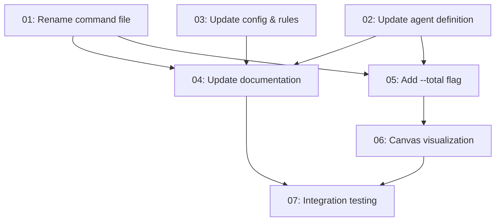

# Spec: CRUX Recall — Rename & Memory Visualization

## Status
Complete

## Overview
Two changes to the CRUX memory system:
1. **Rename** the `/crux-mindreader` command to `/crux-recall` across the entire codebase (command files, agent definitions, config, rules, documentation).
2. **Add `--total` parameter** to `/crux-recall` that generates an interactive force-directed visualization of the entire memory system, delivered as a Cursor canvas (`.canvas.tsx`).

## Key Decisions
- **Visualization delivery**: Use `/canvas` to generate the visualization.
- **Edge construction**: Shared tags and source specs determine edges. No runtime semantic similarity (too expensive).
- **Command name**: `/crux-recall` (user specified).

## Requirements
1. All references to `mindreader`/`MindReader`/`crux-mindreader` must be updated to `recall`/`Recall`/`crux-recall`
2. The `.cursor/commands/crux-mindreader.md` file must be renamed to `crux-recall.md`
3. The CRUX-compressed rule file `.cursor/rules/crux-memories-integration.crux.mdc` must be regenerated from its updated source
4. The `--total` flag must generate an interactive force-directed graph visualization using `/canvas`
5. Nodes represent memories: size ∝ strength, color = type, label = title
6. Edges connect memories sharing tags or source specs; edge thickness ∝ connection strength
7. Interactions: click node → detail panel, hover → highlight, search/filter by type/tag/keyword, force simulation controls
8. Data pipeline reads `.crux/memory-index.yml`, all memory files from `memories/{type}/`, decompresses CRUX-compressed memories

## Subtask Manifest

Every subtask is listed here with its file, assigned agent, dependencies, and phase.
Subtask IDs are numbered in dependency order — lower IDs never depend on higher IDs.

| ID | File | Subagent | Dependencies | Phase | Status |
|----|------|----------|-------------|-------|--------|
| 01 | `subtask-01-crux-recall-rename-command-20260425.md` | crux-software-engineer | — | 1 | Done |
| 02 | `subtask-02-crux-recall-update-agent-definition-20260425.md` | crux-software-engineer | — | 1 | Done |
| 03 | `subtask-03-crux-recall-update-config-rules-20260425.md` | crux-software-engineer | — | 1 | Done |
| 04 | `subtask-04-crux-recall-update-documentation-20260425.md` | crux-platform-architect | 01, 02, 03 | 2 | Done |
| 05 | `subtask-05-crux-recall-add-total-flag-20260425.md` | crux-software-engineer | 01, 02 | 2 | Done |
| 06 | `subtask-06-crux-recall-canvas-visualization-20260425.md` | crux-software-engineer | 05 | 3 | Done (covered by 05) |
| 07 | `subtask-07-crux-recall-integration-testing-20260425.md` | crux-software-engineer | 04, 06 | 4 | Done |

## Subtask Dependency Graph

## Execution Order

Phases are derived from the dependency graph. Subtasks within a phase have no
dependencies on each other and may run in parallel. A phase starts only after
all subtasks in prior phases are complete.

### Phase 1 — Rename (Parallel)
| ID | Subagent | Description |
|----|----------|-------------|
| 01 | crux-software-engineer | Rename `.cursor/commands/crux-mindreader.md` → `crux-recall.md`, update all internal references |
| 02 | crux-software-engineer | Update `.cursor/agents/crux-cursor-memory-manager.md` — rename MindReader Mode → Recall Mode, update all `/crux-mindreader` references |
| 03 | crux-software-engineer | Update `.crux/crux-memories.json` (rename `commands.mindReader` → `commands.recall`), update `.cursor/rules/crux-memories-integration.md`, regenerate `.crux.mdc` |

### Phase 2 — Documentation & --total Definition (Parallel, after Phase 1)
| ID | Subagent | Description |
|----|----------|-------------|
| 04 | crux-platform-architect | Update `README.md`, `AGENTS.md`, and any other documentation referencing mindreader |
| 05 | crux-software-engineer | Add `--total` parameter to `/crux-recall` command definition and agent Recall Mode section |

### Phase 3 — Canvas Visualization (after Phase 2)
| ID | Subagent | Description |
|----|----------|-------------|
| 06 | crux-software-engineer | Implement Cursor canvas visualization — `.canvas.tsx` with inline force simulation, SVG rendering, interactive memory graph, all data embedded |

### Phase 4 — Integration (after Phase 3)
| ID | Subagent | Description |
|----|----------|-------------|
| 07 | crux-software-engineer | Integration testing — verify rename completeness, `--total` generates working canvas visualization |

## Definition of Done
- [x] All subtasks completed
- [x] All tests passing (the project's test suite) — 296/296 passed
- [x] No linter errors in modified files
- [x] Documentation updated as needed
- [x] No remaining references to `mindreader` (case-insensitive grep returns zero hits, excluding spec files, git history, and historical release records)

## Rollback Plan
All changes are file renames and text replacements. Rollback via `git checkout` of the affected files.

## Execution Notes
All 7 subtasks completed successfully. Integration testing (subtask 07) verified:
- Zero remaining `mindreader` references outside historical release records
- All key files updated: command, agent definition, config, rules (source + CRUX), README, CONTRIBUTORS, install.py, install.crux.md, docs/crux-memories.md, web/memories.html
- `--total` flag documented in command, agent definition, and README
- Canvas visualization created with 11 memory nodes, tag-based edges, interactive features
- Full test suite: 296 passed, 0 failed
- Zero linter errors across all modified files
