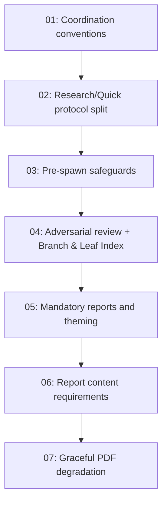

# Spec: Meditate Research-Mode Overhaul

## Status
Completed

## Repository
Target: [github.com/zotoio/CRUX-Compress](https://github.com/zotoio/CRUX-Compress)

This spec is portable. Each subtask is fully self-contained — it includes the canonical content excerpts to apply, plus precise acceptance criteria. An executor in any clone of CRUX-Compress can apply these changes without referencing the originating workspace. All edits target two files:

- `.cursor/commands/crux-meditate.md`
- `.cursor/agents/crux-cursor-memory-manager.md`

No code is modified. The `meditations/` working directories listed in the docs are runtime artifacts produced by `/crux-meditate` invocations after this spec lands; the spec itself does not create them.

## Overview

This spec elevates `/crux-meditate` from a fast parallel-fanout exploration into a deliberate **deep research** tool with rigorous user safeguards, deep-research semantics, anti-homogenisation in output, and mandatory HTML + PDF artefacts that gracefully degrade interactive components for print.

The result is a single command (`/crux-meditate`) that, in its new default **Research mode**, spawns a depth-first 3×3×3 recursive research tree (~45 agents), runs an adversarial review-and-fix cycle, and produces themed, light/dark, responsive HTML reports plus high-contrast PDFs with a clickable table of contents — all behind explicit cost-acknowledgment and facet-confirmation gates so the user opts in deliberately and steers the exploration.

The previous fast behaviour is preserved as `--quick` mode. Both modes share every safeguard (cost ack, theme preflight, facet confirmation, mandatory citations, adversarial review, mandatory reports) — Quick mode only relaxes Research-specific machinery (peer review, citation respawn enforcement, global facet registry).

## Key Decisions

- **Research mode is the new default**; `--quick` opt-in preserves the prior parallel-fanout behaviour for cases where speed matters more than rigor. Both modes share every user-facing safeguard.
- **Three mandatory user gates run before any subagent spawns**: Cost & Scope Acknowledgment → Theme Preflight (askQuestion sequence) → (after subagent derives 3 facets) Facet Confirmation. Every gate uses `askQuestion`; Pattern A (pre-collected) for cost/theme, Pattern B (work first, then escalate) for facet confirmation.
- **Citations are mandatory in both modes** — every output file must include a `## Citations` section plus inline markers. Research mode enforces strictly (parent re-spawns offending children); Quick mode validates best-effort (warn-only).
- **Adversarial review-and-fix cycle is mandatory before any report** — a fresh `crux-cursor-memory-manager` subagent in Adversarial Review function audits all output files across 10 dimensions, applies fixes, iterates up to 3 times. Reports are never built over a failing review.
- **HTML + PDF reports are mandatory artefacts** of every meditation, named `report-{topic-slug}-{ts}.{html,pdf}` (sharing the same UTC timestamp).
- **Anti-Homogenisation Rules** explicitly forbid the recognisable AI-default look (purple-blue gradient hero, Inter-700, three-card grids, doughnut + tinted-circle legend, Tailwind indigo-500). Theming is collected upfront via the Theme Preflight `askQuestion` sequence with a `match_repo` short-circuit.
- **Reports support light AND dark mode** (default dark, persistent toggle); the **PDF renders with a high-contrast print theme** (near-black on near-white) and a **clickable Table of Contents** at the start linking every section.
- **D3.js is permitted alongside Chart.js** for facet-specific interactive visualisations (tree/sunburst/sankey/force-directed/choropleth/parallel coordinates etc.); every D3 chart must include a `.d3-static-fallback` print-state container with a meaningful static equivalent.
- **Interactive calculators are permitted** for any quantifiable trade-off; every calculator must include a `.calculator-static-fallback` print-state container with **3–5 pre-computed what-if scenarios** (typical / optimistic / pessimistic / threshold / recommended).
- **All branch/peer-review/report files use a self-describing on-disk naming convention** (`branch-{N}-depth-{D}-sub-{S}-{slug}-{yyyymmddHHMMSS}.md`, `report-{topic-slug}-{ts}.{html,pdf}`) so re-runs and regeneration are visible by absence rather than overwrite.
- **`facets.md` is the single navigational entry point** of every meditation — post-consolidation it is updated with a Branch & Leaf Index linking every artefact via relative markdown links.

## Requirements

1. The command MUST refuse to spawn anything until the user explicitly proceeds via the Cost & Scope Acknowledgment `askQuestion`. Mode swap and cancel must both be offered.
2. The command MUST collect a deliberate visual identity via a Theme Preflight `askQuestion` sequence (Q1 + Q1b match-repo or Q2/Q3/Q4 preset, Q5 confirm) before spawning the meditation subagent.
3. The depth-0 subagent MUST escalate the first 3 derived facets to the calling agent via Pattern B before spawning any branches; the user must explicitly confirm (or modify, regenerate, cancel).
4. Deep-level facet confirmation MUST be available as an opt-in via Q-Confirm-2 (`confirmDeepFacets ∈ {none, depth_2_only, all_levels}`) and propagated unchanged through every child via file-based `pending-facets-*.yml` / `confirmed-facets-*.yml` escalation.
5. Recursion MUST be depth-first within each branch in Research mode — children's subfocuses are derived from the parent's actual research findings, not pre-derived upfront.
6. Cross-branch facet uniqueness MUST be enforced globally in Research mode via an append-only `facet-registry.yml` plus a `mkdir`-based mutex.
7. Every output file MUST include a `## Citations` section plus inline markers. Research mode parents MUST validate child citations strictly (delete + respawn up to 2 retries); Quick mode parents log warnings.
8. Each parent in Research mode MUST **rewrite** its own file (not append) once its children return, weaving children's findings into a single coherent document with provenance markers.
9. After all 3 depth-1 branches complete in Research mode, 3 dedicated peer-review agents MUST run (one per branch, each reading the other two branches' files and writing a `branch-{N}-peer-review-{slug}-{ts}.md`).
10. After consolidation, the depth-0 manager MUST update `facets.md` to append a Branch & Leaf Index with relative markdown links to every file the meditation produced (globbed from disk so missing slots are visible by absence).
11. Before any report is generated, a fresh adversarial-review subagent MUST audit all output files across 10 dimensions, classify findings as MUST_FIX/SHOULD_FIX/ADVISORY, apply unambiguous fixes by rewriting offending files, and iterate up to 3 times. An `ESCALATE` outcome aborts report generation.
12. Every meditation MUST end with a non-empty paired `report-{topic-slug}-{ts}.html` AND `report-{topic-slug}-{ts}.pdf` (sharing the same UTC `{ts}`). Missing headless Chromium MUST cause a clear actionable error with platform-specific install hints, never a silent skip.
13. The HTML report MUST implement light AND dark mode (default dark, persistent toggle in `localStorage`), responsive navigation (horizontal grouped at ≥768px, burger drawer at <768px), an in-page Table of Contents driving the PDF index, ≥4 distinct chart visualizations (Chart.js + D3.js), ≥3 distinct hand-rolled HTML/CSS/SVG infographics, and ≥1 interactive calculator.
14. The PDF MUST render with a high-contrast print theme (near-black on near-white) and open with a clickable Table of Contents linking every section.
15. Every D3 chart MUST include a `.d3-static-fallback` print-state container that renders a meaningful static equivalent per the per-pattern degradation rules. Charts that cannot degrade are forbidden.
16. Every interactive calculator MUST include a `.calculator-static-fallback` print-state container with 3–5 pre-computed what-if scenarios. Empty fallbacks, single-scenario fallbacks, and input-only stubs are forbidden.
17. The Anti-Homogenisation Rules MUST be enforced in every report regardless of theming choice — purple-blue gradient hero, Inter-700, three-card grid as dominant layout, doughnut + tinted-circle legend, Tailwind indigo-500 accent, and lucide icon-in-tinted-circle motif are all forbidden as defaults.
18. All step references between `.cursor/commands/crux-meditate.md` and `.cursor/agents/crux-cursor-memory-manager.md` MUST be internally consistent after each subtask is applied.

## Subtask Manifest

Every subtask is listed here with its file, assigned agent, dependencies, and phase. Subtask IDs are numbered in dependency order — lower IDs never depend on higher IDs.

| ID | File | Subagent | Dependencies | Phase | Status |
|----|------|----------|-------------|-------|--------|
| 01 | `subtask-01-meditate-coordination-conventions-20260516.md` | crux-platform-architect | — | 1 | Done |
| 02 | `subtask-02-meditate-research-quick-protocol-20260516.md` | crux-platform-architect | 01 | 2 | Done |
| 03 | `subtask-03-meditate-pre-spawn-safeguards-20260516.md` | crux-platform-architect | 02 | 3 | Done |
| 04 | `subtask-04-meditate-adversarial-review-and-index-20260516.md` | crux-platform-architect | 03 | 4 | Done |
| 05 | `subtask-05-meditate-mandatory-reports-and-theming-20260516.md` | crux-platform-architect | 04 | 5 | Done |
| 06 | `subtask-06-meditate-report-content-requirements-20260516.md` | crux-platform-architect | 05 | 6 | Done |
| 07 | `subtask-07-meditate-graceful-pdf-degradation-20260516.md` | crux-platform-architect | 06 | 7 | Done |

## Subtask Dependency Graph

The dependency chain is **strictly serial** because every subtask edits the same two files (`.cursor/commands/crux-meditate.md` and `.cursor/agents/crux-cursor-memory-manager.md`) and later subtasks reference workflow steps and section conventions established by earlier ones.

## Execution Order

### Phase 1
| ID | Subagent | Description |
|----|----------|-------------|
| 01 | crux-platform-architect | Establish file naming, slug + timestamp conventions, glob-based polling, working-directory tree, and registry / lock / citations-index coordination files. Foundational — every later subtask references these conventions. |

### Phase 2 (after Phase 1)
| ID | Subagent | Description |
|----|----------|-------------|
| 02 | crux-platform-architect | Split Meditate Mode into **Research mode (default, depth-first, peer-reviewed, citation-validated)** and **Quick mode (`--quick`, parallel fan-out, warn-only citation enforcement)**. Add the global facet registry + `mkdir` mutex, mandatory citations in both modes, bottom-up rewrite incorporation in Research, dedicated peer-review pass in Research. |

### Phase 3 (after Phase 2)
| ID | Subagent | Description |
|----|----------|-------------|
| 03 | crux-platform-architect | Add the three pre-spawn user safeguards: **Cost & Scope Acknowledgment** (mandatory upfront askQuestion with proceed / mode-swap / cancel), **Theme Preflight** (5-question askQuestion sequence with `match_repo` short-circuit and an Anti-Homogenization Rules block), and **Facet Confirmation** (mandatory Pattern-B escalation of the first 3 derived facets, plus opt-in `confirmDeepFacets ∈ {none, depth_2_only, all_levels}`). |

### Phase 4 (after Phase 3)
| ID | Subagent | Description |
|----|----------|-------------|
| 04 | crux-platform-architect | Add the **mandatory adversarial review-and-fix cycle** (fresh subagent in Adversarial Review function, 10 dimensions, MUST_FIX/SHOULD_FIX/ADVISORY classification, iteration cap of 3, ESCALATE aborts reports). Update `facets.md` to act as the **single navigational entry point** by appending a Branch & Leaf Index post-consolidation with relative links to every artefact. |

### Phase 5 (after Phase 4)
| ID | Subagent | Description |
|----|----------|-------------|
| 05 | crux-platform-architect | Make HTML + PDF report generation **mandatory** in both modes. Add the report-filename convention (`report-{topic-slug}-{ts}.{html,pdf}` sharing UTC timestamp). Add the **theming application** layer driven by the Theme Preflight payload, plus **light + dark mode** (default dark, persistent toggle), **responsive navigation** (horizontal grouped at ≥768px, burger drawer at <768px), in-page **Table of Contents** driving the PDF index, and **high-contrast print theme** for the PDF render. Wire the headless-Chrome render command with `?print=1` and graceful Chromium-binary fallback. |

### Phase 6 (after Phase 5)
| ID | Subagent | Description |
|----|----------|-------------|
| 06 | crux-platform-architect | Document the **report content requirements**: ≥4 distinct chart visualizations (Chart.js + D3.js, with per-facet selection guidance), ≥3 distinct hand-rolled HTML/CSS/SVG infographics, ≥1 interactive calculator, filterable tables, citation-marker tooltips, peer-review section, citations section, footer with `theme:` annotation. Add the CDN allowlist (Chart.js, D3.js + plugins, optional fonts; no other external assets, no runtime fetches). |

### Phase 7 (after Phase 6)
| ID | Subagent | Description |
|----|----------|-------------|
| 07 | crux-platform-architect | Add the **graceful PDF degradation** contracts: every D3 chart needs a `.d3-static-fallback` populated per the per-pattern degradation rules; every interactive calculator needs a `.calculator-static-fallback` with 3–5 pre-computed what-if scenarios. Add the verification gate (sanity-render with `?print=1` and confirm every fallback is non-empty before the PDF is generated). |

## Definition of Done

- [x] All 7 subtasks completed and the Subtask Manifest reflects each subtask's final status
- [x] `.cursor/commands/crux-meditate.md` contains every section listed across the subtasks: Modes table, Argument Handling, Cost & Scope Acknowledgment, Theme Preflight, Facet Confirmation, Research Mode workflow steps, Quick Mode workflow notes, Branch & Leaf Index format, Adversarial Review and Fix Cycle, Report Generation (with subsections for filenames, inputs, HTML structure, anti-homogenization, theming application, light/dark mode, responsive navigation, other styling rules, PDF requirements with TOC and high-contrast theme), and the Related links footer
- [x] `.cursor/agents/crux-cursor-memory-manager.md` Meditate Mode section contains: invocation table, Mode selection note, Cost & Scope Acknowledgment Pattern-A note, Theming payload Pattern-A note, Facet confirmation Pattern-B note, Research mode workflow (steps 1–13), recursive exploration protocol (Phases A–G with Phase C deep-confirmation hook), depth-3 termination rule, facet registry protocol with `mkdir`-lock snippet, Citations protocol, peer review file format, Research-mode output file format, narrowing example, Quick mode subsection (top-level + depth 1/2 workflows + output file format), unified working-directory tree, polling glob list, and design principles (file-based coordination, 3-way fan-out, predictable paths, mandatory report artifacts, mandatory citations, navigational entry point, mandatory adversarial review, mandatory facet confirmation, mandatory cost & scope acknowledgment, visualizations + interactive elements with PDF degradation, light/dark + responsive nav, deliberate non-homogenised theming)
- [x] Step numbering is internally consistent across both files (Research mode workflow steps 1–13 in the agent file are mapped correctly to the command file's "Steps 1–8 subagent block (sub-steps 8.1–8.7) plus Steps 9–12 calling-agent block")
- [x] No references to the deprecated `report.html` / `report.pdf` literals (other than the explicit "Never hard-code these names" rule in the Report Filenames section)
- [x] No "Citations are encouraged" / "Citations optional" wording remains anywhere
- [x] No "Save as interactive HTML report" / "Save as PDF report" options remain in the Interactive Continuation askQuestion (reports are mandatory, not opt-in)
- [x] Linter clean on both files
- [x] All subtask Definition of Done checklists individually green

## Out of Scope

- The `crux-skill-memory-*` skill files (compress, crud, extract, index, rebalance, reference-tracker) are not modified by this spec.
- Other slash commands (`/crux-dream`, `/crux-recall`, `/crux-remember`, `/crux-forget`, `/crux-amnesia`) are not modified beyond any unavoidable cross-reference updates if they mention `/crux-meditate` (none do at present).
- The `AGENTS.md` repository root file is not modified — its references to `/crux-meditate` are descriptive enough to remain accurate without changes.
- The CRUX notation specification (`CRUX.md`) is not touched.
- No code (TypeScript, Python, shell scripts) is modified — this is a documentation-only spec.

## Execution Notes

This spec was generated 2026-05-16 from a working-session implementation of all 7 subtasks against a downstream clone. The originating workspace contains a reference implementation of every change at:
- `.cursor/commands/crux-meditate.md` (post-change, ~888 lines)
- `.cursor/agents/crux-cursor-memory-manager.md` (post-change, ~797 lines)

If you have access to that workspace you can cross-check your applied changes against the reference. Each subtask file below is, however, fully self-contained and includes the canonical content excerpts needed to apply the change without referencing the workspace.
