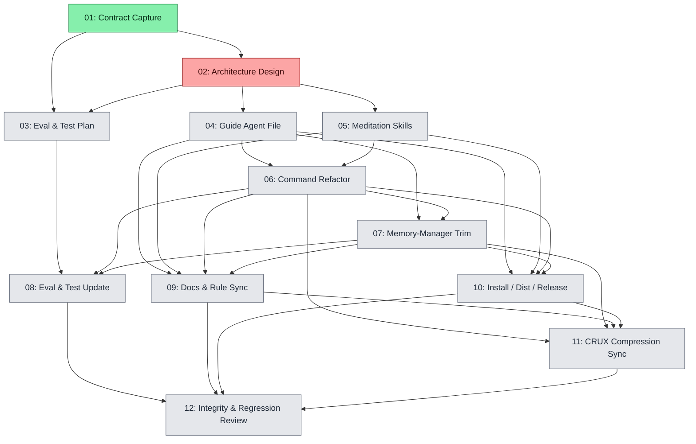

# Spec: Meditate Agent + Skill Decomposition

## Status
Completed

## Overview
Decompose the current `/crux-meditate` workflow — today implemented as a heavy
command file (`.cursor/commands/crux-meditate.md`) plus large meditate-specific
sections inside `crux-cursor-memory-manager.md` — into a clean three-layer
architecture:

1. **Thin coordinator command** (`/crux-meditate`) that owns argument parsing,
   calling-agent gates (depth, cost, theme), Pattern A/B coordination,
   ensemble orchestration, the continuation menu, and resume handling.
2. **A new dedicated agent** `crux-cursor-meditation-guide` that owns the
   Meditate persona, executable phase contracts, and is spawned by the
   coordinator command (Pattern B for tree work).
3. **A new family of `crux-skill-memory-meditation-*` skills** that the new
   agent loads on demand for each major sub-workflow (research phases, quick
   protocol, adversarial review, report generation, coordination, ensemble
   aggregation).

The change is **documentation-only at the meditate layer** (no Python or
runtime changes), but it touches: command file, two agent files, new skill
files, eval/test files, docs, install / dist / version-bump infrastructure,
and any CRUX-compressed mirrors that fall out of date when sources change.

The non-negotiable constraint is **functional preservation**: every current
user-facing behaviour, prompt, gate, mode, report, safeguard, and subagent
contract must remain intact after decomposition. The contract from the
recently-completed
`specs/20260516-meditate-research-mode-overhaul/` is the freeze line.

## Key Decisions

### K1. Three-layer split (command → guide agent → meditation skills)
- **Decision**: `/crux-meditate` becomes a thin coordinator. A new agent
  `crux-cursor-meditation-guide` owns the Meditate persona and tree
  execution. A new `crux-skill-memory-meditation-*` skill family hosts the
  reusable executable contracts.
- **Why**: Today the command and `crux-cursor-memory-manager.md` mirror each
  other character-for-character, which has caused drift risks. Pulling the
  Meditate-only material into a dedicated agent leaves the memory manager
  focused on Dream / REM / Recall / Remember / Forget, and unlocks future
  reuse (e.g. an explicit `/crux-research` shorthand) without touching the
  memory manager.

### K2. `crux-cursor-memory-manager.md` keeps Dream / REM / Recall / Remember / Forget
- **Decision**: Remove all Meditate-specific sections from
  `crux-cursor-memory-manager.md` (Phases A–G research, Quick 6-step,
  Ensemble Aggregation, Adversarial Review, Meditate-only invocation
  rows / examples) and replace each with a one-paragraph pointer to the
  new guide agent. Other lifecycle modes are untouched.
- **Why**: Single source of truth per agent. The `crux-cursor-memory-manager`
  table in `AGENTS.md` already advertises the Memory Manager as a
  generic lifecycle agent; meditate is the largest non-lifecycle workload
  living inside it today.

### K3. Skill family naming follows existing convention
- **Decision**: New skills live under
  `.cursor/skills/crux-skill-memory-meditation-{verb}/SKILL.md`, mirroring
  the existing `crux-skill-memory-{verb}` pattern (`-crud`, `-extract`,
  `-rebalance`, etc.). The approved skill set is exactly six skills:
  - `crux-skill-memory-meditation-research` — Phases A–G research tree,
    facet registry + lock, citations index, peer review.
  - `crux-skill-memory-meditation-quick` — `--quick` 6-step protocol
    (warn-only citations, upfront child derivation).
  - `crux-skill-memory-meditation-ensemble` — N-parallel-trees protocol
    + cross-model synthesis aggregation contract.
  - `crux-skill-memory-meditation-review` — 11-dimension adversarial
    review (≤3 iterations, severities, `MUST_FIX` `needs_user_input`
    schema with mandatory `context`).
  - `crux-skill-memory-meditation-report` — mandatory paired HTML / PDF
    reports, anti-homogenisation theming, Universal Contrast,
    light/dark/print, Chart.js / D3 / calculators with static fallbacks,
    headless Chrome → Chromium degradation.
  - `crux-skill-memory-meditation-coordination` — artefact filename
    table, prefix-glob polling rule, registry lock semantics, retro
    template, branch & leaf index template.
- **Why**: Convention-matching keeps memory-index discovery, install /
  dist enumeration, and AGENTS.md tables predictable. The guide agent is
  the only consumer of these skills, but other future agents could
  reuse e.g. `meditation-report` for similar long-form outputs. Executors
  must not add, remove, merge, or rename these six skills without a
  `needs_user_input` escalation and explicit user approval.

### K4. Calling-agent surface stays in the coordinator command
- **Decision**: The depth selection (`Q-Depth-Selection`), cost
  acknowledgment (`Q-Cost-Acknowledgment` and the expansion variant),
  theme preflight (Q1–Q5 + `theming:` YAML, `surprise_me` non-interactive
  fallback), facet confirmation resume (`Q-Confirm-1` / `Q-Confirm-2` and
  deep-YAML `confirmDeepFacets`), ensemble orchestration (model pool
  enumeration, parallel tree spawn, aggregator spawn), and the post-tree
  steps 9–12 (verify report pair, present paths, continuation menu,
  expansion / save-spec / end handling) all remain on the **calling
  agent / coordinator command side**.
- **Why**: These actions require `AskQuestion` and are forbidden inside
  tree subagents per the project-wide rule. Keeping them in the
  coordinator preserves Pattern A vs Pattern B integrity and avoids
  regressing the safeguards delivered by the 20260516 overhaul.

### K5. Functional-preservation freeze line
- **Decision**: Subtask 01 captures a frozen contract document recording
  every current mode, prompt, gate, safeguard, report element, retro
  field, citation rule, and subagent invocation row. Subsequent subtasks
  must trace each new artefact (agent file, skill file, command file) to
  contract items, and the integrity-review subtask diffs the final repo
  state against the freeze line.
- **Why**: "Lose no functionality" is only verifiable against an
  explicit contract. The 20260516 overhaul gives us most of it but
  is spread across an index + 7 subtasks + execution report; we
  consolidate into a single freeze document for this spec only.

### K6. Eval and test surface expanded, not replaced
- **Decision**: `evals/test_q_meditate.py`, `evals/test_p_amnesia.py`,
  `evals/sdk/tests/q-meditate.test.ts`, `evals/conftest.py` are updated
  in place. New assertion classes / test cases are **added** for the
  new agent + each new skill (presence, frontmatter shape, key
  substrings). Existing assertions are migrated, never deleted, unless
  the underlying contract genuinely moves (e.g. assertion that
  `crux-cursor-memory-manager` is spawned now becomes
  `crux-cursor-meditation-guide` is spawned).
- **Why**: Substring-presence tests are the project's contract anchor;
  rewriting them risks silent regressions.

### K7. Distribution & install opt-in (per zip-contents-protection rule)
- **Decision**: The new agent file and every new skill directory are
  added to `scripts/create-crux-zip.py` `DIST_FILES`,
  `install.py` `MEMORY_FILE_PREFIXES` and fallback file list,
  `.crux/dist-manifest.json` (regenerated), `CONTRIBUTORS.md` table,
  README docs, and `.github/workflows/version-bump.yml` `RELEASE_PATHS`
  if needed. This spec carries the **explicit user authorisation**
  required by the `zip-contents-protection` workspace rule.
- **Why**: New files shipped in the dist must be enumerated in all five
  surfaces or installs will silently miss them.

### K8. CRUX-compressed mirrors regenerated, never hand-edited
- **Decision**: If any source file with a `.crux.md` / `.crux.mdc`
  counterpart is modified (e.g. `.cursor/rules/crux-memories-integration.md`,
  `.cursor/rules/docs-sync.md`), regenerate the CRUX output via the
  `crux-cursor-rule-manager` agent. `AGENTS.md` is a source file and
  `AGENTS.crux.md` is not a maintained checked-in mirror in this repo; do
  not require or create it. Hand edits to generated files are forbidden by
  `_CRUX-RULE.mdc`.
- **Why**: Compressed mirrors are a recurring drift surface and must
  pass through the rule-manager agent, but regeneration scope is limited
  to existing maintained `.crux.md` / `.crux.mdc` mirrors only.

## Requirements

1. `/crux-meditate` must remain functionally identical from the user's
   perspective (modes, prompts, gates, reports, safeguards, retros,
   ensemble behaviour, subagent invocation patterns).
2. A new agent file `.cursor/agents/crux-cursor-meditation-guide.md`
   exists and contains the executable Meditate persona + Phases A–G,
   Quick, Ensemble Aggregation, and Adversarial Review contracts.
3. A new skill family `crux-skill-memory-meditation-*` exists under
   `.cursor/skills/`, with exactly the six approved skills listed in K3.
4. `.cursor/commands/crux-meditate.md` is reduced to a thin coordinator
   that delegates persona work to the new guide agent and references
   the new skills under `Related`.
5. `crux-cursor-memory-manager.md` no longer contains Meditate-specific
   sections; each removed section is replaced by a pointer to the
   guide agent.
6. All of `evals/test_q_meditate.py`, `evals/test_p_amnesia.py`,
   `evals/sdk/tests/q-meditate.test.ts`, and `evals/conftest.py` are
   updated to reflect the new agent / skill structure, with regression
   coverage for modes, gates, reports, and adversarial review.
7. `README.md`, `AGENTS.md` (agent table), `docs/crux-memories.md`, and
   `web/compress.md/memories.html` reflect the new architecture; any
   existing maintained `.crux.md` / `.crux.mdc` mirrors are regenerated.
8. `install.py`, `scripts/create-crux-zip.py`, `.crux/dist-manifest.json`,
   `CONTRIBUTORS.md`, and `.github/workflows/version-bump.yml`
   `RELEASE_PATHS` enumerate the new agent + skills.
9. The integrity-review subtask diffs the final repo state against the
   frozen contract from subtask 01 and reports zero functionality loss
   (or flags any deviations explicitly for user approval).

## Subtask Manifest

Every subtask is listed here with its file, assigned agent, dependencies, and phase.
Subtask IDs are numbered in dependency order — lower IDs never depend on higher IDs.

| ID | File | Subagent | Dependencies | Phase | Status |
|----|------|----------|-------------|-------|--------|
| 01 | `subtask-01-meditate-decomp-contract-capture-20260517.md` | crux-platform-architect | — | 1 | Done |
| 02 | `subtask-02-meditate-decomp-architecture-design-20260517.md` | crux-platform-architect | 01 | 2 | Partial |
| 03 | `subtask-03-meditate-decomp-eval-test-plan-20260517.md` | crux-platform-architect | 01, 02 | 3 | Pending |
| 04 | `subtask-04-meditate-decomp-guide-agent-20260517.md` | crux-software-engineer | 02 | 3 | Pending |
| 05 | `subtask-05-meditate-decomp-skills-extraction-20260517.md` | crux-software-engineer | 02 | 3 | Pending |
| 06 | `subtask-06-meditate-decomp-command-refactor-20260517.md` | crux-software-engineer | 04, 05 | 4 | Pending |
| 07 | `subtask-07-meditate-decomp-memory-manager-trim-20260517.md` | crux-software-engineer | 04, 06 | 5 | Pending |
| 08 | `subtask-08-meditate-decomp-eval-test-update-20260517.md` | crux-software-engineer | 03, 06, 07 | 6 | Pending |
| 09 | `subtask-09-meditate-decomp-docs-sync-20260517.md` | docs-sync-agent | 04, 05, 06, 07 | 6 | Pending |
| 10 | `subtask-10-meditate-decomp-install-dist-release-20260517.md` | crux-software-engineer | 04, 05, 06, 07 | 6 | Pending |
| 11 | `subtask-11-meditate-decomp-crux-compression-20260517.md` | crux-cursor-rule-manager | 06, 07, 09, 10 | 7 | Pending |
| 12 | `subtask-12-meditate-decomp-integrity-review-20260517.md` | integrity-expert | 08, 09, 10, 11 | 8 | Pending |

## Subtask Dependency Graph

## Execution Order

Phases are derived from the dependency graph. Subtasks within a phase have no
dependencies on each other and may run in parallel. A phase starts only after
all subtasks in prior phases are complete.

### Phase 1
| ID | Subagent | Description |
|----|----------|-------------|
| 01 | crux-platform-architect | Capture the frozen Meditate contract (modes, prompts, gates, reports, safeguards, retro, ensemble, adversarial review, subagent invocations) into a single freeze document inside the spec dir. |

### Phase 2 (after Phase 1)
| ID | Subagent | Description |
|----|----------|-------------|
| 02 | crux-platform-architect | Design the agent + skill boundary: which sections move from command and memory-manager into the new guide agent vs. each skill. Produce a section-mapping doc. |

### Phase 3 (after Phase 2 — parallel)
| ID | Subagent | Description |
|----|----------|-------------|
| 03 | crux-platform-architect | Capture the current eval / test surface and design the updated test plan (new assertion classes for guide agent + skills, regression coverage for modes, gates, reports, adversarial review). |
| 04 | crux-software-engineer | Implement `.cursor/agents/crux-cursor-meditation-guide.md` with persona + executable contracts moved from `crux-cursor-memory-manager.md`. |
| 05 | crux-software-engineer | Implement the six new skill directories under `.cursor/skills/crux-skill-memory-meditation-*/SKILL.md`. |

### Phase 4 (after Phase 3)
| ID | Subagent | Description |
|----|----------|-------------|
| 06 | crux-software-engineer | Refactor `.cursor/commands/crux-meditate.md` into a thin coordinator that delegates to the new guide agent and references the new skills. |

### Phase 5 (after Phase 4)
| ID | Subagent | Description |
|----|----------|-------------|
| 07 | crux-software-engineer | Trim Meditate-specific sections out of `crux-cursor-memory-manager.md` and replace each with a pointer to the new guide agent. |

### Phase 6 (after Phase 5 — parallel)
| ID | Subagent | Description |
|----|----------|-------------|
| 08 | crux-software-engineer | Update `evals/test_q_meditate.py`, `evals/test_p_amnesia.py`, `evals/sdk/tests/q-meditate.test.ts`, `evals/conftest.py` per the test plan from subtask 03. |
| 09 | docs-sync-agent | Sync `README.md`, `AGENTS.md` agent table, `docs/crux-memories.md`, `web/compress.md/memories.html`, `CONTRIBUTORS.md`, and source rule documentation with the new agent + skills. |
| 10 | crux-software-engineer | Update `install.py`, `scripts/create-crux-zip.py`, `.crux/dist-manifest.json`, and `.github/workflows/version-bump.yml` `RELEASE_PATHS` (if applicable) so installs and release packaging include the new agent + skills. |

### Phase 7 (after Phase 6)
| ID | Subagent | Description |
|----|----------|-------------|
| 11 | crux-cursor-rule-manager | Regenerate existing maintained CRUX-compressed mirrors whose sources changed (e.g. `crux-memories-integration.crux.mdc`, `docs-sync.crux.mdc`) and validate compression ratio. Do not create or require `AGENTS.crux.md`. |

### Phase 8 (after Phase 7)
| ID | Subagent | Description |
|----|----------|-------------|
| 12 | integrity-expert | Diff the final repo state against the frozen contract from subtask 01, audit code quality, eval coverage, dist enumeration, and report functionality preservation. |

## Definition of Done
- [x] All subtasks completed
- [x] Frozen contract from subtask 01 maps 1:1 onto post-refactor artefacts (no functionality loss)
- [x] All evals (`evals/test_q_meditate.py`, `evals/test_p_amnesia.py`, `evals/sdk/tests/q-meditate.test.ts`) pass
- [x] No linter errors in modified files
- [x] New agent and all new skill SKILL.md files validate against project conventions (frontmatter present, `name` matches directory, description present)
- [x] `crux-cursor-memory-manager.md` contains no Meditate executable sections (only pointers)
- [x] `.cursor/commands/crux-meditate.md` is a thin coordinator
- [x] `scripts/create-crux-zip.py`, `install.py`, `.crux/dist-manifest.json`, `CONTRIBUTORS.md`, README, AGENTS.md, `docs/crux-memories.md`, `web/compress.md/memories.html` enumerate the new agent + skills
- [x] All affected existing maintained `.crux.md` / `.crux.mdc` mirrors regenerated by `crux-cursor-rule-manager`; no new mirror coverage is created
- [x] Integrity review reports zero unexplained deviations from the freeze line

## Execution Notes
*(filled in during/after execution by the executor and aggregator)*

Status scaffolding checklist text may be terse because multiline deliverables
are collapsed during scaffold rendering. This is non-blocking: executors and
judges must verify full checklist context against the original subtask
markdown before treating a terse status item as incomplete or ambiguous.

### Frozen contract reference

Subtask 01 produced an initial freeze document at
`specs/20260517-meditate-agent-skill-decomposition/meditate-frozen-contract-20260517.md`
(captured on 2026-05-17 against the pre-richness sources). It has been
**superseded** on 2026-05-24 by
`specs/20260517-meditate-agent-skill-decomposition/meditate-frozen-contract-20260524.md`,
which incorporates the completed sibling spec
`specs/20260523-meditate-richness/` (executor sign-off 2026-05-24, all 9
subtasks judge-verified — see
`specs/20260523-meditate-richness/execution-report-meditate-richness-20260523.md`).
The 20260517 freeze remains as an audit-trail artefact only.

Every subsequent subtask (02–12) must trace its planned moves / new artefacts /
diffs against the **20260524 freeze** (not the 20260517 freeze). The
integrity-review subtask (12) consumes the new freeze document's Section 10
source-of-truth map as the concordance for verifying functional preservation.

Captured at working-tree state of git SHA
`b4fc33b0c034866bb60b7fe7b03be9e0c7a18bbf` + unstaged 20260523 richness
changes on 2026-05-24 against `.cursor/commands/crux-meditate.md` (2142 lines)
and `.cursor/agents/crux-cursor-memory-manager.md` (1388 lines).
