# Architecture & Design — Meditate Richness + Init-Time Suggestions (20260523)

> **Purpose**: This is the **architecture-design contract** that
> implementation subtasks (03 coordinator gates, 04 agent payload +
> scouting, 05 report contract, 06 evals, 07 docs-sync, 08 CRUX
> mirrors, 09 integrity review) consume. Subtask 02 freezes every
> design call the spec defers to this document: gate ordering, the
> merged `Q-Cost-and-Richness-Acknowledgment` gate, the comprehensiveness
> level mapping table, the cost-formula multiplier table, the combined
> Pattern-B `askQuestion` schema, the 4-mode additional-focus-area
> reconciliation logic, the `init-suggestions-{ts}.yml` schema, the
> patch matrix (pre-decomp vs post-decomp), the adversarial-reviewer
> extension + respawn protocol + non-infinite-loop proof, and the
> full K10 design (post-consolidation `Q-Finalisation-Enhancements`
> gate + ensemble layered cadence + `finalisation-enhancements.yml`
> + follow-up artefact schemas + reflection rubric).
>
> Where this document **resolves** a spec Open Question, the resolution
> is called out explicitly. Where this document **implements** a
> spec K-decision (K1–K10c), the K-decision is cited by name.
>
> **Baseline**: `meditate-richness-frozen-surface-20260523.md` is the
> authoritative freeze line. Sibling
> `specs/20260517-meditate-agent-skill-decomposition/meditate-frozen-contract-20260517.md`
> is cited for items 5–13.
>
> **Execution-time target resolution**: At git HEAD on 2026-05-23 the
> pre-decomposition source files are live (`.cursor/agents/crux-cursor-meditation-guide.md`
> does NOT exist; `.cursor/skills/crux-skill-memory-meditation-*` skills
> do NOT exist; `.cursor/commands/crux-meditate.md` is 1493 lines;
> `.cursor/agents/crux-cursor-memory-manager.md` is 946 lines). The
> patch matrix in §13 lists both columns. Implementation subtasks
> 03–05 MUST inspect the actual repo state at execution time and
> resolve to the pre-decomp column unless 20260517 has shipped first.

---

## 1. Scope

This document is **markdown only — no code edits**. It freezes
every design call required by subtask 02's Deliverables Checklist:

- §2 — Calling-agent ordering diagram (mermaid).
- §3 — Richness level → minima mapping table (12 dimensions × 4
  levels = 48 deterministic cells, no TBDs).
- §4 — Cost-formula multiplier table.
- §5 — Worked-example cost tables (3-facet baseline per level, and
  the additional-facet × 2 re-presentation example).
- §6 — Merged `Q-Cost-and-Richness-Acknowledgment` schema (full
  prompt template, both variants).
- §7 — Init-suggestion data-flow sequence diagram.
- §8 — Combined Pattern-B `needs_user_input` schema.
- §9 — Combined Pattern-B `askQuestion` schema.
- §10 — 4-mode additional-focus-area reconciliation logic.
- §11 — `init-suggestions-{ts}.yml` schema.
- §12 — Backwards-compatibility analysis (`compact` == today).
- §13 — Patch matrix (pre-decomp + post-decomp + K10 rows).
- §14 — Adversarial reviewer extension spec (Dim 12, Dim 13,
  level-conditional Dim 9 expansion).
- §15 — Adversarial respawn protocol design + iteration accounting
  + severity rule + non-infinite-loop proof.
- §16 — K10 `Q-Finalisation-Enhancements` gate design (Pattern-B
  handoff, `finalisation-enhancements.yml` schema with all 11
  payload types, 4 follow-up artefact schemas, reflection rubric
  with worked examples, cost-ack re-presentation prose, respawn-
  handler per-reason ordering, extended non-infinite-loop proof).
- §17 — K10 ensemble layered cadence design (per-tree + root
  reflection, persistence + continuation-menu interaction,
  alternative documented + rejected, single-model unchanged,
  layered non-infinite-loop proof).
- §18 — Eval-strategy section (per-test-class assertions for K1–K10).
- §19 — Open issues / risks carried forward.

**Out of scope** for this document: code edits (subtasks 03–06),
docs sync (subtask 07), CRUX-mirror regeneration (subtask 08),
integrity review (subtask 09).

---

## 2. Calling-agent ordering diagram

The merged gate replaces the standalone `Q-Cost-Acknowledgment`;
the combined Pattern-B confirmation fuses `Q-Confirm-1` /
`Q-Confirm-2` / init-suggestions; `Q-Finalisation-Enhancements`
fires post-consolidation / pre-adversarial-review (per K10a). The
gate count stays at **4 logical pre-spawn slots** even after the
K2 merge.

```mermaid
flowchart TD
    Start([User: /crux-meditate ...]) --> ModeRouter[Calling agent:<br/>parse $ARGUMENTS<br/>resolve mode, ensembleMode]
    ModeRouter --> Q1{Q-Depth-Selection<br/>Pattern A<br/>single-select<br/>default = depth_3}
    Q1 --> Q2{Q-Cost-and-Richness-Acknowledgment<br/>NEW — merged per K2<br/>Pattern A<br/>Sub-Q1 richness + Sub-Q2 proceed/swap/cancel}
    Q2 -->|cancel| Abort([Abort with note])
    Q2 -->|switch_to_*| Q2b[Mode swap<br/>richness PRESERVED per OQ #1]
    Q2b --> Q3
    Q2 -->|proceed| Q3{Theme Preflight Q1–Q5<br/>Pattern A<br/>unchanged from 20260517 freeze §2.4}
    Q3 --> SeedExp[Depth-0 manager runs<br/>seed exploration<br/>derives 3 facets +<br/>3–8 sections +<br/>5–10 visualisations +<br/>0–5 focus areas]
    SeedExp --> NUI{needs_user_input<br/>Pattern B<br/>combined block<br/>per K4}
    NUI --> Q4{Combined Pattern-B askQuestion<br/>NEW — merged per K4<br/>5 sub-questions:<br/>facets + sections +<br/>visualisations +<br/>4-mode focus-areas +<br/>deep_confirm}
    Q4 -->|cancel| Abort
    Q4 --> CheckAddFacet{Any additional_focus_area<br/>treatment ∈ &lt;additional_facet,<br/>additional_facet_AND_section&gt;?}
    CheckAddFacet -->|yes — facet count changed| Q2Reack{Q-Cost-and-Richness-Acknowledgment<br/>READ-ONLY-RICHNESS variant<br/>Pattern A<br/>richness LOCKED per K6}
    Q2Reack -->|cancel| Abort
    Q2Reack -->|re-acknowledge| WriteIS
    CheckAddFacet -->|no| WriteIS[Depth-0 manager writes<br/>facets.md +<br/>init-suggestions-&#123;ts&#125;.yml<br/>Branch &amp; Leaf Index updated]
    WriteIS --> Spawn[Subagent tree spawn:<br/>Phases A–G &#40;Research&#41;<br/>or 6-step protocol &#40;Quick&#41;<br/>ensemble: N parallel trees]
    Spawn --> Polling[Branch polling +<br/>peer review &#40;Research only&#41;]
    Polling --> Consolidate[Depth-0 manager:<br/>step 8 consolidation<br/>writes consolidation.md<br/>+ in-pass reflection<br/>writes finalisation-enhancements.yml<br/>per K10c]
    Consolidate --> EnsembleCheck{ensembleMode?}
    EnsembleCheck -->|no — single-model| BLI[Step 9: refresh<br/>Branch &amp; Leaf Index]
    EnsembleCheck -->|yes — ensemble| EnsembleLayered[K10 layered cadence:<br/>per-tree YAMLs written<br/>aggregator: cross-model-synthesis.md +<br/>root finalisation-enhancements.yml<br/>with cross_model_candidates +<br/>union_candidates &#40;cap 0–5&#41;]
    EnsembleLayered --> BLI
    BLI --> QFin{Q-Finalisation-Enhancements<br/>NEW per K10a<br/>Pattern B handoff<br/>multi-select 0–5<br/>over union_candidates &#40;ensemble&#41;<br/>or per-tree candidates &#40;single-model&#41;<br/>+ per-item treatment sub-Q<br/>for expensive items}
    QFin -->|all skipped — count=0| Adversarial[Adversarial Review and Fix<br/>≤3 iterations cap<br/>13 dimensions]
    QFin -->|≥1 accepted| CheckSpawnNow{Any expensive item<br/>treatment == spawn_now?}
    CheckSpawnNow -->|yes| Q2SpawnNow{Q-Cost-and-Richness-Acknowledgment<br/>READ-ONLY-RICHNESS variant<br/>spawn_now subsystem prose<br/>single round-trip<br/>per K10b}
    Q2SpawnNow -->|cancel| DropSpawnNow[Drop spawn_now treatments<br/>fall back to queue]
    DropSpawnNow --> WriteFE
    Q2SpawnNow -->|re-acknowledge| WriteFE[Update finalisation-enhancements.yml<br/>in place with accepted +<br/>treatment + decided_at_utc]
    CheckSpawnNow -->|no| WriteFE
    WriteFE --> WriteFollowUps[Write follow-up artefacts<br/>for queued expensive items:<br/>follow-up-meditation-&#123;ts&#125;.yml<br/>follow-up-spec-&#123;ts&#125;.yml<br/>follow-up-memories-&#123;ts&#125;.yml<br/>follow-up-expansion-&#123;ts&#125;.yml]
    WriteFollowUps --> Adversarial
    Adversarial --> AdvVerdict{Verdict}
    AdvVerdict -->|PASS / PASS_WITH_ADVISORIES| ReportGen[Report generation skill:<br/>HTML + PDF<br/>level-driven minima<br/>per comprehensiveness payload]
    AdvVerdict -->|Dim 13 fires<br/>respawn_required=true<br/>iter ≤ 2| Respawn[Report-skill respawn<br/>bundled into NEXT iteration<br/>per K9 + K10b<br/>per-reason ordering:<br/>1. accepted_finalisation_enhancements<br/>2. missing_visualisations<br/>3. missing_sections]
    Respawn --> Adversarial
    AdvVerdict -->|ESCALATE / iter=3 still failing| Escalate[Surface unresolved findings<br/>retrospective always written]
    ReportGen --> SpawnNowPost{Any spawn_now items?}
    SpawnNowPost -->|yes| SpawnNowParallel[Spawn expensive agents<br/>in parallel after adversarial cycle<br/>per K10b]
    SpawnNowParallel --> Step10
    SpawnNowPost -->|no| Step10
    Escalate --> Step10[Step 10: present report paths +<br/>queued follow-ups +<br/>spawn-now outputs to user]
    Step10 --> Step11{Step 11: continuation menu<br/>EXTENDED per K10c:<br/>tangent-expansion options +<br/>re-apply-unchosen-enhancement options +<br/>spawn-now-queued-expensive options +<br/>save_spec + end_meditation<br/>grouped by section heading per OQ #14}
    Step11 -->|tangent-expansion| Q2Expand[Q-Cost-and-Richness-Acknowledgment-Expansion<br/>READ-ONLY-RICHNESS variant<br/>richness locked + keep-deep-confirm follow-up]
    Q2Expand --> Spawn
    Step11 -->|re-apply unchosen| QFin
    Step11 -->|spawn-now queued| Q2SpawnNow
    Step11 -->|save_spec| SaveSpec[Save as spec]
    Step11 -->|end_meditation| End([Done])
```



**Key gate ordering invariants** (cite for verification by subtask 09):

1. **K2 — merged gate position**: `Q-Cost-and-Richness-Acknowledgment`
   is the **second** pre-spawn gate (after `Q-Depth-Selection`). No
   standalone `Q-Comprehensiveness` gate exists.
2. **K4 — combined Pattern-B position**: the fused
   facets+sections+visualisations+focus-areas+deep_confirm askQuestion
   is the **fourth** pre-spawn slot (sharing the slot with mid-flow
   Facet Confirmation today). Only one round trip; no separate
   `Q-Confirm-1` / `Q-Confirm-2` calls.
3. **K2 + K4 — cost-ack re-presentation trigger**: the
   `additional_facet` OR `additional_facet_AND_section` decision
   path re-fires the merged gate in the read-only-richness variant
   between the combined Pattern-B confirmation and the subagent
   tree spawn.
4. **K10a — finalisation gate position**: `Q-Finalisation-Enhancements`
   fires **after** consolidation + Branch & Leaf Index refresh,
   **before** the adversarial review-and-fix cycle. In ensemble
   mode the layered cadence (per-tree writes + root reflection)
   completes before the single root askQuestion fires.
5. **K10b — `spawn_now` cost-ack**: if any expensive item is
   accepted with `treatment: spawn_now`, the read-only-richness
   variant of the merged gate fires one more time (single round
   trip; treatment decisions immutable for the rest of the
   invocation).
6. **K10b — finalisation respawn merge**: accepted cheap
   enhancements + Dim-13 missing-init-suggestion findings + Dim-13
   missing-visualisation findings can all bundle into a single
   respawn (per-reason ordering rule in §16).
7. **K10c — continuation menu extension**: step 11 menu surfaces
   tangent-expansion options + unchosen-enhancement re-application
   options + queued-spawn-now options + the legacy `save_spec` +
   `end_meditation`. Grouped under headings per OQ #14 default.
8. **K7 / Requirement 10 preserved**: Pattern A vs Pattern B
   boundary stays intact — every `askQuestion` call belongs to the
   calling agent; subagents NEVER call `AskQuestion`. The new
   gates are all calling-agent-owned.

---

## 3. Richness level mapping table (12 dimensions × 4 levels)

**Constraint reproduced verbatim from subtask 02 Implementation Notes**:
> `compact` level MUST reproduce the current behaviour. … `default`
> bumps every dimension at least one notch above `compact` where there's
> headroom; `detailed` bumps further; `exhaustive` maxes them all out.

This table is the deterministic `comprehensiveness.minima.*` payload
that propagates from the calling agent through the depth-0 manager
to every child agent (per K5), and that the report-generation
contract reads from (per Requirement 3). The 12 dimensions enumerated
match the subtask 02 Implementation Notes list exactly.

| # | Dimension | `compact` | `default` | `detailed` | `exhaustive` |
|---|-----------|-----------|-----------|------------|--------------|
| 1 | `minima.charts.count` | **4** | 5 | 7 | 10 |
| 2 | `minima.charts.types_required` | Any 4 distinct from Chart.js + D3 mix (current behaviour) | ≥5 distinct from Chart.js + D3 mix, **including ≥1 D3-advanced** (sunburst, sankey, force-directed, parallel-coordinates, choropleth) | ≥7 distinct, **including ≥2 D3-advanced AND ≥1 chart per facet-kind: comparison, trend, distribution** | ≥10 distinct, **including ≥3 D3-advanced AND ≥1 per facet-kind: comparison, trend, distribution, composition, network/relationship, geo (when topic supports geo)** |
| 3 | `minima.infographics.count` | **3** | 4 | 6 | 8 |
| 4 | `minima.infographics.types_required` | Any 3 distinct from the existing menu (current behaviour) | ≥4 distinct, **including ≥1 hierarchy AND ≥1 process/flow** | ≥6 distinct, **including ≥1 hierarchy, ≥1 process/flow, ≥1 comparison (matrix/quadrant)** | ≥8 distinct, **including ≥1 each of: hierarchy, process/flow, comparison, taxonomy, timeline, persona** |
| 5 | `minima.calculators.count` | **1** | 1 | 2 | 3 |
| 6 | `minima.calculators.scenarios_per` | **3** (low end of today's 3–5 contract) | 4 | 5 | 5 |
| 7 | `depth3_leaf_inclusion` | `summary` | `summary` | `verbatim_quotes` | `verbatim_quotes` |
| 8 | `per_branch_section_depth` | `consolidation_only` | `branch_summary` | `per_leaf_detail` | `per_leaf_detail` |
| 9 | `citation_density` | Research = `mandatory`; Quick = `warn_only` (mode-driven per K7) | Research = `mandatory`; Quick = `warn_only` | Research = `mandatory`; Quick = `warn_only` | Research = `per_finding_table`; Quick = `warn_only` with per-finding-table column rendered using `(citation needed)` placeholder text per OQ #5 carve-out |
| 10 | `peer_review_surfacing` | `consolidation_only` | `consolidation_only` | `named_section` | `per_branch_dedicated` |
| 11 | `section_length_budget_tokens` | `{ hero: 800, per_facet: 2500, citations: 1000 }` | `{ hero: 1200, per_facet: 4000, citations: 1500 }` | `{ hero: 1800, per_facet: 6500, citations: 2000 }` | `{ hero: 2400, per_facet: 9500, citations: 2500 }` |
| 12 | `ensemble_cross_model_depth` | `per_facet_cards` | `per_facet_cards` | `per_leaf_attribution` | `per_leaf_attribution` |

**Notes per dimension**:

- **#1–#5 (counts)**: `compact` row preserves the live-source values
  at `.cursor/commands/crux-meditate.md:1068-1070` / `:1119-1121` /
  `:1137-1146` byte-for-byte; subtask 06's
  `TestMeditateCompactReproducesPreRichnessMinima` regression pins
  these numerics.
- **#5 (calculators.count)**: bumping from 1 → 2 only at `detailed`
  is intentional. Topics that surface ≥1 quantifiable trade-off
  are common; topics that surface ≥2 are not. `default` stays at 1
  to avoid forcing fabricated calculators.
- **#6 (scenarios_per)**: today's contract is "3–5"; `compact`
  pins the low end (3), each subsequent level moves up; `detailed`
  and `exhaustive` both pin 5 because the menu caps at 5
  (`.cursor/commands/crux-meditate.md:1139-1168` static-fallback
  contract).
- **#7 (depth3_leaf_inclusion)**: the enum has 3 values
  (`elided` / `summary` / `verbatim_quotes`). Today behaves as
  `summary` per K1 — `compact` matches. `default` stays at
  `summary` because the only upward step is `verbatim_quotes`,
  which is the maximum semantic richness and is reserved for
  `detailed` and `exhaustive`. Headroom rule honoured: `default`
  cannot bump because the next notch is the maximum, and the
  intermediate notch `summary` is what's already in use.
- **#8 (per_branch_section_depth)**: 3-value enum; today is at
  the minimum (`consolidation_only`). Each level bumps one notch
  cleanly up to `per_leaf_detail` at `detailed` (max). `exhaustive`
  inherits `per_leaf_detail` (no higher level exists; no headroom).
- **#9 (citation_density)**: K7 fixes density as **mode-driven**.
  Cell values therefore encode the (mode → enum) pair per OQ #5
  resolution. At `exhaustive`, the enum value escalates to
  `per_finding_table` in Research; in Quick, the validation rule
  stays `warn_only` but the report-generation contract still
  renders the per-finding-table column (with `(citation needed)`
  placeholder where citations are absent) so the visual cadence
  matches Research at `exhaustive`. This carve-out is the
  authoritative resolution of OQ #5.
- **#10 (peer_review_surfacing)**: 3-value enum; today is at the
  minimum. `compact` and `default` both stay at
  `consolidation_only` (this dimension only has 1 notch of
  headroom to `named_section` and 1 more to `per_branch_dedicated`;
  the headroom rule is honoured at `detailed` and `exhaustive`).
  Quick mode produces no peer-review files, so `peer_review_surfacing`
  is a no-op in Quick at every level (the report skill emits a
  one-line "Peer review not applicable in Quick mode" placeholder
  when the level demands a named or per-branch section but no
  peer-review files exist).
- **#11 (section_length_budget_tokens)**: each level scales each
  budget by ~1.5× relative to the prior level. `compact` numbers
  match today's de-facto per-section sizing observed in shipped
  meditations (subtask 06 spot-checks against pre-richness HTML
  output to confirm; if numbers drift on calibration the
  `TestMeditateCompactReproducesPreRichnessSectionBudgets` test
  will catch).
- **#12 (ensemble_cross_model_depth)**: 3-value enum;
  `per_facet_cards` matches today (K1). Same headroom logic as
  #7: `default` stays at `per_facet_cards` because the only
  upward step is `per_leaf_attribution`.

**Subagent-abort rule** (per K5): if the `comprehensiveness:`
payload is missing from a spawn prompt, the receiving subagent
aborts with the same error pattern as missing `theming:`
("`comprehensiveness:` payload required; missing from spawn
prompt — caller misconfigured"). Subtask 06's
`TestMeditateComprehensivenessAbortOnMissingPayload` covers.

---

## 4. Cost-formula multiplier table

The cost formula at the merged gate has two distinct dimensions
(per K2 post-assessment fix): **agent count** and **report-skill
token cost**. Higher richness levels can multiply EITHER
dimension; some multiply both.

### 4.1 Agent-count contributions per richness level

Baseline at depth `D`, mode `M`, `F` facets, `E` ensemble pool size:

```
N_baseline(D, M, F, E)
  = (if E == 0 or E == 1: single-tree formula
     else: E × per_tree_count(D, M, F) + 1 (aggregator))

per_tree_count(D, M, F)
  = 1 (depth-0 manager)
    + F × ((D≥1 ? 1 : 0) + (D≥2 ? 3 : 0) + (D≥3 ? 9 : 0))   (per-facet sub-tree)
    + (M == "research" ? F : 0)                              (per-branch peer reviewers, Research only)
    + 1                                                       (adversarial reviewer; ≤3 iters re-uses same agent slot)
```

Concrete baselines at common configurations (matches 20260517 freeze §1):

| Configuration | per_tree_count | Notes |
|--------------|----------------|-------|
| (D=3, Research, F=3) | 1 + 39 + 3 + 1 = **44** ≈ **45** | Today's anchor — matches 20260517 freeze §1 |
| (D=3, Quick, F=3) | 1 + 39 + 0 + 1 = **41** ≈ **42** | Today's Quick anchor |
| (D=2, Research, F=3) | 1 + 12 + 3 + 1 = **17** | |
| (D=2, Quick, F=3) | 1 + 12 + 0 + 1 = **14** | |
| (D=1, Research, F=3) | 1 + 3 + 3 + 1 = **8** | |
| (D=1, Quick, F=3) | 1 + 3 + 0 + 1 = **5** | |

**Richness × agent-count multiplier rule** (per K2 post-assessment
agent-count vs token-cost split):

| Level | Per-leaf citation-table builder pass? | Δ agents at (D=3, Research, F=3) | Δ agents at (D=3, Quick, F=3) |
|-------|---------------------------------------|----------------------------------|-------------------------------|
| `compact` | no | 0 | 0 |
| `default` | no | 0 | 0 |
| `detailed` | no | 0 | 0 |
| `exhaustive` | **yes** (Research only — Quick is warn-only per OQ #5) | **+27** (one builder per depth-3 leaf; 3 facets × 9 leaves/facet) | 0 (Quick warn-only) |

Generalised: at `exhaustive` in Research, `Δ agents = F × 9` at D=3,
`F × 3` at D=2, `F × 1` at D=1. Quick contributes 0 builders at
every depth.

**No other richness-driven agent additions exist**: the per-branch
dedicated section pass (`detailed` + `exhaustive`) and the
peer-review surfacing dedicated-section pass (`detailed` +
`exhaustive`) BOTH run inside the report-generation skill on the
depth-0 manager's existing turn. They consume token cost (see
§4.2) but do NOT spawn new agents.

### 4.2 Token-cost contributions per richness level

The report-generation skill writes more content at higher levels.
Token-cost multipliers apply to the report HTML/PDF output and to
the per-leaf-agent output length (via `section_length_budget_tokens`,
dimension #11 in §3).

| Level | Report-skill output multiplier | Per-leaf-agent output multiplier |
|-------|-------------------------------|----------------------------------|
| `compact` | 1.0× (~25k tokens baseline) | 1.0× (per_facet=2500) |
| `default` | ~1.6× (~40k tokens) | ~1.3× (per_facet=4000 → ratio 4000/2500 = 1.6×; rounded to 1.3× when blended with hero/citations budgets) |
| `detailed` | ~2.4× (~60k tokens) | ~1.6× (per_facet=6500; adds per-branch dedicated section pass + peer-review dedicated section pass — both internal to report skill) |
| `exhaustive` | ~3.6× (~90k tokens) | ~2.0× (per_facet=9500; adds per-leaf detail rendering + per-finding citation column) |

**Ensemble per-tree reflection cost** (per K10 layered cadence
resolution; folds in assessment R8 recommendation):

| Trigger | Token cost per occurrence | Bound |
|---------|--------------------------|-------|
| Per-tree consolidation reflection (writes per-tree `finalisation-enhancements.yml`) | ~1k–2k tokens (single LLM thinking pass in same turn as consolidation) | once per tree |
| Root cross-model reflection (writes root combined `finalisation-enhancements.yml`) | ~1k–2k tokens (single LLM thinking pass in same turn as cross-model-synthesis.md) | once per ensemble invocation |

Total reflection cost in ensemble mode: `~N × 1.5k + 1.5k` tokens
= ~6k tokens for the default `modelPool` size N=3. This is
folded into the per-tree estimate in §5.2.

### 4.3 Additional-facet cost rule

Each `additional_facet` (or `additional_facet_AND_section`) opt-in
bumps `F` by 1. The new total is recomputed via the formulas in
§4.1; the cost-ack re-presentation (per K2 + K4) renders the new
total in the read-only-richness variant before the tree spawns.

Per-facet agent-count contribution at (D=3, Research):
`1 + 3 + 9 = 13` agents per facet (sub-tree only; the 1 peer
reviewer is added separately, total `13 + 1 = 14` per facet at
Research). For `M` additional facets: `Δ agents = M × 14` at
(D=3, Research). At Quick: `Δ agents = M × 13` at (D=3) (no peer
reviewers).

### 4.4 `spawn_now` finalisation-enhancement cost contribution (per K10b)

The cost-ack re-presentation prose for `spawn_now` (§16.5)
enumerates per-expensive-type agent contributions verbatim. Per-type
contributions:

| Expensive type | Agents spawned per accepted item |
|----------------|----------------------------------|
| `additional_meditation` | 1 top-level `/crux-meditate` invocation (each itself a nested tree; the per-invocation cost is computed at that nested meditation's own `Q-Cost-and-Richness-Acknowledgment` gate — this cost-ack only shows the top-level spawns) |
| `extracted_spec` | 1 spec-generator agent |
| `extracted_memories` | 1 memory-extraction agent |
| `expanded_branch` | 1 branch-expansion subtree = at (D=3, Research) `1 + 3 + 9 + 1 (peer) = 14` agents; at (D=3, Quick) `13` agents. Subagent 02 derives the per-mode factor from §4.1's per-tree formula. |

For `M` accepted items: total spawn-now agents =
`Σ per_type(item) × count(item)`. Folded into `N_finalisation` in
the cost-ack re-presentation prose template (§16.5).

---

## 5. Worked-example cost tables

### 5.1 Anchor case — (depth=3, Research, 3 facets, no ensemble, no additional focus areas)

| Level | Agents per tree | Estimated report tokens | Notes |
|-------|----------------|-------------------------|-------|
| `compact` | **~45** | ~25k | Reproduces today's count and output volume byte-for-byte (per K1 backwards-compat anchor; per `.cursor/commands/crux-meditate.md` shipped behaviour at HEAD on 2026-05-23) |
| `default` | **~45** | ~40k | Richness multiplier × baseline; no new agents — only the report skill writes more, and per-leaf agents have a larger `section_length_budget_tokens` |
| `detailed` | **~45** | ~60k | Adds per-branch dedicated section pass + peer-review dedicated section pass; both live in the report skill (no new agents) |
| `exhaustive` | **~72** | ~90k | Adds per-leaf citation-table pass (Research only): +27 per-leaf citation-builder agents at depth-3 (3 facets × 9 leaves); report skill also adds the per-finding citation column |

This is the **authoritative anchor** for the merged gate's prompt
prose substitution: subtask 03 renders these numbers verbatim into
the cost summary table.

### 5.2 Worked example — depth=3, Research, 3 facets, **Ensemble** (modelPool N=3)

Layered cadence adds per-tree reflection writes + 1 root reflection
write per assessment R8.

| Level | Per-tree agents | Aggregator agents | Reflection cost | Total agents | Estimated total tokens |
|-------|----------------|-------------------|-----------------|-------------|------------------------|
| `compact` | 3 × 45 = 135 | 1 (aggregator) | ~6k tokens (3 × ~1.5k per-tree + 1 × ~1.5k root) | **136** | ~3 × 25k + 10k (synthesis) + 6k (reflection) = ~91k |
| `default` | 3 × 45 = 135 | 1 | ~6k | **136** | ~3 × 40k + 15k + 6k = ~141k |
| `detailed` | 3 × 45 = 135 | 1 | ~6k | **136** | ~3 × 60k + 20k + 6k = ~206k |
| `exhaustive` | 3 × 72 = 216 | 1 | ~6k | **217** | ~3 × 90k + 25k + 6k = ~301k |

### 5.3 Worked example — depth=3, Research, **5 facets** (user accepted 2 `additional_facet` opt-ins)

This is the **cost-re-presentation case** the read-only-richness
variant of the merged gate renders when the user accepts 2
`additional_facet` (or `additional_facet_AND_section`) opt-ins.

Per K2 + K4: per-tree count formula with F=5 at (D=3, Research):
`1 + 5 × 13 + 5 + 1 = 1 + 65 + 5 + 1 = 72`.

| Level | Agents per tree | Δ vs 3-facet baseline | Estimated report tokens |
|-------|----------------|-----------------------|-------------------------|
| `compact` | **~72** | +27 (2 × 14 = 28 extra facet-tree agents) | ~25k (richness unchanged — added facets contribute via consolidation prose only at `compact` per K4 + dim #8) |
| `default` | **~72** | +27 | ~40k (added facets contribute via branch_summary at `default`) |
| `detailed` | **~72** | +27 | ~75k (added facets get dedicated per-branch sections under their auto-derived facet title per dim #8 = per_leaf_detail) |
| `exhaustive` | **~72 + 45 = 117** | +27 + (2 × 9 leaves × 1 builder/leaf = 18 extra citation-builders) → +45 total | ~120k (added facets + per-finding citation column over more leaves) |

The cost-ack re-presentation prose (read-only-richness variant)
renders the row matching the locked richness level. E.g. if the
user locked `default` at the original gate and now accepts 2
additional facets:

```
Cost has changed because you accepted 2 additional facets — please
re-acknowledge or cancel.

[Locked: richness = default]
[Locked: depth = 3]

Updated cost summary at richness `default`:
  - Total facets: 5 (was 3)
  - Agents per tree: ~72 (was ~45)
  - Report tokens: ~40k (unchanged — richness fixed)

Re-acknowledge or cancel.
```

Subtask 03's prompt-prose substitution renders this verbatim,
substituting `5`, `~72`, `~40k`, and the locked-richness label.

### 5.4 Worked example — `spawn_now` cost-re-presentation

(depth=3, Research, 3 facets, level=`default`, user accepted 1
`additional_meditation` + 1 `expanded_branch` as `spawn_now`):

```
You've accepted spawning 2 follow-up agent(s) for finalisation
enhancements (additional_meditation, expanded_branch). The new
total agent count is ~60 (current depth 3, richness default,
mode research, including 15 spawn-now agents).

Per-type subsystem agent contribution:
  - additional_meditation × 1  → spawns 1 top-level
    /crux-meditate invocation (each itself a nested tree;
    the per-invocation cost is computed at that nested
    meditation's own Q-Cost-and-Richness-Acknowledgment
    gate — cost-ack here only shows the 1 top-level spawn)
  - expanded_branch × 1        → spawns 1 branch-expansion
    subtree (~14 agents at depth-3 Research)

[Locked: richness = default]
[Locked: depth = 3]

Re-acknowledge or cancel.
```

Cost arithmetic: baseline 45 agents + 1 top-level meditation spawn
(counted as 1 from this cost-ack's perspective — the nested
meditation runs its own gate) + 14 branch-expansion subtree =
~60 (= 45 + 1 + 14).

---

## 6. Merged `Q-Cost-and-Richness-Acknowledgment` schema

### 6.1 Full prompt template (interactive variant)

Subtask 03 implements this verbatim, substituting placeholders
from the cost-formula table (§4) and worked-example table (§5).

```
/crux-meditate is a deep research task that will spawn approximately {N} agents
(depth {maxDepth} in {mode} mode), produce a comprehensive HTML + PDF report with
infographics and clickable index, and run an adversarial review-and-fix cycle
before any output is finalised.

You're also choosing a comprehensiveness level — the level controls how much
research material reaches the report. Higher levels render more depth-3 detail,
more visualisations, more per-branch + peer-review sections, and longer prose,
without affecting research rigor (citation discipline, anti-homogenisation,
adversarial review are all preserved at every level per K7).

Cost summary at depth {maxDepth} in {mode} mode:

| Richness   | Agents per tree | Report tokens | Notes |
|------------|-----------------|---------------|-------|
| compact    | ~{N_compact}    | ~25k          | reproduces pre-richness behaviour |
| default    | ~{N_default}    | ~40k          | richer report; same agent count as compact |
| detailed   | ~{N_detailed}   | ~60k          | adds per-branch dedicated sections + per-leaf-detail |
| exhaustive | ~{N_exhaustive} | ~90k          | adds per-leaf citation-table pass (Research only — +27 builders at D=3); Quick is warn-only per OQ #5 |

(Ensemble adds ~{N_aggregator} aggregator + N×per-tree reflection cost ~6k tokens.)

Compared with a single prompt or chat reply, this is significantly more expensive
in time and tokens. It's designed for well-considered problem statements tied to
high-value strategic activities (architecture decisions, strategic planning,
investment analyses, multi-week initiatives, deep technical research).

For lighter questions, prefer:
  - a regular chat
  - /crux-recall to query existing memories without spawning a tree
  - a single targeted prompt scoped to one file or function

Pick a richness level, then choose how to proceed.
```

### 6.2 Sub-question 1 — Richness level (single-select, **preselected = the level literally named `default`**)

Per K1 / K2 / DoD canonical phrasing.

| Option value | Label | Decision-guidance prose |
|-------------|-------|------------------------|
| `compact` | Compact — pre-richness behaviour | Reproduces the meditate report shipped before this spec (≥4 charts, ≥3 infographics, ≥1 calculator, depth-3 elided beyond summary, consolidation-only sections). Lowest token cost. Pick when you want a backwards-compatible run or when token budget is tight. NOTE: the level enum value is literally `compact`. |
| `default` | Default — new default richness **[preselected]** | The new default-when-unspecified richness (5 charts / 4 infographics / 1 calculator, `branch_summary` per-branch sections, ~1.6× richer prose). Pick when you want the richer baseline without exhaustive cost. NOTE: the level *name* `default` matches the preselected option — these are not in conflict (per K1's naming-reconciliation paragraph; the level enum value `default` is what propagates through the `comprehensiveness:` payload). |
| `detailed` | Detailed — substantial bump | 7 charts / 6 infographics / 2 calculators / `per_leaf_detail` per-branch sections / depth-3 `verbatim_quotes` / peer-review `named_section`. Pick when stakeholders need every angle. |
| `exhaustive` | Exhaustive — maximum richness | 10 charts / 8 infographics / 3 calculators / per-finding citation columns / `per_branch_dedicated` peer-review / `per_leaf_attribution` ensemble. Spawns +27 per-leaf citation-builder agents at depth 3 in Research (Quick mode is warn-only per OQ #5). |

**Default preselection rule**: `default` (the level literally named
`default`). Per K1 — same canonical phrasing across spec / subtask
02 / subtask 03 / subtask 06 / DoD.

### 6.3 Sub-question 2 — Proceed / mode-swap / cancel

Same option set as today's `Q-Cost-Acknowledgment`
(`.cursor/commands/crux-meditate.md:158-166`); mode-swap PRESERVES
the Sub-Q1 richness selection (per spec OQ #1 default).

| Option value | Label | Decision-guidance prose |
|-------------|-------|------------------------|
| `proceed` | Proceed in {mode} at richness {selected_richness} | Yes, this is a high-value strategic problem; proceed unchanged. |
| `switch_to_quick` | Switch to Quick mode (richness preserved) | Proceed but switch to Quick (~{quickCount} agents at depth {maxDepth}, faster, no peer review). Richness selection preserved across swap. Only offered when current mode = Research. |
| `switch_to_research` | Switch to Research mode (richness preserved) | Proceed but switch to Research (~{researchCount} agents, peer-reviewed). Richness preserved. Only offered when current mode = Quick. |
| `switch_to_ensemble` | Switch to Ensemble (richness preserved) | Proceed and enable Ensemble (~{N×perModelCount + 1} agents across {N} model families). Richness preserved. Only offered when ensembleMode = false. |
| `switch_to_single` | Switch to single-model (richness preserved) | Cancel Ensemble, run on a single model (~{perModelCount} agents). Richness preserved. Only offered when ensembleMode = true. |
| `cancel` | Cancel — use a different approach | Stop. No agents spawned, no working directory created. |

**Default preselection rule**: NONE preselected. Per K2: "proceed
is NOT auto-selected; cost-ack still aborts non-interactive
sessions with the existing error message".

### 6.4 Mode-swap interaction with richness sub-question

Per OQ #1 default (preserve the user's richness selection across
mode swap). Justification: the prompt prose already displays all 4
richness rows for the current mode; mode-swap recomputes the agent
count for the new mode but the richness chosen reflects content
preferences orthogonal to mode. The cost delta from the swap is
surfaced in the cost-ack re-presentation flow if the swap pushes
the cost across the user's mental budget — the user can always
cancel.

If subtask 03 finds the prompt becomes too dense to display all 4
× N (4 richness × 2-3 mode swap options = up to 12 rows) cleanly,
the recommended fallback is: render the 4 rows ONLY for the
currently-selected mode; for each mode-swap option, render a
one-line summary (`switch_to_quick: ~{quickCount} agents at
richness {selected}, ~25k–90k report tokens`) that the user can
inspect before swapping.

### 6.5 Default preselection rules — full table

| Field | Preselection rule | Rationale |
|-------|------------------|-----------|
| Sub-Q1 (richness) | `default` (literally — the level named `default`) | K1 + K2 canonical preselection; matches "default-when-unspecified" intent |
| Sub-Q2 (proceed/swap/cancel) | None preselected | K2 non-interactive abort rule: `proceed` is NOT auto-selected |
| Non-interactive Sub-Q1 | `default` (the deterministic fallback) | K2: "richness gets a non-interactive default of `default`" |
| Non-interactive Sub-Q2 | Abort with existing error message | K2 + freeze §3.5: "Non-interactive sessions: if `askQuestion` cannot be answered, abort with a clear error explaining the cost-acknowledgment requirement" |

### 6.6 Non-interactive abort behaviour (preserved from today's cost-ack)

The merged gate inherits the non-interactive abort rule from
today's `Q-Cost-Acknowledgment` (`.cursor/commands/crux-meditate.md:189`,
20260517 freeze §2.2):

> **Non-interactive sessions** (e.g. CI): if `askQuestion` cannot
> be answered, abort with a clear error explaining the
> cost-acknowledgment requirement. Never default to `proceed`
> silently — the safeguard exists precisely because the cost is
> non-trivial.

Sub-Q1 receives the deterministic non-interactive default
`default` (per K2). Sub-Q2 cannot be defaulted — the abort fires
on Sub-Q2 in non-interactive sessions.

### 6.7 Read-only-richness variant

**Triggers** (per K2 + K4 + K6):

1. `Q-Cost-Acknowledgment-Expansion` — calling-agent step 11
   tangent-expansion path (richness locked per K6).
2. Cost re-presentation when one or more `additional_focus_areas`
   are accepted as `additional_facet` or
   `additional_facet_AND_section` (per K2 + K4).
3. Cost re-presentation when one or more accepted finalisation
   enhancements has `treatment: spawn_now` (per K10b).

**Variant shape**: Sub-Q1 is shown as a **locked display row**
instead of a select. Format:

```
Richness: {locked_level} (locked — set at the start of this invocation; cancel and re-invoke /crux-meditate to change)
```

Sub-Q2 remains fully interactive. The prompt prose is prefixed
with a **one-line preamble naming the trigger**:

| Trigger | Preamble |
|---------|----------|
| Expansion path (calling-agent step 11) | `You're continuing this meditation by expanding direction(s). Cost has been recomputed for the expansion tree.` |
| additional-facet acceptance | `Cost has changed because you accepted N additional facets — please re-acknowledge or cancel.` |
| spawn_now acceptance (K10b) | `You've accepted spawning N follow-up agent(s) for finalisation enhancements ({enumerated_types}). The new total agent count is ~{N_total} (current depth {D}, richness {level}, mode {mode}, including {N_finalisation} spawn-now agents).` (full template in §16.5) |

**Per OQ #2 resolution**: the read-only-richness variant titles
the prompt **"Cost-and-Richness Acknowledgment (re-presented)"**
with the trigger preamble underneath, NOT "Re-confirmation: cost
has changed". Subtask 03 implements verbatim.

**No re-presentation loop guarantee** (per K10b extension): each
trigger fires at most once per cause. For the expansion trigger,
the user is at step 11; cancelling drops back to the menu; re-
acknowledging proceeds to spawn. For the additional-facet trigger,
the user is between the combined Pattern-B confirmation and the
tree spawn; cancelling aborts the meditation and deletes
`facets-pending-{ts}.yml`; re-acknowledging proceeds to spawn.
For the spawn-now trigger, the user is between the
`Q-Finalisation-Enhancements` resolve and the adversarial review;
cancelling drops the `spawn_now` treatments to `queue` and
proceeds; re-acknowledging proceeds. The variant cannot re-fire
within the same trigger context.

---

## 7. Init-suggestion data flow sequence diagram

```mermaid
sequenceDiagram
    autonumber
    participant U as User
    participant CA as Calling agent
    participant D0 as Depth-0 manager<br/>(crux-cursor-memory-manager Meditate Mode<br/>pre-decomp)
    participant FS as Working dir filesystem<br/>(meditations/{slug}/)
    participant Tree as Subagent tree

    U->>CA: /crux-meditate {topic}
    CA->>CA: Q-Depth-Selection (Pattern A)
    CA->>CA: Q-Cost-and-Richness-Acknowledgment (Pattern A — merged per K2)
    CA->>CA: Theme Preflight Q1–Q5 (Pattern A — unchanged)
    CA->>D0: Spawn depth-0 manager<br/>(theming + comprehensiveness payloads)
    Note over D0: Step 4 — seed exploration<br/>derives 3 facets + 3–8 sections +<br/>5–10 visualisations + 0–5 focus areas
    D0->>FS: Write facets-pending-{ts}.yml<br/>(extended schema: facets + sections +<br/>visualisations + additional_focus_areas)
    D0->>CA: Return needs_user_input<br/>(combined Pattern-B block per K4)
    Note over CA: Render combined askQuestion<br/>(5 sub-questions: facets +<br/>sections + visualisations +<br/>4-mode focus-areas + deep_confirm)
    CA->>U: askQuestion (5 sub-questions)
    U->>CA: Answers
    alt Any focus_area treatment ∈ {additional_facet, additional_facet_AND_section}
        Note over CA: Cost change detected
        CA->>CA: Q-Cost-and-Richness-Acknowledgment<br/>READ-ONLY-RICHNESS variant<br/>(K2 + K4 re-presentation)
        CA->>U: askQuestion (Sub-Q2 only; richness locked)
        U->>CA: Answer (proceed or cancel)
        alt cancel
            CA->>FS: Delete facets-pending-{ts}.yml
            CA->>U: Abort with note
        end
    end
    CA->>D0: Resume with confirmed payload
    Note over D0: Step 4b — persist confirmed payload
    D0->>FS: Write init-suggestions-{ts}.yml<br/>(confirmed sections + visualisations +<br/>per-item treatment for focus areas)
    D0->>FS: Promote facets-pending-{ts}.yml → facets.md<br/>(delete pending; append Branch & Leaf Index<br/>with [Init suggestions] link per K6 + §16.6)
    D0->>FS: Append confirmed facets to facet-registry.yml (Research)
    D0->>Tree: Spawn explorers (Phase E)<br/>(comprehensiveness payload propagated<br/>unchanged to every child per K5)
    Note over Tree: Branch polling, peer review,<br/>depth-3 leaf exploration, citations
    Tree-->>D0: Branch files written
    Note over D0: Step 8 consolidation<br/>+ in-pass reflection<br/>(K10c rubric)
    D0->>FS: Write consolidation.md + finalisation-enhancements.yml<br/>(top-5 candidate enhancements ranked)
    D0->>CA: Return needs_user_input (K10a finalisation gate)
    CA->>U: askQuestion (multi-select 0–5 + per-item treatment)
    U->>CA: Answers
    CA->>FS: Update finalisation-enhancements.yml in place<br/>(accepted + treatment + decided_at_utc)
    Note over CA: Adversarial review-and-fix cycle reads<br/>init-suggestions-{ts}.yml +<br/>finalisation-enhancements.yml as inputs
    CA->>D0: Resume for adversarial review
    Note over D0,FS: Report-generation contract reads<br/>init-suggestions-{ts}.yml at every level<br/>(per Requirement 6)
```

**Key data-flow invariants**:

1. `init-suggestions-{ts}.yml` is written **once per invocation**
   during the depth-0 manager's resume after the combined
   Pattern-B askQuestion resolves (Step 4b in the diagram).
2. The file is **read** by: the report-generation contract (per
   Requirement 6), the adversarial reviewer (Dim 13 input), the
   continuation menu on expansion (per OQ #8 resolution — re-run
   depth-0 init-suggestion derivation on expansion; the legacy
   meditation's file is NOT read).
3. The file is **linked** from `facets.md` Branch & Leaf Index
   `## Top-level artifacts` block as `[Init suggestions](init-suggestions-{ts}.yml)`.
4. The file is **propagated unchanged** to expansion-direction
   continuations only if the user explicitly opts back into the
   same payload via the continuation menu's "re-use prior
   init-suggestions" option (subtask 03 implements; not the
   default behaviour per OQ #8 resolution).

---

## 8. Combined Pattern-B `needs_user_input` schema

Returned by the depth-0 manager after step 4 seed exploration. The
calling agent reads this verbatim and renders the matching
`askQuestion` (§9).

```yaml
needs_user_input:
  reason: "facets-and-init-suggestions-confirmation"
  pattern: "B"
  context: |
    The depth-0 seed exploration has produced:
    - 3 candidate facets for the meditation tree
    - {N_sections} candidate report sections derived from the topic
    - {N_visualisations} candidate visualisation types
    - {N_focus_areas} additional focus areas the topic touches outside the 3 facets
    Plus the deep-confirm question for depth-2/depth-3 facet derivation control.
    Confirm via the combined askQuestion below; the calling agent will resume
    me with the confirmed payload and I'll write init-suggestions-{ts}.yml
    and proceed to spawn the tree.
  decision_required: true
  prompt_inputs:
    facets:
      - index: 1
        title: "{facet-1-title}"
        subfocus: "{facet-1-subfocus}"
        slug: "{facet-1-slug}"
      - index: 2
        title: "{facet-2-title}"
        subfocus: "{facet-2-subfocus}"
        slug: "{facet-2-slug}"
      - index: 3
        title: "{facet-3-title}"
        subfocus: "{facet-3-subfocus}"
        slug: "{facet-3-slug}"
    sections:
      # 3–8 items per spec Risk #5 cap (subtask 04 enforces)
      - id: "section-{slug-1}"
        title: "{section-1-title}"
        rationale: "{1-line why this section fits}"
        source_signals: ["[chat: turn-N]", "[memory: {memory-title}]", "[file: ...]"]
      # ... up to 8
    visualisations:
      # 5–10 items per spec Risk #5 cap (subtask 04 enforces)
      - id: "viz-{slug-1}"
        type: "{visualisation-type-enum}"  # e.g. magic_quadrant_2x2, decision_tree, sankey, sunburst, etc.
        rationale: "{1-line why this viz fits the topic}"
        what_it_would_show: "{1-2 sentences describing the rendering}"
        source_signals: [...]
      # ... up to 10
    additional_focus_areas:
      # 0–5 items per spec Risk #5 cap (subtask 04 enforces)
      - id: "focus-{slug-1}"
        title: "{focus-area-title}"
        rationale: "{1-line why this focus area is in scope-adjacent but not a primary facet}"
        source_signals: [...]
        recommended_treatment: "report_section_only"  # subagent hint (one of skip/additional_facet/report_section_only/additional_facet_AND_section)
      # ... up to 5
    deep_confirm:
      default_option: "none"
      options: ["none", "depth_2_only", "all_levels"]
  files_written:
    - "facets-pending-{ts}.yml"  # extended schema mirroring prompt_inputs above
  resume_handler_contract:
    expected_input:
      facets_decision: "confirm_all | modify_one | modify_multiple | regenerate | cancel"
      facet_overrides: [{ index: 1|2|3, new_subfocus: "...", new_slug: "..." }]  # only when facets_decision ∈ {modify_one, modify_multiple}
      sections_kept: ["section-{slug-1}", "section-{slug-2}", ...]  # only confirmed section IDs
      visualisations_kept: ["viz-{slug-1}", ...]  # only confirmed viz IDs
      additional_focus_areas_decisions:
        - id: "focus-{slug-1}"
          treatment: "skip | additional_facet | report_section_only | additional_facet_AND_section"
          custom_report_section_title: "..."  # only when treatment ∈ {report_section_only, additional_facet_AND_section}
      deep_confirm_decision: "none | depth_2_only | all_levels"
    on_regenerate:
      # Depth-0 manager re-derives facets only; sections / visualisations / focus areas
      # MAY be re-derived alongside (subagent decides based on whether the facet shape
      # changes the section recommendation), and the combined needs_user_input fires
      # again with the new payload. Capped at 3 regeneration attempts per existing rule.
```

**Schema design decisions**:

- The `facets` block reuses today's `Q-Confirm-1` decision set
  verbatim (per K4 + Requirement 5 — no functional regression
  on facet confirmation semantics).
- The `sections` block is **new** (greenfield contract per freeze
  §12 observation #1).
- The `visualisations` block is **new** (greenfield).
- The `additional_focus_areas` block uses the 4-mode enum from K4
  with per-item `recommended_treatment` set by the depth-0
  manager based on topic signals.
- The `deep_confirm` block reuses today's `Q-Confirm-2` decision
  set verbatim.
- `facets-pending-{ts}.yml` is **extended** to carry all 4
  blocks; the file is the on-disk persistence of `prompt_inputs`.
- On `regenerate`: only facets are re-derived (cheap); the
  associated sections/visualisations/focus-areas MAY be
  re-derived if the new facet shape implies a different
  recommendation set (subagent decision). Capped at 3
  regeneration attempts per existing rule
  (`.cursor/commands/crux-meditate.md:332-336`).

---

## 9. Combined Pattern-B `askQuestion` schema

Calling-agent-side payload. Subtask 03 implements verbatim; this
schema is concrete enough that no further clarification is needed
(per DoD #4 of subtask 02).

```yaml
askQuestion:
  title: "Confirm meditation shape — facets, sections, visualisations, and additional focus areas"
  preamble: |
    The depth-0 seed exploration has produced 3 candidate facets +
    draft report sections + draft visualisations + additional focus
    areas. Confirm the facets and review the rest — most defaults are
    checked already; uncheck what you don't want. Each section / viz /
    focus area shows a one-line rationale and source signals so you can
    quickly tell which ones are well-grounded.
  multi_sub_question: true
  sub_questions:

    - id: "facets"
      kind: "single_select"
      required: true
      prompt: |
        These 3 facets define the entire shape of the meditation — every
        branch and every depth descends from them. Good facets are
        complementary (covering different angles of the topic),
        independently explorable (each can go deep without needing the
        others), and concretely scoped (a specific question or angle,
        not a vague theme).

        Facet 1: {facets[0].title}
          Subfocus: {facets[0].subfocus}
        Facet 2: {facets[1].title}
          Subfocus: {facets[1].subfocus}
        Facet 3: {facets[2].title}
          Subfocus: {facets[2].subfocus}

        If the facets look well-partitioned and you're happy with the
        exploration directions, confirm and proceed. If one feels too
        broad, overlapping, or missing a critical angle, modify it. If
        the overall partitioning feels wrong, regenerate for a fresh set
        (up to 3 attempts).
      options:
        - value: "confirm_all"
          label: "Confirm all 3 facets unchanged"
          decision_guidance: "Pick when the facets look well-partitioned."
        - value: "modify_one"
          label: "Change one facet (follow-up text input)"
          decision_guidance: "Pick when ONE facet feels too broad / off-topic / overlapping."
        - value: "modify_multiple"
          label: "Change multiple facets (follow-up text input)"
          decision_guidance: "Pick when 2+ facets need work."
        - value: "regenerate"
          label: "Discard these 3 and re-derive a different set"
          decision_guidance: "Pick when the overall partitioning feels wrong (capped at 3 attempts; the subagent will re-derive on resume)."
        - value: "cancel"
          label: "Abort the meditation entirely"
          decision_guidance: "Pick to stop now — no agents spawn, no report generated."

    - id: "sections"
      kind: "multi_select"
      required: false
      preselected_indices: "all"  # every option checked by default
      prompt: |
        Confirm the draft report sections to include. Each is checked by
        default — uncheck any you don't want. Section content is sourced
        from across-branch findings (not from a separate scouting agent).
      options:  # one option per candidate from prompt_inputs.sections
        - value: "section-{slug-N}"
          label: "[checked] {sections[N].title} — {sections[N].rationale}"
          source_signals: "{sections[N].source_signals}"
          decision_guidance: "Uncheck if irrelevant; the report will still cover this content if the meditation surfaces it organically. Source signals show what flagged this section."
        # ... one per candidate

    - id: "visualisations"
      kind: "multi_select"
      required: false
      preselected_indices: "all"
      prompt: |
        Confirm the visualisation types the report should render. Each
        is checked by default — uncheck any that don't fit the topic. The
        report skill will always honour the confirmed types (the
        adversarial reviewer's Dim 13 will flag missing ones for a
        respawn).
      options:
        - value: "viz-{slug-N}"
          label: "[checked] {visualisations[N].type} — {visualisations[N].what_it_would_show}"
          source_signals: "{visualisations[N].source_signals}"
          decision_guidance: "Pick when the visualisation fits the topic's natural shape."

    - id: "additional_focus_areas"
      kind: "per_item_single_select"
      required: false
      default_per_item: "skip"
      prompt: |
        For each additional focus area, choose how to handle it. The 4
        modes differ in cost:
          - skip: discard (zero cost)
          - additional_facet: add as a NEW facet (multiplies agent count
            by ~13 per facet at depth 3 Research; cost-ack re-fires)
          - report_section_only: add as a new report section (no agent
            cost; section content sourced from across-branch findings)
          - additional_facet_AND_section: BOTH (new facet AND dedicated
            report section under user-specified title; same agent cost as
            additional_facet)
        Cost change rule: ANY choice of `additional_facet` or
        `additional_facet_AND_section` triggers the read-only-richness
        cost-ack re-presentation BEFORE the tree spawns.
      items:  # one per candidate from prompt_inputs.additional_focus_areas
        - id: "focus-{slug-N}"
          title: "{additional_focus_areas[N].title}"
          rationale: "{additional_focus_areas[N].rationale}"
          source_signals: "{additional_focus_areas[N].source_signals}"
          options:
            - value: "skip"
              label: "Skip — drop this focus area entirely"
              decision_guidance: "Pick when not relevant. Zero cost."
            - value: "additional_facet"
              label: "Add as new facet (+~14 agents at D=3 Research; +~13 at D=3 Quick; cost-ack re-fires)"
              decision_guidance: "Pick when the focus area warrants its own research branch. Bumps facet count → multiplies agent count. At `compact`/`default` richness the new branch contributes via consolidation prose only (per dim #8 = consolidation_only or branch_summary); at `detailed`/`exhaustive` it gets a dedicated per-branch section under its auto-derived facet title."
              cost_change_signal: true
            - value: "report_section_only"
              label: "Add as new report section (no agent cost)"
              decision_guidance: "Pick when the topic warrants a dedicated section but no new exploration branch. The section title becomes the focus-area title in the report; content is sourced from across-branch findings + the supplied rationale."
              cost_change_signal: false
            - value: "additional_facet_AND_section"
              label: "Both — new facet + dedicated named section (cost-ack re-fires; follow-up text for custom section title)"
              decision_guidance: "Pick when you want the new branch AND a named report section (the section title overrides the auto-derived per-branch section title at `detailed`+; at `compact`/`default` the named section still appears via the `confirmed_sections` rule even though the dim #8 setting doesn't normally produce per-branch sections). Same agent cost as `additional_facet`."
              cost_change_signal: true
              follow_up: "custom_report_section_title"  # free-text input collected after the per-item answer

    - id: "deep_confirm"
      kind: "single_select"
      required: true
      preselected_value: "none"
      prompt: |
        By default, deeper subfocuses (depth 2 and 3) are derived
        autonomously from each parent's research findings — no further
        prompts. This is fastest and works well when the top-level facets
        are well-scoped.

        If you want more control, you can opt in to confirming subfocuses
        at deeper levels. Be aware of the latency trade-off:
          - depth_2_only adds up to 9 confirmation prompts (3 per branch × 3 branches)
          - all_levels adds up to 36 additional prompts (9 at depth 2 + 27 at depth 3)
        Each prompt pauses the exploration tree until you respond.
      options:
        - value: "none"
          label: "[default] None — auto-derive at depth 2 and depth 3"
          decision_guidance: "Recommended for most meditations."
        - value: "depth_2_only"
          label: "Confirm at depth 2 only (adds up to 9 prompts)"
          decision_guidance: "Pick when you want to steer the second level but trust leaf-level derivation."
        - value: "all_levels"
          label: "Confirm at depth 2 and depth 3 (adds up to 36 prompts)"
          decision_guidance: "Pick for the highest-stakes explorations where you want full control over every subfocus."

  resume_handler:
    sequence:
      1: "Collect Sub-Q1 (facets) answer + any follow-up text inputs for modify_one/modify_multiple"
      2: "Collect Sub-Q2 (sections) multi-select answer"
      3: "Collect Sub-Q3 (visualisations) multi-select answer"
      4: "Collect Sub-Q4 (additional_focus_areas) per-item answers + follow-up text for custom_report_section_title"
      5: "Collect Sub-Q5 (deep_confirm) answer"
    cost_change_check:
      condition: "any additional_focus_areas[i].treatment ∈ {additional_facet, additional_facet_AND_section}"
      on_true: "fire Q-Cost-and-Richness-Acknowledgment read-only-richness variant BEFORE resuming the depth-0 manager; on cancel abort and delete facets-pending-{ts}.yml; on re-acknowledge resume with full payload"
      on_false: "resume depth-0 manager directly with confirmed payload"
    on_cancel: "abort meditation; delete facets-pending-{ts}.yml; do NOT create init-suggestions-{ts}.yml"
    on_regenerate: "resume depth-0 manager with regenerate_facets=true + previous facets-pending-{ts}.yml path; depth-0 manager re-emits needs_user_input with new prompt_inputs (cap 3 attempts per existing rule)"
```

**Per OQ #8 Open Question default (Risk surfaced by spec
assessment — combined-prompt cognitive load)**: at the
seed-exploration ceiling the combined askQuestion shows up to ~27
items the user must triage. Subtask 04 caps the candidate counts
per Risk #5 mitigation (3–8 sections, 5–10 visualisations, 0–5
focus areas). The combined askQuestion preamble explicitly states
"Each is checked by default — uncheck what you don't want" so the
default action is a single confirm-all-without-thinking. Subtask
09 verifies the resulting prose is scannable.

---

## 10. 4-mode additional-focus-area reconciliation logic

For each of the 4 opt-in modes, the calling-agent resume handler
applies these decisions deterministically:

| Mode | Facet count change | Report section added | Cost-ack re-presentation trigger | Branch & Leaf Index placement | New-branch naming / sequencing |
|------|--------------------|---------------------|----------------------------------|-------------------------------|--------------------------------|
| `skip` | no | no | **no** | not enumerated | n/a |
| `additional_facet` | **yes (+1)** | At `compact`/`default`: only via across-branch consolidation prose (dim #8 = `consolidation_only` or `branch_summary` → no standalone section). At `detailed`/`exhaustive`: yes — standard per-branch section under auto-derived facet title (dim #8 = `per_leaf_detail`) | **yes** | new Branch entry (e.g. "Branch 4") | name = auto-derived from focus-area title; sequenced after Branch 3 in registration order; slug derived per existing facet-slug rules |
| `report_section_only` | no | **yes** — with `custom_report_section_title` = focus-area title | **no** | no Branch entry; section entry under `confirmed_sections` in `init-suggestions-{ts}.yml` | n/a |
| `additional_facet_AND_section` | **yes (+1)** | **yes** — with `custom_report_section_title` set via the askQuestion follow-up (overrides auto-derived per-branch section title at `detailed`+; at `compact`/`default` the named section still appears via `confirmed_sections` even though dim #8 doesn't normally produce per-branch sections) | **yes** | new Branch entry + `confirmed_sections` entry | name = `custom_report_section_title` (also used as facet display title for that branch); sequenced after Branch 3 in registration order |

**Cost-ack re-presentation trigger summary** (per OQ #6 cap
interaction):

- Trigger fires only when at least one focus-area decision is
  `additional_facet` OR `additional_facet_AND_section`.
- Total agent count is recomputed per §4.3 (per-facet adder).
- Per OQ #6 default: no hard cap on `additional_facet` count
  beyond the seed-exploration cap of 5 focus areas; the cost-ack
  re-presentation prose surfaces the new total. Subtask 09 may
  escalate as `WARNING` if the prose at 5 × `additional_facet` ×
  `exhaustive` becomes unscannable, but no `BLOCKER`.

**At-`compact`/`default` `additional_facet`-only carve-out (per K4
post-assessment fix)**: when `treatment = additional_facet` (NOT
`additional_facet_AND_section`) and the locked richness is
`compact` or `default`, the new branch's findings contribute ONLY
to the across-branch consolidation prose. No standalone section is
generated. This matches `per_branch_section_depth = consolidation_only`
(`compact`) or `branch_summary` (`default`). The
`init-suggestions-{ts}.yml` `confirmed_sections` block does NOT
add an entry for an `additional_facet`-only opt-in (the entry
only appears for `report_section_only` and
`additional_facet_AND_section`).

---

## 11. `init-suggestions-{ts}.yml` schema

**Filename pattern**: `init-suggestions-{ts}.yml` where `{ts}` is
the working-directory timestamp (matches `facets.md` /
`consolidation.md` co-location convention).

**Path**: `meditations/{yyyymmdd}-{topic-slug}/init-suggestions-{ts}.yml`.

**Written by**: depth-0 manager (Meditate Mode resume step after
the combined Pattern-B askQuestion resolves; pre-decomp:
`.cursor/agents/crux-cursor-memory-manager.md` step ~4b;
post-decomp: `.cursor/agents/crux-cursor-meditation-guide.md` +
`crux-skill-memory-meditation-research/SKILL.md` /
`crux-skill-memory-meditation-quick/SKILL.md`).

**Read by** (downstream contracts):

- Report-generation contract (per Requirement 6) — every entry in
  `confirmed_sections` MUST appear as a section in the rendered
  report; every entry in `confirmed_visualisations` MUST be
  rendered.
- Adversarial reviewer Dim 13 (per K9 + §14) — flags missing /
  insufficiently-populated confirmed sections or missing
  visualisations.
- Continuation menu (calling-agent step 11) — per OQ #8 resolution
  (b): expansion continuations re-run depth-0 init-suggestion
  derivation rather than re-using this file; this file is the
  audit trail for the originating invocation only.

**Audit-link rules**: appended to `facets.md` Branch & Leaf Index
`## Top-level artifacts` block (per K6 + §16.6) as
`[Init suggestions](init-suggestions-{ts}.yml)`. The link is
written by the depth-0 manager during step 9 (post-consolidation
Branch & Leaf Index refresh) and re-refreshed at step 11
(post-review refresh).

**Full schema**:

```yaml
---
generated_utc: "2026-05-23T21:20:00Z"
topic_slug: "{topic-slug}"
seed_exploration_ts: "{ts}"                # matches the depth-0 manager's resume timestamp
confirmed_at_utc: "2026-05-23T21:23:00Z"   # filled by depth-0 manager after combined askQuestion resolves
comprehensiveness_level: "default"          # echoed from the comprehensiveness payload at audit time
audit:
  draft_count:
    sections: 8
    visualisations: 10
    additional_focus_areas: 5
  confirmed_count:
    sections: 6                              # how many sections the user kept
    visualisations: 8                        # how many visualisations the user kept
    additional_focus_areas:
      skip: 2
      additional_facet: 1
      report_section_only: 1
      additional_facet_AND_section: 1
---
confirmed_sections:
  - id: "section-adoption"
    title: "Adoption and Market Presence"
    source: "depth_0_seed_exploration"      # or "additional_focus_area_report_section_only" or "additional_focus_area_AND_section"
    rationale: "Topic asks about vendor adoption; needed for the comparison frame"
    source_signals:
      - "[chat: turn-3]"
      - "[memory: vendor-eval-patterns]"
    user_modified: false                     # was the title accepted as-is, or did the user edit it?
  - id: "section-migration"
    title: "Migration Path from Legacy System"
    source: "additional_focus_area_report_section_only"
    rationale: "Topic implies existing system needs to be replaced"
    source_signals:
      - "[chat: turn-5]"
    user_modified: false
  - id: "section-vendor-lockin"
    title: "Vendor Lock-in Risk Analysis"
    source: "additional_focus_area_AND_section"
    rationale: "Risk surfaced by depth-0 seed; user accepted as facet + named section"
    source_signals:
      - "[memory: vendor-lockin-redflag]"
    user_modified: false

confirmed_visualisations:
  - id: "viz-magic-quadrant"
    type: "magic_quadrant_2x2"
    rationale: "Topic explicitly compares 3 alternatives"
    what_it_would_show: "Plots each alternative against axes 'feature-completeness' vs 'ecosystem-maturity'"
    source_signals:
      - "[file: src/router.ts:12-40]"
  - id: "viz-decision-tree"
    type: "decision_tree_diagram"
    rationale: "Decision involves multi-step gating"
    what_it_would_show: "Renders the recommended branching logic from problem statement to chosen alternative"
    source_signals:
      - "[chat: turn-7]"

additional_focus_areas:
  - id: "focus-migration"
    title: "Migration Path from Legacy System"
    rationale: "Topic implies existing system needs to be replaced"
    source_signals:
      - "[chat: turn-5]"
    treatment: "report_section_only"           # one of: skip / additional_facet / report_section_only / additional_facet_AND_section
    resulting_section_id: "section-migration"  # set when treatment ∈ {report_section_only, additional_facet_AND_section}
    resulting_branch_index: null               # set when treatment ∈ {additional_facet, additional_facet_AND_section}
    custom_report_section_title: null          # set when treatment == additional_facet_AND_section
    decided_at_utc: "2026-05-23T21:23:00Z"
  - id: "focus-vendor-lockin"
    title: "Vendor Lock-in Risk Analysis"
    rationale: "Risk surfaced by depth-0 seed; warrants its own branch + named section"
    source_signals:
      - "[memory: vendor-lockin-redflag]"
    treatment: "additional_facet_AND_section"
    resulting_section_id: "section-vendor-lockin"
    resulting_branch_index: 4
    custom_report_section_title: "Vendor Lock-in Risk Analysis"
    decided_at_utc: "2026-05-23T21:23:00Z"
  - id: "focus-roadmap"
    title: "Vendor Roadmap Velocity"
    rationale: "Adjacent angle; not a primary facet"
    source_signals:
      - "[memory: vendor-comparison-2025]"
    treatment: "additional_facet"
    resulting_section_id: null                  # no section entry at compact/default per K4 carve-out
    resulting_branch_index: 5
    custom_report_section_title: null
    decided_at_utc: "2026-05-23T21:23:00Z"
  - id: "focus-licensing"
    title: "Open-Source Licensing Implications"
    treatment: "skip"
    resulting_section_id: null
    resulting_branch_index: null
    custom_report_section_title: null
    decided_at_utc: "2026-05-23T21:23:00Z"
  - id: "focus-team-skills"
    title: "In-House Team Skill Match"
    treatment: "skip"
    resulting_section_id: null
    resulting_branch_index: null
    custom_report_section_title: null
    decided_at_utc: "2026-05-23T21:23:00Z"
```

**Schema invariants**:

- The `treatment` field is the **per-item** field requested by the
  subtask Deliverables Checklist (item 9 / item 11). It records
  one of the 4 modes per focus area.
- `resulting_section_id` is set if and only if `treatment ∈ {report_section_only, additional_facet_AND_section}`.
- `resulting_branch_index` is set if and only if `treatment ∈ {additional_facet, additional_facet_AND_section}`.
- `custom_report_section_title` is set if and only if `treatment == additional_facet_AND_section`.
- At `compact`/`default` richness, `additional_facet`-only opt-ins
  produce a `resulting_branch_index` but NO `resulting_section_id`
  (per the K4 carve-out documented in §10).
- `audit.confirmed_count` totals MUST match the cardinality of
  the corresponding arrays.

---

## 12. Backwards-compatibility analysis — `compact` reproduces today's behaviour exactly

**Claim** (per K1 backwards-compat anchor + DoD #2 of subtask 02):
when the user selects `richness = compact`, every functional
dimension of the meditation matches the shipped behaviour at
`.cursor/commands/crux-meditate.md` / `.cursor/agents/crux-cursor-memory-manager.md`
HEAD on 2026-05-23.

**Per-dimension proof**:

| Dimension | Live source (HEAD 2026-05-23) | `compact` mapping (§3) | Match? |
|-----------|-------------------------------|-----------------------|--------|
| 1. `minima.charts.count` | `.cursor/commands/crux-meditate.md:1068-1070` ("at least 4 distinct chart types in total") | 4 | ✓ |
| 2. `minima.charts.types_required` | Same — "any combination of Chart.js and D3.js" | Any 4 distinct from Chart.js + D3 mix | ✓ |
| 3. `minima.infographics.count` | `.cursor/commands/crux-meditate.md:1119-1121` ("at least 3 distinct infographic types") | 3 | ✓ |
| 4. `minima.infographics.types_required` | Same — "Pick at least 3 distinct infographic types from the list below" | Any 3 distinct from the existing menu | ✓ |
| 5. `minima.calculators.count` | `.cursor/commands/crux-meditate.md:1137` ("at least one JavaScript-driven calculator") | 1 | ✓ |
| 6. `minima.calculators.scenarios_per` | `.cursor/commands/crux-meditate.md:1139-1168` ("3–5 pre-computed what-if scenarios") | 3 (low end of 3–5) | ✓ (low-end pinning is the conservative backwards-compat choice) |
| 7. `depth3_leaf_inclusion` | `.cursor/agents/crux-cursor-memory-manager.md:411-420` (consolidation step 8 reads 3 depth-1 only; depth-2/depth-3 roll up via Phase F into depth-1 → consolidation summary) | `summary` | ✓ |
| 8. `per_branch_section_depth` | `.cursor/commands/crux-meditate.md:1000` ("each confirmed facet becomes one or more report sections … organized by the subject matter's natural structure") + the report today is rendered primarily off `consolidation.md` (`:1008`) | `consolidation_only` | ✓ |
| 9. `citation_density` | `.cursor/agents/crux-cursor-memory-manager.md:655-690` (Research mandatory + citations-index validation) + Quick warn-only at `:457` | Research = `mandatory`; Quick = `warn_only` (mode-driven per K7) | ✓ |
| 10. `peer_review_surfacing` | `.cursor/commands/crux-meditate.md:1001` (Quality review section folds reinforcements/contradictions/gaps from peer-review files; one card per review file — but content lives inside the broader report; not a per-branch dedicated section) | `consolidation_only` | ✓ |
| 11. `section_length_budget_tokens` | Not explicitly pinned in today's source; reverse-engineered from shipped HTML/PDF samples (per subtask 06 calibration test) | `{ hero: 800, per_facet: 2500, citations: 1000 }` | ✓ (pending subtask 06 spot-check; if drift detected, the `compact` row in §3 is updated to match the observed defaults — but the principle that `compact` matches today is preserved) |
| 12. `ensemble_cross_model_depth` | Per K1: "ensemble report extras today render per-facet cards" — `.cursor/commands/crux-meditate.md:1474` Ensemble-specific visualizations section | `per_facet_cards` | ✓ |

**Operational invariants** also preserved at `compact`:

- Per-tree agent count at (D=3, Research, F=3) = ~45 (matches
  20260517 freeze §1).
- Report token output ≈ 25k (matches today's de-facto sizing).
- No new agent spawns introduced by richness at `compact` (§4.1).
- Adversarial reviewer dimensions 1–11 unchanged (per K9 — Dim
  12 and Dim 13 added on top; Dim 12 evaluates against the
  comprehensiveness footer annotation, which at `compact` claims
  `compact` and matches the delivered minima; Dim 13 evaluates
  against `init-suggestions-{ts}.yml`, which at `compact` is
  still produced and honoured).
- Citation discipline: Research mandatory, Quick warn-only (K7 +
  dim #9).
- Anti-Homogenisation Rules, Universal Contrast, Subject-Matter
  Focus, Retrospective always-written, paired HTML + PDF,
  adversarial cycle ≤3 — all preserved at every level including
  `compact`.

**Subtask 06 regression test**: `TestMeditateCompactReproducesPreRichnessMinima`
pins the numeric values verbatim and asserts the live source matches.
`TestMeditateCompactNoNewAgentSpawns` asserts agent-count at
`compact` matches the pre-richness baseline.

---

## 13. Patch matrix

This matrix lists every affected contract surface from subtask
01's freeze (14 items + 4 K10 items + 1 OQ/respawn item = **19
rows**), with pre-decomposition target (today, file:lines) AND
post-decomposition target (per 20260517 §3 architecture design)
AND edit summary. Implementation subtasks 03–05 inspect the actual
repo state at execution time and resolve to the pre-decomp column
unless 20260517 has shipped first.

**Execution-time resolution today**: pre-decomp branch is live
(`.cursor/agents/crux-cursor-meditation-guide.md` does NOT exist;
no `crux-skill-memory-meditation-*` skill directories;
`crux-meditate.md` = 1493 lines).

| # | Contract surface | Pre-decomp target (today) | Post-decomp target (per 20260517 §3) | Edit summary |
|---|------------------|---------------------------|--------------------------------------|--------------|
| 1 | Calling-agent gate ordering (4 pre-spawn slots) | `.cursor/commands/crux-meditate.md:30-36` (Pattern-B preamble) + the four-gate sections (`:55-105`, `:106-189`, `:191-293`, `:295-439`) | `.cursor/commands/crux-meditate.md` (thinned; gate prompts kept verbatim per 20260517 §3.2) | No removal; document the merged gate-2 insertion + combined Pattern-B gate-4 insertion + new post-consolidation `Q-Finalisation-Enhancements` gate (K10a). Gate count stays at 4 pre-spawn slots; finalisation gate fires post-consolidation pre-adversarial. |
| 2 | `Q-Cost-Acknowledgment` → `Q-Cost-and-Richness-Acknowledgment` (rename + merge per K2) | `.cursor/commands/crux-meditate.md:106-189` (prompt at `:127-142`; ensemble variant at `:144-154`; options at `:158-166`; behaviour rules at `:169-189`) | `.cursor/commands/crux-meditate.md` (thinned coordinator) | Rename section to `Q-Cost-and-Richness-Acknowledgment`; add Sub-Q1 (4-level richness enum, preselected = the level literally named `default`); update prompt prose to display 4-row cost summary (depth × richness × mode) per §6.1; update agent-count formula prose with richness multipliers per §4; add **read-only-richness variant** for expansion + cost-re-presentation + spawn-now paths per §6.7; preserve non-interactive abort rule verbatim from `:189`. |
| 3 | `Q-Cost-Acknowledgment-Expansion` (cost-ack expansion variant — replaced) | `.cursor/commands/crux-meditate.md:174-189` (expansion bullet embedded in Cost Ack behaviour rule; prompt at `:178-184`; options at `:187-188`) + `:433-438` (Re-spawn semantics with `confirmDeepFacets` reuse + "keep deep-confirm setting?" follow-up) | `.cursor/commands/crux-meditate.md` (thinned coordinator) | Replace with read-only-richness variant of the merged gate (richness shown LOCKED per K6 set-once-per-invocation). The expansion variant does NOT offer a "keep richness setting?" follow-up; richness is implicitly locked. Existing "keep deep-confirm setting?" follow-up at `:438` is preserved unchanged. |
| 4 | `Q-Confirm-1` (existing facet confirmation askQuestion) | `.cursor/commands/crux-meditate.md:311-330` (prompt body `:313-323`; options `:325-330`) | `.cursor/commands/crux-meditate.md` (thinned coordinator) | Replace with combined Pattern-B askQuestion's `facets` sub-question per §9. Prompt body preserved verbatim; options preserved verbatim; decision semantics unchanged. |
| 5 | `Q-Confirm-2` (existing deep-confirm askQuestion) | `.cursor/commands/crux-meditate.md:338-359` (prompt body `:342-353`; options `:357-359`) | `.cursor/commands/crux-meditate.md` (thinned coordinator) | Fold into combined Pattern-B askQuestion's `deep_confirm` sub-question per §9. Prompt body preserved verbatim; options preserved verbatim; default `none` preserved. |
| 6 | `facets-pending-{ts}.yml` extended schema | `.cursor/commands/crux-meditate.md:309` (write semantics) + `:361` (delete semantics) + `:446` (filename row) | `.cursor/commands/crux-meditate.md` (filename row stays in coordinator) + `.cursor/skills/crux-skill-memory-meditation-coordination/SKILL.md` (filename row mirror) + `.cursor/skills/crux-skill-memory-meditation-research/SKILL.md` + `.cursor/skills/crux-skill-memory-meditation-quick/SKILL.md` (write-side) | Extend on-disk schema to mirror combined `needs_user_input` `prompt_inputs` block per §8 (facets + sections + visualisations + additional_focus_areas). Write semantics unchanged (still pre-confirmation draft); delete semantics unchanged (still deleted after combined askQuestion resolves; replaced by `init-suggestions-{ts}.yml` + promoted `facets.md`). |
| 7 | Init-suggestions production (depth-0 step 4 extension) | `.cursor/agents/crux-cursor-memory-manager.md:360-446` (Meditate Mode depth-0 manager steps 1–13 Research, especially step 4 facet derivation) | `.cursor/agents/crux-cursor-meditation-guide.md` (step-list summary) + `.cursor/skills/crux-skill-memory-meditation-research/SKILL.md` + `.cursor/skills/crux-skill-memory-meditation-quick/SKILL.md` (step 4 verbatim) | Extend step 4 to ALSO produce sections (3–8) + visualisations (5–10) + additional_focus_areas (0–5), each with rationale + source_signals + recommended_treatment. Embed all four blocks in a single `needs_user_input` per §8. Subagent abort rule mirrors `theming`: if `comprehensiveness:` is missing from spawn prompt, abort. |
| 8 | Init-suggestions persistence (`init-suggestions-{ts}.yml` write) | new artefact — written into the same step that promotes `facets-pending-{ts}.yml` → `facets.md` at `.cursor/commands/crux-meditate.md:361` (resume step) + `.cursor/agents/crux-cursor-memory-manager.md:407-420` (depth-0 step 7 / 8) | `.cursor/agents/crux-cursor-meditation-guide.md` (step-list summary) + `.cursor/skills/crux-skill-memory-meditation-research/SKILL.md` + `.cursor/skills/crux-skill-memory-meditation-quick/SKILL.md` (write-side step 4b) + `.cursor/skills/crux-skill-memory-meditation-coordination/SKILL.md` (filename row in artefacts table) | Add `init-suggestions-{ts}.yml` write semantics: depth-0 manager writes during resume, schema per §11. No new agent spawn (cheap text write). |
| 9 | Report-generation minima (replace fixed with level-driven) | `.cursor/commands/crux-meditate.md:1066` (Option Comparison "standard content minimums" sentence) + `:1068-1070` (chart minima) + `:1119-1121` (infographic minima) + `:1137-1146` (calculator minima) + `:1474` (Ensemble "in addition to the standard minimums" heading) + `.cursor/agents/crux-cursor-memory-manager.md:439` (mirror) | `.cursor/skills/crux-skill-memory-meditation-report/SKILL.md` (verbatim minima clauses) + `.cursor/commands/crux-meditate.md` + `.cursor/agents/crux-cursor-meditation-guide.md` (one-paragraph pointers) | Replace fixed numbers (`≥4`, `≥3`, `≥1`) with `{comprehensiveness.minima.charts.count}`, `{comprehensiveness.minima.infographics.count}`, `{comprehensiveness.minima.calculators.count}` placeholders that resolve at runtime from the payload. Add explicit level-driven dimensions for `depth3_leaf_inclusion`, `per_branch_section_depth`, `peer_review_surfacing`, `section_length_budget_tokens`, `ensemble_cross_model_depth`. `compact` row reproduces today's numbers byte-for-byte (per §3 + §12). |
| 10 | Per-branch / depth-3 / peer-review surfacing (level-driven) | `.cursor/commands/crux-meditate.md:1000` (per-facet sections) + `:1001` (Quality review section, Research) + `:1008` (all 39 branch files rule) + `:1016` (input-coverage verification) + `:1018` (anti-sparseness escalation) + `.cursor/agents/crux-cursor-memory-manager.md:411-420` (Research consolidation step 8) + `:457` (Quick consolidation step 8 substitution) | `.cursor/skills/crux-skill-memory-meditation-report/SKILL.md` (rendering rules) + `.cursor/skills/crux-skill-memory-meditation-research/SKILL.md` + `.cursor/skills/crux-skill-memory-meditation-quick/SKILL.md` (consolidation step 8) | Replace fixed "consolidation-driven" rendering with level-driven branching: `per_branch_section_depth` controls per-branch section presence; `depth3_leaf_inclusion` controls verbatim quoting vs summary; `peer_review_surfacing` controls dedicated peer-review section. `compact` reproduces today exactly. |
| 11 | Comprehensiveness payload propagation | both files: spawn-prompt enumerations in `.cursor/commands/crux-meditate.md` (depth-0 spawn around `:439-446`) + Phase D propagation in `.cursor/agents/crux-cursor-memory-manager.md:380-450` (Research) + `:450-475` (Quick) + ensemble step at `:872-907` | `.cursor/agents/crux-cursor-meditation-guide.md` (mode-router payload table) + `.cursor/skills/crux-skill-memory-meditation-research/SKILL.md` + `.cursor/skills/crux-skill-memory-meditation-quick/SKILL.md` (per-skill receive contract) + `.cursor/skills/crux-skill-memory-meditation-ensemble/SKILL.md` (per-tree propagation) | Add `comprehensiveness:` to every spawn-prompt enumeration; subagent abort rule mirrors `theming` (per K5). Propagation is set-once-per-invocation per K6 — no child can override. |
| 12 | Adversarial reviewer 11 dims → 13 dims (Dim 12 + Dim 13 + level-conditional Dim 9 expansion) | `.cursor/commands/crux-meditate.md:759-771` (dimensions) + `:773-779` (severity) + `:781-799` (iteration loop) + `:801-816` (MUST_FIX `needs_user_input` schema) | `.cursor/skills/crux-skill-memory-meditation-review/SKILL.md` (verbatim dim list) + `.cursor/agents/crux-cursor-meditation-guide.md` (mode-router pointer) | Add Dim 12 (Comprehensiveness fidelity) + Dim 13 (Init-suggestion honour AND finalisation-enhancement honour) per §14. Add level-conditional expansion for Dim 9 (peer-review thoroughness at `detailed`+). **Decision 2 (deferred to subtask 02 per spec)**: Dim 13 covers BOTH init-suggestion honour AND finalisation-enhancement honour (no separate Dim 14) — see §14.5 for justification. |
| 13 | Adversarial respawn protocol (Dim 13) | `.cursor/commands/crux-meditate.md` Adversarial Review section + Report Generation section (cross-link) | `.cursor/skills/crux-skill-memory-meditation-review/SKILL.md` (respawn trigger + payload schema) + `.cursor/skills/crux-skill-memory-meditation-report/SKILL.md` (respawn handler) | Add respawn payload schema per K9 + §15; iteration-budget rule (shares ≤3 cap; counts as 1 iteration; respawn-then-re-review per OQ #3 default); severity rule (`respawn_required: true` bypasses in-place fix); written non-infinite-loop proof per §15.5. |
| 14 | Cost re-presentation on additional-facet acceptance | `.cursor/commands/crux-meditate.md` Facet Confirmation resume-handler section (~`:362+`) | `.cursor/commands/crux-meditate.md` (thinned coordinator) | Document the trigger (`additional_facet` OR `additional_facet_AND_section` accepted) + the re-presented gate's read-only-richness shape per §6.7. Resume handler logic per §9 `resume_handler.cost_change_check`. |
| 15 | Branch & Leaf Index `## Top-level artifacts` (add `init-suggestions-{ts}.yml` link) | `.cursor/commands/crux-meditate.md:705-718` (canonical Top-level artifacts subsection) | `.cursor/skills/crux-skill-memory-meditation-coordination/SKILL.md` (verbatim Top-level artifacts subsection mirror) | Append `[Init suggestions](init-suggestions-{ts}.yml)` (per K6) + `[Finalisation enhancements](finalisation-enhancements.yml)` (per K10c) — see also patch matrix rows #16–#19 for the K10 additions. Existing entries preserved verbatim. |
| 16 | Set-once-per-invocation richness rule | `.cursor/commands/crux-meditate.md` `Q-Cost-Acknowledgment-Expansion` subsection + Re-spawn semantics subsection at `:433-438` | `.cursor/commands/crux-meditate.md` (thinned coordinator) + `.cursor/skills/crux-skill-memory-meditation-coordination/SKILL.md` | Document persistence rule (richness shown locked in expansion variant; reused unchanged on continuation; no `--reset-richness` flag per K6). The expansion variant does NOT offer a "keep richness setting?" follow-up. |
| 17 | **K10 — `Q-Finalisation-Enhancements` insertion target** (new gate post-consolidation pre-adversarial) | new section in `.cursor/commands/crux-meditate.md` between the consolidation step description (`~:680-735` Branch & Leaf Index) and the Adversarial Review section (`~:737-876`) | new section in `.cursor/skills/crux-skill-memory-meditation-coordination/SKILL.md` (gate ownership) **[architecture call]** — see §16 — NOT a new `crux-skill-memory-meditation-finalisation/SKILL.md` per K8 spirit | Insert the multi-select 0–5 askQuestion + per-item treatment sub-Qs (cheap=`respawn` default; expensive=`queue` default vs `spawn_now` opt-in) + Pattern-B handoff dance (subagent writes file, calling agent runs askQuestion, calling agent updates file in place). Gate fires in Research + Quick + Ensemble per K10a. |
| 18 | **K10 — Consolidation reflection contract** (where the 5-candidate reflection happens) | extend `.cursor/agents/crux-cursor-memory-manager.md` Meditate Mode step 8 (consolidation step at `:411-420` Research; `:457` Quick) — add reflection sub-step in same LLM pass | add to `.cursor/skills/crux-skill-memory-meditation-research/SKILL.md` + `.cursor/skills/crux-skill-memory-meditation-quick/SKILL.md` (consolidation step extension) + `.cursor/skills/crux-skill-memory-meditation-ensemble/SKILL.md` (per-tree + root reflection) | Add reflection sub-step: depth-0 manager (or per-tree consolidation agent in ensemble) reads the SAME inputs as consolidation (branch files + peer reviews where applicable + citations index) plus its own consolidation prose, scores up to 5 candidate enhancements via the impact × insight-value rubric per K10c + §16.4, writes `finalisation-enhancements.yml` BEFORE returning control to the calling agent. In ensemble mode the per-tree reflection writes per-tree YAMLs; the aggregator runs a second reflection + writes the root combined YAML — see §17. |
| 19 | **K10 — Continuation-menu extension (step 11)** | extend step 11 in `.cursor/commands/crux-meditate.md` continuation-menu section (~`:1340-1492`) | extend `.cursor/commands/crux-meditate.md` continuation-menu section (thinned coordinator retains step 11) | Add option families: (a) tangent-expansion (existing) — re-runs `Q-Cost-Acknowledgment-Expansion`; (b) re-apply unchosen enhancement — re-runs `Q-Finalisation-Enhancements` with chosen item pre-checked; (c) spawn-now queued expensive — re-runs read-only-richness cost-ack then spawns; (d) `save_spec` (existing); (e) `end_meditation` (existing). Grouped under headings per OQ #14 default ("Expansion directions" / "Apply un-chosen enhancements" / "Spawn queued follow-ups" / "Other"). |
| 20 | **K10 — `finalisation-enhancements.yml` artefact entry** in Coordination Conventions filename table + Branch & Leaf Index Top-level artifacts enumeration | `.cursor/commands/crux-meditate.md:446` (filename table — add row) + `:705-718` (Top-level artifacts — add row) | `.cursor/skills/crux-skill-memory-meditation-coordination/SKILL.md` (filename table mirror + Top-level artifacts mirror) | Add `finalisation-enhancements.yml` row to filename table with note "Written by depth-0 manager (consolidation reflection); updated in place by calling agent with `accepted` + `treatment` after Q-Finalisation-Enhancements resolves; ensemble: per-tree YAMLs at `{model-subdir}/finalisation-enhancements.yml` + root combined YAML at `finalisation-enhancements.yml`". Add `[Finalisation enhancements](finalisation-enhancements.yml)` link to Top-level artifacts. |
| 21 | Eval coverage | `evals/test_q_meditate.py` (240 lines, 8 test classes) + `evals/sdk/tests/q-meditate.test.ts` (357 lines, 3 describe blocks) | unchanged location — `evals/` is repo-stable across both pre- and post-decomp targets | Extend with K1–K10 assertions per §18; no existing assertion deleted. New test classes per §18. |

**Patch matrix totals**: 21 rows covering every freeze item (1–14)
+ the cost-re-presentation (14) + set-once-per-invocation (16) +
K10 surfaces (17–20) + eval coverage (21). Every contract surface
from subtask 01's freeze has at least one row. Both pre-decomp and
post-decomp columns are filled with concrete file paths and line
ranges (no `TBD`).

**Architecture decision flagged in row #17**: extend
`crux-skill-memory-meditation-coordination/SKILL.md` post-decomp
rather than create a new `crux-skill-memory-meditation-finalisation/SKILL.md`
skill directory. Rationale: K8 forbids new skill directories;
`meditation-coordination` already owns top-level artefact rules +
Branch & Leaf Index + retrospective; adding the
`Q-Finalisation-Enhancements` gate ownership there keeps the
artefact-vs-skill boundary aligned (coordination skill owns
calling-agent-side coordination contracts; gate ownership IS such
a contract).

---

## 14. Adversarial reviewer extension spec

The existing 11-dimension adversarial review
(`.cursor/commands/crux-meditate.md:759-771`, 20260517 freeze §4.6)
is preserved verbatim. This section adds Dim 12 + Dim 13 +
level-conditional expansion of Dim 9.

### 14.1 Dimension 12 — Comprehensiveness fidelity

**Wording** (insert verbatim after the existing 11 dimensions):

```
12. **Comprehensiveness fidelity** — The rendered report's chart
    count, infographic count, calculator count, depth-3 leaf
    inclusion behaviour, per-branch section depth, citation density,
    peer-review surfacing, section length budget, and ensemble
    cross-model depth must match the deterministic minima for the
    `comprehensiveness.level` declared in the report footer.
    Specifically:
    - Chart count ≥ `comprehensiveness.minima.charts.count`.
    - Infographic count ≥ `comprehensiveness.minima.infographics.count`.
    - Calculator count ≥ `comprehensiveness.minima.calculators.count`
      (when topic surfaces a quantifiable trade-off).
    - Per-branch section depth matches `comprehensiveness.per_branch_section_depth`
      (e.g. at `detailed`+ verify each confirmed facet has a dedicated
      per-branch section; at `compact`/`default` verify per-branch
      content folds into consolidation prose only).
    - Peer-review surfacing matches `comprehensiveness.peer_review_surfacing`
      (e.g. at `detailed` verify a `named_section` exists for
      reinforcements/contradictions/gaps; at `per_branch_dedicated`
      verify one per branch).
    - `depth3_leaf_inclusion` mode honoured (e.g. at `verbatim_quotes`
      verify ≥1 depth-3 leaf quote with citation appears per branch).

    Severity: `MUST_FIX` (in-place rewrite — does NOT trigger respawn).
    The reviewer can add missing charts / infographics / sections inline
    by rewriting the report HTML — these are presentation-layer fixes
    that don't require regenerating the full report.
```

### 14.2 Dimension 13 — Init-suggestion AND finalisation-enhancement honour

**Decision 2 (deferred to subtask 02 at design-doc time)**:
**extend Dim 13** to cover BOTH init-suggestion honour AND
finalisation-enhancement honour, rather than introducing a
separate Dim 14. Justification (per §14.5).

**Wording**:

```
13. **Init-suggestion AND finalisation-enhancement honour** —
    Confirmed sections from `init-suggestions-{ts}.yml`
    (`confirmed_sections` block) MUST appear as report sections with
    substantive content; confirmed visualisations from
    `init-suggestions-{ts}.yml` (`confirmed_visualisations` block)
    MUST be rendered. Accepted finalisation enhancements from
    `finalisation-enhancements.yml` (`accepted: true,
    treatment: respawn`) MUST appear in the report per the K10b
    cheap-respawn flow.

    Specifically:
    - For each `confirmed_sections[i]`: a section with that exact
      title must exist in the rendered HTML, AND its body must be
      non-empty (>1 paragraph or >100 words; a heading-only stub
      counts as missing). Auto-resolved=true means an accepted
      finalisation enhancement (cheap, respawned) has overlapping
      title — flag the section as auto-resolved AND verify the
      enhancement-driven section appears.
    - For each `confirmed_visualisations[i]`: a visualisation of
      that exact type must be rendered with non-empty data (a
      container with no data series counts as missing).
    - For each `finalisation-enhancements.yml.candidates[i]` with
      `accepted: true, treatment: respawn`: a section / chart /
      infographic / etc. matching the type's rendering contract
      (§16.3) must appear in the report.

    Severity: `MUST_FIX` AND `respawn_required: true` — bypasses
    standard in-place fix per K9. The reviewer constructs the
    structured respawn payload (§15.1) and triggers a report-skill
    respawn rather than rewriting inline. Iteration budget shares
    the existing ≤3 cap (§15).
```

### 14.3 Level-conditional Dimension 9 expansion (peer-review thoroughness)

**Wording** (replace the existing Dim 9 text with the level-aware
version; the existing minimum severity rule is preserved):

```
9. **Peer-review thoroughness** — Research mode only.

   At `comprehensiveness.peer_review_surfacing ∈ {consolidation_only}`
   (`compact` and `default`): peer-review files must exist for each
   branch and must each contain at least one identified reinforcement,
   contradiction, and gap. Verify peer-review reach into the
   consolidation prose.

   At `comprehensiveness.peer_review_surfacing ∈ {named_section}`
   (`detailed`): in addition to the above, verify that the report
   contains a dedicated named section (e.g. "Quality Review" or
   "Cross-Cutting Reinforcements & Contradictions") surfacing the
   peer-review findings cross-cutting all branches.

   At `comprehensiveness.peer_review_surfacing ∈ {per_branch_dedicated}`
   (`exhaustive`): in addition to the above, verify ONE named section
   per branch surfacing that branch's peer-review reinforcements /
   contradictions / gaps.

   Severity: `MUST_FIX` (in-place rewrite at all levels — does NOT
   trigger respawn even at `per_branch_dedicated`, because adding a
   named section is a presentation-layer fix).
```

### 14.4 Severity matrix (post-extension)

| Dimension | Severity | Triggers respawn? |
|-----------|----------|-------------------|
| 1–8 | existing (PASS / SHOULD_FIX / MUST_FIX) | no |
| 9 (level-conditional) | `MUST_FIX` | no (in-place rewrite) |
| 10–11 | existing | no |
| 12 (comprehensiveness fidelity) | `MUST_FIX` | no (in-place rewrite) |
| 13 (init-suggestion + finalisation-enhancement honour) | `MUST_FIX` + `respawn_required: true` | **yes** |

### 14.5 Why Dim 13 extends rather than splits into Dim 13 + Dim 14 (Decision 2 resolution)

The two candidate behaviours share:

- Same severity (`MUST_FIX` + `respawn_required: true`).
- Same trigger condition (a confirmed/accepted section or
  visualisation is absent or insufficiently populated).
- Same fix path (regenerate the report via the respawn protocol —
  inline fixes don't reliably honour user-confirmed payloads).
- Same iteration budget (shares the ≤3 cap).
- Same respawn payload schema (the K9 schema with extended
  `respawn_reasons:` list already accommodates both
  `missing_init_suggestion_sections` and
  `accepted_finalisation_enhancements`).

Splitting into Dim 13 (init) + Dim 14 (finalisation) would:

- Double the cross-references (every place that says "Dim 13"
  would need to say "Dim 13 / Dim 14").
- Require parallel severity-table updates.
- Not improve detection precision — the reviewer evaluates both
  conditions in the same pass.

Extending Dim 13 keeps cross-references stable and preserves the
"the reviewer audits user-confirmed contracts" mental model. Both
init-suggestions and accepted finalisation enhancements are
user-confirmed contracts; Dim 13 audits both.

**Subtask 05 implements** Dim 13 covering both; subtask 06 covers
via `TestMeditateDim13InitSuggestionHonour` + the K10
`TestMeditateK10CheapEnhancementRespawn` (which exercises the
same Dim 13 path with `accepted_finalisation_enhancements` as
the respawn cause).

---

## 15. Adversarial respawn protocol design

### 15.1 Full respawn payload schema

Reproduced from K9 with K10b extension; payload is passed to the
report-generation skill on respawn.

```yaml
respawn_reasons:         # list-typed — one respawn may carry multiple reasons
  - "missing_init_suggestion_sections"      # Dim 13 — confirmed_sections gap
  - "missing_init_suggestion_visualisations" # Dim 13 — confirmed_visualisations gap
  - "accepted_finalisation_enhancements"    # K10b — cheap enhancements accepted
reviewer_iteration: 1 | 2 | 3
prior_report_paths:
  html: "report-{topic-slug}-{prior_ts}.html"
  pdf:  "report-{topic-slug}-{prior_ts}.pdf"
missing_sections:        # populated when respawn_reasons contains "missing_init_suggestion_sections"
  - title: "Adoption and Market Presence"
    rationale: "From init-suggestions; user confirmed this section"
    source_signals: ["[chat: turn-3]", "[memory: vendor-eval-patterns]"]
    branch_evidence_pointers:
      - "branch-1-depth-2-sub-1-{slug}-{ts}.md"
      - "branch-2-depth-3-sub-4-{slug}-{ts}.md"
missing_visualisations:  # populated when respawn_reasons contains "missing_init_suggestion_visualisations"
  - type: "magic_quadrant_2x2"
    rationale: "Topic explicitly compares 3 alternatives"
    source_signals: ["[file: src/router.ts:12-40]"]
accepted_finalisation_enhancements:        # populated when respawn_reasons contains "accepted_finalisation_enhancements"
  - id: "exec-summary-{ts}"                # one entry per accepted cheap enhancement
    type: "executive_summary"              # one of the K10a cheap-taxonomy types
    title: "Executive Summary"
    description: "1-page exec summary aimed at C-level / time-poor readers"
    payload:                               # type-specific shape per §16.3
      target_persona: "leadership"
      max_paragraphs: 3
      anchor_findings:
        - "[research: auth-flow-trade-offs]"
        - "[research: cost-of-ownership-trajectory]"
    source_signals: ["[child: depth-3 leaf]", "[memory: ...]"]
preserve_other_content: true               # see OQ #9 resolution below
comprehensiveness_payload: { ... unchanged ... }
init_suggestions_payload: { ... unchanged, full ... }
theming_payload: { ... unchanged ... }
finalisation_enhancements_payload: { ... full file content if present, else null ... }
```

**OQ #9 resolution** (delta vs full regeneration): full regeneration
with the new timestamp; `preserve_other_content: true` means
"include the prior report's confirmed sections / visualisations /
non-missing content verbatim in the regenerated output — do not
drop them". The report skill reads `prior_report_paths.html` to
preserve other content. This locks down the previous ambiguity.

**OQ #10 resolution** (citation re-validation after respawn): the
calling agent re-runs citation validation on the regenerated
HTML/PDF (same contract as first-pass). Subtask 05 implements;
the report skill's own in-process validation is NOT sufficient
because the regenerated content may introduce new citation gaps.

### 15.2 Iteration accounting rule (per OQ #3 default — respawn-then-re-review)

- Respawn shares the existing ≤3 adversarial review-and-fix
  iteration cap (frozen by 20260517).
- A respawn is **bundled into the iteration that flagged it** — the
  iteration counter advances once per review-and-fix cycle regardless
  of whether the cycle triggered a respawn; respawns do NOT carve
  out a separate retry budget.
- The **next** iteration's reviewer reviews the regenerated report
  (respawn-then-re-review).
- **Maximum useful respawns per meditation = 2** (respawn at end
  of iter 1 → reviewed at iter 2; respawn at end of iter 2 →
  reviewed at iter 3; iter 3 cannot usefully respawn because no
  iter 4 exists). When `reviewer_iteration == 3` and Dim 13 still
  fires, verdict = `ESCALATE`.

### 15.3 Severity rule

`MUST_FIX` AND `respawn_required: true` bypasses the standard
in-place fix path. The reviewer constructs the structured respawn
payload (§15.1) and triggers the report-skill respawn. Dimension
12 (and the level-conditional Dim 9 expansion) keep the standard
`MUST_FIX` flow because they don't typically require whole-section
regeneration.

### 15.4 Same-iteration Dim 1–11 fix + Dim 13 respawn ordering (per OQ #7 default — (a))

When iteration N's adversarial reviewer simultaneously fires Dim
1–11 findings AND Dim 13 with `respawn_required: true`:

1. **First**: apply Dim 1–11 in-place fixes (the reviewer rewrites
   branch / consolidation / peer-review files as it normally does).
2. **Then**: respawn the report-generation skill; the respawn
   re-reads the now-fixed branch files and regenerates the report,
   cleanly incorporating the in-place fixes.

Subtask 05 implements this ordering deterministically in the
reviewer's run-loop. Subtask 06's `TestMeditateRespawnAppliesDim1to11FixesFirst`
covers.

### 15.5 Non-infinite-loop proof — base (K9)

**Claim**: the respawn protocol cannot infinite-loop.

**Proof**:

1. The adversarial review-and-fix cycle has a hard cap of **≤3
   iterations** (frozen by 20260517 freeze §4.6).
2. A respawn is bundled into the iteration that flagged Dim 13;
   the iteration counter advances by exactly 1 per cycle
   regardless of whether a respawn fired.
3. **Maximum useful respawns per meditation = 2**:
   - Iter 1 ends → respawn possible (output reviewed at iter 2).
   - Iter 2 ends → respawn possible (output reviewed at iter 3).
   - Iter 3 ends → respawn NOT useful (no iter 4 exists to review
     the regenerated report; iter 3 with Dim 13 still firing
     **always resolves to `ESCALATE`**).
4. The respawn payload is **deterministic** (function of
   `init-suggestions-{ts}.yml` + branch evidence pointers + prior
   report paths) — no source of non-termination.
5. Each respawn produces exactly 1 report-skill run.
6. Therefore: total respawn-related work ≤ 2 respawns × 1
   report-skill run = bounded.

The ≤3 iteration cap × the bounded respawn count = bounded total
work. ESCALATE is reachable when `reviewer_iteration == 3` and Dim
13 still fires — this is the explicit termination state.

### 15.6 Non-infinite-loop proof — extended for K10b

**Claim**: extending `respawn_reasons:` with
`accepted_finalisation_enhancements` does NOT increase the
maximum useful respawn count.

**Proof**:

1. The `Q-Finalisation-Enhancements` gate fires **once per
   meditation** (post-consolidation / pre-adversarial-review; per
   K10a).
2. Accepted cheap enhancements bundle into the **first** adversarial
   review iteration's respawn payload (iteration 1). The reviewer
   runs once at iter 1; if Dim 13 fires on the regenerated report at
   iter 2 it can carry `missing_init_suggestion_*` causes but NOT
   `accepted_finalisation_enhancements` (which has already been
   processed at iter 1).
3. Therefore the `accepted_finalisation_enhancements` cause can
   fire **at most once** per meditation, contributing at most 1
   respawn within the ≤3 iteration cap.
4. The remaining 1 useful respawn slot (iter 2's possible respawn
   for iter 3 review) is reserved for `missing_init_suggestion_*`
   causes; no additional respawn budget is required.
5. Therefore total useful respawns remains ≤ 2.

Subtask 09's verification step explicitly reconstructs the
worst-case scenario (Dim 13 fires every iteration with maximum
respawn payload bundling).

### 15.7 OQ #9 resolution — bundling sections AND visualisations into one respawn

When a single Dim-13 finding carries both
`missing_init_suggestion_sections` AND
`missing_init_suggestion_visualisations`, they are **bundled into
ONE respawn per iteration** (1 iteration consumed). Splitting into
two sequential respawns would consume 2 iterations and reduce the
≤3 cap headroom. Per OQ #9 default. Subtask 05 implements; subtask
06 covers via `TestMeditateRespawnBundledSectionsAndVisualisations`.

### 15.8 Respawn-handler per-reason ordering (per K10b extension)

When a respawn payload carries `accepted_finalisation_enhancements`
AND `missing_init_suggestion_sections` AND/OR
`missing_init_suggestion_visualisations`, the report skill
processes in this order:

1. **`accepted_finalisation_enhancements`** (additive new sections
   / charts; render these first).
2. **`missing_init_suggestion_visualisations`** (additive; render
   missing viz containers + data series).
3. **`missing_init_suggestion_sections`** (may be auto-resolved by
   step 1 if an accepted enhancement title overlaps with a missing-
   section title via fuzzy-match: case-insensitive substring
   either direction, or Jaccard similarity ≥ 0.6 on tokenised
   titles — subtask 05 picks the simpler rule).

When step 1 auto-resolves a step-3 missing section, the report
skill marks the missing section as `auto_resolved: true` in its
respawn-output report metadata; the next iteration's reviewer
verifies the enhancement-driven section meets the substantive-content
bar (>1 paragraph / >100 words). If it doesn't, Dim 13 fires again
on the next iteration with the same missing-section cause.

Subtask 06's `TestMeditateRespawnTripleReasonBundle` covers the
case of all three reasons firing simultaneously. Subtask 06's
`TestMeditateRespawnAutoResolveOverlap` covers the
auto-resolution path.

---

## 16. K10 — `Q-Finalisation-Enhancements` gate design

### 16.1 Pattern-B handoff dance

```mermaid
sequenceDiagram
    autonumber
    participant CA as Calling agent
    participant D0 as Depth-0 manager<br/>(post-decomp: meditation-guide<br/>+ meditation-coordination skill)
    participant FS as Working dir filesystem
    participant Adv as Adversarial reviewer

    Note over D0: Step 8 consolidation completes;<br/>in-pass reflection scores 5 candidates<br/>per impact × insight-value rubric
    D0->>FS: Write consolidation.md
    D0->>FS: Write finalisation-enhancements.yml<br/>(top 5 candidates ranked;<br/>ensemble: per-tree YAMLs first,<br/>then root combined per §17)
    Note over D0: Step 9: refresh Branch & Leaf Index<br/>(includes [Finalisation enhancements] link)
    D0->>CA: Return needs_user_input<br/>Pattern B<br/>candidates payload<br/>(does NOT call AskQuestion)
    Note over CA: Pattern-A askQuestion phase
    CA->>CA: Render multi-select 0–5<br/>(union_candidates in ensemble)
    CA-->>CA: askQuestion to user
    Note over CA: User picks 0–5 + per-item treatment<br/>(cheap = respawn default;<br/>expensive = queue default or spawn_now)
    alt Any expensive item treatment == spawn_now
        CA->>CA: Cost-ack re-presentation<br/>read-only-richness variant<br/>(K10b + §16.5)
        CA-->>CA: askQuestion (Sub-Q2 only; richness locked)
        alt user cancels
            Note over CA: Drop spawn_now treatments<br/>fall back to queue
        end
    end
    CA->>FS: Update finalisation-enhancements.yml in place<br/>(accepted + treatment + decided_at_utc)
    CA->>FS: Write follow-up-{type}-{ts}.yml for each queued expensive item
    CA->>D0: Resume depth-0 manager with updated payload
    Note over D0: Step 10: bundle accepted cheap items<br/>into next adversarial-review iteration's<br/>respawn payload (Dim 13 cause)
    D0->>Adv: Spawn adversarial reviewer<br/>(payload includes:<br/>init_suggestions_payload +<br/>finalisation_enhancements_payload +<br/>accepted_finalisation_enhancements list)
    Note over Adv: Iter 1 review; Dim 13 fires<br/>on accepted_finalisation_enhancements →<br/>respawn report skill
    Adv->>D0: Respawn report-generation skill
    Note over D0: Report skill respawns + writes new HTML/PDF<br/>per-reason ordering: accepted enhancements first
    D0->>Adv: Iter 2 reviews regenerated report
    Note over Adv: If clean → PASS; else further iter (≤3 cap)
    Adv-->>D0: Verdict
    alt verdict ∈ {PASS, PASS_WITH_ADVISORIES}
        Note over D0: Post-cycle: spawn expensive spawn_now items in parallel
    end
    D0->>CA: Step 13 return to calling agent
```

**Subagent-side write contract**: the depth-0 manager (or per-tree
consolidation agent in ensemble; or aggregator at root in ensemble)
writes `finalisation-enhancements.yml` **before** returning the
`needs_user_input` block. The subagent never calls `AskQuestion`
— Pattern B is preserved.

**Calling-agent-side update contract**: the calling agent reads
the YAML, runs the multi-select askQuestion + per-item treatment
sub-Qs + any `spawn_now` cost-ack re-presentation, then updates
the YAML in place with `accepted` / `treatment` / `decided_at_utc`.
The updated YAML is the source of truth for the respawn payload's
`accepted_finalisation_enhancements:` list.

**Resume contract**: depth-0 manager resumes with the updated YAML
path (passed via the resume's input field
`finalisation_enhancements_path: "meditations/{slug}/finalisation-enhancements.yml"`).
The depth-0 manager re-reads the YAML and constructs the respawn
payload entries.

### 16.2 `finalisation-enhancements.yml` schema (single-model)

For ensemble layered cadence schema see §17. The single-model
schema:

```yaml
---
generated_utc: "2026-05-23T21:10:00Z"
topic_slug: "{topic-slug}"
mode: "research"                          # or "quick"
ensemble: false                            # true → see §17 schema variant
rubric:
  impact_score_max: 10                    # 1-10 scale
  insight_value_score_max: 10             # 1-10 scale
  minimum_impact_threshold: 6             # composite_score ≥ 6 (default; configurable)
  weights: { impact: 1.0, insight_value: 1.0 }   # configurable via cruxMemories.meditate.finalisationEnhancements.weights (OQ #11)
  formula: "product"                       # or "weighted_sum" per OQ #11
degradation_reason: null                  # null | "fewer than 5 candidates met threshold" | "no high-quality candidates surfaced"
---
candidates:
  - id: "exec-summary-{ts}"                # stable id; lower-case-with-dashes (used in respawn payload)
    type: "executive_summary"              # one of 7 cheap or 4 expensive types
    cost_class: "cheap"                    # "cheap" | "expensive"
    title: "Executive Summary"
    description: "1-page exec summary for time-poor leadership readers"
    impact_score: 9                        # 1-10 per rubric
    insight_value_score: 8                 # 1-10 per rubric
    composite_score: 72                    # impact × insight_value (or weighted sum if weights configured)
    source_signals:                        # citations the consolidation agents used
      - "[child: branch-1-depth-3-sub-2-{slug}-{ts}.md]"
      - "[memory: leadership-comm-patterns]"
    payload: { ... }                       # type-specific shape per §16.3
    accepted: null                         # filled by calling agent: true | false
    treatment: null                        # filled by calling agent: "respawn" | "queue" | "spawn_now" | "unchosen_persisted"
    decided_at_utc: null                   # filled by calling agent
  # ... up to 5 candidates
```

### 16.3 Per-type `payload:` shapes (11 types)

Each type defines the structured `payload:` block the consolidation
reflection populates. Subtask 04 implements the write side; subtask
05 implements the read / render side (cheap types only — expensive
types spawn follow-up work and have no report-side rendering).

#### Cheap types (7) — rendered in the report via respawn

| Type | `payload:` shape |
|------|------------------|
| `executive_summary` | `{ target_persona: "leadership"\|"engineer"\|"product"\|"researcher", max_paragraphs: int, anchor_findings: ["[research: slug]", ...] }` |
| `action_plan` | `{ horizons: ["7d", "30d", "quarter"], items_per_horizon: int, anchor_findings: ["[research: slug]", ...] }` |
| `risks_section` | `{ risk_taxonomy_axes: ["likelihood", "impact", "detection_difficulty"], anchor_findings: ["[research: slug]", ...] }` |
| `glossary` | `{ term_count_estimate: int, anchor_branches: ["branch-1", "branch-2", ...] }` |
| `decision_tree_infographic` | `{ root_decision: "Which vendor to adopt?", depth: int, anchor_findings: ["[research: slug]", ...] }` |
| `reader_persona_tldrs` | `{ personas: ["leadership", "engineer", "product"], paragraphs_per_persona: int }` |
| `cross_branch_synthesis_section` | `{ axes: ["convergent", "divergent"], anchor_findings_per_axis: { convergent: [...], divergent: [...] } }` |

#### Expensive types (4) — spawn follow-up work

| Type | `payload:` shape |
|------|------------------|
| `additional_meditation` | `{ proposed_topic: "...", proposed_facet_seed: ["facet-1", "facet-2", "facet-3"], recommended_depth: 1\|2\|3, recommended_mode: "research"\|"quick" }` |
| `extracted_spec` | `{ proposed_slug: "{yyyymmdd}-{slug}", overview: "...", candidate_subtasks: [{title: "...", agent: "{subagent-id}"}], spec_template: "{relative-path-to-template-file}" }` |
| `extracted_memories` | `{ candidates: [{title: "...", type: "learning"\|"redflag"\|"core"\|"idea"\|"goal", body_summary: "...", source_signals: [...]}] }` |
| `expanded_branch` | `{ target_branch_index: int, recommended_new_depth: 1\|2\|3, facet_emphasis_override: "...", recommended_mode: "research"\|"quick" }` |

### 16.4 Reflection rubric — worked examples per axis

The depth-0 manager (or per-tree consolidation agent in ensemble)
scores each candidate enhancement on two axes (1–10 each), then
computes composite via the formula in §16.2 rubric block.

#### `impact_score` (1–10) — worked anchors

| Score | What it looks like |
|-------|---------------------|
| **9** | Enhancement directly enables a high-stakes decision. **Example**: an `executive_summary` for a vendor-comparison meditation that unblocks a board presentation; without it, the reader cannot make the decision the meditation was commissioned to inform. |
| **5** | Enhancement clarifies reading order but doesn't change recommended action. **Example**: a `glossary` that helps a non-domain reader skim the report faster, but every domain reader could already act on the existing content. |
| **2** | Cosmetic improvement only. **Example**: a `reader_persona_tldrs` for a 3-page meditation that the existing introduction already covers; the persona TL;DRs would be redundant phrasings. |

#### `insight_value_score` (1–10) — worked anchors

| Score | What it looks like |
|-------|---------------------|
| **9** | Surfaces a cross-branch synthesis no individual branch made visible. **Example**: a `cross_branch_synthesis_section` that connects an architectural choice surfaced in Branch 1 with a cost-of-ownership pattern surfaced in Branch 3 — neither branch made the connection but the synthesis is decision-relevant. |
| **5** | Re-organises content from one branch into a more readable form. **Example**: a `risks_section` that gathers risk findings already prominent in Branch 2 into a single section with a taxonomy axis. The reader gains organisational benefit but no new substantive insight. |
| **2** | Paraphrases content already prominent in existing sections. **Example**: an `action_plan` whose items each match one-to-one with the existing "Recommended Next Steps" section bullets, with no horizon-specific differentiation. |

#### Cross-model reflection rubric anchor (per assessment R5 calibration)

At the ensemble cross-model reflection layer (§17), the same 2/5/9
anchors apply, with one calibration: **cross-tree convergence boosts
`insight_value_score` to ≥7** when applicable. Rationale:
cross-tree convergence is by construction a high-insight signal —
multiple independent model trees identified the same enhancement
candidate, which is rarely accidental. The aggregator should
treat any candidate with `source: cross_model` and explicit
cross-tree convergence signal as ≥7 unless an explicit downgrade
reason is documented in the candidate's `description`.

### 16.5 Cost-ack re-presentation prose for `spawn_now`

Reproduced verbatim from subtask 02 deliverable; subtask 03's
prompt-prose substitution renders this template at runtime.

```
You've accepted spawning {N} follow-up agent(s) for finalisation
enhancements ({enumerated_types}). The new total agent count is
~{N_total} (current depth {D}, richness {level}, mode {mode},
including {N_finalisation} spawn-now agents).

Per-type subsystem agent contribution (must be enumerated
verbatim in the prose so the user sees which subsystems gain
work):
  - additional_meditation × M  → spawns M top-level
    /crux-meditate invocations (each itself a nested tree;
    the per-invocation cost is computed at that nested
    meditation's own Q-Cost-and-Richness-Acknowledgment
    gate — cost-ack here only shows the M top-level spawns)
  - extracted_spec × M         → spawns M spec-generator
    agent(s)
  - extracted_memories × M     → spawns M memory-extraction
    agent(s)
  - expanded_branch × M        → spawns M branch-expansion
    subtrees (each ≈ 13 agents at depth-3 Research; subtask
    02 derives the per-mode factor from the cost-formula
    multiplier table and folds it into N_finalisation)

[Locked: richness = {level}]
[Locked: depth = {D}]

Re-acknowledge or cancel.
```

**Per-type factor table for `N_finalisation` substitution**:

| Type | Per-item agent contribution (D=3 Research) | Per-item agent contribution (D=3 Quick) |
|------|--------------------------------------------|-----------------------------------------|
| `additional_meditation` | 1 (top-level spawn only; nested gate fires for nested cost) | 1 |
| `extracted_spec` | 1 (spec-generator agent) | 1 |
| `extracted_memories` | 1 (memory-extraction agent) | 1 |
| `expanded_branch` | 14 (`1 + 3 + 9 + 1 peer`) | 13 (`1 + 3 + 9`, no peer) |

For mixed `spawn_now` accept lists: `N_finalisation = Σ per_type(item) × count(item)`.

**No re-presentation loop guarantee**: the cost-ack re-presentation
for `spawn_now` is a single round trip. User picks `re-acknowledge`
(proceeds to adversarial-review + scheduled post-cycle spawn) OR
`cancel` (drops `spawn_now` treatments back to `queue` per K10b).
The re-presentation cannot re-fire within the same invocation;
user cannot re-edit the `spawn_now` set after the cost-ack closes
(the `finalisation-enhancements.yml` is updated in place and
treatment decisions are immutable for the remainder of the
invocation). Subtask 03 enforces single-shot semantics in the
resume-handler.

### 16.6 Follow-up artefact schemas (queued expensive items — 4 schemas)

Written by the calling agent immediately after the
`Q-Finalisation-Enhancements` resolves, BEFORE the adversarial
review starts. Files live in the meditation working directory
alongside `consolidation.md`. The continuation menu (K10c) reads
these files to surface "spawn now" options.

#### `follow-up-meditation-{ts}.yml`

Mirrors `additional_meditation.payload`. One per accepted item
with `treatment ∈ {queue, spawn_now}`.

```yaml
---
generated_utc: "2026-05-23T21:30:00Z"
source_meditation_slug: "{topic-slug}"
source_finalisation_enhancement_id: "additional-meditation-{ts}"
follow_up_type: "additional_meditation"
treatment_at_creation: "queue"             # or "spawn_now"
---
proposed_topic: "Cost-of-ownership trajectory across vendor options"
proposed_facet_seed:
  - "Acquisition cost (initial deployment + transition)"
  - "Operational cost (annualised including support)"
  - "Exit cost (migration if switching)"
recommended_depth: 2
recommended_mode: "research"
anchor_findings:                            # links back into source meditation
  - "[research: cost-of-ownership-trajectory]"
  - "[research: vendor-comparison]"
```

#### `follow-up-spec-{ts}.yml`

Mirrors `extracted_spec.payload`.

```yaml
---
generated_utc: "2026-05-23T21:30:00Z"
source_meditation_slug: "{topic-slug}"
source_finalisation_enhancement_id: "extracted-spec-{ts}"
follow_up_type: "extracted_spec"
treatment_at_creation: "queue"
---
proposed_slug: "20260524-implement-vendor-migration"
overview: |
  Implement a phased migration from the current vendor to {chosen-vendor}
  based on the meditation's recommendation. Spec captures the architectural
  changes, data migration plan, rollback procedure, and timeline.
candidate_subtasks:
  - title: "Capture migration contract surface (current vendor APIs in use)"
    agent: "crux-platform-architect"
  - title: "Design phased cutover plan with rollback gates"
    agent: "crux-platform-architect"
  - title: "Implement migration tooling"
    agent: "crux-software-engineer"
  - title: "Eval coverage for migration correctness"
    agent: "crux-software-engineer"
  - title: "Integrity review pre-cutover"
    agent: "integrity-expert"
spec_template: ".cursor/templates/spec-template.md"   # path relative to repo root
anchor_findings:
  - "[research: vendor-migration-architecture]"
```

#### `follow-up-memories-{ts}.yml`

Mirrors `extracted_memories.payload`.

```yaml
---
generated_utc: "2026-05-23T21:30:00Z"
source_meditation_slug: "{topic-slug}"
source_finalisation_enhancement_id: "extracted-memories-{ts}"
follow_up_type: "extracted_memories"
treatment_at_creation: "queue"
---
candidates:
  - title: "Vendor X exhibits late-stage support deprioritisation pattern"
    type: "learning"                        # learning | redflag | core | idea | goal
    body_summary: |
      Across two prior projects, Vendor X reduced support quality 18-24 months
      after acquisition. Pattern emerged from the cost-of-ownership branch's
      depth-3 leaf on support SLAs.
    source_signals:
      - "[research: vendor-comparison-depth-3]"
      - "[memory: vendor-support-quality-redflag]"
  - title: "Pilot programs from Vendor Y often have hidden multi-year commits"
    type: "redflag"
    body_summary: |
      Pilot pricing terms include auto-conversion to 3-year contracts after 90
      days unless explicitly cancelled.
    source_signals: [...]
```

#### `follow-up-expansion-{ts}.yml`

Mirrors `expanded_branch.payload`.

```yaml
---
generated_utc: "2026-05-23T21:30:00Z"
source_meditation_slug: "{topic-slug}"
source_finalisation_enhancement_id: "expanded-branch-{ts}"
follow_up_type: "expanded_branch"
treatment_at_creation: "queue"
---
target_branch_index: 2
recommended_new_depth: 3
facet_emphasis_override: |
  Original facet emphasised "feature comparison". The expansion should emphasise
  "ecosystem maturity" — the depth-2 findings flagged maturity gaps the original
  facet didn't dig into.
recommended_mode: "research"
anchor_findings:
  - "[research: ecosystem-maturity-gap]"
```

**File-naming convention**: `follow-up-{type}-{ts}.yml` where
`{type} ∈ {meditation, spec, memories, expansion}` and `{ts}` is
the calling-agent write timestamp (NOT the depth-0 manager's
consolidation timestamp; this lets multiple continuation-menu
re-applications produce distinct files).

**Branch & Leaf Index integration** (per K10c + patch matrix row
#20): the depth-0 manager's step 9 / step 11 Branch & Leaf Index
refresh adds these files to the `## Top-level artifacts` block:

```
- [Finalisation enhancements](finalisation-enhancements.yml)
- Follow-up artefacts (one entry per follow-up-{type}-{ts}.yml discovered):
  - [Follow-up: additional meditation — Cost-of-ownership trajectory](follow-up-meditation-{ts}.yml) _(treatment: queue)_
  - [Follow-up: extracted spec — vendor migration](follow-up-spec-{ts}.yml) _(treatment: spawn_now)_
  - …
```

### 16.7 Reflection happens in-pass with consolidation

Per K10c reflection contract and subtask 02 Implementation Notes:
the reflection happens in the SAME LLM pass as consolidation
(single read of inputs — branch files + peer reviews + citations
index + the consolidation prose just written). No additional file
re-read; the reflection adds ~1–2k tokens of LLM thinking
overhead per tree.

The consolidation agent's step 8 prompt is extended with a
reflection sub-step:

```
After writing consolidation.md, reflect on what enhancements would
most increase the report's value to the reader. Pick up to 5
candidates from the menu (see types list below), score each on
impact (1-10) and insight-value (1-10), and write the top-5 ranked
by composite_score to finalisation-enhancements.yml. If fewer than
5 candidates meet the minimum_impact_threshold (composite_score ≥ 6
by default), record the count and the degradation_reason. Do not
spawn additional agents for this step — the reflection uses the
inputs already in context (branch files, peer reviews, citations
index, consolidation prose).
```

---

## 17. K10 — Ensemble layered cadence design (per OQ #10 resolution "both layered")

### 17.1 Per-tree reflection contract

Each model tree's consolidation agents capture + reflect + rank up
to 5 candidate enhancements internally during that tree's
consolidation phase. **Inputs** the per-tree reflection reads (same
as the per-tree consolidation step, so reflection is in-pass with
no extra read cost):

- Per-tree branch files (`branch-*-depth-*-sub-*-*.md`).
- Per-tree consolidation prose just written.
- Per-tree peer review files (Research mode only).
- Citations index (Research mode only).

The per-tree reflection writes its YAML BEFORE the per-tree
consolidation agent returns to the ensemble aggregator.

### 17.2 Per-tree YAML write path

Each tree writes:

```
meditations/{yyyymmdd}-{topic-slug}/{model-subdir}/finalisation-enhancements.yml
```

where `{model-subdir}` matches the existing per-model subdirectory
convention from the ensemble protocol (resolved from
`cruxMemories.meditate.modelPool[i].slug` or equivalent).

Each per-tree candidate carries:

- `source_tree: "{model-subdir}"` — so root-level provenance is
  unambiguous when the union appears at the root combined gate.
- `surfaced_to_root: null` — placeholder; the aggregator fills
  this in after computing the union (per §17.4).

**Per-tree YAMLs are write-only at the per-tree level**: no
per-tree askQuestion fires (per OQ #10 resolution recommended
posture). Per-tree YAMLs are immutable except for the
`surfaced_to_root` annotation written by the aggregator.

### 17.3 Root cross-model reflection contract

After `cross-model-synthesis.md` is written by the existing
ensemble aggregation function
(`.cursor/agents/crux-cursor-memory-manager.md:872-907`), the
aggregator runs a SECOND reflection pass over:

- (a) All per-tree `consolidation.md` files.
- (b) All per-tree `finalisation-enhancements.yml` files (so the
  aggregator sees what each tree surfaced).
- (c) `cross-model-synthesis.md` itself.

The aggregator produces up to **5 cross-model candidates** emergent
from looking across all trees together. Patterns that should rank
high:

1. **Cross-tree convergence**: ≥2 trees converged on the same
   enhancement type (signals the enhancement matters at the
   cross-model level). Apply assessment R5 calibration —
   `insight_value_score ≥ 7` when convergence is explicit.
2. **Cross-model-only patterns**: visible only across models (e.g.
   a divergence between two trees suggests an `extracted_spec`
   candidate one tree didn't see).
3. **Cross-model-synthesis-side opportunities**:
   `cross_branch_synthesis_section` is naturally cross-tree and
   often a high-value cross-model candidate.

Cross-model candidates carry `source: "cross_model"`.

### 17.4 Root combined YAML

The aggregator writes:

```
meditations/{yyyymmdd}-{topic-slug}/finalisation-enhancements.yml
```

(no `{model-subdir}` segment) containing:

```yaml
---
generated_utc: "2026-05-23T21:15:00Z"
topic_slug: "{topic-slug}"
mode: "research"
ensemble: true
ensemble_pool_size: 3                       # N = modelPool size
rubric: { ... same as §16.2 ... }
degradation_reason: null
---
cross_model_candidates:
  # up to 5 ranked candidates from the aggregator's reflection
  - id: "cross-branch-synthesis-{ts}"
    type: "cross_branch_synthesis_section"
    cost_class: "cheap"
    title: "Cross-Model Convergent Findings"
    description: "Cross-tree convergence on architectural axes"
    impact_score: 9
    insight_value_score: 9                  # boosted per R5 calibration
    composite_score: 81
    source: "cross_model"
    source_signals: ["[cross-model-synthesis: ...]"]
    payload: { ... }
    accepted: null
    treatment: null
    decided_at_utc: null
    convergence_signal: true                # explicit annotation when ≥2 trees converged
union_candidates:
  # denormalised top-N (capped at 5) by composite_score across (per_tree × N) + (cross_model × 5)
  - id: "exec-summary-{ts}"
    # ...same shape as candidates...
    source: "tree:gpt-5.5-medium"           # one of "cross_model" or "tree:{model-subdir}"
    composite_score: 80
    surfaced_to_root: true                   # always true for entries in union_candidates
  - id: "cross-branch-synthesis-{ts}"
    source: "cross_model"
    composite_score: 81
    surfaced_to_root: true
  # ... up to 5
```

After writing the root YAML, the aggregator updates each per-tree
YAML's `candidates[].surfaced_to_root` field with the appropriate
boolean (`true` if the candidate made the union cap; `false`
otherwise). This is the ONLY mutation the aggregator makes to
per-tree YAMLs.

### 17.5 Root single combined gate (recommended posture)

The calling agent runs a single multi-select `askQuestion` at
ensemble root over `union_candidates`, capped at 0–5. **Each
option label includes provenance**:

```
{title} [{cost_class}] ({source-label}) — composite={N}
```

Where `{source-label}` is `"cross-model"` or `"from tree: {model-label}"`
(model label resolved from
`cruxMemories.meditate.modelPool[i].label`).

**Decision-guidance prose** per option:

```
{decision_guidance_base} (from {source-label}: ranks #{rank_in_source}
in the {source-label} reflection; composite_score = {N}). Pick
when {one-line rationale}. Cross-model candidates tend to surface
patterns no single model tree saw alone.
```

**Model-label resolution fallback** (per assessment R6): if
`cruxMemories.meditate.modelPool` no longer contains the
`{model-subdir}` slug at continuation time (model retired), label
falls back to `"Unknown model ({model-subdir})"`. Subtask 03
implements the fallback.

### 17.6 Alternative architecture (per-tree user gates) — documented and rejected

**Alternative**: fire `Q-Finalisation-Enhancements` askQuestions
inside each tree's flow (N user prompts instead of 1).

**Why rejected as default**:

1. **User cognitive load**: ensemble with `modelPool` size 3 means
   3 user prompts at the same decision point. Even with
   well-grouped options, asking the user to triage finalisation
   enhancements 3 times in a row is unscannable.
2. **Cross-model insight loss**: per-tree gates run BEFORE the
   ensemble aggregator produces `cross-model-synthesis.md`. The
   user cannot see cross-model patterns when answering per-tree
   gates — the aggregator's cross-model reflection produces a
   strictly better signal.
3. **Sequencing complexity**: per-tree gates serialise the trees
   (each tree blocks until the user answers); the existing
   ensemble protocol runs trees in parallel. Per-tree gates
   would force serialisation.
4. **No reduction in cap exposure**: per-tree gates still bound
   the user-facing choice at 5 per tree × 3 trees = up to 15
   choices, vs. 5 at the root combined gate.

**Possible argument for the alternative**: if the user wants
explicit per-tree control over which model's recommendations they
adopt, the per-tree gates surface that choice directly. The single
combined root gate does NOT remove this choice — `union_candidates`
labels each entry with its source tree, so the user can still
prefer one tree's recommendations over another. The provenance
labels in §17.5 preserve per-tree selectability without serial
prompting.

**Final per-tree-vs-root presentation call**: **single combined
root gate (recommended posture)**. Subtask 03 implements; subtask
09 verifies; subtask 06 covers via
`TestMeditateK10EnsembleSingleCombinedRootGate`.

### 17.7 Single-model flow unchanged

Non-ensemble Research and Quick flows are unchanged from K10a's
original semantics: gate fires once after that single tree's
consolidation completes. The single-model `finalisation-enhancements.yml`
schema is §16.2 (no `ensemble: true` block, no
`cross_model_candidates`, no `union_candidates`). Subtask 06's
`TestMeditateK10SingleModelGateFiresOnce` covers backwards-compat.

### 17.8 Persistence + continuation-menu interaction

**Persistence rule**: per-tree YAMLs persist regardless of whether
their candidates surfaced at the root combined gate. The
continuation menu (K10c — step 11) reads BOTH the root YAML AND
every per-tree YAML to surface unchosen items.

**Continuation menu surfacing**:

| Source | Item state | Continuation-menu label |
|--------|------------|-------------------------|
| Root YAML | `accepted: false, treatment: "unchosen_persisted"`, `source: "cross_model"` | `Re-open meditation to apply enhancement: {title} (cross-model; composite={N})` |
| Root YAML | `accepted: false, treatment: "unchosen_persisted"`, `source: "tree:{model-subdir}"` | `Re-open meditation to apply enhancement: {title} (from tree: {model-label}; composite={N})` |
| Per-tree YAML | `surfaced_to_root: false` | `Re-open meditation to apply enhancement: {title} (from tree: {model-label}, not surfaced at root; composite={N})` |

**Re-application targeting**: re-applying a per-tree-only unchosen
item targets the **per-tree report respawn** (per subtask 05);
re-applying a root unchosen item targets the **cross-model
synthesis report respawn** UNLESS the union entry's
`source: "tree:..."` indicates otherwise (in which case it targets
the per-tree report respawn for that tree).

**Per-report ≤3 iteration cap** (per assessment R7): each report
(per-tree × N + cross-model × 1) gets its OWN ≤3 iteration cap.
Pre-K10 behaviour already worked this way at the per-tree level
(each tree runs its own adversarial review). Adding the cross-model
report does NOT consume per-tree iterations; the cross-model
adversarial review runs once with its own ≤3 cap on the cross-model
synthesis report. Subtask 09 verifies.

### 17.9 Layered cadence non-infinite-loop proof

**Claim**: the layered cadence design cannot infinite-loop and
does not increase the K10b respawn bound.

**Proof**:

1. **Per-tree reflection writes**: happen exactly once per tree
   during that tree's consolidation phase. Bounded by `modelPool`
   size (currently 3 — a constant).
2. **Root cross-model reflection**: happens exactly once per
   ensemble invocation (in the same pass as
   `cross-model-synthesis.md` is written).
3. **Root combined askQuestion**: happens exactly once per
   invocation (mirror of K10a single-model bound).
4. **Per-tree adversarial review-and-fix cycles**: each tree gets
   its own ≤3 cap (unchanged from pre-K10). Per-tree-sourced
   accepted-enhancements bundle into the originating tree's
   first adversarial review iteration's respawn payload.
5. **Cross-model adversarial review-and-fix cycle**: one cycle on
   the cross-model synthesis report with its own ≤3 cap.
   Cross-model-sourced accepted-enhancements bundle into the
   cross-model report's first adversarial review iteration's
   respawn payload.
6. Therefore: layered cadence adds AT MOST `N + 1` reflection
   writes (N = `modelPool` size) + 1 root user gate, all bounded.
   Cannot increase the K10b respawn bound (≤2 useful respawns per
   report, per K9 cap).
7. Total bounded work: `O(N)` reflection writes + 1 user gate +
   `(N + 1) × 2 useful respawns × 1 report-skill run each` =
   `O(N)` total report-skill runs. Bounded by `modelPool` size.

Subtask 09 verifies; subtask 06's
`TestMeditateK10EnsembleLayeredCadenceFiniteIteration` covers.

---

## 18. Eval-strategy section

Subtask 06 implements; subtask 02 designs the contract. Per-test-class
assertions for K1–K10. All new test classes live in
`evals/test_q_meditate.py` (Python static checks) and
`evals/sdk/tests/q-meditate.test.ts` (SDK end-to-end) unless noted.

### 18.1 K1 — Comprehensiveness level enum

| Test class | File | Assertions |
|------------|------|------------|
| `TestMeditateComprehensivenessLevelEnum` | Python | (a) Command file documents all 4 level names verbatim (`compact`, `default`, `detailed`, `exhaustive`); (b) the level enum value `default` is documented as the preselected option in the merged gate; (c) the dual meaning of `default` is called out per K1's naming-reconciliation paragraph. |
| `TestMeditateCompactReproducesPreRichnessMinima` | Python | Verifies §3 `compact` row: charts.count = 4, infographics.count = 3, calculators.count = 1, calculators.scenarios_per = 3, depth3_leaf_inclusion = `summary`, per_branch_section_depth = `consolidation_only`, peer_review_surfacing = `consolidation_only`, ensemble_cross_model_depth = `per_facet_cards`. Pinned numerics; fails loudly on drift. |
| `TestMeditateCompactMatchesPreRichnessMinima` | Python | Regression test pinned to live-source minima values at `.cursor/commands/crux-meditate.md:1068-1070` / `:1119-1121` / `:1137-1146`. Asserts source byte values match the table. |

### 18.2 K2 — Merged `Q-Cost-and-Richness-Acknowledgment` gate

| Test class | File | Assertions |
|------------|------|------------|
| `TestMeditateMergedCostRichnessGate` | Python | (a) Command file contains `Q-Cost-and-Richness-Acknowledgment` literal; (b) does NOT contain standalone `Q-Comprehensiveness` gate; (c) gate documents Sub-Q1 (richness, 4 options, preselected = `default`) and Sub-Q2 (proceed/swap/cancel, 6 options); (d) mode-swap preserves richness per OQ #1; (e) non-interactive abort rule preserved verbatim from `:189`. |
| `TestMeditateMergedGatePromptProse` | Python | Asserts the prompt template's cost-summary table includes 4 richness rows; runtime placeholders `{N_compact}`, `{N_default}`, `{N_detailed}`, `{N_exhaustive}` are present. |
| `TestMeditateReadOnlyRichnessVariant` | Python | (a) Command file documents the read-only-richness variant; (b) variant title is "Cost-and-Richness Acknowledgment (re-presented)" per OQ #2; (c) Sub-Q1 displayed as locked row; (d) prompt prose has 3 trigger preambles (expansion / additional-facet / spawn_now). |
| `TestMeditateCostFormulaPropagatesRichness` | Python | Cost formula prose references `{comprehensiveness.level}` and `{additional_facets_count}` in the agent-count calculation. |

### 18.3 K3 — Dual-target landing (patch matrix)

| Test class | File | Assertions |
|------------|------|------------|
| `TestMeditateDualTargetPatchMatrixApplied` | Python | At execution time, the spec's edits landed in either pre-decomp targets OR post-decomp targets (filesystem check on which agent / skill files exist). |
| `TestMeditateSpawnsMemoryManagerOrMeditationGuide` | Python | Replaces the existing `test_spawns_memory_manager` literal check: accepts either `crux-cursor-memory-manager` OR `crux-cursor-meditation-guide` per K3 dual-target. |
| `"spawns subagents for recursive exploration"` (SDK) | TypeScript | Updated to accept either literal per K3. |

### 18.4 K4 — Init-suggestions + combined Pattern-B askQuestion + 4-mode focus-area opt-in

| Test class | File | Assertions |
|------------|------|------------|
| `TestMeditateInitSuggestionsPayload` | Python | Command file documents the combined `needs_user_input` block with all 4 blocks (facets + sections + visualisations + additional_focus_areas). |
| `TestMeditateCombinedFacetConfirmation` | Python | Combined Pattern-B askQuestion documented with 5 sub-questions: facets / sections / visualisations / 4-mode focus-areas / deep_confirm. No separate `Q-Confirm-1` and `Q-Confirm-2` calls. |
| `TestMeditateFourModeFocusAreaEnum` | Python | All 4 mode enum values documented verbatim: `skip`, `additional_facet`, `report_section_only`, `additional_facet_AND_section`. Per-mode reconciliation table matches §10. |
| `TestMeditateAdditionalFacetCostAck` | Python | Cost-ack re-presentation triggered ONLY by `additional_facet` OR `additional_facet_AND_section` decisions per §10. `skip` and `report_section_only` do NOT trigger. |
| `TestMeditateInitSuggestionsYAMLSchema` | Python | `init-suggestions-{ts}.yml` schema documented with `confirmed_sections` / `confirmed_visualisations` / `additional_focus_areas` blocks per §11. Each focus area item has `treatment` field. |
| `TestMeditateInitSuggestionsLinkedFromIndex` | Python | Branch & Leaf Index `## Top-level artifacts` block includes `[Init suggestions](init-suggestions-{ts}.yml)` per K6. |
| `"combined Pattern-B confirmation honoured"` (SDK) | TypeScript | End-to-end: agent surfaces the combined askQuestion with 5 sub-questions; per-item treatment for focus areas works; init-suggestions-{ts}.yml is written with confirmed payload. |

### 18.5 K5 — Comprehensiveness payload propagation

| Test class | File | Assertions |
|------------|------|------------|
| `TestMeditateComprehensivenessPayloadSchema` | Python | Payload shape documented matches K5 + §3 (level + minima + depth3_leaf_inclusion + per_branch_section_depth + citation_density + peer_review_surfacing + section_length_budget_tokens + ensemble_cross_model_depth). |
| `TestMeditateComprehensivenessAbortOnMissingPayload` | Python | Subagent abort rule documented: if `comprehensiveness:` is missing from spawn prompt, abort with theming-style error. |
| `TestMeditateComprehensivenessPropagatesToChildren` | Python | Phase D propagation documented; ensemble per-tree propagation documented; payload immutable through tree (set-once). |

### 18.6 K6 — Set-once-per-invocation + `init-suggestions-{ts}.yml` persistence

| Test class | File | Assertions |
|------------|------|------------|
| `TestMeditateRichnessSetOncePerInvocation` | Python | Expansion variant shows richness locked; no `--reset-richness` flag exists; `Q-Cost-Acknowledgment-Expansion` does NOT offer "keep richness setting?" follow-up. |
| `TestMeditateInitSuggestionsReusedOnExpansion` | Python | Per OQ #8 resolution (b): expansion re-runs depth-0 init-suggestion derivation rather than re-using prior file. Documented in command file. |

### 18.7 K7 — Existing safeguards preserved verbatim across every level

| Test class | File | Assertions |
|------------|------|------------|
| `TestMeditateAntiHomogenisationPreservedAtEveryLevel` | Python | Anti-Homogenisation block at `.cursor/commands/crux-meditate.md:1174-1194` matches the live source byte-for-byte regardless of level. |
| `TestMeditateUniversalContrastPreservedAtEveryLevel` | Python | WCAG block at `:1205-1231` byte-stable. |
| `TestMeditateSubjectMatterFocusPreservedAtEveryLevel` | Python | Subject-Matter Focus rule at `:878-898` byte-stable. |
| `TestMeditateCitationDensityModeDriven` | Python | Citation density at every level is mode-driven per K7 + dim #9; at `exhaustive` × Quick the warn-only validation is preserved per OQ #5 carve-out. |
| `TestMeditatePatternAvsPatternBBoundary` | Python | Every new gate documented as calling-agent-owned; subagent contract states "NEVER call AskQuestion" verbatim. |

### 18.8 K8 — No new files added to dist / install / version-bump

| Test class | File | Assertions |
|------------|------|------------|
| `TestMeditateNoNewDistFilesK8` | Python | (Pre-existing per assessment fix.) `scripts/create-crux-zip.py`, `install.py`, `.github/workflows/version-bump.yml`, `.crux/dist-manifest.json` are not modified by the meditate-touched file surfaces. |

### 18.9 K9 — Adversarial reviewer extension + respawn protocol

| Test class | File | Assertions |
|------------|------|------------|
| `TestMeditateAdversarialReviewerDim12` | Python | Dim 12 (Comprehensiveness fidelity) documented per §14.1; severity = `MUST_FIX` (no respawn). |
| `TestMeditateAdversarialReviewerDim13` | Python | Dim 13 (Init-suggestion + finalisation-enhancement honour) documented per §14.2; severity = `MUST_FIX` + `respawn_required: true`. Decision 2 deferred per spec: Dim 13 covers BOTH; no Dim 14. |
| `TestMeditateAdversarialReviewerDim9LevelConditional` | Python | Dim 9 expansion documented per §14.3 (level-conditional peer-review thoroughness). |
| `TestMeditateRespawnPayloadSchema` | Python | `respawn_reasons:` is list-typed; carries `missing_init_suggestion_sections`, `missing_init_suggestion_visualisations`, `accepted_finalisation_enhancements`. Schema matches §15.1. |
| `TestMeditateRespawnIterationBudget` | Python | Respawn shares ≤3 iteration cap; counts as 1 iteration; respawn-then-re-review per OQ #3 default. |
| `TestMeditateRespawnSeverityRule` | Python | `MUST_FIX` + `respawn_required: true` bypasses standard in-place fix path. |
| `TestMeditateRespawnFiniteIteration` | Python | Verifies max useful respawns = 2 per §15.5; iter 3 + Dim 13 = `ESCALATE`. |
| `TestMeditateRespawnAppliesDim1to11FixesFirst` | Python | Per OQ #7 default (a): Dim 1–11 in-place fixes applied BEFORE respawn (§15.4). |
| `TestMeditateRespawnBundledSectionsAndVisualisations` | Python | Per OQ #9 default: sections + visualisations bundled into 1 respawn (§15.7). |
| `TestMeditateRespawnTripleReasonBundle` | Python | All three respawn_reasons in one payload; per-reason ordering per §15.8. |
| `TestMeditateRespawnAutoResolveOverlap` | Python | Per-reason ordering step 1 auto-resolves overlapping step-3 missing-section; reviewer verifies substantive content. |

### 18.10 K10 — `Q-Finalisation-Enhancements` + ensemble layered cadence

| Test class | File | Assertions |
|------------|------|------------|
| `TestMeditateK10GateFiresPostConsolidationPreAdversarial` | Python | Gate documented as firing after consolidation + Branch & Leaf Index, before adversarial review-and-fix cycle. |
| `TestMeditateK10MultiSelectCap` | Python | Gate is a multi-select 0–5; degradation rule documented for fewer-than-5 candidates. |
| `TestMeditateK10PatternBHandoff` | Python | Handoff dance documented per §16.1: subagent writes YAML, calling agent runs askQuestion, calling agent updates YAML in place. Subagent NEVER calls AskQuestion. |
| `TestMeditateK10FinalisationEnhancementsYAMLSchema` | Python | Schema matches §16.2 single-model + §17.4 ensemble. All 11 payload type shapes documented per §16.3. |
| `TestMeditateK10CheapEnhancementRespawn` | Python | Cheap accepts bundle into `respawn_reasons: [accepted_finalisation_enhancements, ...]`; reuses ≤3 cap; finite iteration preserved. |
| `TestMeditateK10ExpensiveQueueDefault` | Python | Expensive items default `treatment: queue`; one `follow-up-{type}-{ts}.yml` per queued item; 4 follow-up schemas documented per §16.6. |
| `TestMeditateK10ExpensiveSpawnNowCostAck` | Python | `spawn_now` triggers read-only-richness cost-ack re-presentation per §16.5; prose enumerates per-type subsystem contribution verbatim; single round-trip semantics. |
| `TestMeditateK10ContinuationMenuSurfacing` | Python | Continuation menu surfaces unchosen items (re-apply) + queued expensive (spawn now) + tangent-expansion + save_spec + end_meditation per §16.1 step 11 extension. Grouped under headings per OQ #14. |
| `TestMeditateK10ReflectionRubric` | Python | Impact × insight-value rubric documented per K10c + §16.4; weights configurable via `cruxMemories.meditate.finalisationEnhancements.weights` per OQ #11; default `formula: product`. Worked examples per axis documented. |
| `TestMeditateK10SkipAllBackwardsCompat` | Python | Skip-all (count=0) path: respawn_reasons does NOT contain `accepted_finalisation_enhancements`; no `follow-up-*-{ts}.yml` written; report HTML/PDF section list unchanged structurally; footer `theme:` annotation omits `finalisation-enhancements:` segment; no additional adversarial-review iteration consumed; `finalisation-enhancements.yml` has every candidate as `accepted: false, treatment: "unchosen_persisted"`. Byte-for-byte airtight. |
| `TestMeditateK10QuickModeFires` | Python | Gate fires in Quick mode per K10a + OQ #13 default. |
| `TestMeditateK10EnsembleLayeredCadence` | Python | Per-tree YAMLs written at `{model-subdir}/finalisation-enhancements.yml`; root YAML at `finalisation-enhancements.yml` with `cross_model_candidates` + `union_candidates`; surfaced-to-root annotation; single root askQuestion (per §17.5); root ranking by composite score across union; single-model backwards-compat preserved; per-tree vs cross-model report respawn targeting. |
| `TestMeditateK10EnsembleSingleCombinedRootGate` | Python | Recommended posture documented and implemented; alternative documented and rejected. |
| `TestMeditateK10EnsembleContinuationMenuLayered` | Python | Per-tree-only unchosen items (`surfaced_to_root: false`) surfaced with provenance label `(from tree: {model-label}, not surfaced at root)`. Model-label resolution fallback per assessment R6. |
| `TestMeditateK10EnsembleLayeredCadenceFiniteIteration` | Python | Layered cadence adds at most N + 1 reflection writes + 1 root user gate; per-report ≤3 cap unchanged; total work bounded per §17.9. |
| `"K10 gate handoff end-to-end"` (SDK) | TypeScript | End-to-end: meditation runs, depth-0 manager writes `finalisation-enhancements.yml`, calling agent runs the multi-select askQuestion, accepts 1 cheap + 1 expensive (queue), respawn fires, report regenerated. |

### 18.11 Eval-strategy summary

**Total new test classes**: ~50 across K1–K10 (Python) + ~4 SDK
end-to-end tests. **Pre-existing test class count**: 8 Python +
3 SDK describe blocks (from §9.1 / §9.2 of the freeze). Total
post-spec: ~58 Python test classes + ~7 SDK describe blocks. No
existing assertion is deleted.

**Coverage matrix**: every Requirement (1–22) of the spec has at
least one explicit test class in §18. Subtask 06 uses this list
as a deterministic checklist; the executor cannot land subtask 06
without each row's test existing and passing.

---

## 19. Open issues / risks carried forward

The spec's Open Questions section is the canonical source. This
section captures the **architecture-design-time resolutions** for
the OQs where subtask 02 is the lock-in point.

### 19.1 OQ resolutions locked at subtask 02

| OQ # | Description | Resolution applied in this doc |
|------|-------------|-------------------------------|
| #1 (tertiary cluster A) | Mode-swap interaction with richness sub-question | **Resolved**: preserve richness across mode swap; if prompt becomes too dense, fall back to per-mode 4-row table (§6.4). |
| #2 (tertiary cluster A) | Cost-ack re-presentation prompt title | **Resolved**: "Cost-and-Richness Acknowledgment (re-presented)" with one-line trigger preamble (§6.7). |
| #3 (tertiary cluster A) | Respawn iteration accounting | **Resolved**: respawn-then-re-review (§15.2). Iteration counter advances once per cycle. |
| #4 (tertiary cluster A) | `additional_facet_AND_section` Branch & Leaf Index placement | **Resolved**: appears as additional branch entries AND under `confirmed_sections` (§10 + §11 + §13 row #15). |
| #5 (tertiary cluster A) | `compact` × Quick warn-only carve-out at `exhaustive` × Quick | **Resolved**: warn-only validation preserved at every level in Quick; `exhaustive` × Quick renders per-finding-table column with `(citation needed)` placeholder where citations are absent (§3 dim #9). |
| #6 (tertiary cluster A) | Additional-focus-areas cap interaction with cost re-presentation | **Resolved**: no hard cap beyond seed-exploration cap of 5 focus areas; cost-ack re-presentation surfaces new total (§10). Subtask 09 may escalate as `WARNING` if prose unscannable; no `BLOCKER`. |
| #7 (tertiary cluster B — post-assessment) | Same-iteration Dim 1–11 fix + Dim 13 respawn ordering | **Resolved**: apply Dim 1–11 in-place fixes FIRST, then respawn (§15.4). |
| #8 (tertiary cluster B — post-assessment) | Expansion-continuation when prior meditation has no `init-suggestions-{ts}.yml` | **Resolved**: re-run depth-0 init-suggestion derivation on expansion (per (b) default) (§7 + §11 + §13 row #16). |
| #9 (tertiary cluster B — post-assessment) | Bundled vs split respawn when both sections AND visualisations missing | **Resolved**: bundle into one respawn per iteration (§15.7). |
| #10 (K10 cluster) | Ensemble cadence | **Resolved by user 2026-05-23 — "both layered"**: §17 documents the full layered cadence. Per-tree YAMLs + root cross-model reflection + single combined root gate (recommended posture). |
| #11 (K10 cluster) | Rubric weights configurable | **Resolved**: configurable via `cruxMemories.meditate.finalisationEnhancements.weights` (default `{ impact: 1.0, insight_value: 1.0 }`); `formula: product` default, `weighted_sum` alternative (§16.2 + assessment Priority 17). |
| #12 (K10 cluster) | Threshold for fewer-than-5 candidates | **Resolved**: default `minimum_impact_threshold: 6` (~60% of max composite). Subtask 09 spot-checks against real meditation runs; follow-up spec adjusts if needed (no auto-applied default change). |
| #13 (K10 cluster) | `Q-Finalisation-Enhancements` placement in Quick mode | **Resolved**: fire in Quick too; gate is opt-in (skip-all = today's behaviour). Quick is for speed, not for skipping user intent. |
| #14 (K10 cluster) | Continuation-menu ordering | **Resolved**: grouped with headings ("Expansion directions" / "Apply un-chosen enhancements" / "Spawn queued follow-ups" / "Other") per default in §13 row #19. |

### 19.2 Architecture-design-time decisions (locked here)

| Decision | Resolution | Rationale |
|----------|-----------|-----------|
| Decision 2 — Dim 13 vs Dim 14 (deferred to subtask 02 per spec) | **Extend Dim 13** to cover both init-suggestion honour AND finalisation-enhancement honour | §14.5 — shared severity, shared trigger condition, shared fix path, shared payload schema; splitting would double cross-references without improving detection. |
| Post-decomp finalisation gate location (subtask deliverable architecture call) | Extend `crux-skill-memory-meditation-coordination/SKILL.md` rather than create new `crux-skill-memory-meditation-finalisation/SKILL.md` | K8 forbids new skill directories; `meditation-coordination` already owns top-level artefact rules + Branch & Leaf Index + retrospective. |
| Ensemble cadence presentation call (recommended posture per spec) | **Single combined root gate** (not per-tree user gates) | §17.6 — cognitive load, cross-model insight loss, sequencing complexity, no reduction in cap exposure. |
| Section-budget calibration numbers (§3 dim #11) | Pinned via subtask 06 spot-check of shipped pre-richness HTML output | Pre-richness behaviour at `compact` must match observed output; numbers in §3 are subtask 02's starting point, subtask 06 validates. |
| Per-report ≤3 iteration cap in layered cadence (assessment R7) | Each report (per-tree × N + cross-model × 1) gets its OWN ≤3 cap | §17.8 — matches pre-K10 per-tree behaviour; cross-model report runs once with its own cap. |
| Model-label resolution fallback (assessment R6) | `"Unknown model ({model-subdir})"` fallback when `modelPool` no longer lists the slug | §17.5 — retired-model continuations don't break. |
| Per-tree reflection cost in cost-ack (assessment R8) | Folded into §4.2 token-cost table; ~1–2k tokens per tree + 1–2k root | Ensemble cost is now surfaced in the merged gate's prompt prose. |
| Per-reason ordering in respawn handler (per Risk #7 mitigation) | accepted_finalisation_enhancements → missing_visualisations → missing_sections; auto-resolution rule via fuzzy-match | §15.8 — additive content processed first; missing sections may be auto-resolved by overlap. |

### 19.3 Open issues passed to subtask 06 / 09

| Issue | Owner | Notes |
|-------|-------|-------|
| Section-budget numeric calibration | Subtask 06 (`TestMeditateCompactReproducesPreRichnessSectionBudgets`) | If drift detected, update §3 dim #11 row to match observed defaults; the principle that `compact` matches today is preserved. |
| Combined Pattern-B prompt cognitive load | Subtask 09 | Per OQ #8: trust the seed-exploration caps; if 9 finds the prompt unscannable, escalate as `WARNING`. |
| Cost-formula numeric pinning | Subtask 06 (NICE_TO_HAVE per assessment R1) | Add `TestMeditateCostFormulaNumericPinning` post-02-completion. |
| `report_section_only` rendering at every level (NICE_TO_HAVE R2) | Subtask 06 | Tighten `TestMeditateInitSuggestions` or add `TestMeditateReportSectionOnlyAtAllLevels`. |
| Anti-homogenisation regression at richer levels (NICE_TO_HAVE R3) | Subtask 09 | Spot-check `exhaustive` report against Dim 8 (anti-homogenisation). |
| YAML schema fixture for init-suggestions (NICE_TO_HAVE R4) | follow-up spec | Out of scope for this spec. |
| Threshold calibration for fewer-than-5 K10 candidates (OQ #12) | Subtask 09 | Spot-check a real meditation run; adjust default in follow-up spec if needed. |

### 19.4 Risks carried forward from spec

All 10 spec risks (Risks 1–10) remain. Subtask 02 has:

- Mitigated Risk 1 via the patch matrix (§13) with both columns
  explicit.
- Mitigated Risk 2 via the combined askQuestion design with
  per-sub-question decision-guidance prose (§9) and the cognitive
  load cap from subtask 04.
- Mitigated Risk 3 via the exhaustive 12-dimension mapping table
  with no TBDs (§3 + §12).
- Mitigated Risk 4 via the deterministic Dim 12 + Dim 13 design
  (file scan + count comparison + fuzzy-match auto-resolution;
  no LLM-judgment).
- Mitigated Risk 5 via the cap rules (3–8 sections, 5–10
  visualisations, 0–5 focus areas) and per-item rationale + source
  signals.
- Mitigated Risk 6 via the explicit `TestMeditateCompactReproducesPreRichnessMinima`
  pinning test in subtask 06.
- Mitigated Risk 7 via per-reason ordering (§15.8) and the
  triple-reason-bundle test (`TestMeditateRespawnTripleReasonBundle`).
- Mitigated Risk 8 via the in-pass reflection contract (§16.7;
  reflection adds ~1–2k tokens per tree).
- Mitigated Risk 9 via the grouped-headings continuation menu
  (§13 row #19; OQ #14 default).
- Mitigated Risk 10 via the K9 + K10b combined non-infinite-loop
  proof (§15.5 + §15.6).

---

_Captured by `crux-platform-architect` against repo
`/home/andrewv/git/cursor/CRUX-Compress` at git HEAD on
2026-05-23. Subsequent subtasks (03–09) must treat this document
as the **architecture-design contract** — any deviation requires
an explicit `needs_user_input` escalation surfaced through the
calling agent (subagents NEVER call `AskQuestion` per K7 +
Requirement 10)._
