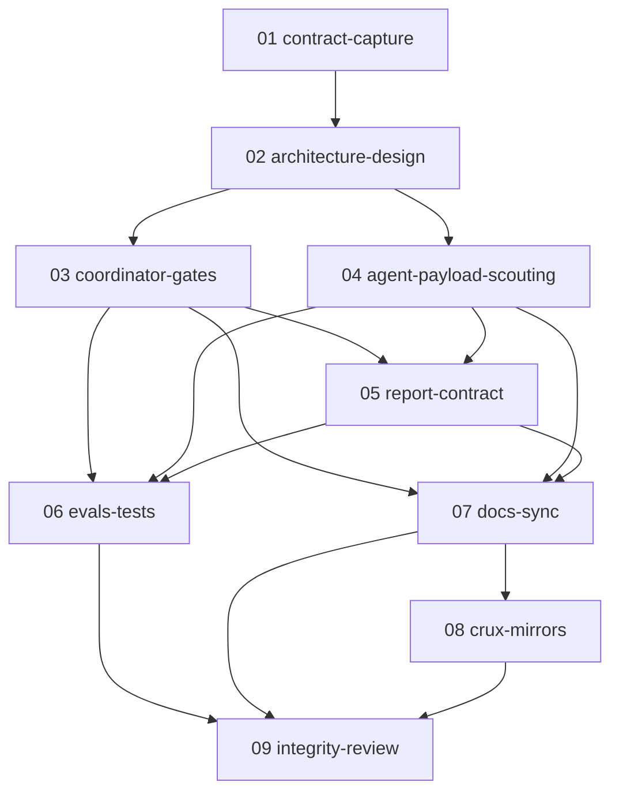

# Spec: Meditate Comprehensiveness + Init-Time Suggestions

## Status
Completed

> Spec executed and verified 2026-05-24 via `/zoto-spec-execute`. See
> `execution-report-meditate-richness-20260523.md`. W1 + W1b post-execution
> fixes applied + verified (field-name divergence at
> `.cursor/commands/crux-meditate.md:1815` + `.cursor/agents/crux-cursor-memory-manager.md:510, 512`
> closed; canonical `additional_focus_areas[]` with `treatment:` filter
> is now the single source of truth across read + write surfaces).

> **Updated 2026-05-23** with confirmed open-question decisions:
> level names changed to `compact / default / detailed / exhaustive`
> (K1); standalone `Q-Comprehensiveness` gate merged into
> `Q-Cost-and-Richness-Acknowledgment` (K2); 4-mode additional-focus-
> area opt-in (K4); set-once-per-invocation richness with reuse on
> expansion (K6); adversarial reviewer respawn protocol added for
> missing init-suggestion sections (K9). Open Questions reset.
>
> **Updated 2026-05-23 (later)** — judge auto-applied fixes per
> `assessment-meditate-richness-20260523.md`: cost-ack expansion
> rewording (subtask 01); K2 cost-multiplier worked example;
> K4 `additional_facet`-only natural-output clarification at
> `compact` / `default` vs `detailed`+ in K4; changed `respawn_reason`
> to list-typed `respawn_reasons` in K9 so one Dim-13 finding can
> bundle both missing-section and missing-visualisation reasons;
> added 3 new lower-severity Open Questions (#7 / #8 / #9).
>
> **Updated 2026-05-23 (post-assessment)** by `zoto-spec-judge`:
> tightened naming-collision wording for the level *named* `default`
> in K2 / DoD; split K2's cost formula into agent-count vs
> token-cost dimensions with a worked-example table; clarified the
> `additional_facet`-only mode's report-section behaviour at
> `compact` / `default` vs `detailed`+ in K4; changed `respawn_reason`
> to list-typed `respawn_reasons` in K9 so one Dim-13 finding can
> bundle both missing-section and missing-visualisation reasons;
> added 3 new lower-severity Open Questions (#7 / #8 / #9).
> See `assessment-meditate-richness-20260523.md` for the full diff.
>
> **Updated 2026-05-23 (latest — K10 added)** — added **K10**
> (split into K10a / K10b / K10c) covering the new post-
> consolidation / pre-adversarial-review
> `Q-Finalisation-Enhancements` gate: a multi-select askQuestion
> offering 5 candidate enhancements ranked by impact × insight-
> value, mixed-cost taxonomy (cheap report-side + expensive
> agent-spawning), per-item accept-policy (`respawn` for cheap,
> `queue` default / `spawn_now` opt-in for expensive),
> `finalisation-enhancements.yml` persistence, and continuation-
> menu re-application of unchosen items. K9 `respawn_reasons`
> list extended with `accepted_finalisation_enhancements` value.
> Existing K1–K9 semantics unchanged; only cross-references
> updated. 5 new K10-related Risks (#7–#10) and 5 new K10-related
> Open Questions (#10–#14) added.
>
> **Updated 2026-05-23 (K10 re-judge — user decisions applied)** —
> after K10 was added outside the prior judge pass, a re-judge
> applied two user-confirmed decisions:
> 1. **OQ #10 (ensemble cadence) RESOLVED → "both layered"** —
>    per-tree consolidation agents capture + reflect + rank 5
>    candidates internally during their own consolidation phase
>    (writing per-tree `finalisation-enhancements.yml` under
>    `meditations/{slug}/{model-subdir}/`); the ensemble
>    aggregator, after producing `cross-model-synthesis.md`,
>    runs a second reflection step to surface 5 **cross-model**
>    candidates. The user-facing askQuestion is a **single
>    combined multi-select at ensemble root** ranking the union
>    of `(per-tree × N) + (cross-model × 5)`, capped at the
>    standard 0–5 multi-select. Per-tree YAMLs are persisted
>    regardless so the continuation menu can resurface unchosen
>    per-tree items later. Single-model flows unchanged
>    (K10a's original "fires once after consolidation"
>    semantics). Subtask 02 makes the final per-tree-vs-root
>    presentation call (recommended posture: single combined
>    root gate).
> 2. **Adversarial-reviewer Dim 13 vs new Dim 14 — DEFERRED to
>    subtask 02 design-doc time** (no spec-level pre-commit;
>    subtask 05 already documents the dual-option without
>    pre-committing).
>
> Per-priority K10 round findings + auto-applied fixes recorded
> in `assessment-meditate-richness-20260523.md` (K10 Re-Judge
> section).

## Overview

Enhance `/crux-meditate` along **four distinct concerns** that share a single coordinated landing surface:

1. **Default report richness raised** — promote more researching-agent data
   (per-branch findings, depth-3 leaf material, peer-review reinforcements /
   contradictions / gaps) into the default HTML / PDF report. Today the
   report is rendered primarily off `consolidation.md` plus selective
   re-reading of branch files, leaving substantive depth-3 evidence elided.
2. **User-selectable comprehensiveness** — richness selection (4-level
   enum: `compact` / `default` / `detailed` / `exhaustive`) is folded
   into the existing `Q-Cost-Acknowledgment` gate as a single
   3-dimensional combined `askQuestion` covering depth × richness ×
   mode (renamed `Q-Cost-and-Richness-Acknowledgment`). The level
   chosen maps **deterministically** onto: minimum chart / infographic
   / calculator counts; depth-3 leaf inclusion behaviour; per-branch
   dedicated section depth; citation density; peer-review surfacing
   rules; per-section length budgets; ensemble cross-model breakdown
   depth.
3. **Init-time suggestion of sections + visualisation types** — during the
   existing depth-0 seed exploration (no new agent spawns; no extra
   latency), the depth-0 manager proposes a draft list of report sections
   and a draft list of visualisation types tailored to the topic. These
   are surfaced through the existing Pattern-B `needs_user_input` gate
   together with the proposed facets; the calling agent confirms / edits /
   extends them via a single combined `askQuestion`.
4. **Init-time suggestion of additional focus areas** — the depth-0 seed
   exploration also surfaces related angles outside the 3 facets (e.g.
   "you might also want to cover X, Y, Z"). The user can opt each one in
   as either an **additional facet** (multiplicative agent-count cost; cost
   ack re-presented) or an **additional report section only** (no extra
   agent cost), or skip.

The non-negotiable constraints are **functional preservation** of every
existing safeguard (anti-homogenisation, Universal Contrast, citation
discipline, Subject-Matter Focus, Pattern A vs Pattern B integrity) and
**dual-target landing** — this spec must apply cleanly whether the
sibling `20260517-meditate-agent-skill-decomposition` spec has shipped or
not (see K3 below).

## Key Decisions

### K1. Comprehensiveness levels = `compact` / `default` / `detailed` / `exhaustive`

- **Decision**: 4 named levels, deterministic mapping table per level.
- **Default level (selected when the user does not pick one)**: the
  level literally named `default`. This level is **richer than today's
  behaviour** (matches the user's stated intent: "by default … more
  data"). Non-interactive invocations also resolve to `default`.
- **Naming reconciliation — IMPORTANT**: one of the four level names is
  literally `default`. That is the level *name*. It is also the level
  selected when the user does not specify one (the "default-default").
  These are not in conflict — the level enum value `default` is what
  propagates through the `comprehensiveness:` payload and what subagent
  contracts read; the "is this the preselected option" semantics live
  only in the askQuestion's `default:` field. Executors must NOT rename
  the enum value to avoid this overlap; the name `default` is the
  single source of truth. Documentation surfaces (subtask 07) MUST
  call out the dual meaning in plain prose so users do not get
  confused.
- **Backwards-compat anchor**: `compact` reproduces the **exact current**
  behaviour — chart minima ≥4, infographic minima ≥3, calculator minima
  ≥1, no per-branch dedicated sections, depth-3 leaf material elided
  beyond consolidation summaries, peer-review surfaced through
  `consolidation.md` only. This means the only "breaking" change is the
  default-when-unspecified value; the old behaviour remains available
  as opt-in by selecting `compact`.
- **Level relative ordering** (low → high richness): `compact <
  default < detailed < exhaustive`. Each level bumps every dimension
  at least one notch above its predecessor where there is headroom.
- **Why 4 levels, not 3 or 5**: 3 levels collapse `detailed` and
  `exhaustive` into one, losing the ability to bound exhaustive token
  cost. 5 levels create indistinct boundaries between adjacent levels.
  The 4-level set maps cleanly onto: legacy-equivalent / new-default /
  noticeably-richer / maximum.

### K2. Merged gate `Q-Cost-and-Richness-Acknowledgment` (NO standalone `Q-Comprehensiveness` gate)

- **Decision**: Richness selection is **folded into** the existing
  `Q-Cost-Acknowledgment` gate. There is **no standalone**
  `Q-Comprehensiveness` gate — that idea is dropped. The renamed
  gate `Q-Cost-and-Richness-Acknowledgment` runs as the second
  pre-spawn gate (after Depth Selection). The combined `askQuestion`
  surfaces all three dimensions — **depth × richness × mode** — plus
  the resulting agent count and runtime estimate in a single round
  trip.
- **Calling-agent ordering** (final): Depth Selection → (combined)
  `Q-Cost-and-Richness-Acknowledgment` → Theme Preflight → … →
  combined Pattern-B confirmation that fuses `Q-Confirm-1` /
  `Q-Confirm-2` with the init-suggestions confirmation (per K4).
- **Combined gate structure**: one `askQuestion` with sub-questions —
  - **Sub-Q1 — Richness level** (single-select, preselected = the
    level literally named `default`): `compact` / `default` /
    `detailed` / `exhaustive`.
  - **Sub-Q2 — Proceed / mode-swap / cancel** (single-select, same
    decision set as today's `Q-Cost-Acknowledgment`): `proceed` /
    `switch_to_quick` / `switch_to_research` / `switch_to_ensemble` /
    `switch_to_single` / `cancel`. Mode-swap PRESERVES the user's
    Sub-Q1 richness selection.
  - The prompt prose displays the depth (from Q-Depth-Selection),
    each richness option's effect on the runtime / agent count
    estimate, and the resulting cost summary so the user is
    acknowledging the *actual* total cost, not just mode and depth.
- **Cost formula extension**: agent count is now
  `f(depth, mode, richness, ensemble_pool_size, additional_facets)`.
  Richness affects **two distinct cost dimensions** — agent count
  AND per-agent token cost — and the spec calls them out separately
  so subtask 02 can produce a numerically accurate multiplier table
  for the cost-ack prose:

  **Agent-count multipliers (NEW agent spawns at higher richness)**:
  - **`exhaustive` only**: per-leaf citation-table generation pass
    spawns 1 additional citation-builder agent per leaf at depth 3
    in Research mode. (Quick mode: no additional agent; warn-only
    citation rule preserved per K7 + OQ #5.)
  - All other "passes" listed below run INSIDE the
    report-generation skill on the existing depth-0 manager turn —
    they do not spawn new agents.

  **Token-cost multipliers (no new agent spawns; report-generation
  skill writes more content)**:
  - Per-branch dedicated section pass (`detailed` and `exhaustive`)
    — the report skill renders one section per branch instead of
    folding into the consolidation.
  - Peer-review surfacing dedicated-section pass (`detailed` and
    `exhaustive`) — the report skill surfaces reinforcements /
    contradictions / gaps as named report sections.
  - Per-leaf-agent output length budget (every level) — affects
    each meditation child's per-file token cost via
    `section_length_budget_tokens` (K5).

  **Worked example** (depth 3, Research mode, 3 facets, no
  ensemble, no additional facets):

  | Level | Agent count (per tree) | Approx report-skill output (tokens, illustrative) |
  |---|---|---|
  | `compact` | ~45 (today's baseline: 1 depth-0 + 3 depth-1 + 9 depth-2 + 27 depth-3 + 3 peer reviewers + ≤3 adversarial review iters; rounding) | ~25k |
  | `default` | ~45 (no new agents; richer report only) | ~40k |
  | `detailed` | ~45 (no new agents; per-branch + peer-review dedicated sections inside the report skill) | ~60k |
  | `exhaustive` | ~72 (~45 + 27 per-leaf citation-table builders at depth 3 Research) | ~90k |

  The numbers above are illustrative — subtask 02 produces the
  authoritative table; subtask 03 implements the cost-prose
  substitution; subtask 06 may pin numbers (see
  `TestMeditateCostFormulaNumericPinning` recommendation in the
  spec assessment) once subtask 02 lands.

  **Re-presentation rule** (cross-referenced from K4): when the
  combined Pattern-B confirmation accepts one or more
  `additional_facet` OR `additional_facet_AND_section` opt-ins,
  the calling agent re-runs the merged gate in
  read-only-richness shape with the updated total per the
  formula above. `skip` and `report_section_only` decisions do
  NOT trigger re-presentation.
- **Persistence across expansions**: `Q-Cost-Acknowledgment-Expansion`
  inherits the merged gate's structure but is **read-only on
  richness** (set-once-per-invocation, see K6). It still re-presents
  the cost estimate (because depth + mode + facets may have changed
  the multiplier), but it shows richness as locked. To change
  richness, the user must `cancel` and re-invoke `/crux-meditate`.
- **Cost-ack re-presentation when additional facets accepted**: if
  the combined Pattern-B confirmation (per K4) ends up adding facets
  via `additional_facet` or `additional_facet_AND_section` opt-ins,
  the calling agent re-runs `Q-Cost-and-Richness-Acknowledgment` in
  the read-only-richness shape (same as expansion variant) so the
  user sees the new total cost before the tree spawns. If the user
  cancels at re-presentation, the meditation aborts and any pending
  coordination files (`facets-pending-{ts}.yml`,
  `init-suggestions-pending-{ts}.yml` if used) are deleted.
- **Non-interactive default**: `default` for richness; `proceed` is
  NOT auto-selected (cost-ack still aborts non-interactive sessions
  with the existing error message — that safeguard is preserved).
  This means non-interactive callers must pass an explicit
  acknowledgment via the same mechanism that today's cost-ack
  expects (no change to that contract).

### K3. Dual-target landing — works whether 20260517 has shipped or not

- **Decision**: This spec **does not depend** on
  `specs/20260517-meditate-agent-skill-decomposition/`. Subtasks
  describe edits in terms of the **contract surface** (e.g. "the report
  generation contract", "the calling-agent gate sequence", "the depth-0
  manager step 4") rather than concrete file paths. Each implementation
  subtask resolves to either:
  - **Pre-decomposition target**: edit `.cursor/commands/crux-meditate.md`
    + `.cursor/agents/crux-cursor-memory-manager.md` (current state at
    `2026-05-23`).
  - **Post-decomposition target**: edit
    `.cursor/agents/crux-cursor-meditation-guide.md` +
    `.cursor/skills/crux-skill-memory-meditation-{report,research,quick,coordination,review,ensemble}/SKILL.md`
    + thinned `.cursor/commands/crux-meditate.md` (when 20260517 has
    landed).
- **Resolution mechanism**: subtask 02 (architecture & design) emits a
  **patch matrix** — for each affected contract surface, lists the
  pre-decomp target file/section AND the post-decomp target file/section.
  Implementation subtasks (03–05) check the actual repo state at
  execution time and apply the corresponding patches.
- **Why this matters**: 20260517 is in early state — only subtask 01
  (contract capture) is completed; subtask 02 is `blocked`. Waiting
  could indefinitely delay this work. Designing for both targets lets
  this spec ship independently and preserves the 20260517 freeze line.

### K4. Init-time suggestions are produced by the depth-0 seed exploration (no new agent spawn)

- **Decision**: Reuse the depth-0 manager's existing facet-derivation
  step 4 to **also** produce a draft suggestions payload (sections,
  visualisations, additional focus areas). All three are returned in
  the **same** `needs_user_input` block as the proposed facets. The
  calling agent surfaces a **single combined `askQuestion`** that
  presents:
  - The 3 proposed facets (existing `Q-Confirm-1` decision set:
    `confirm_all` / `modify_one` / `modify_multiple` / `regenerate` /
    `cancel`)
  - The draft report sections (new — multi-select with edit affordances)
  - The draft visualisation types (new — multi-select with edit
    affordances)
  - The additional focus areas (new — per-item opt-in, **4 modes**:
    `skip` / `additional_facet` / `report_section_only` /
    `additional_facet_AND_section`)
  - The deep-confirm enum (existing `Q-Confirm-2` — folded in to avoid
    a second prompt round-trip)
- **Per-mode downstream effect**:
  - `skip` — the focus area is discarded; no facet, no report
    section. Zero cost.
  - `additional_facet` — the focus area becomes a 4th (or 5th, 6th,
    …) facet. Bumps facet count → multiplies agent count at every
    depth (especially depth 3 / ensemble). Triggers cost-ack
    re-presentation per K2. **Does not** add a dedicated report
    section beyond what the new branch's findings naturally produce.
    At `compact` and `default` (where
    `per_branch_section_depth = consolidation_only` or
    `branch_summary`), the new branch's findings contribute to the
    across-branch consolidation prose only — no standalone section.
    At `detailed` and `exhaustive`, the new branch gets its own
    per-branch section under its auto-derived facet title (the
    standard per-branch section rule from K5 / subtask 05).
  - `report_section_only` — the focus area becomes a confirmed
    report section in `init-suggestions-{ts}.yml` (so the report
    skill must include a section by that title) but does NOT add a
    facet. The section content is sourced from across-branch
    findings + the supplied rationale prose; no new branch is
    spawned. Zero agent-count cost.
  - `additional_facet_AND_section` — both effects: a new facet IS
    spawned (multiplicative agent cost; triggers cost-ack
    re-presentation per K2) AND a dedicated named report section
    appears in `init-suggestions-{ts}.yml` so the report skill
    presents that branch's findings under the user-supplied title
    rather than under the auto-derived facet title.
- **Cost re-presentation trigger** (cross-references K2): any opt-in
  decision of `additional_facet` OR `additional_facet_AND_section`
  causes the calling agent to re-run
  `Q-Cost-and-Richness-Acknowledgment` (read-only-richness shape)
  with the updated agent count before tree spawn. `skip` and
  `report_section_only` decisions do NOT trigger re-presentation
  (no agent-count change).
- **Why not a dedicated "scouting" subagent**: the depth-0 manager
  already runs a seed exploration to derive facets. Producing 3 extra
  payload fields adds negligible token cost and **zero** additional
  agent spawns. A separate scout subagent would multiply token cost
  and require an extra orchestration step.

### K5. Comprehensiveness payload propagation mirrors `theming` payload

- **Decision**: `comprehensiveness:` becomes a structured payload
  passed unchanged from the calling agent into the depth-0 subagent's
  spawn prompt and propagated unchanged to every child agent in the
      tree (and to every ensemble member tree). Shape:
  ```yaml
  comprehensiveness:
    level: "compact" | "default" | "detailed" | "exhaustive"
    minima:
      charts: { count, types_required }
      infographics: { count, types_required }
      calculators: { count, scenarios_per }
    depth3_leaf_inclusion: "elided" | "summary" | "verbatim_quotes"
    per_branch_section_depth: "consolidation_only" | "branch_summary" | "per_leaf_detail"
    citation_density: "warn_only" | "mandatory" | "per_finding_table"
    peer_review_surfacing: "consolidation_only" | "named_section" | "per_branch_dedicated"
    section_length_budget_tokens: { hero, per_facet, citations }
    ensemble_cross_model_depth: "synthesis_only" | "per_facet_cards" | "per_leaf_attribution"
  ```
- **Why structured**: deterministic mapping per level removes
  ambiguity for the report-generation skill (which today has fixed
  minima hard-coded at ≥4 / ≥3 / ≥1). The exact values per level live
  in the architecture-design subtask deliverable (subtask 02).
- **Subagent abort rule**: same shape as `theming` — depth-0 subagent
  aborts with a clear error if `comprehensiveness:` is missing from
  spawn prompt.

### K6. Set-once-per-invocation + `init-suggestions-{ts}.yml` persistence

- **Decision (set-once-per-invocation)**: the richness level captured
  via Sub-Q1 of `Q-Cost-and-Richness-Acknowledgment` persists for the
  **entire invocation** — the depth-0 manager, every branch / leaf
  child, every ensemble member tree, the adversarial reviewer, and
  the report-generation skill all see the same level. Same mental
  model as `maxDepth`. **There is no `--reset-richness` flag.** To
  change the richness level, the user must `cancel` and re-invoke
  `/crux-meditate`.
- **Decision (expansion-direction continuation reuses unchanged)**:
  on calling-agent step 12 expansion, both the richness level AND
  the `init-suggestions-{ts}.yml` payload (confirmed sections,
  visualisations, additional-focus-areas treatments) are **reused
  unchanged** for the expansion tree. This matches `theming` and
  `confirmDeepFacets` persistence. The expansion variant of the
  cost gate (`Q-Cost-Acknowledgment-Expansion`) shows richness as
  locked / read-only and does NOT offer a "keep richness setting?"
  follow-up — the answer is implicit.
- **Decision (audit + persistence)**: After the calling agent
  receives confirmed sections / visualisations / additional-focus-
  areas via the combined Pattern-B askQuestion, the depth-0 manager
  writes the confirmed payload to
  `meditations/{yyyymmdd}-{topic-slug}/init-suggestions-{ts}.yml`
  during the resume step (consistent with how confirmed facets
  become `facets.md`). This file is:
  - Read by the report-generation contract: every confirmed section
    title MUST appear in the report; every confirmed visualisation
    type MUST be rendered; the report MAY add more sections / charts
    beyond these.
  - Linked from the Branch & Leaf Index (`facets.md`) as a top-level
    artefact so the user can audit what they confirmed.
  - Re-used unchanged on expansion-direction continuation per the
    decision above.

### K7. Existing safeguards are non-negotiable across every level

- **Decision**: Anti-Homogenisation Rules, Universal Contrast (WCAG),
  Subject-Matter Focus rule, Pattern A vs Pattern B boundaries, citation
  discipline (mandatory `## Citations` section, validation rules),
  retrospective always-written rule, mandatory paired HTML + PDF
  output, and adversarial review-and-fix cycle (≤3 iterations) all
  apply **unchanged at every comprehensiveness level**. The level
  varies *richness*, not *rigor*.
- **Why explicit**: it would be tempting to relax citation enforcement
  in `compact` to "match" the lighter feel. We do **not** do this.
  `compact` produces fewer charts and fewer prose sections, but every
  claim still carries a citation. This preserves the warn-only /
  mandatory split between Quick and Research mode that already exists
  today (citation density remains **mode-driven**, not level-driven —
  the `comprehensiveness.citation_density` payload field is set by
  mode at every level, with `exhaustive` adding a per-finding-table
  citation column on top).

### K8. No new files added to dist / install / version-bump RELEASE_PATHS

- **Decision**: All edits land inside files already enumerated in
  `scripts/create-crux-zip.py`, `install.py` `MEMORY_FILE_PREFIXES`,
  and the version-bump RELEASE_PATHS — that is, into existing source
  files. **No new agent file, no new skill directory, no new
  command file is created.** This means:
  - No `scripts/create-crux-zip.py` change.
  - No `install.py` change.
  - No `.crux/dist-manifest.json` change.
  - No `.github/workflows/version-bump.yml` change.
  - No `CONTRIBUTORS.md` table change beyond what
    `docs-sync-agent` normally maintains.
- **If 20260517 has shipped at execution time**: that spec already
  enumerates the new files; this spec patches their existing entries
  rather than adding new ones. Either way: no zip-contents-protection
  rule trigger.

### K9. Adversarial reviewer gains comprehensiveness-aware checks + report-skill respawn protocol for missing init-suggestion sections

- **Decision (two new dimensions)**: The 11-dimension adversarial
  review (frozen by 20260517 subtask 01) gains **two new checks** at
  the same severity taxonomy:
  - **Dimension 12 — Comprehensiveness fidelity** (`MUST_FIX` if
    level claimed in footer doesn't match actual minima delivered;
    e.g. footer says `detailed` but only 4 charts rendered when
    `detailed` requires more).
  - **Dimension 13 — Init-suggestion honour** (`MUST_FIX` if any
    confirmed section from `init-suggestions-{ts}.yml` is absent or
    insufficiently populated; `MUST_FIX` if any confirmed
    visualisation type is absent).
- **Decision (level-conditional dimension 9)**: The peer-review
  thoroughness dimension (`#9`) gains a level-conditional expansion:
  at `detailed`+ the reviewer must verify that reinforcements /
  contradictions / gaps reach the report (not just the consolidation).
- **Decision (respawn protocol — STRONGER than standard `MUST_FIX`)**:
  When dimension 13 fires (a confirmed init-suggestion section is
  absent or insufficiently populated in the rendered report), the
  reviewer **respawns the report-generation skill** with a structured
  missing-section payload, rather than relying on the standard
  in-place `MUST_FIX` fix that the reviewer would normally write.
  Rationale: missing whole sections require regeneration of the
  report HTML / PDF pair, which is too large a rewrite for the
  reviewer to perform inline reliably.

  **Trigger condition**: Dimension 13 finding for a confirmed
  section title (or confirmed visualisation type) that is either
  absent from the report HTML OR present only as an empty stub
  (no substantive content; e.g. heading exists but the body is one
  line, or the visualisation container exists but renders no data).

  **Respawn payload schema** (passed to the report-generation
  skill on respawn):

  ```yaml
  respawn_reasons:       # list-typed — one respawn may carry multiple reasons
    - "missing_init_suggestion_sections"
    - "missing_init_suggestion_visualisations"
    - "accepted_finalisation_enhancements"   # added by K10b — accepted cheap enhancements respawn the report skill
  reviewer_iteration: 1 | 2 | 3
  prior_report_paths:
    html: "report-{topic-slug}-{prior_ts}.html"
    pdf:  "report-{topic-slug}-{prior_ts}.pdf"
  missing_sections:
    - title: "Adoption and Market Presence"
      rationale: "From init-suggestions; user confirmed this section"
      source_signals: ["[chat: turn-3]", "[memory: vendor-eval-patterns]"]
      branch_evidence_pointers:
        - "branch-1-depth-2-sub-1-{slug}-{ts}.md"
        - "branch-2-depth-3-sub-4-{slug}-{ts}.md"
  missing_visualisations:
    - type: "magic_quadrant_2x2"
      rationale: "Topic explicitly compares 3 alternatives"
      source_signals: ["[file: src/router.ts:12-40]"]
  accepted_finalisation_enhancements:        # added by K10b
    - id: "exec-summary-{ts}"                # one entry per accepted cheap enhancement
      type: "executive_summary"              # one of the K10a cheap-taxonomy types
      title: "Executive Summary"
      description: "1-page exec summary aimed at C-level / time-poor readers"
      payload:                               # type-specific shape (subtask 02 defines per type)
        target_persona: "leadership"
        max_paragraphs: 3
      source_signals: ["[child: depth-3 leaf]", "[memory: ...]"]
  preserve_other_content: true
  comprehensiveness_payload: { ... unchanged ... }
  init_suggestions_payload: { ... unchanged, full ... }
  theming_payload: { ... unchanged ... }
  finalisation_enhancements_payload: { ... full file content if present, else null ... }
  ```

  **Iteration budget**: respawn re-uses the **existing ≤3
  adversarial review-and-fix iteration cap**. A respawn is
  **bundled into the iteration that flagged it** — the iteration
  counter advances once per review-and-fix cycle regardless of
  whether the cycle triggered a respawn, and respawns do NOT carve
  out a separate retry budget. The **next** iteration's reviewer
  reviews the regenerated report (respawn-then-re-review, per OQ
  #3 default). **Maximum useful respawns per meditation = 2**
  (respawn at end of iter 1 → reviewed at iter 2; respawn at end
  of iter 2 → reviewed at iter 3; iter 3 cannot usefully respawn
  because no iter 4 exists to review the regenerated report).
  When `reviewer_iteration == 3` and dimension 13 still fires,
  the verdict is `ESCALATE` (existing semantics — abort report
  generation, surface unresolved findings to the calling agent in
  the standard step-10 path). This guarantees no infinite loop and
  matches the iteration discipline of the existing cycle.

  **Severity classification**: dimension-13 findings are `MUST_FIX`
  AND ALSO carry the `respawn_required: true` flag. The standard
  reviewer flow (apply unambiguous fixes; escalate ambiguous via
  `needs_user_input` Pattern B with mandatory `context`) is
  **bypassed** for `respawn_required` findings — they unconditionally
  trigger respawn rather than in-place rewrite. Dimension 12 (and
  the level-conditional dimension 9 expansion) keep the standard
  `MUST_FIX` flow because they don't typically require whole-section
  regeneration.

  **Output filename**: respawned reports get a fresh timestamp
  (`TS=$(date -u +%Y%m%d%H%M%S)`); the prior pair is preserved on
  disk for diff inspection. The Branch & Leaf Index resolves the
  latest pair via prefix-glob (existing behaviour).
- **Why explicit**: without the respawn protocol, dimension 13 would
  be `MUST_FIX` only — and reviewers tend to add empty stub sections
  rather than fully regenerate, which doesn't honour user-confirmed
  init-suggestions. Without dimensions 12 + 13, the comprehensiveness
  and init-suggestion contracts become advisory and the user gets
  non-deterministic richness / honour.

### K10a. Post-consolidation `Q-Finalisation-Enhancements` gate (timing + scope)

- **Decision (timing)**: A new Pattern-B gate
  `Q-Finalisation-Enhancements` fires **after consolidation
  completes** (i.e. after `consolidation.md` has been written and the
  Branch & Leaf Index has been refreshed in `facets.md`) but **before
  the adversarial review-and-fix cycle begins**. The gate runs in
  both **Research mode** and **Quick mode**.

  **Ensemble-mode cadence (layered — RESOLVED 2026-05-23 from OQ #10
  "both layered")**:

  - **Per-tree reflection** — each model tree's consolidation agents
    capture + reflect + rank up to 5 candidate enhancements internally
    during that tree's own consolidation phase. Each tree persists its
    candidate set to
    `meditations/{yyyymmdd}-{topic-slug}/{model-subdir}/finalisation-enhancements.yml`
    (the `{model-subdir}` matches the existing per-model subdirectory
    convention from the ensemble protocol). No askQuestion fires per
    tree — these per-tree YAMLs are write-only at the per-tree level.
  - **Root cross-model reflection** — after the ensemble aggregator
    produces `cross-model-synthesis.md`, it runs a second reflection
    step over all per-tree consolidation outputs + the cross-model
    synthesis itself, producing up to 5 **cross-model** candidates
    that emerge from looking at all trees together (e.g. patterns
    where multiple trees converged on the same enhancement; patterns
    visible only across models). The aggregator writes
    `meditations/{yyyymmdd}-{topic-slug}/finalisation-enhancements.yml`
    at the ensemble root (no `{model-subdir}` segment) capturing the
    cross-model candidates.
  - **Single combined root gate** — the user-facing askQuestion fires
    **once** at ensemble root, ranking the **union** of all per-tree
    candidates AND the cross-model candidates by composite score,
    capped at the standard 0–5 multi-select. Per-tree YAMLs are
    persisted regardless so the continuation menu (K10c) can resurface
    unchosen per-tree items later. **Recommended posture (final
    presentation call deferred to subtask 02)**: single combined root
    gate so the user is not interrupted N times; alternative
    (per-tree user gates inside each tree's flow) is allowed if
    subtask 02's architect judges it materially better, but the
    default + recommended choice is single combined root gate.
  - **Backwards compatibility for single-model flows** — non-ensemble
    (single-model) Research and Quick flows are unchanged from K10a's
    original semantics: gate fires once after that single tree's
    consolidation completes.
- **Why this timing**: accepted cheap enhancements need to be in the
  report when the adversarial reviewer evaluates it (so Dim 13's
  init-suggestion-honour audit naturally extends to a parallel
  "finalisation-enhancement-honour" check via the same respawn
  mechanism — see K10b). Running the gate AFTER adversarial review
  would either (a) require a second reviewer cycle for the post-
  enhancement report, doubling cost, or (b) ship un-reviewed
  content. Running BEFORE consolidation defeats the purpose
  (consolidation agents need to have produced + reflected on the
  candidate set first).
- **Decision (scope — mixed-cost taxonomy)**: The depth-0 manager
  (more precisely: the consolidation agents — see K10c reflection
  contract) picks 5 candidate enhancements ranked by
  `impact_score × insight_value_score`, drawn from a **menu**
  (extensible per topic). The menu has two cost classes:

  **Cheap** (report-side, applied via report-skill respawn within
  the existing ≤3 review-and-fix iteration cap):
  - `executive_summary` — 1-page exec summary aimed at C-level /
    time-poor readers
  - `action_plan` — sequenced concrete actions (next 7 days /
    30 days / quarter), tied to specific findings
  - `risks_section` — cross-branch risks the consolidation
    surfaced but the existing report under-emphasised
  - `glossary` — definitions of domain terms used across branches
  - `decision_tree_infographic` — decision-flow diagram capturing
    the meditation's recommended branching logic
  - `reader_persona_tldrs` — tailored TL;DRs per persona
    (engineer / product / leadership / etc.)
  - `cross_branch_synthesis_section` — explicit "where independent
    branches converged / diverged" section

  **Expensive** (would spawn agents or queue follow-up work):
  - `additional_meditation` — queue a follow-up `/crux-meditate`
    invocation for a tangent the consolidation flagged as worth
    its own tree
  - `extracted_spec` — generate a draft spec under
    `specs/{yyyymmdd}-{slug}/` capturing actionable deliverables
    from the meditation
  - `extracted_memories` — propose memory candidates (one per
    finding worth promoting to a learning / red-flag / core memory
    via `/crux-remember`)
  - `expanded_branch` — re-run an existing branch at higher depth
    or with a different facet emphasis (essentially an
    expansion-direction continuation, but pre-queued)

  The taxonomy is **dynamic** — the menu above is the starting set;
  subtask 02 may extend if architecturally justified. For any given
  meditation, consolidation agents pick whichever 5 best fit the
  topic. Each candidate carries a `cost_class: "cheap" | "expensive"`
  field and a type-specific `payload:` object whose shape is
  defined per-type by subtask 02.
- **Decision (multi-select cap, 0–5)**: The askQuestion is a
  multi-select with at most 5 options visible. Picking 0 = skip
  cleanly; the gate's outcome is `"all_skipped"` and the workflow
  proceeds directly to adversarial review with no respawn-payload
  contribution. There is **no forced minimum**.
- **Decision (graceful degradation when fewer than 5 candidates
  surface)**: If the consolidation agents flag fewer than 5
  high-quality candidates (e.g. only 3 score above the
  `minimum_impact_threshold`), record the count and the reason in
  `finalisation-enhancements.yml` (`degradation_reason: "fewer than
  5 candidates met minimum_impact_threshold"`). The askQuestion
  shows whatever count surfaced (3, 4, or 5). Showing 0 surfaces
  a "no high-quality enhancement candidates surfaced" message and
  skips the gate entirely (workflow proceeds to adversarial review
  unchanged). Subtask 02 defines the threshold value; default
  proposed = `impact_score × insight_value_score >= 6` on a 1–10 ×
  1–10 rubric.

### K10b. Accept-policy + cost-ack re-presentation for `spawn_now`

- **Decision (cheap items — `treatment: "respawn"`)**: For each
  accepted cheap enhancement, the calling agent adds a
  structured payload entry to the next adversarial-review
  iteration's respawn payload (extending K9 — see the updated
  schema above). The reviewer's standard ≤3 iteration cap absorbs
  the work. Each accepted cheap enhancement triggers exactly one
  respawn-payload contribution; multiple accepted cheap items in
  one acceptance round bundle into a single respawn (the schema's
  `accepted_finalisation_enhancements:` list field is array-typed).
  The new respawn cause `accepted_finalisation_enhancements`
  appears in the `respawn_reasons:` list when at least one cheap
  enhancement was accepted.
- **Decision (expensive items — default `treatment: "queue"`)**:
  For each accepted expensive enhancement, default treatment =
  `queue`. The calling agent writes a follow-up artefact next to
  `consolidation.md`:
  - `additional_meditation` → `follow-up-meditation-{ts}.yml`
    with the proposed topic / facet seed / depth recommendation.
  - `extracted_spec` → `follow-up-spec-{ts}.yml` with the proposed
    spec slug / overview / candidate subtasks.
  - `extracted_memories` → `follow-up-memories-{ts}.yml` with the
    proposed memory candidates (one per finding, with types like
    `learning` / `redflag` / `core`).
  - `expanded_branch` → `follow-up-expansion-{ts}.yml` with the
    target branch number / new depth / facet override.

  Queued items do **not** spawn agents in the current invocation.
  They surface in the **continuation menu (calling-agent step
  12)** as one-click resume options (e.g. "Apply queued follow-up:
  spawn additional meditation on {topic}"). The workflow proceeds
  to adversarial review unchanged.
- **Decision (expensive items — opt-in `treatment: "spawn_now"`)**:
  The user can override default by selecting `spawn_now` on the
  per-item treatment sub-question. Selecting `spawn_now` for ANY
  expensive item triggers a **cost-ack re-presentation** in the
  read-only-richness shape of the merged
  `Q-Cost-and-Richness-Acknowledgment` gate (mirrors the K2 +
  K4 cost re-presentation pattern). The re-presentation prose
  enumerates the spawn-now items with their estimated agent counts
  and total token cost, prefixed with: "You've accepted spawning
  N follow-up agent(s) for finalisation enhancements. The new
  agent count is {N_total}. Re-acknowledge or cancel."
  - On cancel: drop the `spawn_now` treatments, fall back to
    `queue` treatment for those items (no work lost — the items
    still surface in continuation menu), proceed with the
    remaining accepted items.
  - On proceed: spawn the expensive agents in parallel after the
    adversarial-review cycle completes (so the respawned report
    incorporates the accepted cheap enhancements before any
    expensive follow-up runs); their outputs are reported in the
    calling-agent step 10 presentation alongside the report
    paths.
  - **Pattern A vs Pattern B integrity**: the per-item
    `spawn_now` sub-question and the cost-ack re-presentation
    are owned by the calling agent; subagents do NOT call
    `AskQuestion`. This preserves the existing Pattern-A / B
    boundary unchanged.

### K10c. Persistence + reflection contract + continuation surfacing

- **Decision (persistence — `finalisation-enhancements.yml`)**:
  The depth-0 manager writes
  `meditations/{yyyymmdd}-{topic-slug}/finalisation-enhancements.yml`
  during the post-consolidation step (BEFORE the askQuestion fires)
  containing the top-5 (or fewer — see K10a degradation rule)
  ranked candidates produced by the consolidation reflection. The
  calling agent updates this file in place after the askQuestion
  resolves, recording each item's `accepted: true | false` and
  `treatment` field. The full file is included in the next
  adversarial-review iteration's respawn payload (per K10b cheap
  flow).

  **Ensemble-mode persistence paths (layered cadence per K10a)**:
  - Per-tree YAMLs are written at
    `meditations/{yyyymmdd}-{topic-slug}/{model-subdir}/finalisation-enhancements.yml`
    BEFORE the ensemble aggregator runs. Each per-tree YAML lists
    candidates with `source_tree: "{model-subdir}"` so the root
    combined gate can label option provenance.
  - The root cross-model YAML is written at
    `meditations/{yyyymmdd}-{topic-slug}/finalisation-enhancements.yml`
    AFTER `cross-model-synthesis.md` is written and BEFORE the root
    combined askQuestion fires. The root YAML contains both
    `cross_model_candidates: [...]` (5 ranked candidates produced by
    the aggregator's reflection step) AND a denormalised
    `union_candidates: [...]` listing the top-N (capped at 5) by
    composite score drawn from `(per_tree × N) + (cross_model × 5)`;
    each `union_candidates[]` entry carries
    `source: "tree:{model-subdir}" | "cross_model"` so the calling
    agent's askQuestion can label provenance and downstream report
    targeting (per subtask 05) can resolve to the correct report.
  - The calling agent updates the **root** YAML in place after the
    askQuestion resolves; per-tree YAMLs remain immutable except for
    a `surfaced_to_root: true | false` annotation written by the
    aggregator (so the continuation menu can distinguish per-tree
    items that did NOT make the root cap of 5 — these are still
    resurfacable via the continuation menu per K10c).

  Schema:

  ```yaml
  ---
  generated_utc: "2026-05-23T21:10:00Z"
  topic_slug: "{topic-slug}"
  rubric:
    impact_score_max: 10        # 1-10 scale
    insight_value_score_max: 10 # 1-10 scale
    minimum_impact_threshold: 6 # impact_score × insight_value_score >= 6 (default)
    weights: { impact: 1.0, insight_value: 1.0 }   # configurable via cruxMemories.meditate.finalisationEnhancements.weights (OQ #11)
  degradation_reason: null | "fewer than 5 candidates met threshold" | "no high-quality candidates surfaced"
  ---
  candidates:
    - id: "exec-summary-{ts}"
      type: "executive_summary"
      cost_class: "cheap"
      title: "Executive Summary"
      description: "1-page exec summary for time-poor leadership readers"
      impact_score: 9                  # 1-10
      insight_value_score: 8           # 1-10
      composite_score: 72              # impact × insight_value (or weighted sum if weights configured)
      source_signals:                  # citations the consolidation agents used to identify this candidate
        - "[child: branch-1-depth-3-sub-2-{slug}-{ts}.md]"
        - "[memory: leadership-comm-patterns]"
      payload:                         # type-specific; subtask 02 defines per-type schema
        target_persona: "leadership"
        max_paragraphs: 3
        anchor_findings:
          - "[research: auth-flow-trade-offs]"
          - "[research: cost-of-ownership-trajectory]"
      accepted: null                   # filled by calling agent post-askQuestion: true | false
      treatment: null                  # filled by calling agent: "respawn" | "queue" | "spawn_now" | "unchosen_persisted"
      decided_at_utc: null             # filled by calling agent
    - id: "additional-meditation-{ts}"
      type: "additional_meditation"
      cost_class: "expensive"
      title: "Follow-up meditation: cost-of-ownership trajectory"
      description: "Tangent surfaced at depth 2; warrants its own tree"
      impact_score: 8
      insight_value_score: 7
      composite_score: 56
      source_signals: [...]
      payload:
        proposed_topic: "Cost-of-ownership trajectory across vendor options"
        proposed_facet_seed: ["...", "...", "..."]
        recommended_depth: 2
        recommended_mode: "research"
      accepted: null
      treatment: null
      decided_at_utc: null
  ```

- **Decision (continuation-menu surfacing of unchosen items)**:
  In calling-agent step 12 (interactive continuation menu),
  unchosen items (`accepted: false, treatment: "unchosen_persisted"`)
  are surfaced as additional opt-in options labelled
  `"Re-open meditation to apply enhancement: {title}"`. Picking one
  re-runs the post-consolidation phase: the calling agent re-
  presents the askQuestion with that single item pre-checked and
  the others greyed out, lets the user accept or cancel, then
  triggers a new adversarial-review iteration (within a fresh ≤3
  cap because this is a new continuation invocation, not a
  re-entry into the prior cycle). Queued expensive items
  (`treatment: "queue"`) ALSO surface in the continuation menu
  with one-click "spawn now" options that re-present the cost-ack
  before spawning. The ≤3 iteration cap of the prior invocation
  has no bearing on continuation-menu actions; each continuation
  is a fresh invocation per K6 set-once persistence semantics.

  **Ensemble-mode continuation surfacing** — when an ensemble
  meditation is the source, the continuation menu surfaces:
  - **Root unchosen items** (cross-model + per-tree that surfaced
    at root): one option per `accepted: false, treatment:
    "unchosen_persisted"` entry in the root YAML. Source label per
    OQ #10 resolution: `(cross-model)` or `(from tree:
    {model-label})`.
  - **Per-tree-only unchosen items** (per-tree candidates with
    `surfaced_to_root: false`): one option per such entry
    aggregated across all per-tree YAMLs. Source label includes
    `(from tree: {model-label}, not surfaced at root)`. Selecting
    one of these targets the per-tree report respawn (per subtask
    05) rather than the cross-model synthesis report respawn.
- **Decision (no in-report appendix)**: The rendered HTML / PDF
  report does NOT contain an appendix listing unchosen
  enhancements. The YAML file is the audit trail. Rationale:
  keeps the report clean; the user already knows what they
  rejected; the continuation menu provides the recovery path.
- **Decision (reflection contract — `impact_score` × `insight_value_score`
  rubric)**: The consolidation agents (depth-0 manager — or, post-
  decomposition, the meditation-guide agent invoking the
  `crux-skill-memory-meditation-coordination` or a new
  `crux-skill-memory-meditation-finalisation` skill) score each
  candidate enhancement on:
  - **`impact_score` (1–10)** — how materially the enhancement
    would change reader behaviour or decision-making. 1 = decorative
    (nice-to-have, no behavioural change); 10 = decision-blocking
    (without this, the reader cannot act on the meditation).
  - **`insight_value_score` (1–10)** — how much new
    consolidated-cross-branch insight the enhancement surfaces.
    1 = restates content already prominent in the existing
    sections; 10 = surfaces a non-obvious cross-branch synthesis
    or risk that no individual branch made visible.
  - **Composite score** = `impact_score × insight_value_score`
    (multiplicative; both axes must be high to rank near the top).
    Configurable via `cruxMemories.meditate.finalisationEnhancements.weights`
    (OQ #11) if the user wants a weighted sum instead.

  Subtask 04 documents the rubric in enough detail that an LLM
  agent can apply it deterministically (e.g. include 2–3 worked
  examples per axis showing what scores 3 vs 7 vs 9 look like).

## Requirements

1. Merged `Q-Cost-and-Richness-Acknowledgment` gate implemented as a
   single combined `askQuestion` covering depth × richness × mode
   with all 4 richness enum values (`compact` / `default` / `detailed`
   / `exhaustive`), decision-guidance prose per option, default
   richness preselection = `default`. **No standalone
   `Q-Comprehensiveness` gate.**
2. Comprehensiveness payload propagated unchanged from calling agent
   through depth-0 manager to every child agent and to every ensemble
   member tree.
3. Deterministic level → minima mapping table documented in the
   report-generation contract, with `compact` reproducing today's
   minima exactly.
4. Init-suggestion payload (sections / visualisations / additional
   focus areas) produced by depth-0 seed exploration without
   additional agent spawns.
5. Combined Pattern-B askQuestion folds existing `Q-Confirm-1`,
   existing `Q-Confirm-2`, and the new init-suggestion confirmation
   (with **4-mode** additional-focus-area opt-in: `skip` /
   `additional_facet` / `report_section_only` /
   `additional_facet_AND_section`) into a single round trip.
6. Confirmed init-suggestions persisted to
   `init-suggestions-{ts}.yml` and read by report-generation contract.
7. Cost-ack re-presentation (read-only-richness shape of the merged
   gate) when a user opts an `additional_focus_area` into either
   `additional_facet` or `additional_facet_AND_section`.
8. Adversarial reviewer extended with comprehensiveness-fidelity
   (Dim 12) and init-suggestion-honour (Dim 13) dimensions, plus
   level-conditional expansion of dimension 9. Dim 13 triggers a
   **report-skill respawn protocol** with structured
   missing-section payload; respawn budget shares the existing ≤3
   review-and-fix iteration cap.
9. Backwards compatibility: `compact` level == current behaviour for
   every chart / infographic / calculator / per-branch / depth-3 /
   peer-review rule.
10. All existing safeguards preserved verbatim (anti-homogenisation,
    Universal Contrast, Subject-Matter Focus, citation discipline,
    Pattern A vs Pattern B boundaries, retrospective always-written,
    mandatory paired HTML + PDF, adversarial cycle ≤3 iterations).
11. Set-once-per-invocation richness — set via the merged gate; reused
    unchanged on expansion-direction continuation; no
    `--reset-richness` flag.
12. Eval coverage updated: `evals/test_q_meditate.py` and
    `evals/sdk/tests/q-meditate.test.ts` assert all of (1)–(11)
    without deleting any existing assertion. Tests must include
    coverage of the respawn protocol and a finite-iteration check
    (no infinite loop possible).
13. Documentation surfaces (README.md, AGENTS.md project-internal
    section, `docs/crux-memories.md`, `web/compress.md/memories.html`)
    reflect the merged gate, level enum, default, init-suggestion
    mechanism, and respawn protocol.
14. CRUX-compressed mirrors of any source rule files touched are
    regenerated; no new mirrors created (per `_CRUX-RULE.mdc`).
15. Integrity review confirms no functionality lost against the
    contract surface frozen in subtask 01 AND verifies the respawn
    protocol cannot infinite-loop (extended in K10b to include
    the `accepted_finalisation_enhancements` respawn cause).
16. `Q-Finalisation-Enhancements` askQuestion implemented as a
    multi-select 0–5 gate fired post-consolidation /
    pre-adversarial-review (per K10a); skip-all path reproduces
    today's behaviour byte-for-byte.
17. `finalisation-enhancements.yml` written by depth-0 manager
    (or post-decomp meditation-guide / coordination skill) BEFORE
    the askQuestion fires; schema matches K10c verbatim; updated
    in place by the calling agent post-askQuestion with `accepted`
    + `treatment` + `decided_at_utc` fields.
18. Cheap-enhancement accept-policy bundled into next adversarial-
    review iteration's respawn payload via the extended K9
    `respawn_reasons:` list (`accepted_finalisation_enhancements`
    value); reuses ≤3 iteration cap; finite-iteration guarantee
    preserved.
19. Expensive-enhancement accept-policy: default `queue` writes a
    `follow-up-{type}-{ts}.yml` artefact next to `consolidation.md`;
    opt-in `spawn_now` triggers cost-ack re-presentation in
    read-only-richness shape mirroring the K4 pattern.
20. Continuation menu (calling-agent step 12) surfaces both
    unchosen items (with one-click "re-open meditation to apply
    enhancement: {title}" options) AND queued expensive items
    (with one-click "spawn now" options that re-present cost-ack
    before spawning).
21. Reflection rubric (impact × insight-value, 1–10 each, default
    composite = product) documented in subtask 04 with worked
    examples sufficient for deterministic LLM application.
22. Eval coverage updated for K10 — multi-select shape, 0–5 cap,
    skip-all backwards-compat, cheap-respawn path, expensive-queue
    default, expensive-spawn-now cost-re-presentation, persistence
    schema, continuation-menu surfacing, finite-iteration with the
    new respawn cause.

## Subtask Manifest

| ID | File | Subagent | Dependencies | Phase | Status |
|----|------|----------|-------------|-------|--------|
| 01 | `subtask-01-meditate-richness-contract-capture-20260523.md` | crux-platform-architect | — | 1 | Completed |
| 02 | `subtask-02-meditate-richness-architecture-design-20260523.md` | crux-platform-architect | 01 | 2 | Completed |
| 03 | `subtask-03-meditate-richness-coordinator-gates-20260523.md` | crux-software-engineer | 02 | 3 | Completed |
| 04 | `subtask-04-meditate-richness-agent-payload-scouting-20260523.md` | crux-software-engineer | 02 | 3 | Completed |
| 05 | `subtask-05-meditate-richness-report-contract-20260523.md` | crux-software-engineer | 03, 04 | 4 | Completed |
| 06 | `subtask-06-meditate-richness-evals-tests-20260523.md` | crux-software-engineer | 03, 04, 05 | 5 | Completed |
| 07 | `subtask-07-meditate-richness-docs-sync-20260523.md` | docs-sync-agent | 03, 04, 05 | 5 | Completed (Partial — surgical-scope deferred to S09) |
| 08 | `subtask-08-meditate-richness-crux-mirrors-20260523.md` | crux-cursor-rule-manager | 07 | 6 | Completed |
| 09 | `subtask-09-meditate-richness-integrity-review-20260523.md` | integrity-expert | 06, 07, 08 | 7 | Completed |

## Subtask Dependency Graph



## Execution Order

Phases are derived from the dependency graph. Subtasks within a phase
have no dependencies on each other and may run in parallel. A phase
starts only after all subtasks in prior phases are complete.

### Phase 1 (single)
| ID | Subagent | Description |
|----|----------|-------------|
| 01 | crux-platform-architect | Capture contract surface this spec will modify (gate ordering, report minima, init-time hooks). |

### Phase 2 (single)
| ID | Subagent | Description |
|----|----------|-------------|
| 02 | crux-platform-architect | Architecture: gate ordering diagram (now including post-consolidation `Q-Finalisation-Enhancements` per K10a), merged `Q-Cost-and-Richness-Acknowledgment` design, level mapping table, init-suggestion data flow, 4-mode focus-area handling, respawn protocol design (extended in K10b for cheap-enhancement respawn cause), reflection contract (impact × insight-value rubric per K10c), `finalisation-enhancements.yml` schema, follow-up artefact schemas (`follow-up-meditation-{ts}.yml`, `follow-up-spec-{ts}.yml`, `follow-up-memories-{ts}.yml`, `follow-up-expansion-{ts}.yml`), cost-ack re-presentation prose for `spawn_now`, dual-target patch matrix. |

### Phase 3 (parallel)
| ID | Subagent | Description |
|----|----------|-------------|
| 03 | crux-software-engineer | Coordinator command file: merge richness selection into `Q-Cost-Acknowledgment` (renamed `Q-Cost-and-Richness-Acknowledgment`); combined Pattern-B facet-confirmation askQuestion (with 4-mode focus-area opt-in); payload propagation; expansion-mode handling (richness locked); cost re-presentation on additional-facet opt-ins; **new `Q-Finalisation-Enhancements` multi-select gate post-consolidation / pre-adversarial-review per K10a**, with per-item treatment sub-questions for expensive items (`queue` default vs `spawn_now` opt-in) and cost-ack re-presentation when any `spawn_now` selected; continuation-menu (step 12) extended with unchosen-enhancement re-application + queued-expensive spawn-now options. |
| 04 | crux-software-engineer | Depth-0 manager / guide-agent: receive `comprehensiveness:`; produce init-suggestion payload during seed exploration; embed in `needs_user_input`; honour 4-mode focus-area decisions; **at end of consolidation, produce + reflect on top-5 candidate finalisation enhancements (impact × insight-value rubric per K10c) and write `finalisation-enhancements.yml` BEFORE returning control to the calling agent for the new askQuestion gate (single-model flows); in ensemble mode, per-tree consolidation agents write per-tree `{model-subdir}/finalisation-enhancements.yml` and the aggregator runs a second reflection over per-tree consolidation outputs + `cross-model-synthesis.md` to write the root combined YAML — per K10a layered cadence resolved from OQ #10**; consume accepted-enhancements payload back from calling agent + propagate to adversarial-review + report-skill respawn (per-tree report respawn for per-tree-sourced accepts; cross-model synthesis report respawn for cross-model accepts). |

### Phase 4 (single)
| ID | Subagent | Description |
|----|----------|-------------|
| 05 | crux-software-engineer | Report contract: replace fixed minima with level-driven table; per-branch dedicated section rule; depth-3 inclusion rule; peer-review surfacing rule; honour confirmed sections / visualisations; implement adversarial respawn protocol (Dim 13 → respawn payload schema + iteration-budget enforcement); **extend respawn payload to honour `accepted_finalisation_enhancements` per K10b — define per-cheap-type rendering contract (where each new section lands, data shape consumed, fallback / static degradation rules) and confirm interaction with existing minima per richness level**. Sequenced after 03 because both touch the same coordinator-command file region (or, post-decomposition, the same report skill). |

### Phase 5 (parallel)
| ID | Subagent | Description |
|----|----------|-------------|
| 06 | crux-software-engineer | New eval / test cases asserting all of K1–K9 against the modified surfaces; regression coverage of K7 (existing safeguards); coverage of the respawn protocol and finite-iteration guarantee; **new K10 coverage: gate shape (multi-select 0–5), cheap-respawn path, expensive-queue default, expensive-spawn-now cost-re-presentation, persistence schema, continuation-menu surfacing, finite-iteration with the `accepted_finalisation_enhancements` respawn cause, byte-for-byte backwards-compat for skip-all path**. |
| 07 | docs-sync-agent | Update README.md, AGENTS.md project-internal section, `docs/crux-memories.md` QA checklist, `web/compress.md/memories.html` to reflect the merged gate, level enum (`compact / default / detailed / exhaustive` — including the dual meaning of `default`), init-suggestion mechanism (with 4-mode opt-in), respawn protocol, **and the new `Q-Finalisation-Enhancements` gate + `finalisation-enhancements.yml` artefact + follow-up-{type}-{ts}.yml artefacts in the working-directory layout description**. |

### Phase 6 (single)
| ID | Subagent | Description |
|----|----------|-------------|
| 08 | crux-cursor-rule-manager | Regenerate any `.crux.md` / `.crux.mdc` mirrors of source rule files touched by 07. No new mirrors created. |

### Phase 7 (single)
| ID | Subagent | Description |
|----|----------|-------------|
| 09 | integrity-expert | Diff post-spec repo against subtask 01 freeze line; verify K1–K10 honoured; verify CRUX freshness; verify Pattern A/B integrity (including the new K10 gate is calling-agent-owned); verify `compact` == today's behaviour; verify respawn protocol cannot infinite-loop with the extended `respawn_reasons` list; verify cost-ack re-presentation fires only on `spawn_now` opt-in; verify `finalisation-enhancements.yml` schema; verify continuation menu surfaces unchosen + queued items. |

## Definition of Done

- [ ] All 9 subtasks completed (subtask manifest unchanged at 9; K10 work absorbed into existing subtasks)
- [ ] Merged `Q-Cost-and-Richness-Acknowledgment` askQuestion implemented with 4 richness enum values (`compact` / `default` / `detailed` / `exhaustive`), decision-guidance prose; Sub-Q1 preselected = the level literally named `default` (canonical phrasing — used everywhere this preselection is documented)
- [ ] No standalone `Q-Comprehensiveness` gate exists anywhere in the repo
- [ ] Combined Pattern-B facet-confirmation askQuestion folds Q-Confirm-1 + Q-Confirm-2 + init-suggestions (with 4-mode focus-area opt-in) into one round trip
- [ ] Comprehensiveness level → minima mapping table documented; `compact` reproduces current minima exactly
- [ ] `init-suggestions-{ts}.yml` persisted; read by report skill; linked from `facets.md` Branch & Leaf Index
- [ ] Adversarial reviewer extended with comprehensiveness-fidelity + init-suggestion-honour checks; Dim 13 triggers respawn protocol with structured payload; respawn shares the existing ≤3 iteration cap (verified non-infinite-loop)
- [ ] Cost-ack re-presented (read-only-richness shape) when `additional_facet` OR `additional_facet_AND_section` accepted from init suggestions
- [ ] Set-once-per-invocation richness — reused unchanged on expansion; no `--reset-richness` flag
- [ ] All existing safeguards preserved (anti-homogenisation, Universal Contrast, Subject-Matter Focus, citation discipline, Pattern A/B, retrospective, paired HTML+PDF, adversarial ≤3 iterations)
- [ ] Evals (`evals/test_q_meditate.py`, `evals/sdk/tests/q-meditate.test.ts`) pass with new assertions added; no existing assertion deleted; respawn protocol covered
- [ ] Documentation synced (README, AGENTS.md project-internal, `docs/crux-memories.md`, `web/compress.md/memories.html`); the dual meaning of `default` (level name vs preselection) called out in plain prose
- [ ] All CRUX-compressed mirrors of touched source rule files regenerated; no new mirrors created
- [ ] Integrity review reports zero unexplained deviations from the contract surface frozen in subtask 01 AND verifies the respawn protocol cannot infinite-loop
- [ ] No new files added to install / dist / version-bump enumerations (K8)
- [ ] Spec works against either pre-decomposition or post-decomposition repo state (K3)
- [ ] **K10**: `Q-Finalisation-Enhancements` askQuestion fires post-consolidation / pre-adversarial-review on every Research-mode AND Quick-mode invocation. **Ensemble cadence (resolved 2026-05-23 per OQ #10 "both layered")**: per-tree consolidation agents write per-tree `{model-subdir}/finalisation-enhancements.yml` internally; the aggregator runs a second reflection step + writes the root combined YAML after `cross-model-synthesis.md`; the user-facing askQuestion fires **once** at ensemble root over the union of per-tree + cross-model candidates (capped at 5).
- [ ] **K10**: 5 candidate enhancements written to `finalisation-enhancements.yml` (or fewer with documented `degradation_reason` if consolidation flagged <5 high-quality candidates)
- [ ] **K10**: Skip-all (0 selected) reproduces today's behaviour byte-for-byte (covered by `TestMeditateK10SkipAllBackwardsCompat` in subtask 06)
- [ ] **K10**: Adversarial review honours accepted cheap enhancements via the extended Dim 13 (or via a new dimension if subtask 02 judges that cleaner)
- [ ] **K10**: Continuation menu offers re-application of unchosen enhancements AND spawn-now of queued expensive items
- [ ] **K10**: Cost-ack re-presentation fires ONLY when `spawn_now` is selected for at least one expensive item (verified by integrity review)
- [ ] **K10**: Reflection rubric (impact × insight-value, 1–10 each) documented in subtask 04 with worked examples sufficient for deterministic LLM application

## Risks

1. **Contract surface drift while this spec is in flight**. If
   20260517 (decomposition) starts shipping artefacts during this
   spec's execution, the patch-matrix in subtask 02 may need updating
   mid-flight. **Mitigation**: subtask 02's patch matrix MUST list both
   targets explicitly; subtask 09 (integrity review) verifies the
   target chosen at execution time matches the actual repo state.
2. **Combined askQuestion exceeds practical question complexity**.
   Folding facets + sections + visualisations + additional focus areas
   + deep-confirm into one combined `needs_user_input` block produces a
   long prompt. **Mitigation**: subtask 02 designs the combined prompt
   with clear section dividers and per-item decision-guidance text;
   subtask 03 enforces a question-template structure; subtask 09
   verifies the resulting prose is scannable.
3. **Comprehensiveness mapping creates ambiguity at boundaries**.
   E.g. is "depth-3 leaf material" verbatim or summarised at
   `detailed`? **Mitigation**: subtask 02's mapping table is
   exhaustive (every dimension specified per level); subtask 09
   verifies no dimension is left as "TBD".
4. **Adversarial reviewer load increase**. Two new dimensions added
   to the existing 11. **Mitigation**: subtasks 02 + 05 ensure the
   new checks are deterministic (file scan + count comparison),
   not LLM-judgment, so they don't increase reviewer iteration risk.
5. **Init-suggestion payload too speculative**. If the depth-0 seed
   exploration's draft sections / visualisations are off-base, the
   user spends cognitive load editing them. **Mitigation**: subtask
   04 caps draft list sizes (3–8 sections, 5–10 visualisations,
   0–5 additional focus areas) and requires per-item rationale +
   `source_signals` so the user can quickly tell which suggestions
   are well-grounded.
6. **`compact` becomes a regression vector**. If `compact` is
   poorly maintained over time, regression tests stop catching real
   default drift. **Mitigation**: subtask 06 adds an explicit
   `test_compact_matches_pre_richness_minima` regression test
   pinned to the current numeric values.
7. **K10 — Adversarial-review respawn explosion**. Adding the
   `accepted_finalisation_enhancements` cause to the
   `respawn_reasons:` list multiplies the bundles a single respawn
   can carry; if the report skill mishandles a payload with all
   three reason values present (missing-sections + missing-
   visualisations + accepted-enhancements) it could regress quality.
   **Mitigation**: subtask 05 must implement the report-skill
   respawn handler with explicit per-reason ordering (process
   accepted-enhancements first because they're additive, then
   missing-visualisations, then missing-sections, since
   missing-sections may be auto-resolved by accepted-enhancement
   work); subtask 06 adds a triple-reason-bundle test case.
8. **K10 — Consolidation-agent reflection cost**. The reflection
   contract (impact × insight-value rubric) adds work to the
   consolidation step. Worst case: consolidation agent must read
   N branch files + M peer-review files + citations index again
   to score 5 candidates. **Mitigation**: subtask 04 specifies that
   the reflection happens in the SAME pass as consolidation
   (single read of inputs); subtask 02 numerically estimates the
   added token cost and includes it in the cost-ack worked
   example so the user is acknowledging the actual cost.
9. **K10 — Continuation-menu UX complexity**. Step 12 today offers
   tangent-expansion + save_spec + end_meditation. K10 adds two
   new option families (re-apply-unchosen-enhancement,
   spawn-now-queued-expensive). If users see 8+ options, the menu
   becomes unscannable. **Mitigation**: subtask 03 groups options
   into clear sections with dividers; subtask 09 verifies the
   resulting prose meets the existing
   `MUST_FIX needs_user_input` decision-guidance schema rule.
10. **K10 — `accepted_finalisation_enhancements` budgets the same
    iteration cap as missing-init-suggestion respawns**. If a
    Dim-13 finding fires AT THE SAME iteration as accepted-
    enhancement work, both are bundled into one respawn payload
    (per Risk 7 mitigation). The single ≤3 iteration cap absorbs
    both. **Mitigation**: subtask 02 includes a bundled-respawn
    finite-iteration proof; subtask 06 adds a regression test for
    the bundled case.

## Open Questions

The 6 original open questions have been **resolved** by the user
(2026-05-23) and applied to K1 / K2 / K4 / K6 / K9 above. The
following NEW uncertainties surfaced while applying the decisions —
flagged for the integrity review (subtask 09) and for the human
reviewer:

1. **Mode-swap interaction with richness sub-question in the merged
   gate**. The merged `Q-Cost-and-Richness-Acknowledgment` has two
   sub-questions (richness, then proceed/swap/cancel). If the user
   picks `switch_to_quick` after selecting `richness=detailed`, do
   we **preserve** the `detailed` selection (current default in K2
   prose) or **re-prompt** richness because the cost calculus
   changed? Default chosen: preserve the user's richness selection
   across mode swap (the user already saw the cost rows for that
   level × mode combination because the prompt prose displays all
   four combinations). Subtask 02 may revisit this if the prompt
   becomes too dense to display all 4 × N combinations cleanly.
2. **Cost-ack re-presentation prompt shape on additional-facet
   acceptance**. The re-presentation runs the merged gate in
   "read-only-richness" shape (K2). Open: does the user-facing
   prose name this "Re-confirmation: cost has changed" or
   "Cost-and-Richness Acknowledgment (re-presented)"? Default:
   the latter, with a one-line preamble noting *why* it's
   re-presented (so the user doesn't think it's a UI bug).
   Subtask 03 finalises the wording.
3. **Respawn iteration accounting**. K9 says respawn shares the
   existing ≤3 iteration cap and counts as one iteration. Open:
   when iteration N triggers a respawn, does iteration N+1 spawn a
   fresh reviewer (current default — matches existing
   `iter-{N}.md` naming) or does the respawn itself happen
   *between* iteration N and the verdict, and iteration N+1
   re-reviews the regenerated report? Default chosen: the latter
   (respawn-then-re-review) to keep verdict semantics intact —
   each iteration's review reflects the current report state.
   Subtask 02 / 05 must lock this down deterministically.
4. **Do `additional_facet_AND_section` items appear in the
   `## Top-level artifacts` block of the Branch & Leaf Index, or
   are they enumerated alongside other branches?** Default: they
   appear as additional branch entries (Branch 4, Branch 5, …)
   in the per-branch enumeration AND their confirmed report
   section title is included in `init-suggestions-{ts}.yml` under
   `confirmed_sections` for the report skill to honour. Subtask
   02 / 04 / 05 must keep these in sync.
5. **`compact` level + Quick mode — does Quick still apply
   warn-only citations?** K7 says citation density is
   mode-driven (preserved). Open: at `compact` + Quick we want
   today's "warn-only Quick" behaviour. At `exhaustive` + Quick,
   does the per-finding-table citation column requirement
   override Quick's warn-only validation, or stay warn-only?
   Default chosen: warn-only validation is preserved at every
   level in Quick mode (validation rule, not density rule); the
   per-finding-table column requirement adds presentation density
   on top, which Quick can still satisfy with the warning-style
   "(citation needed)" placeholder text. Subtask 02 / 05 must
   document this carve-out so reviewers don't enforce
   inconsistent behaviour.
6. **`additional_focus_areas` cap interaction with cost
   re-presentation**. K4 caps focus areas at 0–5. If the user
   accepts e.g. 3 of them as `additional_facet_AND_section`,
   that's 3 × `1 + 3 + 9 = 13` extra agents at depth 3 in
   Research mode, on top of the base 3-facet × 13 = 39. Total
   could approach 90 agents per tree before peer review +
   adversarial. Open: should there be a hard cap (e.g.
   `max_total_facets: 6`) above which the cost re-presentation
   warns the user with stronger language, or just trust the
   re-presentation prose to make the cost obvious? Default:
   trust the re-presentation; surface as `WARNING` (not
   `BLOCKER`) if subtask 09 finds the cost language insufficient.

### Tertiary Open Questions — surfaced by adversarial review (2026-05-23)

> **NUMBERING NOTE (2026-05-23 K10 re-judge)**: this section
> originally surfaced four tertiary OQs numbered 7–10. A later
> assessment pass introduced three further OQs numbered 7–9 (the
> second cluster below). The K10 Open Questions subsection
> continues with #10–#14 (and #10 is RESOLVED per the layered-
> ensemble cadence decision). The duplicate numbering is preserved
> for audit (each block is internally consistent and cross-
> references its own #N within its block); subtask 09 (integrity
> review) is the canonical source for "which OQ #N am I looking
> at?" if ambiguity arises.

The following NEW uncertainties surfaced during the
zoto-spec-judge adversarial review pass. They are NOT
blockers and inherit default resolutions; flagged for the
human reviewer + subtask 02 (architecture-design) + subtask
09 (integrity review).

7. **Live cost-update on richness sub-question change**.
   When the user picks `compact` then changes to `exhaustive`
   within the merged gate before submitting, does the
   displayed cost prose update live, or does it show all 4
   levels' cost rows up-front? Default chosen: show all 4 cost
   rows in the prompt prose up-front (no UI live-update
   assumption — the existing `askQuestion` doesn't guarantee
   re-render on selection change). Subtask 02 / 03 must
   confirm this rendering decision in the prompt template.

8. **Combined Pattern-B prompt size / cognitive load cap**.
   At the seed-exploration ceiling (8 sections + 10
   visualisations + 5 additional focus areas + 3 facets +
   deep-confirm) the combined askQuestion shows ~27 items the
   user must triage. Risk: cognitive overload → user
   defaults-everything-through and loses the value of the
   confirmation step. Default chosen: trust the caps from
   subtask 04 (3–8 sections, 5–10 visualisations, 0–5 focus
   areas); if subtask 09 finds the resulting prompt
   unscannable, escalate as `WARNING` and consider a
   "compact-prompt" mode in a follow-up spec.

9. **Respawn payload semantics — delta vs full regeneration**.
   The respawn payload (K9) carries `preserve_other_content:
   true` plus a `missing_sections` / `missing_visualisations`
   list. Open: does the report skill **splice** new sections
   into the prior HTML/PDF (preserving everything else
   byte-for-byte) or **regenerate the full report** with the
   missing sections now included? The "fresh timestamp" rule
   in K9 suggests full regeneration; the
   `preserve_other_content: true` flag suggests delta. Default
   chosen: full regeneration with the new timestamp, where
   `preserve_other_content: true` means "include the prior
   report's confirmed sections / visualisations verbatim in
   the regenerated output — do not drop them". Subtask 02 / 05
   must lock this down to prevent ambiguity in the respawn
   payload contract.

10. **Citation re-validation after respawn**. After a respawn
    produces a new report, does the calling agent re-run
    citation validation on the regenerated HTML/PDF (same as
    first-pass validation) or trust the report skill's own
    in-process validation? Default chosen: re-validate (same
    contract as first-pass; citation discipline is mandatory
    per K7 and applies to whatever report is finalised).
    Subtask 05's respawn-implementation deliverable should
    cite this explicitly so the executor doesn't accidentally
    skip validation on the regenerated output.
7. **Same-iteration Dim 1–11 fix + Dim 13 respawn ordering**
   (surfaced by spec assessment 2026-05-23). If iteration N's
   adversarial reviewer simultaneously fires (a) Dim 1–11
   findings (which the reviewer would apply in-place by
   rewriting branch / consolidation / peer-review files) AND
   (b) Dim 13 with `respawn_required: true` — in what order do
   they execute? Two viable interpretations:
   (a) Apply Dim 1–11 in-place fixes first → respawn report
       skill, which re-reads the now-fixed branch files and
       regenerates the report (the report regeneration cleanly
       incorporates the in-place fixes);
   (b) Respawn report skill first → in-place fixes happen
       after, on top of the regenerated report (more brittle —
       the respawn output may already contain stale content).
   Default chosen: (a) — apply Dim 1–11 in-place fixes first,
   then respawn. This keeps the respawn deterministic w.r.t.
   the branch files it reads. Subtask 02 must lock this down
   in the architecture-design doc; subtask 05 implements;
   subtask 09 verifies. Severity: WARNING (not BLOCKER) —
   the default is conservative and the proof of finite
   iteration still holds either way.
8. **Expansion-continuation when prior meditation has no
   `init-suggestions-{ts}.yml`** (surfaced by spec assessment
   2026-05-23). K6 says "on calling-agent step 12 expansion,
   both the richness level AND the `init-suggestions-{ts}.yml`
   payload … are reused unchanged for the expansion tree".
   Open: what happens when the user expands a meditation that
   was produced before this spec landed (no
   `init-suggestions-{ts}.yml` exists on disk)? Three options:
   (a) Synthesize an empty `init-suggestions-{ts}.yml` (zero
       confirmed sections / visualisations / additional focus
       areas) and proceed with `default` richness;
   (b) Re-run the depth-0 init-suggestion derivation step 4 on
       the expansion's seed exploration (consistent with
       always re-running facet confirmation on expansion);
   (c) Prompt the user to opt in to suggestions explicitly via
       a one-line continuation question.
   Default chosen: (b) — re-run depth-0 init-suggestion
   derivation on expansion. This is consistent with the
   "always re-run facet confirmation on expansion" rule and
   doesn't require special-casing legacy meditations.
   Subtask 02 must document; subtask 04 implements; subtask 09
   verifies. Severity: WARNING.
9. **Respawn payload bundling when both missing sections AND
   missing visualisations fire** (surfaced by spec assessment
   2026-05-23). With the `respawn_reasons` schema now
   list-typed, a single Dim-13 finding can carry both reasons.
   Open: should the reviewer bundle all missing-section AND
   missing-visualisation findings into ONE respawn (1 iteration
   consumed) or split them into TWO sequential respawns
   (2 iterations consumed)? Default chosen: bundle into one
   respawn per iteration. This preserves the maximum head-room
   for additional review iterations and matches the
   "deterministic respawn payload" property called out in the
   non-infinite-loop proof. Subtask 02 / 05 must lock this in.
   Severity: WARNING.

### K10 Open Questions — surfaced while integrating the new finalisation-enhancement gate

10. **Should ensemble mode fire `Q-Finalisation-Enhancements`
    once at ensemble level OR per-model-tree?**
    **RESOLVED 2026-05-23 (user decision)** → **"both layered"**.
    Per-tree consolidation agents capture + reflect + rank 5
    candidates internally during their own consolidation phase,
    writing per-tree
    `meditations/{slug}/{model-subdir}/finalisation-enhancements.yml`.
    The ensemble aggregator runs a second reflection step
    (after `cross-model-synthesis.md` is written) producing 5
    **cross-model** candidates and writing the root
    `meditations/{slug}/finalisation-enhancements.yml`. The
    user-facing askQuestion is a **single combined multi-select at
    ensemble root** over the union `(per-tree × N) + (cross-model
    × 5)`, ranked by composite score, capped at the standard 0–5
    multi-select. Per-tree YAMLs persist regardless so the
    continuation menu (K10c) can resurface unchosen per-tree items
    later. Subtask 02 finalises the per-tree-vs-root presentation
    call (recommended posture documented in K10a: single combined
    root gate); subtask 04 implements per-tree + root reflection
    writes; subtask 05 implements per-tree vs cross-model report
    respawn targeting; subtask 06 covers via
    `TestMeditateK10EnsembleLayeredCadence` (replaces the prior
    `TestMeditateK10EnsembleOnceAtRoot`); subtask 09 verifies
    layered cadence + per-tree YAML persistence + root combined
    gate ranking. Severity: WARNING (resolved; preserved for
    history).
11. **Should the rubric weights be configurable in
    `.crux/crux-memories.json`?** The default composite formula
    is `impact_score × insight_value_score`. Users may want
    weighted sums (e.g. weight insight-value 2× over impact for
    research-heavy domains, or vice versa for action-oriented
    domains). Default chosen: **configurable** via
    `cruxMemories.meditate.finalisationEnhancements.weights`
    with default `{ impact: 1.0, insight_value: 1.0 }` and the
    composite formula falls back to the multiplicative product
    when both weights are 1.0 AND a `formula: "product" | "weighted_sum"`
    field is not set; otherwise compute
    `impact_score * weights.impact + insight_value_score * weights.insight_value`.
    Subtask 02 documents the precedence; subtask 04 implements.
    Severity: WARNING.
12. **What is the threshold for showing fewer than 5
    candidates?** K10a says `composite_score >= minimum_impact_threshold`
    (default 6 on a 1–10 × 1–10 rubric). Open: is 6 too low
    (too many borderline candidates surfaced) or too high (too
    many meditations skip the gate entirely because no
    candidate clears the bar)? Default chosen: 6 (≈ 60% of
    max composite score with default weights). Subtask 02
    proposes a 2-step calibration: (a) ship with default 6;
    (b) subtask 09 spot-checks a real meditation run to see
    if the threshold rejects too many or too few; if needed,
    a follow-up spec adjusts the default. Severity: WARNING.
13. **`Q-Finalisation-Enhancements` placement in Quick mode
    relative to the Quick-mode aggregation step**. Quick mode's
    consolidation step is structurally similar to Research
    mode's but doesn't include peer-review files. Open: does
    the gate fire AFTER Quick-mode consolidation completes
    (mirrors Research; default chosen) OR is it skipped
    entirely in Quick mode because the speed-over-rigor design
    intent argues against an extra user pause? Default chosen:
    fire in Quick mode too. Quick is for speed, not for skipping
    user intent — the gate is opt-in (skip-all = today's
    behaviour; the user pays no extra cost if they don't accept
    anything). Subtask 02 documents; subtask 04 implements;
    subtask 06 covers via `TestMeditateK10QuickModeFires`.
    Severity: WARNING.
14. **Continuation-menu ordering of unchosen-enhancement
    options vs queued-expensive options vs existing
    tangent-expansion options**. With K10 active, step 12 may
    show: 0–N tangent-expansion options + 0–5 unchosen-
    enhancement options + 0–4 queued-expensive options +
    `save_spec` + `end_meditation`. Worst case = 11+ options.
    Open: should they be grouped under headings (e.g.
    "Expansion directions" / "Apply un-chosen enhancements" /
    "Spawn queued follow-ups") or interleaved as today's flat
    list? Default chosen: **grouped with headings** (subtask
    03 implements the prompt template; subtask 09 verifies the
    resulting prose is scannable per the existing
    decision-guidance schema rule). Severity: WARNING.

## Execution Notes

Filled in during/after execution.

### Cross-references
- **Subtask 01 freeze artefact** (produced 2026-05-23):
  [`meditate-richness-frozen-surface-20260523.md`](./meditate-richness-frozen-surface-20260523.md)
  — authoritative freeze line for the 14 contract items this spec
  touches; subtask 02's patch matrix and subtasks 03–09 must diff
  against this document. Cites the sibling
  `meditate-frozen-contract-20260517.md` for items 5–13 rather than
  restating, and reproduces verbatim the items not covered there
  (gate ordering, facet-confirmation schema, report minima,
  per-branch / depth-3 / peer-review surfacing, cost-ack expansion
  variant, existing eval coverage inventory).
- **Subtask 02 architecture-design artefact** (produced 2026-05-23):
  [`meditate-richness-architecture-design-20260523.md`](./meditate-richness-architecture-design-20260523.md)
  — architecture-design contract that implementation subtasks
  (03 coordinator gates, 04 agent payload + scouting, 05 report
  contract, 06 evals, 07 docs-sync, 08 CRUX mirrors, 09 integrity
  review) consume. Locks down the calling-agent gate ordering
  diagram (with `Q-Cost-and-Richness-Acknowledgment` merged per K2
  + post-consolidation `Q-Finalisation-Enhancements` per K10a),
  the 12-dimension × 4-level richness mapping table (no TBDs;
  `compact` row reproduces today's minima exactly), the cost-formula
  multiplier table + worked examples per level + `(depth=3, Research,
  5 facets)` re-presentation example, the merged-gate schema
  (interactive + read-only-richness variants), the combined
  Pattern-B `needs_user_input` / `askQuestion` schemas, the 4-mode
  additional-focus-area reconciliation logic, the `init-suggestions-{ts}.yml`
  schema with per-item `treatment` field, the 21-row patch matrix
  with pre-decomp + post-decomp targets resolved, the adversarial
  reviewer extension (Dim 12 + Dim 13 + level-conditional Dim 9 +
  Decision 2 resolution → extend Dim 13 covering both init-suggestion
  honour AND finalisation-enhancement honour), the respawn protocol
  with iteration accounting + severity rule + K9 base proof + K10b
  extension proof, the K10 `finalisation-enhancements.yml` schema
  with all 11 per-type payload shapes + 4 follow-up artefact
  schemas + impact × insight-value reflection rubric (with worked
  anchors per axis) + cost-ack re-presentation prose for `spawn_now`
  + respawn-handler per-reason ordering, the K10 ensemble layered
  cadence design (per-tree + root reflection contracts, persistence
  + continuation-menu interaction, alternative architecture
  documented and rejected, single-model flow unchanged, layered
  non-infinite-loop proof), the eval-strategy section enumerating
  per-test-class assertions for K1–K10, and the OQ / risk
  resolutions carried forward.
- **Sibling spec**: `specs/20260517-meditate-agent-skill-decomposition/`
  (in-progress decomposition; contract surface frozen in
  `meditate-frozen-contract-20260517.md`)
- **Pre-decomposition source files** (current targets at 2026-05-23):
  - `.cursor/commands/crux-meditate.md` (1493 lines)
  - `.cursor/agents/crux-cursor-memory-manager.md` (946 lines)
- **Post-decomposition source files** (target if 20260517 ships first):
  - `.cursor/agents/crux-cursor-meditation-guide.md`
  - `.cursor/skills/crux-skill-memory-meditation-{report,research,quick,coordination,review,ensemble}/SKILL.md`
  - thinned `.cursor/commands/crux-meditate.md`
- **Eval files**: `evals/test_q_meditate.py`, `evals/sdk/tests/q-meditate.test.ts`
- **Docs surfaces**: `README.md`, `AGENTS.md`, `docs/crux-memories.md`, `web/compress.md/memories.html`
