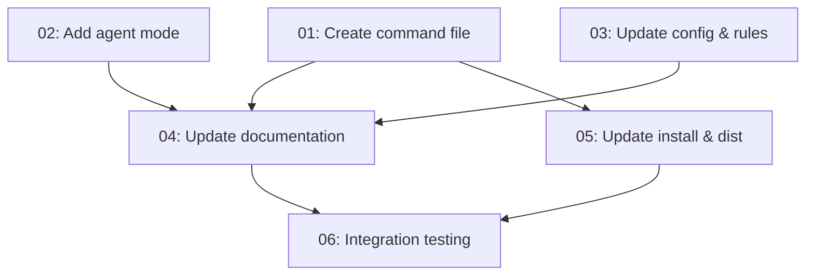

# Spec: CRUX Meditate — Recursive Memory-Informed Exploration

## Status
Completed

## Overview
A new `/crux-meditate` command that performs recursive memory-informed exploration through 3-level deep agent inception. The command examines chat context (or user-provided parameters: text, files, folders, images, past chats), derives 3 facets, and spawns parallel `crux-cursor-memory-manager` subagents that recursively explore each facet through 3 depth levels. Insights consolidate back up through the recursion tree and are presented to the user with interactive continuation options.

## Key Decisions
- **Self-recursive agent pattern**: The same agent type (`crux-cursor-memory-manager`) serves as both orchestrator (depth 0) and recursive children (depths 1–3). Recursion is controlled by `meditateDepth` and `meditateFacet` parameters rather than introducing separate agent types. This keeps the agent boundary clean — the memory manager already has all the skills needed for memory queries and exploration.
- **3-level depth limit**: Fixed at 3 levels to balance exploration depth against token cost and latency. Each level spawns one child, producing a 3×3 tree (3 branches × 3 depths = 9 total leaf explorations).
- **Interactive continuation**: After consolidation, the user can expand in new directions (re-running the full 3-level recursion with enriched context), save insights as a draft spec, or end the session.
- **SVG architecture diagram**: Added to the website (`web/compress.md/memories.html`) rather than as a standalone image, keeping documentation self-contained in HTML.

## Requirements
1. Command file `.cursor/commands/crux-meditate.md` with full usage documentation
2. New "Meditate Mode" in `crux-cursor-memory-manager` agent definition with recursive exploration protocol
3. Config entry in `.crux/crux-memories.json` for the meditate command
4. Amnesia override list in `crux-memories-integration.md` updated to include `/crux-meditate`
5. All sibling command files updated with cross-references to `/crux-meditate`
6. Documentation updated: README, CONTRIBUTORS, docs/crux-memories.md, web/memories.html
7. Install and distribution files updated: install.py, install.crux.md, scripts/create-crux-zip.py
8. Eval scenarios added to USER_EVAL_CHECKLISTS.md
9. SVG recursion architecture diagram added to website

## Subtask Manifest

Every subtask is listed here with its file, assigned agent, dependencies, and phase.
Subtask IDs are numbered in dependency order — lower IDs never depend on higher IDs.

| ID | File | Subagent | Dependencies | Phase | Status |
|----|------|----------|-------------|-------|--------|
| 01 | `subtask-01-crux-meditate-create-command-20260425.md` | crux-software-engineer | — | 1 | Done |
| 02 | `subtask-02-crux-meditate-add-agent-mode-20260425.md` | crux-software-engineer | — | 1 | Done |
| 03 | `subtask-03-crux-meditate-update-config-rules-20260425.md` | crux-software-engineer | — | 1 | Done |
| 04 | `subtask-04-crux-meditate-update-documentation-20260425.md` | crux-platform-architect | 01, 02, 03 | 2 | Done |
| 05 | `subtask-05-crux-meditate-update-install-dist-20260425.md` | crux-software-engineer | 01 | 2 | Done |
| 06 | `subtask-06-crux-meditate-integration-testing-20260425.md` | crux-software-engineer | 04, 05 | 3 | Done |

## Subtask Dependency Graph

## Execution Order

Phases are derived from the dependency graph. Subtasks within a phase have no
dependencies on each other and may run in parallel. A phase starts only after
all subtasks in prior phases are complete.

### Phase 1 — Core Implementation (Parallel)
| ID | Subagent | Description |
|----|----------|-------------|
| 01 | crux-software-engineer | Create `.cursor/commands/crux-meditate.md` with full usage, argument handling, exploration workflow, and related command links |
| 02 | crux-software-engineer | Add Meditate Mode to `.cursor/agents/crux-cursor-memory-manager.md` — recursive exploration protocol, invocation variants, design principles |
| 03 | crux-software-engineer | Add `commands.meditate` entry to `.crux/crux-memories.json`, update amnesia override list in `.cursor/rules/crux-memories-integration.md`, regenerate `.crux.mdc` |

### Phase 2 — Documentation & Distribution (Parallel, after Phase 1)
| ID | Subagent | Description |
|----|----------|-------------|
| 04 | crux-platform-architect | Update README.md, CONTRIBUTORS.md, AGENTS.md, docs/crux-memories.md, web/memories.html (command card + SVG diagram), evals, sibling command files |
| 05 | crux-software-engineer | Update install.py (MEMORY_FILE_PREFIXES, default commands, fallback list), regenerate install.crux.md, update scripts/create-crux-zip.py DIST_FILES |

### Phase 3 — Verification (after Phase 2)
| ID | Subagent | Description |
|----|----------|-------------|
| 06 | crux-software-engineer | Integration testing — verify all files updated, command registered, cross-references consistent, test suite passes |

## Definition of Done
- [x] All subtasks completed
- [x] All tests passing
- [x] No linter errors in modified files
- [x] Documentation updated across all surfaces
- [x] SVG architecture diagram renders correctly on website
- [x] Eval scenarios documented

## Rollback Plan
All changes are new file creation or text additions to existing files. Rollback via `git checkout` of the affected files and removal of `.cursor/commands/crux-meditate.md`.

## Execution Notes
All 6 subtasks completed successfully. The `/crux-meditate` command implements a novel self-recursive agent pattern where `crux-cursor-memory-manager` spawns child instances of itself, controlled by `meditateDepth` and `meditateFacet` parameters. The 3-level recursion tree (3 branches × 3 depths) provides deep memory-informed exploration with interactive continuation options. Documentation, install scripts, distribution config, and eval scenarios all updated to reflect the new command.
