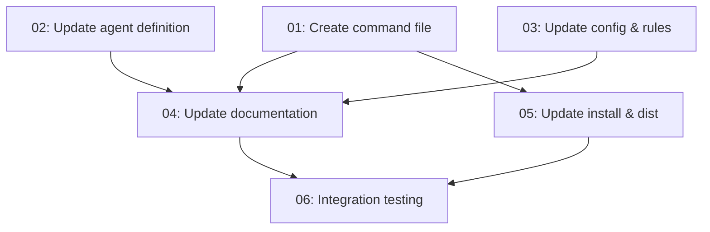

# Spec: /crux-remember Command

## Status
Completed

## Overview
Add a `/crux-remember` command to the CRUX memories system, providing users with a direct way to create ad-hoc memories outside of spec workflows. Unlike `/crux-dream` (which extracts memories from completed work items), `/crux-remember` lets users capture insights, learnings, and ideas immediately — with interactive type selection via `AskQuestion` and optional `--type` flag for scripted usage. Memories created via this command are tagged with `source: "adhoc"` and participate in standard consolidation during REM sleep.

## Key Decisions
- Decision 1: Type selection uses `AskQuestion` with options sourced from `typeTransitions` keys (`idea`, `learning`, `redflag`, `core`, `goal`), keeping the UI consistent with the config-driven type system
- Decision 2: The `--type <type>` flag allows skipping interactive type selection for power users and scripted workflows
- Decision 3: Ad-hoc memories always set `source: "adhoc"` to distinguish them from spec-extracted memories (which carry their spec name as source)
- Decision 4: Ad-hoc memories are placed in base scope (`memories/{type}/`) by default — the agent scoping rule was relaxed to allow this without requiring dream extraction context
- Decision 5: The command delegates to existing skills (`crux-skill-memory-crud` for creation, `crux-skill-memory-index` for index rebuild) rather than implementing creation logic directly

## Requirements
1. Create `.cursor/commands/crux-remember.md` command definition file
2. Add Remember Mode to the memory manager agent (`.cursor/agents/crux-cursor-memory-manager.md`)
3. Add a `remember` entry to the `commands` section in `.crux/crux-memories.json`
4. Update `.cursor/rules/crux-memories-integration.md` amnesia override list to include `/crux-remember`
5. Regenerate `.cursor/rules/crux-memories-integration.crux.mdc` from the updated source
6. Update agent scoping rule to allow ad-hoc base-scope memory creation via `/crux-remember`
7. Update all documentation files (`README.md`, `CONTRIBUTORS.md`, `AGENTS.md`, `docs/crux-memories.md`, `web/compress.md/memories.html`)
8. Update related command files with cross-references (`crux-amnesia.md`, `crux-dream.md`, `crux-forget.md`, `crux-recall.md`)
9. Add eval scenarios to `evals/USER_EVAL_CHECKLISTS.md`
10. Update `install.py` (`MEMORY_FILE_PREFIXES`, default commands, fallback list) and regenerate `install.crux.md`
11. Update `scripts/create-crux-zip.py` `DIST_FILES`

## Subtask Manifest

Every subtask is listed here with its file, assigned agent, dependencies, and phase.
Subtask IDs are numbered in dependency order — lower IDs never depend on higher IDs.

| ID | File | Subagent | Dependencies | Phase | Status |
|----|------|----------|-------------|-------|--------|
| 01 | `subtask-01-crux-remember-create-command-20260425.md` | crux-software-engineer | — | 1 | Done |
| 02 | `subtask-02-crux-remember-update-agent-20260425.md` | crux-software-engineer | — | 1 | Done |
| 03 | `subtask-03-crux-remember-update-config-rules-20260425.md` | crux-software-engineer | — | 1 | Done |
| 04 | `subtask-04-crux-remember-update-documentation-20260425.md` | crux-platform-architect | 01, 02, 03 | 2 | Done |
| 05 | `subtask-05-crux-remember-update-install-dist-20260425.md` | crux-software-engineer | 01 | 2 | Done |
| 06 | `subtask-06-crux-remember-integration-testing-20260425.md` | crux-software-engineer | 04, 05 | 3 | Done |

## Subtask Dependency Graph

## Execution Order

Phases are derived from the dependency graph. Subtasks within a phase have no
dependencies on each other and may run in parallel. A phase starts only after
all subtasks in prior phases are complete.

### Phase 1 — Core Implementation (Parallel)
| ID | Subagent | Description |
|----|----------|-------------|
| 01 | crux-software-engineer | Create `.cursor/commands/crux-remember.md` command definition with argument handling, `--type` flag, and skill delegation |
| 02 | crux-software-engineer | Add Remember Mode to `.cursor/agents/crux-cursor-memory-manager.md`, relax agent scoping rule for ad-hoc creation |
| 03 | crux-software-engineer | Add `commands.remember` to `.crux/crux-memories.json`, update `.cursor/rules/crux-memories-integration.md` amnesia override list, regenerate `.crux.mdc` |

### Phase 2 — Documentation & Distribution (Parallel, after Phase 1)
| ID | Subagent | Description |
|----|----------|-------------|
| 04 | crux-platform-architect | Update `README.md`, `CONTRIBUTORS.md`, `AGENTS.md`, `docs/crux-memories.md`, `web/compress.md/memories.html`, related command cross-references, and `evals/USER_EVAL_CHECKLISTS.md` |
| 05 | crux-software-engineer | Update `install.py` (`MEMORY_FILE_PREFIXES`, default commands, fallback list), regenerate `install.crux.md`, update `scripts/create-crux-zip.py` `DIST_FILES` |

### Phase 3 — Verification (after Phase 2)
| ID | Subagent | Description |
|----|----------|-------------|
| 06 | crux-software-engineer | Integration testing — verify command wiring, config completeness, documentation accuracy, test suite passes |

## Definition of Done
- [x] `.cursor/commands/crux-remember.md` exists with AskQuestion type selection and `--type` flag
- [x] Memory manager agent has a Remember Mode section with full workflow
- [x] Agent scoping rule relaxed for ad-hoc base-scope memory creation
- [x] `.crux/crux-memories.json` has `commands.remember` entry
- [x] Amnesia override list includes `/crux-remember`
- [x] CRUX-compressed rule regenerated
- [x] All documentation files updated (README, CONTRIBUTORS, AGENTS, crux-memories docs, website)
- [x] Related commands have cross-references to `/crux-remember`
- [x] Eval scenarios added
- [x] Install and distribution files updated
- [x] All subtasks completed
- [x] No linter errors in modified files

## Rollback Plan
All changes are additive file creations and text insertions. Rollback via `git checkout` of the affected files and `git rm` of `.cursor/commands/crux-remember.md`.

## Execution Notes
- **Reverse-engineered spec**: This spec documents work already completed in a prior chat session. All subtasks were implemented and verified.
- All 6 subtasks completed successfully.
- The command follows established patterns from `/crux-dream`, `/crux-forget`, and `/crux-recall`.
- Ad-hoc memories use `source: "adhoc"` and default to base scope, integrating cleanly with the existing REM sleep consolidation pipeline.
