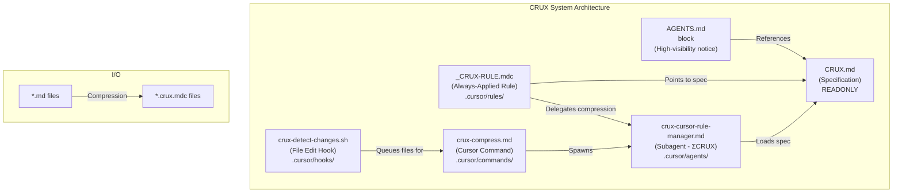
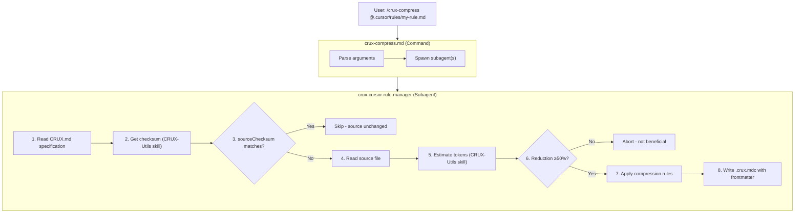
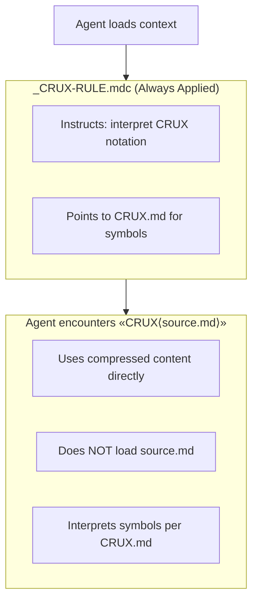
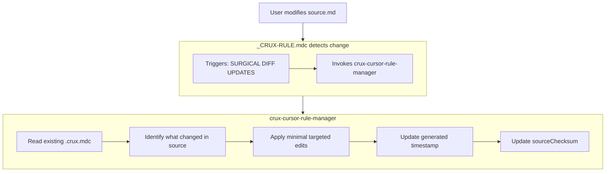

# ΣCRUX Compress

**Repository**: [github.com/zotoio/CRUX-Compress](https://github.com/zotoio/CRUX-Compress)

## The Problem

AI coding assistants like Cursor rely on context windows to understand your project. When you add natural language markdown rules to guide agent behavior, those rules consume valuable context tokens—often thousands of tokens per rule file. As your rule library grows, context window usage balloons, leaving less room for actual code and conversation.

Users want to manage their rules in readable, natural language markdown. But LLMs don't need the verbose prose—they just need the actionable information.

## The Approach

CRUX extracts the essential meaning from natural language markdown rules and compresses it into a logic-based Domain Specific Language (DSL) that all LLMs understand without additional instructions.

**How it works:**

1. **You write rules in natural language markdown** — readable, maintainable, version-controllable
2. **CRUX compresses them** — extracting the "crux" (the decisive, most important points) into a compact symbolic notation
3. **Compressed rules load into context** — achieving 5-10x token reduction (target ≤20% of original)
4. **LLMs interpret the notation natively** — no decompression needed, semantic meaning preserved, although the spec is added for completeness and reinforcement

The result: your context window stays lean while your rules remain powerful.

## Demonstration

<div align="center">

```
┌───────────────────────────────────────────────────────────┐
│                                                           │
│   ████████░░░░░░░░░░░░░░░░░░░░░░░░░░░░░░░░  82% SAVED     │
│                                                           │
│       BEFORE: ~625 tokens  →  AFTER: ~112 tokens          │
│                                                           │
└───────────────────────────────────────────────────────────┘
```

</div>

<details>
<summary><strong>BEFORE — Original Rule (625 tokens)</strong></summary>

> # Team Development Standards
> 
> ## Key Definitions
> 
> | Abbreviation | Meaning |
> |--------------|---------|
> | fn | function |
> | cls | class |
> | cmp | component |
> | pr | pull request |
> 
> ## Style Rules
> 
> ### Indentation & Formatting
> 
> - Use **2 spaces** for indentation
> - **Never use tabs!** This is strictly enforced
> - Lines must not exceed **100 characters**
> 
> ### Naming Conventions
> 
> | Element | Convention | Examples |
> |---------|------------|----------|
> | Functions | camelCase | `getUserData`, `processOrder` |
> | Classes | PascalCase | `UserService`, `OrderProcessor` |
> | Constants | UPPER_SNAKE_CASE | `MAX_RETRIES`, `API_BASE_URL` |
> 
> ## Quality Rules
> 
> ### Size Limits
> 
> - Functions must be **50 lines or fewer**
> - Classes must be **300 lines or fewer**
> 
> ### Documentation & Testing
> 
> - All exported members must have test coverage of **at least 80%**
> - All functions must include JSDoc comments documenting:
>   - Parameters
>   - Return value
> 
> ### Complexity
> 
> - Cyclomatic complexity must not exceed **10**
> 
> ## Code Review Process
> 
> - All pull requests require:
>   - At least **1 approval** from a reviewer
>   - **CI pipeline must pass**
> - If a change is **500 lines or more**, you must split it into smaller PRs!
> 
> ## Patterns to Avoid
> 
> | Anti-Pattern | Guidance |
> |--------------|----------|
> | `any` type | **Strictly forbidden!** Always use proper types |
> | `console.log` | Not allowed in production code |
> | Magic numbers | Extract to named constants instead |
> 
> ## Examples
> 
> ### Good Practice
> 
> When handling errors, use try/catch with proper logging and handling:
> 
> ```typescript
> try {
>   await riskyOperation();
> } catch (error) {
>   logger.error('Operation failed', error);
>   handleError(error);
> }
> ```
> 
> ### Bad Practice
> 
> Never silently swallow errors:
> 
> ```typescript
> try {
>   await riskyOperation();
> } catch (e) {
>   /* ignore */
> }
> ```
> 
> ## Core Principles
> 
> - **Quality takes priority over speed** — Don't sacrifice code quality to ship faster
> - **Readable code takes priority over clever code** — Write code that others can understand

</details>

---

<details open>
<summary><strong>AFTER — CRUX Compressed (112 tokens)</strong></summary>

**Try this** Copy and paste into Claude, ChatGPT, Gemini, or any LLM:

```
Explain this: CRUX:coding-standards.md;Ρ{team dev standards};Κ{fn=function;cls=class;cmp=component;pr=pull request};R.style{indent=2sp;¬tabs!;line≤100ch;naming{fn=camelCase;cls=PascalCase;const=UPPER_SNAKE}};R.quality{fn.len≤50;cls.len≤300;∀export→test.cov≥80%;∀fn→jsdoc[params+return];cyclomatic≤10};Λ.review{pr→≥1approval+CI.pass;Δ≥500lines→split!};P.avoid{¬any!;¬console.log[prod];¬magic.num→use.const};E{⊤:err→try/catch→log+handle;⊥:catch(e){/*ignore*/}};Ω{quality≻speed;readable≻clever}
```

</details>

<details>
<summary><strong>Formatted CRUX (for readability)</strong></summary>

```
Explain this: 

CRUX:coding-standards.md
Ρ{team dev standards}
Κ{fn=function; cls=class; cmp=component; pr=pull request}
R.style{
  indent=2sp; ¬tabs!; line≤100ch
  naming{fn=camelCase; cls=PascalCase; const=UPPER_SNAKE}
}
R.quality{
  fn.len≤50; cls.len≤300; ∀export→test.cov≥80%
  ∀fn→jsdoc[params+return]; cyclomatic≤10
}
Λ.review{pr→≥1approval+CI.pass; Δ≥500lines→split!}
P.avoid{¬any!; ¬console.log[prod]; ¬magic.num→use.const}
E{⊤:err→try/catch→log+handle; ⊥:catch(e){/*ignore*/}}
Ω{quality≻speed; readable≻clever}

```

</details>

---

> **Note:** Larger source documents typically achieve higher compression percentages. A 500-word markdown file might compress to 15% of its original tokens, while a 100-word file might only reach 40%. CRUX helps most dealing with verbose rules.

## Etymology

**CRUX** = **C**ontext **R**eduction **U**sing **X**-encoding

The "X" is intentionally flexible:

- e**X**pressive symbols (→ ⊳ ⊲ ∋ ∀)
- e**X**tensible notation (custom blocks)
- e**X**change format (compress ↔ expand)

The name also serves as a backronym for "crux" — the decisive or most important point — which is exactly what the compression preserves while stripping everything else.

## Quick Install

Install CRUX Compress into your project with a single command:

```bash
curl -fsSL https://raw.githubusercontent.com/zotoio/CRUX-Compress/main/install.sh | bash
```

**Prerequisites**: `curl` and `unzip` must be installed on your system.

### Install Options

```bash
# With backup of existing files
curl -fsSL .../install.sh | bash -s -- --backup

# Verbose output
curl -fsSL .../install.sh | bash -s -- --verbose

# Show help
curl -fsSL .../install.sh | bash -s -- --help
```

### What Gets Installed

The installer creates/updates these files in your project:


| File                                         | Purpose                  |
| -------------------------------------------- | ------------------------ |
| `CRUX.md`                                    | Specification (READONLY) |
| `AGENTS.md`                                  | Agent awareness notice   |
| `.crux/crux.json`                            | Installed CRUX version   |
| `.crux/crux-release-files.json`              | Release manifest         |
| `.cursor/hooks.json`                         | Hook configuration       |
| `.cursor/hooks/crux-detect-changes.sh`       | File change detection    |
| `.cursor/hooks/crux-session-start.sh`        | Session start hook       |
| `.cursor/agents/crux-cursor-rule-manager.md` | Compression subagent     |
| `.cursor/commands/crux-compress.md`          | Compression command      |
| `.cursor/rules/_CRUX-RULE.mdc`               | Always-applied rule      |
| `.cursor/skills/CRUX-Utils/`                 | Utility skill            |


### Upgrading

The install script is re-runnable. It detects existing installations and shows version comparison before upgrading:

```
Current version: v1.0.0
Latest version:  v1.1.0
Upgrading from v1.0.0 to v1.1.0...
```

Use `--backup` to preserve your existing files before overwriting.

## System Architecture

The CRUX system consists of 6 interconnected components:




## Component Details

### 1. `CRUX.md` - The Specification (Project Root)

**Purpose**: The authoritative specification defining CRUX notation syntax, encoding symbols, and compression rules.

**Key Contents**:

- Encoding symbols (structure, relations, logic, change, qualifiers)
- Standard blocks (`Ρ`, `E`, `Λ`, `Π`, `Κ`, `R`, `P`, `Γ`, `M`, `Φ`, `Ω`)
- Compression rules (eliminate prose, deduplicate, collapse, merge)
- Quality gates (target ≤20% of original token count)
- Example transformations

**Critical Rules**:

- **READONLY** - Agents must NEVER edit this file unless explicitly asked by the user
- All other CRUX components reference this as their source of truth

### 2. `<CRUX>` Block in `AGENTS.md` (Project Root)

**Purpose**: High-visibility notice ensuring ALL agents are aware of CRUX notation before they begin work.

**Location**: Near the top of `AGENTS.md`, the first file agents read.

**Key Contents**:

```xml
<CRUX agents="always">
## CRITICAL: CRUX Notation
...
### Foundational CRUX Rules (MUST FOLLOW)
1. NEVER EDIT `CRUX.md`
2. DO NOT LOAD SOURCE FILES when CRUX exists
3. SURGICAL DIFF UPDATES on source changes
4. ABORT IF NO SIGNIFICANT REDUCTION
5. IGNORE EXAMPLE RULES - `.cursor/rules/example/*` are demos only
</CRUX>
```

**Why It Matters**: This ensures agents know to:

- Load `CRUX.md` to understand compression symbols
- Use CRUX content instead of loading original source files
- Keep CRUX files synchronized when sources change

### 3. `_CRUX-RULE.mdc` - Always-Applied Rule (`.cursor/rules/`)

**Purpose**: A Cursor rule that is always loaded into context, providing agents with instructions for handling CRUX notation.

**Key Functions**:

- **Specification Loading**: Instructs agents to load `CRUX.md` and `AGENTS.md` from the project root
- **Decompression**: Tells agents to interpret and follow CRUX-compressed rules
- **Compression**: Directs agents to delegate compression tasks to `crux-cursor-rule-manager` subagent

**Key Instructions**:

- When encountering CRUX notation, use the specification in `CRUX.md` to understand and adhere to the rules
- Always interpret, understand and adhere to the meaning compressed in CRUX notation
- When asked to compress a markdown rule file, delegate to the `crux-cursor-rule-manager` subagent

### 4. `crux-cursor-rule-manager.md` - The Subagent (`.cursor/agents/`)

**Purpose**: A specialized AI subagent (ΣCRUX) that performs compression and decompression tasks.

**Capabilities**:

- **Compression**: Convert verbose markdown → compact CRUX notation
- **Decompression**: Explain CRUX notation in natural language
- **Validation**: Verify CRUX output follows specification
- **Semantic Validation**: Compare CRUX to source, produce confidence score
- **Surgical Diff Updates**: Update CRUX files when sources change

**Workflow**:

1. Load `CRUX.md` specification (required first step)
2. Get source file's checksum via `CRUX-Utils` skill
3. Check if existing CRUX `sourceChecksum` matches → skip if unchanged
4. Estimate token reduction using `CRUX-Utils` skill → abort if <50% reduction
5. Apply compression rules from specification
6. Generate output with frontmatter (generated, sourceChecksum, beforeTokens, afterTokens)
7. Verify quality gates (target ≤20% of original)
8. **Semantic validation**: Fresh agent instance compares CRUX to source, produces confidence score
9. Update frontmatter with `confidence: XX%`

**Output Format**:

```yaml
---
generated: YYYY-MM-DD HH:MM
sourceChecksum: "1234567890"
beforeTokens: 2500
afterTokens: 400
confidence: 92%
alwaysApply: true
---

> [!IMPORTANT]
> Generated file - do not edit!
```

### 5. `crux-compress.md` - The Command (`.cursor/commands/`)

**Purpose**: A Cursor command that orchestrates CRUX compression tasks.

**Usage**:

```
/crux-compress ALL                    - Compress all eligible rules
/crux-compress @path/to/file.md       - Compress a specific file
/crux-compress @file1.md @file2.md    - Compress multiple files
/crux-compress ALL --force            - Force recompression (delete existing CRUX files first)
/crux-compress @file.md --minified    - Compress with single-line output (note that LLMs take more effort to parse and understand this format)
```

**Flags**:

| Flag | Description |
|------|-------------|
| `--minified` | Single-line output, no spaces, max compression |
| `--force` | Delete existing `.crux.mdc` files before compression (bypasses checksum skip) |

**Key Features**:

- **Parallelism**: Spawns up to 4 `crux-cursor-rule-manager` subagents in parallel
- **Batching**: Processes files in batches of 4 when >4 files
- **Source Checksum Tracking**: Skips files whose sourceChecksum hasn't changed (use `--force` to bypass)
- **Eligibility Criteria**: Files must have `crux: true` frontmatter (`.md` or `.mdc` files, not `.crux.mdc`)

**File Convention**:


| Type                         | Extension   | Example                |
| ---------------------------- | ----------- | ---------------------- |
| Source (human-readable)      | `.md`       | `core-tenets.md`       |
| Compressed (token-efficient) | `.crux.mdc` | `core-tenets.crux.mdc` |


### 6. `crux-detect-changes.sh` - The Hook (`.cursor/hooks/`)

**Purpose**: A Cursor hook that automatically detects when source files with `crux: true` are modified and queues them for compression.

**How It Works**:

1. Triggered by the `afterFileEdit` Cursor hook
2. Checks if the edited file is in `.cursor/rules/` with `.md` extension (not `.crux.mdc`)
3. Verifies the file has `crux: true` in its frontmatter
4. Queues the file in `.cursor/hooks/pending-crux-compress.json` for later compression

**Hook Configuration** (`.cursor/hooks.json`):

```json
{
  "version": 1,
  "hooks": {
    "sessionStart": [
      {
        "command": "bash .cursor/hooks/crux-session-start.sh",
        "description": "Display pending CRUX compressions at session start"
      }
    ],
    "afterFileEdit": [
      {
        "command": "bash .cursor/hooks/crux-detect-changes.sh",
        "description": "Queue modified source files for CRUX compression"
      }
    ]
  }
}
```

**Benefits**:

- Automatically tracks which source files need recompression
- Displays pending compressions at session start
- Avoids manual tracking of modified files
- Works with the `/crux-compress` command workflow

### 7. `CRUX-Utils` - The Skill (`.cursor/skills/`)

**Purpose**: Multi-purpose utility for CRUX compression workflows.

**Modes**:


| Mode                                 | Purpose                                                 |
| ------------------------------------ | ------------------------------------------------------- |
| `--token-count <file>`               | Estimate tokens for a file                              |
| `--token-count --ratio <src> <crux>` | Compare source vs CRUX, calculate compression ratio     |
| `--cksum <file>`                     | Get checksum formatted for `sourceChecksum` frontmatter |


**Token Estimation Method**:


| Content Type  | Chars/Token | Notes                                |
| ------------- | ----------- | ------------------------------------ |
| Prose         | 4.0         | Markdown text, headers, lists        |
| Code blocks   | 3.5         | More symbols, shorter identifiers    |
| Special chars | 1.0         | CRUX Unicode symbols (→, ⊳, «, etc.) |


**Benefits**:

- Deterministic (same input = same output)
- Content-aware (different ratios for prose vs code)
- CRUX-aware (counts special Unicode symbols)
- Used by `crux-cursor-rule-manager` for frontmatter metrics

See `.cursor/skills/CRUX-Utils/SKILL.md` for detailed usage.

## Installation in Another Project

To use CRUX in your project, copy these files to your project root:


| File                                         | Purpose                                                                       |
| -------------------------------------------- | ----------------------------------------------------------------------------- |
| `CRUX.md`                                    | Specification (READONLY)                                                      |
| `AGENTS.md`                                  | Agent awareness notice (or add the `<CRUX>` block to your existing AGENTS.md) |
| `.crux/crux.json`                            | Installed CRUX version                                                        |
| `.crux/crux-release-files.json`              | Release manifest for backup/verification                                      |
| `.cursor/hooks.json`                         | Hook configuration                                                            |
| `.cursor/hooks/crux-detect-changes.sh`       | File change detection hook                                                    |
| `.cursor/hooks/crux-session-start.sh`        | Session start hook                                                            |
| `.cursor/agents/crux-cursor-rule-manager.md` | Compression subagent                                                          |
| `.cursor/commands/crux-compress.md`          | Compression command                                                           |
| `.cursor/rules/_CRUX-RULE.mdc`               | Always-applied rule                                                           |
| `.cursor/skills/CRUX-Utils/`                 | Utility skill (token estimation, checksums)                                   |


Then:

1. Ensure `.cursor/hooks.json` is recognized by Cursor
2. Add `crux: true` to any rule files you want to compress
3. Use `/crux-compress ALL` to compress eligible files

## How They Work Together

### Compression Flow




### Decompression Flow (Runtime)




### Synchronization Flow




## Foundational Rules (All Components Enforce)

These rules are defined in `CRUX.md` (numbered 0-4) and enforced by all CRUX components:

0. **ALWAYS INTERPRET AND UNDERSTAND ALL CRUX RULES FIRST** - At session start, interpret all CRUX notation in rules. When new rules are added to context, interpret them immediately. Build a mental model of all rules that can be visualized on request.
1. **NEVER EDIT `CRUX.md`** - The specification is read-only unless explicitly asked by the user
2. **DO NOT LOAD SOURCE FILES when CRUX exists** - Use `«CRUX⟨...⟩»` content directly
3. **SURGICAL DIFF UPDATES** - Keep CRUX files synchronized with source changes
4. **ABORT IF NO SIGNIFICANT REDUCTION** - Target ≤20% of original; skip if not achieved

## File Locations Summary


| Component           | Path                                         | Purpose                        |
| ------------------- | -------------------------------------------- | ------------------------------ |
| Specification       | `CRUX.md`                                    | Defines notation syntax        |
| Agent Notice        | `AGENTS.md` (CRUX block)                     | High-visibility awareness      |
| Version Metadata    | `.crux/crux.json`                            | Installed CRUX version         |
| Release Manifest    | `.crux/crux-release-files.json`              | File checksums for backup      |
| Always-Applied Rule | `.cursor/rules/_CRUX-RULE.mdc`               | Runtime instructions           |
| Subagent            | `.cursor/agents/crux-cursor-rule-manager.md` | Compression executor           |
| Compress Command    | `.cursor/commands/crux-compress.md`          | Compression interface          |
| Test Command        | `.cursor/commands/crux-test.md`              | LLM feature testing            |
| Hook                | `.cursor/hooks/crux-detect-changes.sh`       | Auto-detect file changes       |
| Session Hook        | `.cursor/hooks/crux-session-start.sh`        | Show pending compressions      |
| Hook Config         | `.cursor/hooks.json`                         | Hook configuration             |
| Utility Skill       | `.cursor/skills/CRUX-Utils/`                 | Token estimation, checksums    |
| Install Script      | `install.sh`                                 | Curl-pipe-bash installer       |
| Zip Builder         | `scripts/create-crux-zip.sh`                 | Build distribution zip         |
| Shellcheck          | `scripts/shellcheck.sh`                      | Lint all shell scripts         |
| Tests               | `tests/*.bats`                               | BATS test suite                |
| CI Workflows        | `.github/workflows/`                         | Automated testing and releases |
| Dev Rules           | `.cursor/rules/*.mdc`                        | Development workflow rules     |


## Quick Reference

### To Compress a Rule File

```
/crux-compress @.cursor/rules/my-rule.md
```

### To Make a File Eligible for Compression

Add to frontmatter:

```yaml
---
crux: true
---
```

**Note**: Both `.md` and `.mdc` files with `crux: true` are eligible. For `.mdc` files, the compression workflow will:

1. Rename the file to `.md` (preserving the source)
2. Compress to `.crux.mdc` (which becomes the active Cursor rule)

### To Check Compression Ratio and Confidence

Compressed files include metrics in frontmatter:

```yaml
beforeTokens: 2500  # Original
afterTokens: 400    # Compressed (16% of original)
confidence: 92%     # Semantic validation score
```

**Confidence Score** indicates how well CRUX preserves semantic meaning:

- ≥90%: Excellent (accept as-is)
- 80-89%: Good (accept)
- 70-79%: Marginal (review)
- <70%: Poor (revise)

### CRUX Notation Quick Reference

```
STRUCTURE:  «»⟨⟩{}[]().sub
COMPARE:    > < ≥ ≤
PRIORITY:   ≻ ≺
DATA FLOW:  → ←
RELATIONS:  ⊳ ⊲ @ : = ∋
LOGIC:      | & ⊤ ⊥ ∀ ∃ ¬
CHANGE:     Δ + -
QUALIFY:    * ? ! #
IMPORTANCE: ⊛ ◊
BLOCKS:     Ρ E Λ Π Κ R P Γ M Φ Ω
```

See `CRUX.md` for complete specification.

## Testing

CRUX Compress includes comprehensive test coverage for all scripts.

### Running Tests Locally

Tests use [BATS](https://github.com/bats-core/bats-core) (Bash Automated Testing System):

```bash
# Install BATS (if not already installed)
# macOS
brew install bats-core

# Ubuntu/Debian
sudo apt-get install bats

# Run all tests
bats tests/*.bats

# Run specific test file
bats tests/test_crux_utils.bats

# Verbose output
bats tests/*.bats --verbose-run
```

### Running Shellcheck Locally

All shell scripts are validated with [shellcheck](https://www.shellcheck.net/). Run locally before committing:

```bash
# Install shellcheck (if not already installed)
# macOS
brew install shellcheck

# Ubuntu/Debian
sudo apt install shellcheck

# Run shellcheck on all scripts
./scripts/shellcheck.sh

# Show diff suggestions for fixes
./scripts/shellcheck.sh --fix
```

The script checks all shell files including `install.sh`, `scripts/create-crux-zip.sh`, hook scripts, utility scripts, and test helpers.

### Test Coverage


| Script                       | Test File               | Coverage                                          |
| ---------------------------- | ----------------------- | ------------------------------------------------- |
| `crux-utils.sh`              | `test_crux_utils.bats`  | Token counting, checksums, ratios, error handling |
| `scripts/create-crux-zip.sh` | `test_create_zip.bats`  | Zip contents, version embedding, structure        |
| `crux-detect-changes.sh`     | `test_detect_hook.bats` | Frontmatter detection, queue management           |
| `install.sh`                 | `test_install.bats`     | Syntax validation, options, functions             |


### LLM Feature Testing

Use the `/crux-test` command in Cursor to run comprehensive LLM-driven tests:

```
/crux-test              - Run all tests
/crux-test compression  - Test compression only
/crux-test validation   - Test semantic validation only
```

This generates a `CRUX-TEST-REPORT.md` with detailed results including:

- Compression metrics
- Token reduction analysis
- Semantic validation scores
- Any issues found

## CI/CD

CRUX Compress uses GitHub Actions for automated testing and releases.

### Workflows


| Workflow           | Trigger        | Purpose                                          |
| ------------------ | -------------- | ------------------------------------------------ |
| `test.yml`         | PR, Push       | Runs BATS tests, validates zip, checks scripts   |
| `version-bump.yml` | Push to main   | Auto-bumps version based on conventional commits |
| `release.yml`      | Version change | Creates GitHub Release with zip artifact         |


### Conventional Commits

Version bumping follows conventional commits:


| Commit Type        | Version Bump  | Example                          |
| ------------------ | ------------- | -------------------------------- |
| `feat:`            | Minor (1.X.0) | `feat: add new compression mode` |
| `fix:`             | Patch (1.0.X) | `fix: handle empty files`        |
| `BREAKING CHANGE:` | Major (X.0.0) | Body contains "BREAKING CHANGE:" |
| Other              | Patch (1.0.X) | `docs: update readme`            |


### Release Process

1. Push commits to `main` with conventional commit messages
2. `version-bump.yml` analyzes commits and updates `.crux/crux.json`
3. `release.yml` detects version change and:
  - Generates checksums and updates `.crux/crux-release-files.json` manifest
  - Builds versioned zip via `scripts/create-crux-zip.sh`
  - Creates GitHub Release with tag `vX.X.X`
  - Attaches zip as release artifact
  - Generates release notes from commits

## Contributing

1. Fork the repository
2. Create a feature branch: `git checkout -b feature/my-feature`
3. Make changes and add tests
4. Run tests: `bats tests/*.bats`
5. Commit with conventional message: `git commit -m "feat: add my feature"`
6. Push and create PR

## License

MIT License - see LICENSE file for details.