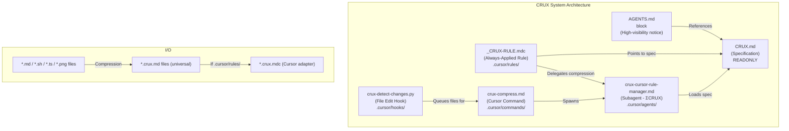
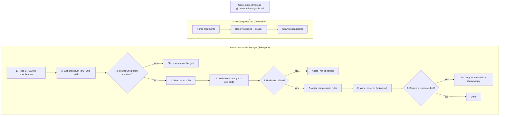
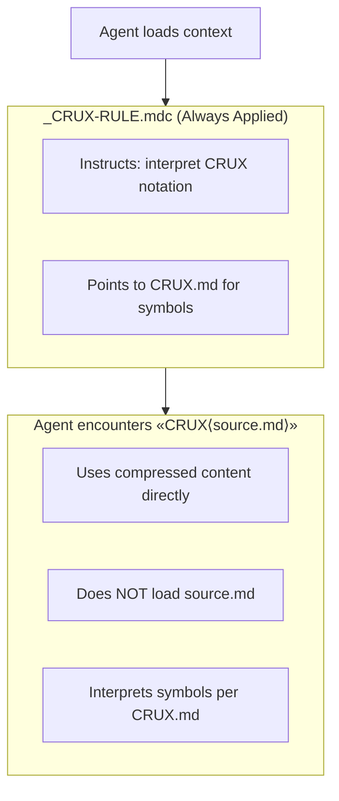
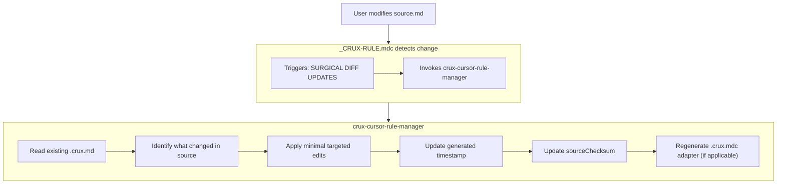

# ΣCRUX Compress


**Website**: [compress.md](https://compress.md)
**Repository**: [github.com/zotoio/CRUX-Compress](https://github.com/zotoio/CRUX-Compress)

## Table of Contents

- [The Problem](#the-problem)
- [The Approach](#the-approach)
- [Demonstration](#demonstration)
- [Etymology](#etymology)
- [Quick Install](#quick-install)
  - [Install Options](#install-options)
  - [What Gets Installed](#what-gets-installed)
  - [Upgrading](#upgrading)
- [How They Work Together](#how-they-work-together)
  - [Compression Flow](#compression-flow)
- [Installation in Another Project](#installation-in-another-project)
- [CRUX Components](#crux-components)
  - [1. The Specification (`CRUX.md`)](#1-the-specification-cruxmd)
  - [2. Agent Awareness (`AGENTS.md`)](#2-agent-awareness-agentsmd)
  - [3. `crux-cursor-rule-manager` - The Subagent](#3-crux-cursor-rule-manager---the-subagent)
  - [4. `/crux-compress` - The Command](#4-crux-compress---the-command)
  - [5. `crux-session-start.py` - The Hook](#5-crux-session-startsh---the-hook)
  - [6. `crux-detect-changes.py` - The Hook](#6-crux-detect-changessh---the-hook)
  - [7. `crux-utils` - The Skill](#7-crux-utils---the-skill)
- [Memories](#memories)
  - [Enabling Memories](#enabling-memories)
  - [Memory Commands](#memory-commands)
  - [MCP Server (Optional)](#mcp-server-optional)
  - [Python Dependencies](#python-dependencies)


## The Problem

AI coding assistants like Cursor rely on context windows to understand your project. When you add natural language markdown rules to guide agent behavior, those rules consume valuable context tokens—often thousands of tokens per rule file. As your rule library grows, context window usage balloons, leaving less room for actual code and conversation.

Users want to manage their rules in readable, natural language markdown. But LLMs don't need the verbose prose—they just need the actionable information.

## The Approach

CRUX extracts the essential meaning from natural language markdown rules and compresses it into a logic-based Domain Specific Language (DSL) that all LLMs understand without additional instructions.

> CRUX compression works for more than just rules, but this is the current focus.

**How it works:**

1. **You write rules in natural language markdown** — readable, maintainable, version-controllable
2. **CRUX compresses them** — extracting the "crux" (the decisive, most important points) into a compact symbolic notation
3. **Compressed rules load into context** — achieving 5-10x token reduction (target ≤20% of original)
4. **LLMs interpret the notation natively** — no decompression needed, semantic meaning preserved, although the spec is added for completeness and reinforcement

CRUX can compress markdown rules, source code, images, and even public webpages. URL sources are automatically saved to `.crux/out/` for easy access.

The result: your context window stays lean while your rules remain powerful.

## Demonstration

<div align="center">

```
┌───────────────────────────────────────────────────────────┐
│                                                           │
│   ████████░░░░░░░░░░░░░░░░░░░░░░░░░░░░░░░░  82% SAVED     │
│                                                           │
│       BEFORE: ~625 tokens  →  AFTER: ~112 tokens          │
│                                                           │
└───────────────────────────────────────────────────────────┘
```

</div>

<details>
<summary><strong>BEFORE — Original Rule (625 tokens)</strong></summary>

> # Team Development Standards
> 
> ## Key Definitions
> 
> | Abbreviation | Meaning |
> |--------------|---------|
> | fn | function |
> | cls | class |
> | cmp | component |
> | pr | pull request |
> 
> ## Style Rules
> 
> ### Indentation & Formatting
> 
> - Use **2 spaces** for indentation
> - **Never use tabs!** This is strictly enforced
> - Lines must not exceed **100 characters**
> 
> ### Naming Conventions
> 
> | Element | Convention | Examples |
> |---------|------------|----------|
> | Functions | camelCase | `getUserData`, `processOrder` |
> | Classes | PascalCase | `UserService`, `OrderProcessor` |
> | Constants | UPPER_SNAKE_CASE | `MAX_RETRIES`, `API_BASE_URL` |
> 
> ## Quality Rules
> 
> ### Size Limits
> 
> - Functions must be **50 lines or fewer**
> - Classes must be **300 lines or fewer**
> 
> ### Documentation & Testing
> 
> - All exported members must have test coverage of **at least 80%**
> - All functions must include JSDoc comments documenting:
>   - Parameters
>   - Return value
> 
> ### Complexity
> 
> - Cyclomatic complexity must not exceed **10**
> 
> ## Code Review Process
> 
> - All pull requests require:
>   - At least **1 approval** from a reviewer
>   - **CI pipeline must pass**
> - If a change is **500 lines or more**, you must split it into smaller PRs!
> 
> ## Patterns to Avoid
> 
> | Anti-Pattern | Guidance |
> |--------------|----------|
> | `any` type | **Strictly forbidden!** Always use proper types |
> | `console.log` | Not allowed in production code |
> | Magic numbers | Extract to named constants instead |
> 
> ## Examples
> 
> ### Good Practice
> 
> When handling errors, use try/catch with proper logging and handling:
> 
> ```typescript
> try {
>   await riskyOperation();
> } catch (error) {
>   logger.error('Operation failed', error);
>   handleError(error);
> }
> ```
> 
> ### Bad Practice
> 
> Never silently swallow errors:
> 
> ```typescript
> try {
>   await riskyOperation();
> } catch (e) {
>   /* ignore */
> }
> ```
> 
> ## Core Principles
> 
> - **Quality takes priority over speed** — Don't sacrifice code quality to ship faster
> - **Readable code takes priority over clever code** — Write code that others can understand

</details>

---

<details open>
<summary><strong>AFTER — CRUX Compressed (112 tokens)</strong></summary>

**Try this** Copy and paste into Claude, ChatGPT, Gemini, or any LLM:

```
Explain this: ⟦CRUX:coding-standards.md;Ρ{team dev standards};Κ{fn=function;cls=class;cmp=component;pr=pull request};R.style{indent=2sp;¬tabs!;line≤100ch;naming{fn=camelCase;cls=PascalCase;const=UPPER_SNAKE}};R.quality{fn.len≤50;cls.len≤300;∀export→test.cov≥80%;∀fn→jsdoc[params+return];cyclomatic≤10};Λ.review{pr→≥1approval+CI.pass;Δ≥500lines→split!};P.avoid{¬any!;¬console.log[prod];¬magic.num→use.const};E{⊤:err→try/catch→log+handle;⊥:catch(e){/*ignore*/}};Ω{quality≻speed;readable≻clever}⟧
```

</details>

<details>
<summary><strong>Formatted CRUX (for readability)</strong></summary>

```
Explain this: 

⟦CRUX:coding-standards.md
Ρ{team dev standards}
Κ{fn=function; cls=class; cmp=component; pr=pull request}
R.style{
  indent=2sp; ¬tabs!; line≤100ch
  naming{fn=camelCase; cls=PascalCase; const=UPPER_SNAKE}
}
R.quality{
  fn.len≤50; cls.len≤300; ∀export→test.cov≥80%
  ∀fn→jsdoc[params+return]; cyclomatic≤10
}
Λ.review{pr→≥1approval+CI.pass; Δ≥500lines→split!}
P.avoid{¬any!; ¬console.log[prod]; ¬magic.num→use.const}
E{⊤:err→try/catch→log+handle; ⊥:catch(e){/*ignore*/}}
Ω{quality≻speed; readable≻clever}
⟧
```

</details>

---

> **Note:** Larger source documents typically achieve higher compression percentages. A 500-word markdown file might compress to 15% of its original tokens, while a 100-word file might only reach 40%. CRUX helps most dealing with verbose rules.

## Etymology

**CRUX** = **C**ontext **R**eduction **U**sing **X**-encoding

The "X" is intentionally flexible:

- e**X**pressive symbols (→ ⊳ ⊲ ∋ ∀)
- e**X**tensible notation (custom blocks)
- e**X**change format (compress ↔ expand)

The name also serves as a backronym for "crux" — the decisive or most important point — which is exactly what the compression preserves while stripping everything else.

## Quick Install

Install CRUX Compress into your project with a single command:

```bash
curl -fsSL https://raw.githubusercontent.com/zotoio/CRUX-Compress/main/install.py | python3 -
```

If GitHub is blocked in your environment, use the jsDelivr CDN mirror:

```bash
curl -fsSL https://cdn.jsdelivr.net/gh/zotoio/CRUX-Compress@main/install.py | python3 -
```

The installer automatically falls back to jsDelivr for version checks and file downloads when GitHub is unreachable.

> **Tip:** You can also copy `install.py` locally and run it directly with `python3 install.py` -- it works the same way.

**Prerequisites**: `curl` and `unzip` must be installed on your system.

### Install Options

```bash
# With backup of existing files
curl -fsSL .../install.py | python3 - --backup

# Verbose output
curl -fsSL .../install.py | python3 - --verbose

# Show help
curl -fsSL .../install.py | python3 - --help
```

### What Gets Installed

The installer creates/updates these files in your project:


| File                                         | Purpose                  |
| -------------------------------------------- | ------------------------ |
| `CRUX.md`                                    | Specification (READONLY) |
| `AGENTS.md`                                  | Agent awareness notice   |
| `.crux/crux.json`                            | Installed CRUX version   |
| `.crux/crux-release-files.json`              | Release manifest         |
| `.cursor/hooks.json`                         | Hook configuration       |
| `.cursor/hooks/crux-detect-changes.py`       | File change detection    |
| `.cursor/hooks/crux-session-start.py`        | Session start hook       |
| `.cursor/agents/crux-cursor-rule-manager.md` | Compression subagent     |
| `.cursor/commands/crux-compress.md`          | Compression command      |
| `.cursor/rules/_CRUX-RULE.mdc`               | Always-applied rule      |
| `.cursor/skills/crux-utils/`                 | Utility skill            |


### Upgrading

The install script is re-runnable. It detects existing installations and shows version comparison before upgrading:

```
Current version: v1.0.0
Latest version:  v1.1.0
Upgrading from v1.0.0 to v1.1.0...
```

Use `--backup` to preserve your existing files before overwriting.

## System Architecture

The CRUX system consists of 6 interconnected components:


```mermaid
flowchart TB
    subgraph "CRUX System Architecture"
        CRUX["CRUX.md<br/>(Specification)<br/>READONLY"]
        AGENTS["AGENTS.md<br/><CRUX> block<br/>(High-visibility notice)"]
        RULE["_CRUX-RULE.mdc<br/>(Always-Applied Rule)<br/>.cursor/rules/"]
        MANAGER["crux-cursor-rule-manager.md<br/>(Subagent - ΣCRUX)<br/>.cursor/agents/"]
        COMMAND["crux-compress.md<br/>(Cursor Command)<br/>.cursor/commands/"]
        HOOK["crux-detect-changes.py<br/>(File Edit Hook)<br/>.cursor/hooks/"]
        
        AGENTS -->|"References"| CRUX
        RULE -->|"Points to spec"| CRUX
        MANAGER -->|"Loads spec"| CRUX
        COMMAND -->|"Spawns"| MANAGER
        RULE -->|"Delegates compression"| MANAGER
        HOOK -->|"Queues files for"| COMMAND
    end
    
    subgraph "I/O"
        INPUT["*.md / *.sh / *.ts / *.png files"]
        OUTPUT["*.crux.md files (universal)"]
        CURSOR["*.crux.mdc (Cursor adapter)"]
        INPUT -->|"Compression"| OUTPUT
        OUTPUT -->|"If .cursor/rules/"| CURSOR
    end
```


## Component Details

### 1. `CRUX.md` - The Specification (Project Root)

**Purpose**: The authoritative specification defining CRUX notation syntax, encoding symbols, and compression rules.

**Key Contents**:

- Encoding symbols (structure, relations, logic, change, qualifiers)
- Standard blocks (`Ρ`, `E`, `Λ`, `Π`, `Κ`, `R`, `P`, `Γ`, `M`, `Φ`, `Ω`)
- Compression rules (eliminate prose, deduplicate, collapse, merge)
- Image compression (semantic visual descriptions using vision capabilities)
- Code compression (semantic structure extraction from source code)
- Quality gates (target ≤20% of original token count)
- Example transformations (markdown, code, and image)

**Critical Rules**:

- **READONLY** - Agents must NEVER edit this file unless explicitly asked by the user
- All other CRUX components reference this as their source of truth

### 2. `<CRUX>` Block in `AGENTS.md` (Project Root)

**Purpose**: High-visibility notice ensuring ALL agents are aware of CRUX notation before they begin work.

**Location**: Near the top of `AGENTS.md`, the first file agents read.

**Key Contents**:

```xml
<CRUX agents="always">
## CRITICAL: CRUX Notation
...
### Foundational CRUX Rules (MUST FOLLOW)
1. NEVER EDIT `CRUX.md`
2. DO NOT LOAD SOURCE FILES when CRUX exists
3. SURGICAL DIFF UPDATES on source changes
4. ABORT IF NO SIGNIFICANT REDUCTION
5. IGNORE EXAMPLE RULES - `.cursor/rules/example/*` are demos only
</CRUX>
```

**Why It Matters**: This ensures agents know to:

- Load `CRUX.md` to understand compression symbols
- Use CRUX content instead of loading original source files
- Keep CRUX files synchronized when sources change

### 3. `_CRUX-RULE.mdc` - Always-Applied Rule (`.cursor/rules/`)

**Purpose**: A Cursor rule that is always loaded into context, providing agents with instructions for handling CRUX notation.

**Key Functions**:

- **Specification Loading**: Instructs agents to load `CRUX.md` and `AGENTS.md` from the project root
- **Decompression**: Tells agents to interpret and follow CRUX-compressed rules
- **Compression**: Directs agents to delegate compression tasks to `crux-cursor-rule-manager` subagent

**Key Instructions**:

- When encountering CRUX notation, use the specification in `CRUX.md` to understand and adhere to the rules
- Always interpret, understand and adhere to the meaning compressed in CRUX notation
- When asked to compress a markdown rule file, delegate to the `crux-cursor-rule-manager` subagent

### 4. `crux-cursor-rule-manager.md` - The Subagent (`.cursor/agents/`)

**Purpose**: A specialized AI subagent (ΣCRUX) that performs compression and decompression tasks.

**Capabilities**:

- **Compression**: Convert verbose markdown or code → compact CRUX notation
- **Code Compression**: Extract semantic structure from source code into CRUX notation
- **Image Compression**: Extract semantic visual descriptions from images
- **Decompression**: Explain CRUX notation in natural language
- **Validation**: Verify CRUX output follows specification
- **Semantic Validation**: Compare CRUX to source, produce confidence score
- **Surgical Diff Updates**: Update CRUX files when sources change

**Workflow**:

1. Load `CRUX.md` specification (required first step)
2. Get source file's checksum via `crux-utils` skill
3. Check if existing CRUX `sourceChecksum` matches → skip if unchanged
4. Estimate token reduction using `crux-utils` skill → abort if <50% reduction
5. Apply compression rules from specification
6. Generate output with frontmatter (generated, sourceChecksum/sourceUrl, beforeTokens, afterTokens, reducedBy)
7. Verify quality gates (target ≤20% of original)
8. **Semantic validation**: Fresh agent instance compares CRUX to source, produces confidence score
9. Update frontmatter with `confidence: XX%`

**Output Format**:

```yaml
---
generated: YYYY-MM-DD HH:MM
sourceChecksum: "1234567890"
beforeTokens: 2500
afterTokens: 400
reducedBy: 84%
confidence: 92%
alwaysApply: true
---

> [!IMPORTANT]
> Generated file - do not edit!
```

### 5. `crux-compress.md` - The Command (`.cursor/commands/`)

**Purpose**: A Cursor command that orchestrates CRUX compression tasks.

**Usage**:

```
/crux-compress ALL                    - Compress all eligible rules
/crux-compress @path/to/file.md       - Compress a specific file
/crux-compress @file1.md @file2.md    - Compress multiple files
/crux-compress @script.sh             - Compress a code file
/crux-compress @image.png             - Compress an image
/crux-compress https://example.com/   - Compress a public webpage (outputs to .crux/out/)
/crux-compress ALL --force            - Force recompression (delete existing CRUX files first)
/crux-compress @file.md --minified    - Compress with single-line output (note that LLMs take more effort to parse and understand this format)
/crux-compress @file.md --plugin=frontmatter-tagger - Run a plugin while compressing
```

**Flags**:

| Flag | Description |
|------|-------------|
| `--minified` | Single-line output, no spaces, max compression |
| `--force` | Delete existing CRUX output files before compression (bypasses checksum skip) |
| `--plugin <name>` / `--plugin=<name>` | Enable a named plugin from `.crux/plugins/registry.json` |

**Key Features**:

- **Parallelism**: Spawns up to 4 `crux-cursor-rule-manager` subagents in parallel
- **Batching**: Processes files in batches of 4 when >4 files
- **Source Checksum Tracking**: Skips files whose sourceChecksum hasn't changed (use `--force` to bypass)
- **URL Compression**: Compress public webpages using `sourceUrl` instead of `sourceChecksum` (outputs to `.crux/out/`)
- **Default Output Location**: URL sources and unspecified locations output to `.crux/out/`
- **Two-tier output**: Universal `.crux.md` + Cursor adapter `.crux.mdc` (when source is in `.cursor/rules/`)
- **Eligibility**: Markdown needs `crux: true` frontmatter; code/images need explicit file reference
- **Plugin Hooks**: Optional lifecycle plugins (`beforeFetch`, `beforeCompress`, `afterCompress`, `afterValidate`) can be enabled via command param

**Plugin Registry**:

Create `.crux/plugins/registry.json` to declare plugins and hook bindings:

```json
{
  "plugins": {
    "frontmatter-tagger": {
      "description": "Add standardized metadata after compression",
      "hooks": ["afterCompress"]
    },
    "quality-gate": {
      "description": "Apply extra validation policy checks",
      "hooks": ["afterValidate"]
    }
  }
}
```

**File Convention**:


| Type                                   | Extension   | Example                |
| -------------------------------------- | ----------- | ---------------------- |
| Source (human-readable)                | `.md`       | `core-tenets.md`       |
| Compressed (universal, IDE-agnostic)   | `.crux.md`  | `core-tenets.crux.md`  |
| Cursor adapter (derived)               | `.crux.mdc` | `core-tenets.crux.mdc` |
| Compressed code                        | `.crux.md`  | `install.crux.md`      |
| Compressed image                       | `.crux.md`  | `diagram.crux.md`      |
| Compressed webpage (URL)               | `.crux.md`  | `.crux/out/page.crux.md` |


### 6. `crux-detect-changes.py` - The Hook (`.cursor/hooks/`)

**Purpose**: A Cursor hook that automatically detects when source files with `crux: true` are modified and queues them for compression.

**How It Works**:

1. Triggered by the `afterFileEdit` Cursor hook
2. Checks if the edited file is in `.cursor/rules/` with `.md` extension (not `.crux.mdc`)
3. Verifies the file has `crux: true` in its frontmatter
4. Queues the file in `.crux/pending-compression.json` for later compression

**Hook Configuration** (`.cursor/hooks.json`):

```json
{
  "version": 1,
  "hooks": {
    "sessionStart": [
      {
        "command": "python3 .cursor/hooks/crux-session-start.py",
        "description": "Display pending CRUX compressions at session start"
      }
    ],
    "afterFileEdit": [
      {
        "command": "python3 .cursor/hooks/crux-detect-changes.py",
        "description": "Queue modified source files for CRUX compression"
      }
    ]
  }
}
```

**Benefits**:

- Automatically tracks which source files need recompression
- Displays pending compressions at session start
- Avoids manual tracking of modified files
- Works with the `/crux-compress` command workflow

### 7. `crux-utils` - The Skill (`.cursor/skills/`)

**Purpose**: Multi-purpose utility for CRUX compression workflows.

**Modes**:


| Mode                                 | Purpose                                                 |
| ------------------------------------ | ------------------------------------------------------- |
| `--token-count <file>`               | Estimate tokens for a file                              |
| `--token-count --ratio <src> <crux>` | Compare source vs CRUX, calculate compression ratio     |
| `--cksum <file>`                     | Get checksum formatted for `sourceChecksum` frontmatter |


**Token Estimation Method**:


| Content Type  | Chars/Token | Notes                                |
| ------------- | ----------- | ------------------------------------ |
| Prose         | 4.0         | Markdown text, headers, lists        |
| Code blocks   | 3.5         | More symbols, shorter identifiers    |
| Special chars | 1.0         | CRUX Unicode symbols (→, ⊳, «, etc.) |


**Benefits**:

- Deterministic (same input = same output)
- Content-aware (different ratios for prose vs code)
- CRUX-aware (counts special Unicode symbols)
- Used by `crux-cursor-rule-manager` for frontmatter metrics

See `.cursor/skills/crux-utils/SKILL.md` for detailed usage.

## Memories

CRUX Memories is an optional learning system that lets agents extract, store, and recall knowledge across sessions. Memories persist as structured markdown files and are automatically surfaced to agents based on relevance.

The memory lifecycle has three phases:

- **Dream** — After completing a plan, extract learnings, red flags, goals, and ideas into memory files
- **REM Sleep** — Periodically rebalance the memory corpus: promote high-value memories, demote stale ones, consolidate duplicates, archive unused entries
- **MindReader** — Query and display memories in human-readable form (read-only)

### Enabling Memories

Memories are disabled by default. To enable:

1. Edit `.crux/crux-memories.json` and set `enableMemories` to `"true"`:

```json
{
  "flags": [
    { "enableMemories": "true" }
  ]
}
```

2. Memories are stored in the `memories/` directory, organized by type (`core/`, `learning/`, `redflag/`, `goal/`, `idea/`)
3. Agent-scoped memories live under `memories/agents/{agent-id}/`

### Memory Commands

| Command | Purpose |
|---------|---------|
| `/crux-dream <plan-name>` | Extract memories from a completed plan |
| `/crux-dream --rem` | Run REM sleep (rebalance all memories) |
| `/crux-dream --rem --yolo` | REM sleep with auto-apply for non-conflict changes |
| `/crux-mindreader` | Show contextually relevant memories |
| `/crux-mindreader "query"` | Search memories by keyword |
| `/crux-mindreader <plan-name>` | Show memories from a specific plan |

### MCP Server (Optional)

The CRUX MCP server provides semantic search over the memory corpus via the Model Context Protocol. Agents with MCP access can search memories more effectively than linear index scanning.

To configure the MCP server, add to `.cursor/mcp.json`:

```json
{
  "mcpServers": {
    "crux-memories": {
      "command": "python",
      "args": ["-m", "crux_mcp_server", "-t", "stdio", "--config", ".crux/crux-memories.json"]
    }
  }
}
```

The server can also run in HTTP mode for external integrations:

```bash
python -m crux_mcp_server -t http --port 8742
```

See `crux_mcp_server/README.md` for full options and tool documentation.

### Python Dependencies

The memory system and MCP server require Python >= 3.10. Install dependencies per component:

```bash
# MCP server
pip install -r crux_mcp_server/requirements.txt

# Eval tests
pip install -r evals/requirements.txt
```

## Installation in Another Project
To use CRUX in your project, see [Quick Install](#quick-install).


| File                                         | Purpose                                                                       |
| -------------------------------------------- | ----------------------------------------------------------------------------- |
| `CRUX.md`                                    | Specification (READONLY)                                                      |
| `AGENTS.md`                                  | Agent awareness notice (or add the `<CRUX>` block to your existing AGENTS.md) |
| `.crux/crux.json`                            | Installed CRUX version                                                        |
| `.crux/crux-release-files.json`              | Release manifest for backup/verification                                      |
| `.cursor/hooks.json`                         | Hook configuration                                                            |
| `.cursor/hooks/crux-detect-changes.py`       | File change detection hook                                                    |
| `.cursor/hooks/crux-session-start.py`        | Session start hook                                                            |
| `.cursor/agents/crux-cursor-rule-manager.md` | Compression subagent                                                          |
| `.cursor/commands/crux-compress.md`          | Compression command                                                           |
| `.cursor/rules/_CRUX-RULE.mdc`               | Always-applied rule                                                           |
| `.cursor/skills/crux-utils/`                 | Utility skill (token estimation, checksums)                                   |


Then:

1. Ensure `.cursor/hooks.json` is recognized by Cursor
2. Add `crux: true` to any rule files you want to compress
3. Use `/crux-compress ALL` to compress eligible files

## How They Work Together

### Compression Flow


```mermaid
flowchart TD
    USER["User: /crux-compress @.cursor/rules/my-rule.md"]
    
    subgraph COMMAND["crux-compress.md (Command)"]
        C1["Parse arguments"]
        C2["Resolve plugins (--plugin)"]
        C3["Spawn subagent(s)"]
        C1 --> C2 --> C3
    end
    
    subgraph MANAGER["crux-cursor-rule-manager (Subagent)"]
        M1["1. Read CRUX.md specification"]
        M2["2. Get checksum (crux-utils skill)"]
        M3{"3. sourceChecksum matches?"}
        M4["4. Read source file"]
        M5["5. Estimate tokens (crux-utils skill)"]
        M6{"6. Reduction ≥50%?"}
        M7["7. Apply compression rules"]
        M8["8. Write .crux.md (universal)"]
        M9{"9. Source in .cursor/rules/?"}
        M10["10. Copy to .crux.mdc + alwaysApply"]
        
        M1 --> M2 --> M3
        M3 -->|"Yes"| SKIP["Skip - source unchanged"]
        M3 -->|"No"| M4 --> M5 --> M6
        M6 -->|"No"| ABORT["Abort - not beneficial"]
        M6 -->|"Yes"| M7 --> M8 --> M9
        M9 -->|"Yes"| M10
        M9 -->|"No"| DONE["Done"]
    end
    
    USER --> COMMAND
    COMMAND --> MANAGER
```


### Decompression Flow (Runtime)


```mermaid
flowchart TD
    START["Agent loads context"]
    
    subgraph RULE["_CRUX-RULE.mdc (Always Applied)"]
        R1["Instructs: interpret CRUX notation"]
        R2["Points to CRUX.md for symbols"]
    end
    
    subgraph INTERPRET["Agent encounters «CRUX⟨source.md⟩»"]
        I1["Uses compressed content directly"]
        I2["Does NOT load source.md"]
        I3["Interprets symbols per CRUX.md"]
    end
    
    START --> RULE
    RULE --> INTERPRET
```


### Synchronization Flow


```mermaid
flowchart TD
    START["User modifies source.md"]
    
    subgraph RULE["_CRUX-RULE.mdc detects change"]
        R1["Triggers: SURGICAL DIFF UPDATES"]
        R2["Invokes crux-cursor-rule-manager"]
        R1 --> R2
    end
    
    subgraph MANAGER["crux-cursor-rule-manager"]
        M1["Read existing .crux.md"]
        M2["Identify what changed in source"]
        M3["Apply minimal targeted edits"]
        M4["Update generated timestamp"]
        M5["Update sourceChecksum"]
        M6["Regenerate .crux.mdc adapter (if applicable)"]
        
        M1 --> M2 --> M3 --> M4 --> M5 --> M6
    end
    
    START --> RULE
    RULE --> MANAGER
```


## Foundational Rules (All Components Enforce)

These rules are defined in `CRUX.md` (numbered 0-4) and enforced by all CRUX components:

0. **ALWAYS INTERPRET AND UNDERSTAND ALL CRUX RULES FIRST** - At session start, interpret all CRUX notation in rules. When new rules are added to context, interpret them immediately. Build a mental model of all rules that can be visualized on request.
1. **NEVER EDIT `CRUX.md`** - The specification is read-only unless explicitly asked by the user
2. **DO NOT LOAD SOURCE FILES when CRUX exists** - Use `«CRUX⟨...⟩»` content directly
3. **SURGICAL DIFF UPDATES** - Keep CRUX files synchronized with source changes
4. **ABORT IF NO SIGNIFICANT REDUCTION** - Target ≤20% of original; skip if not achieved

## File Locations Summary


| Component           | Path                                         | Purpose                        |
| ------------------- | -------------------------------------------- | ------------------------------ |
| Specification       | `CRUX.md`                                    | Defines notation syntax        |
| Agent Notice        | `AGENTS.md` (CRUX block)                     | High-visibility awareness      |
| Version Metadata    | `.crux/crux.json`                            | Installed CRUX version         |
| Release Manifest    | `.crux/crux-release-files.json`              | File checksums for backup      |
| Always-Applied Rule | `.cursor/rules/_CRUX-RULE.mdc`               | Runtime instructions           |
| Subagent            | `.cursor/agents/crux-cursor-rule-manager.md` | Compression executor           |
| Compress Command    | `.cursor/commands/crux-compress.md`          | Compression interface          |
| Test Command        | `.cursor/commands/crux-test.md`              | LLM feature testing            |
| Hook                | `.cursor/hooks/crux-detect-changes.py`       | Auto-detect file changes       |
| Session Hook        | `.cursor/hooks/crux-session-start.py`        | Show pending compressions      |
| Hook Config         | `.cursor/hooks.json`                         | Hook configuration             |
| Utility Skill       | `.cursor/skills/crux-utils/`                 | Token estimation, checksums    |
| Install Script      | `install.py`                                 | Curl-pipe installer (Python)   |
| Zip Builder         | `scripts/create-crux-zip.py`                 | Build distribution zip         |
| Tests               | `evals/*.py`                                 | Pytest test suite              |
| CI Workflows        | `.github/workflows/`                         | Automated testing and releases |
| Dev Rules           | `.cursor/rules/*.mdc`                        | Development workflow rules     |
| Memory Config       | `.crux/crux-memories.json`                   | Memory system configuration    |
| Memory Index        | `.crux/memory-index.yml`                     | Prioritised memory index       |
| Memory Manager      | `.cursor/agents/crux-cursor-memory-manager.md` | Memory lifecycle agent       |
| Planner Agent       | `.cursor/agents/crux-planner.md`             | Multi-step planning agent      |
| Dream Command       | `.cursor/commands/crux-dream.md`             | Memory extraction command      |
| MindReader Command  | `.cursor/commands/crux-mindreader.md`        | Memory query command           |
| MCP Server          | `crux_mcp_server/`                           | Semantic memory search server  |
| Memory Skills       | `.cursor/skills/crux-skill-memory-*/`        | Memory operation skills        |
| Memory Storage      | `memories/`                                  | Memory file storage            |
| Eval Tests          | `evals/`                                     | Python-based eval test suite   |


## Quick Reference

### To Compress a Rule File

```
/crux-compress @.cursor/rules/my-rule.md
```

### To Make a File Eligible for Compression

Add to frontmatter:

```yaml
---
crux: true
---
```

**Note**: Both `.md` and `.mdc` files with `crux: true` are eligible. For `.mdc` files, the compression workflow will:

1. Rename the file to `.md` (preserving the source)
2. Compress to `.crux.md` (universal output)
3. If in `.cursor/rules/`, also produce `.crux.mdc` (Cursor adapter with `alwaysApply`)

### To Check Compression Ratio and Confidence

Compressed files include metrics in frontmatter:

```yaml
beforeTokens: 2500  # Original
afterTokens: 400    # Compressed (16% of original)
reducedBy: 84%      # Compression percentage
confidence: 92%     # Semantic validation score
```

**Confidence Score** indicates how well CRUX preserves semantic meaning:

- ≥90%: Excellent (accept as-is)
- 80-89%: Good (accept)
- 70-79%: Marginal (review)
- <70%: Poor (revise)

### CRUX Notation Quick Reference

```
STRUCTURE:  «»⟨⟩{}[]().sub
COMPARE:    > < ≥ ≤
PRIORITY:   ≻ ≺
DATA FLOW:  → ←
RELATIONS:  ⊳ ⊲ @ : = ∋
LOGIC:      | & ⊤ ⊥ ∀ ∃ ¬
CHANGE:     Δ + -
QUALIFY:    * ? ! #
IMPORTANCE: ⊛ ◊
BLOCKS:     Ρ E Λ Π Κ R P Γ M Φ Ω
```

See `CRUX.md` for complete specification.

## Testing

CRUX Compress includes comprehensive test coverage for all scripts.

### Running Tests Locally

Tests use [pytest](https://pytest.org/):

```bash
# Install test dependencies
pip install -r evals/requirements.txt

# Run all tests
pytest evals/ -v

# Run specific test file
pytest evals/test_crux_utils.py -v

# Run with short output
pytest evals/ --tb=short
```

### Running Shellcheck Locally

All shell scripts are validated with [shellcheck](https://www.shellcheck.net/). Run locally before committing:

```bash
# Install shellcheck (if not already installed)
# macOS
brew install shellcheck

# Ubuntu/Debian
sudo apt install shellcheck

# Run all tests
python3 scripts/test.py
```

### Test Coverage


| Script                       | Test File               | Coverage                                          |
| ---------------------------- | ----------------------- | ------------------------------------------------- |
| `crux-utils.py`              | `test_crux_utils.py`    | Token counting, checksums, ratios, error handling |
| `scripts/create-crux-zip.py` | `test_create_zip.py`    | Zip contents, version embedding, structure        |
| `crux-detect-changes.py`     | `test_detect_hook.py`   | Frontmatter detection, queue management           |
| `install.py`                 | `test_install.py`       | CLI flags, version comparison, hooks merge, upsert |


### Python Eval Tests

The `evals/` directory contains pytest-based integration tests for the memory system:

```bash
# Install dependencies
pip install -r evals/requirements.txt

# Run eval tests
pytest evals/ -v
```

The `scripts/test.py` script runs bats and pytest in sequence.

### LLM Feature Testing

Use the `/crux-test` command in Cursor to run comprehensive LLM-driven tests:

```
/crux-test              - Run all tests
/crux-test compression  - Test compression only
/crux-test validation   - Test semantic validation only
```

This generates a `CRUX-TEST-REPORT.md` with detailed results including:

- Compression metrics
- Token reduction analysis
- Semantic validation scores
- Any issues found

## CI/CD

CRUX Compress uses GitHub Actions for automated testing and releases.

### Workflows


| Workflow           | Trigger        | Purpose                                          |
| ------------------ | -------------- | ------------------------------------------------ |
| `test.yml`         | PR, Push       | Runs pytest, validates zip, checks scripts        |
| `version-bump.yml` | Push to main   | Auto-bumps version based on conventional commits |
| `release.yml`      | Version change | Creates GitHub Release with zip artifact         |


### Conventional Commits

Version bumping follows conventional commits:


| Commit Type        | Version Bump  | Example                          |
| ------------------ | ------------- | -------------------------------- |
| `feat:`            | Minor (1.X.0) | `feat: add new compression mode` |
| `fix:`             | Patch (1.0.X) | `fix: handle empty files`        |
| `BREAKING CHANGE:` | Major (X.0.0) | Body contains "BREAKING CHANGE:" |
| Other              | Patch (1.0.X) | `docs: update readme`            |


### Release Process

1. Push commits to `main` with conventional commit messages
2. `version-bump.yml` analyzes commits and updates `.crux/crux.json`
3. `release.yml` detects version change and:
  - Generates checksums and updates `.crux/crux-release-files.json` manifest
  - Builds versioned zip via `scripts/create-crux-zip.py`
  - Creates GitHub Release with tag `vX.X.X`
  - Attaches zip as release artifact
  - Generates release notes from commits

## Contributing

1. Fork the repository
2. Create a feature branch: `git checkout -b feature/my-feature`
3. Make changes and add tests
4. Run tests: `pytest evals/ -v`
5. Commit with conventional message: `git commit -m "feat: add my feature"`
6. Push and create PR

## License

MIT License - see LICENSE file for details.