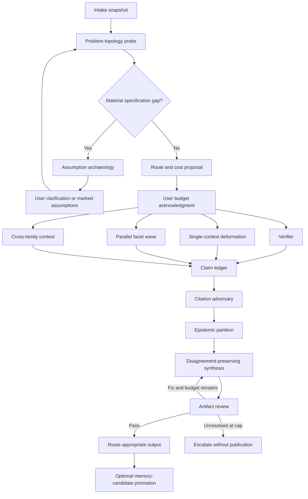

# Meditate vNext: Deformation-Grounded Architecture Analysis

**Status:** Architecture analysis
**Scope:** Consolidated design context for a future `/crux-meditate` revision
**Decision posture:** Facts, hypotheses, and unknowns are separated explicitly
**Analysis mode:** Architecture synthesis plus adversarial review using isolated
same-family contexts; agreement between those contexts is not treated as
cross-model evidence

## Executive Decision

Meditate vNext should be a **prompt-and-skill-driven, file-coordinated state
machine**. Cursor's subagent dispatcher should remain the execution engine.
A small one-shot Python utility may support deterministic operations such as
schema validation, seeded input shuffling, budget arithmetic, and claim-ledger
checks, but it should not become an `asyncio` agent orchestrator or long-running
service.

The current architecture already has the correct deployment primitives:

1. A command owns argument parsing, user gates, and every user-facing question.
2. The `crux-cursor-meditation-guide` agent owns autonomous routing and
   orchestration.
3. Named meditation skills own reusable execution contracts.
4. Agents coordinate through files rather than transcript polling or chained
   paraphrases.

The central change is therefore not a new runtime. It is a new **problem-topology
router and execution graph** that replaces fixed `3 × 3 × 3` expansion with
budgeted, evidence-directed work.

The term **problem-topology probe** is preferred over "entropy classifier." A
single LLM call does not measure entropy; it estimates properties of the problem
that determine which reasoning deformation is appropriate.

## Context Integrated by This Document

This analysis aligns five sources of context:

1. The user's delegated configuration and proposed entropy-adaptive router.
2. The uploaded research document, *Multiagent Prompting Strategies: A Design
   Document Grounded in the Deformation Literature*.
3. The current `/crux-meditate` command, guide agent, six meditation skills,
   configuration, memories, and evals.
4. A platform-architecture design pass.
5. An isolated adversarial integrity review of that design direction.

The user-provided research prompt asks for candidate multiagent prompting
strategies that make actual reasoning dispositions visible rather than implying
hidden capabilities or altered states. This requirement is treated as an
architectural invariant: every route discloses what deformation ran, whether it
used one or multiple contexts, and whether it used one or multiple model
families.

## Epistemic Status Vocabulary

This document uses:

- **Fact** — directly supported by the repository, a supplied source, or
  executable evidence.
- **Hypothesis** — a plausible design claim that requires evaluation before
  becoming a default.
- **Unknown** — an unresolved question for which the available context is
  insufficient.

These labels describe evidence status, not model confidence. Confidence scores
from proposers are deliberately hidden from reviewers because they can encourage
sycophantic convergence.

## Delegated Parameters and Resolutions

| Parameter | Delegated assumption | Resolution |
|---|---|---|
| **Heterogeneity** | Use a hybrid approach: single-context by default; cross-family models for contested empirical work | **Accepted with a quality condition.** Cross-family participants must be comparably capable and receive equivalent source/tool access. Diversity must not introduce a weak-model drag. |
| **Memory substrate** | File-based state machine with immutable inputs, isolated `.sub` artifacts, and persistent learning | **Accepted with a persistence correction.** Run artifacts are file-based and isolated. Learning is written as candidates, not appended automatically to the durable memory corpus. |
| **Routing** | One cheap LLM probe; decomposable work capped at 15 agents; debate capped at two rounds | **Accepted with scope corrections.** The probe is multi-label, `15` is a configurable parallel-wave ceiling rather than a universal saturation law, and the two-round cap applies to debate exchanges—not the existing artifact review cycle. |
| **Citation gate** | Unsupported claims are soft-downgraded into Facts, Hypotheses, or Unknowns instead of halting | **Accepted.** Unsupported claims may proceed only outside the Facts bucket. Fabricated citations, corrupt provenance, or invalid artifacts remain blocking failures. |

## Current Meditate Baseline

### What should be preserved

The current system has several strong properties that both the repository and
the supplied research support:

- File-based coordination with predictable paths and prefix-glob polling.
- Explicit cost acknowledgment before expensive work.
- Mandatory citation markers and strict parent validation in Research mode.
- Independent adversarial review before publication.
- Cross-model ensemble synthesis that distinguishes convergence, divergence,
  and unique findings.
- Structured propagation of theming, comprehensiveness, model strategy, and
  deep-confirm settings.
- Bounded review and respawn cycles.
- A process retrospective even when publication is blocked.
- Subject-matter-focused user outputs rather than process logs.
- Static fallbacks for interactive report content.

### What should change

The current default imposes three facets at each expandable node and reaches
approximately 45 agents for a depth-three Research tree. This is predictable,
but it imposes a uniform topology on problems that may have one, two, seven, or
many meaningful independent facets.

The current system also conflates several orthogonal choices:

- problem shape,
- recursion depth,
- model allocation,
- research rigor,
- report richness.

Meditate vNext should make these independent:

| Axis | Examples |
|---|---|
| Problem route | verify, clarify, decompose, contest |
| Deformation | invert, compress, horizons, triad |
| Rigor | strict citations and peer review; best-effort exploratory |
| Model strategy | caller model, random model, per-facet models, cross-family contest |
| Output profile | verification result, clarification artifact, full research report |
| Budget | maximum parallel agents, maximum total agents, debate rounds |

## Evidence Review and Corrections

### Multiagent debate has a weak base rate

**Fact:** The supplied research cites evaluations in which representative
multiagent debate methods frequently fail to outperform chain-of-thought or
self-consistency baselines at equal or lower cost.

**Design consequence:** Debate must not be the default deformation. A verifier,
single-context reframe, or independent parallel sampling should be preferred
when those mechanisms match the problem.

### Heterogeneity helps only under quality control

**Fact:** Cross-family models can provide more independent errors and framing
diversity than same-model role instructions.

**Fact:** The supplied research also records evidence that mixing a weaker model
with a stronger model can reduce aggregate quality.

**Design consequence:** `modelPool` entries need explicit family, capability,
quality-tier, tool-access, and cost metadata. A cross-family route requires at
least two comparably capable participants. Model labels alone are insufficient.

### The `n = 15` result is not a universal agent cap

**Fact:** The cited `15`-agent result comes from homogeneous sampling and
majority voting on structured benchmarks. It does not establish the saturation
point for heterogeneous, source-reading, open-ended research.

**Resolution:** Use `15` as a configurable maximum number of concurrently
running independent facet agents. Maintain a separate user-approved total-agent
budget. Determine better defaults empirically.

### Debate drift and artifact review are different

**Fact:** The cited 76–89% drift rate applies to multi-turn debate on generative
tasks. The current Meditate review loop is a criteria-based artifact audit,
checking properties such as citation resolution, frontmatter validity, missing
sections, and report integrity.

**Resolution:** Cap adversarial debate exchanges at two rounds. Keep the current
three-iteration artifact review and report-respawn budget until an eval shows
that the third iteration adds no value.

### Cohen's kappa was overextended

**Fact:** Cohen's kappa is meaningful when reviewers classify the same items
using the same categorical label set.

**Problem:** Free-form research outputs do not naturally meet those conditions,
and high agreement is not automatically evidence of theatrical review.

**Resolution:** Use kappa only in controlled reviewer evals with planted,
categorically labeled defects. At runtime, use claim-level novelty, supported
contradiction rate, unresolved evidence gaps, and marginal verified-claim yield.

### The router is itself fallible

**Fact:** A one-call router inherits single-pass model errors.

**Resolution:** The router emits its evidence, a primary and secondary route,
and a composed route plan. Users can override it. Mixed tasks are split into
components instead of forced into one exclusive class.

### Automatic continual learning is unsafe

**Fact:** The current guide agent distinguishes meditation artifacts from
durable memory files and prohibits direct memory CRUD.

**Problem:** Automatically appending fluent synthesis to a persistent memory
file would allow speculative or incorrect conclusions to contaminate future
runs.

**Resolution:** Produce `memory-candidates.yml` after the run. Promotion to the
memory corpus remains an explicit user-controlled operation through the
existing memory lifecycle.

### "Read-only" requires a precise definition

A historical repository memory describes Meditate as producing no files during
exploration, but the current implementation clearly coordinates through files
under `meditations/`.

For vNext, **read-only** means:

- no production-code changes,
- no configuration changes,
- no memory-corpus changes,
- no external mutations,
- run-local coordination artifacts are allowed.

This resolves the stale historical wording without discarding its safety goal.

## Topology Probe

The probe produces dimensions rather than one exclusive label:

```yaml
probe:
  verifier_coverage: 0.0
  specification_gap: 0.0
  decomposition_gain: 0.0
  contestation: 0.0
  dependency_coupling: 0.0
  external_evidence_need: 0.0
  confidence: 0.0

route:
  primary: "verify | clarify | decompose | contest"
  secondary: null
  composed_steps: []
  rationale: ""
  user_override: null

budget_proposal:
  likely_agents: 0
  maximum_agents: 0
  maximum_parallel_agents: 0
  debate_rounds: 0
```

### Routing rules

1. **Verifier coverage is high**
   - Run the verifier for the claims it can decide.
   - Do not run multiagent reasoning merely because the overall invocation is
     named Meditate.
   - If only part of the problem is verifiable, return verified sub-results to
     the route planner and route the remainder separately.

2. **Specification gap is material**
   - Run assumption archaeology.
   - Surface only decision-relevant assumptions.
   - Ask the user when different answers would materially change the result.
   - Otherwise proceed with explicit marked assumptions and re-enter routing
     once.

3. **Decomposition gain is high and coupling is low**
   - Derive the natural number of independent facets.
   - Launch one isolated context per confirmed facet, within the approved wave
     and total budgets.
   - Each context receives the same immutable intake and one exclusive scope.

4. **Contestation is high**
   - Determine whether the disagreement is empirical, normative, or merely
     underspecified.
   - Use heterogeneous independent contexts only for contested empirical or
     evidence-sensitive judgment where independence can change the result.
   - Preserve normative disagreements rather than pretending evidence alone can
     resolve them.

5. **Mixed topology**
   - Compose routes, for example:
     `clarify → verify-subclaims → decompose-remainder → cite-audit`.

## State Machine



### Termination invariants

- Assumption-archaeology reroute: at most one automatic reroute before user
  input is required.
- Parallel facet count: bounded by `max_parallel_agents`.
- Total spawns: bounded by the user-approved total-agent budget.
- Debate: at most two exchanges.
- Cross-family escalation: at most once per routed contested component.
- Artifact review: at most three iterations, including report respawns.
- No transition may increase a budget counter.
- Budget exhaustion converts unresolved work to Unknowns; it does not silently
  increase cost.

## Candidate Reasoning Strategies

### 1. Cheap verifier

**Deformation:** Replace model judgment with execution or deterministic checking.

**Worth the cost:** Code, math, schema validation, reproducible queries, and
claims with an available ground-truth check.

**Waste condition:** No meaningful verifier exists.

**Invocation:** `--route verify` or automatic component-level routing.

**Disclosure:** `[route: verify] [context: single] [verifier: <tool>]`.

### 2. Assumption archaeology

**Deformation:** Forbid solving until load-bearing premises, false binaries, and
unstated choices are identified.

**Worth the cost:** Wrong-question problems, strategy, ambiguous requirements,
and questions whose framing may predetermine the answer.

**Waste condition:** The task is already operationally specified.

**Invocation:** `--route clarify`, `--deform assumptions`, or "surface the
assumptions before solving."

**Disclosure:** `[deformation: assumption-archaeology] [context: single]`.

### 3. Inversion

**Deformation:** Solve how to guarantee failure or non-achievement, then invert
supported failure preventions into design constraints.

**Worth the cost:** Architecture, risk, planning, strategy, and resilience.

**Waste condition:** A direct deterministic solution is available.

**Invocation:** `--deform invert` or "how would this fail?"

**Disclosure:** `[deformation: inversion] [context: single]`; speculative failure
modes remain Hypotheses.

### 4. Compression-first reasoning

**Deformation:** Reduce the input to load-bearing variables, constraints, and
excluded details before analysis.

**Worth the cost:** Long-context tasks with sparse signal.

**Waste condition:** The problem is already minimal.

**Invocation:** `--deform compress`.

**Disclosure:** `[deformation: compression-first]`; the output records what was
omitted and why.

### 5. Temporal decomposition

**Deformation:** Hold the analytical role constant while changing the time
horizon.

**Worth the cost:** Forecasting, policy, technical debt, and strategic
decisions.

**Waste condition:** Time-invariant factual problems.

**Invocation:** `--deform horizons`.

**Disclosure:** `[deformation: temporal] [horizons: immediate, medium, long]`.

### 6. Proposer, critic, synthesizer

**Deformation:** Separate generation, evaluation, and integration to reduce
premature commitment.

**Worth the cost:** Medium-complexity analysis where a plausible first draft
needs independent evidentiary scrutiny.

**Waste condition:** A verifier can decide the result.

**Invocation:** `--deform triad`.

**Disclosure:** The system must say either:

- `[three passes, one context/model family; no independent errors claimed]`, or
- `[three isolated contexts; families: ...]`.

The critic cannot see proposer confidence. The synthesizer receives blinded,
seeded-randomized input order.

### 7. Breadth-first facet exploration

**Deformation:** Assign each independent facet its own context and budget.

**Worth the cost:** Broad searches and research whose parts can be investigated
without continuous shared state.

**Waste condition:** Strong cross-facet coupling or one narrow answer.

**Invocation:** `--route decompose`.

**Disclosure:** `[route: decompose] [isolated contexts: N] [wave: W]`.

### 8. Earned depth

**Deformation:** Expand only a branch whose first pass exposes a high-impact
unresolved claim, new counterevidence, or a productive evidence gap.

**Worth the cost:** A branch continues to produce supported novelty.

**Waste condition:** Additional passes repeat the same claims or require
unavailable evidence.

**Invocation:** Automatic within budget or `--expand <facet>`.

**Disclosure:** Every expansion records its triggering evidence gap.

### 9. Structurally opposed pair

**Deformation:** Two isolated contexts receive incompatible conclusions or
different evidence partitions and must construct the strongest supportable case.

**Worth the cost:** Contested empirical claims and decisions where persuasive
arguments can conceal weak evidence.

**Waste condition:** Deterministic answers, low-stakes questions, or artificial
opposition with no real uncertainty.

**Invocation:** `--route contest`.

**Disclosure:** `[route: contest] [contexts: 2] [families: N] [rounds: ≤2]`.

### 10. Citation adversary

**Deformation:** Review claim support rather than arguing for the opposite
conclusion.

**Worth the cost:** Research, due diligence, high-stakes recommendations, and
reports containing external factual claims.

**Waste condition:** Pure creative generation or fully deterministic reasoning.

**Invocation:** Automatic on factual routes or `--cite-audit`.

**Disclosure:** Publish the claim-level verification and downgrade log.

### 11. Epistemic partitioning

**Deformation:** Restrict final speech acts to Facts, Hypotheses, Unknowns, and
Contradicted claims.

**Worth the cost:** Any route where confident unsupported synthesis is a risk.

**Waste condition:** None for substantive Meditate outputs; implementation can
be lightweight on creative routes.

**Invocation:** Automatic quality invariant or `--epistemic`.

**Disclosure:** Each claim carries a status and provenance.

### 12. Disagreement-preserving synthesis

**Deformation:** Forbid the synthesizer from resolving genuine disagreement
without evidence.

**Worth the cost:** Heterogeneous or independently sourced findings disagree.

**Waste condition:** The answer has already been deterministically verified.

**Invocation:** Automatic on contested and heterogeneous routes.

**Disclosure:** Report the competing positions, evidence crux, and evidence that
would resolve the dispute.

## Parallel-Wave and Earned-Depth Policy

The router proposes the natural facet count; it does not pad to three.

```yaml
exploration:
  proposed_facets: 6
  confirmed_facets: 5
  max_parallel_agents: 10
  max_total_agents: 16
  current_wave: 1
  remaining_agent_budget: 11
```

A branch may expand only when at least one of these conditions holds:

- an unresolved claim has high decision impact,
- contradictory evidence was found,
- a source-backed child question is narrower than its parent,
- the expected verified-claim yield exceeds the configured minimum.

A branch stops when:

- a verifier resolves it,
- two consecutive passes add no material supported claim,
- remaining uncertainty requires unavailable external evidence,
- its unresolved items are explicitly moved to Unknowns,
- the run budget is exhausted.

Agreement by itself neither expands nor collapses a branch.

## File Coordination Design

Retain the repository's existing `meditations/{yyyymmdd}-{topic-slug}/` root.
Do not introduce a generic `workspace/memory/` directory that conflates run
state with durable memories.

```text
meditations/{yyyymmdd}-{topic-slug}/
├── intake.md
├── route.yml
├── budget.yml
├── state.yml
├── facets.md
├── sources/
│   ├── manifest.yml
│   └── snapshots/
├── .sub/
│   ├── probe/
│   ├── deformations/
│   ├── agents/
│   ├── debate/
│   ├── verification/
│   └── review/
├── claims.yml
├── epistemic-status.yml
├── consolidation.md
├── finalisation-enhancements.yml
├── retrospective-{ts}.md
├── report-{topic-slug}-{ts}.html
├── report-{topic-slug}-{ts}.pdf
└── memory-candidates.yml
```

### Immutability rules

- `intake.md`, `route.yml`, `budget.yml`, source snapshots, and every `.sub`
  artifact are immutable after creation.
- Every worker writes only to its own unique `.sub` path.
- `state.yml` is the sole mutable coordination object and has one writer: the
  root coordinator. Updates use atomic temporary-write-and-rename semantics.
- Reviews produce versioned correction artifacts rather than rewriting another
  worker's evidence.
- `consolidation.md` is promoted once the selected revision passes review.
- Existing prefix-glob discovery remains valid for timestamped reports and
  retrospectives.

### Why not make every existing file immutable in place?

The current review contract rewrites branch and consolidation files. Simply
declaring those files immutable would create competing "original" and
"corrected" copies with no authoritative pointer. The explicit state manifest
solves that problem: raw evidence remains immutable, corrections are versioned,
and the coordinator records which revision is promoted.

## Claim Ledger and Citation Gate

```yaml
claims:
  - id: "claim-017"
    text: "..."
    status: "fact | hypothesis | unknown | contradicted"
    support_type: "direct | inferred | none"
    citations:
      - source_id: "source-004"
        locator: "lines 30-42"
    source_verified: true
    contributors: ["agent-facet-2"]
    deformation: "inversion"
    disagreement_id: null
    downgrade:
      from: null
      reason: null
      review_iteration: null
```

### Soft-downgrade behavior

- Supported and source-verified claim → Fact.
- Plausible inference with traceable premises → Hypothesis.
- Missing source, unavailable data, or unresolved contest → Unknown.
- Source directly refutes claim → Contradicted.
- Fabricated citation or intentionally misrepresented source → blocking
  integrity failure.

The citation adversary reads the raw source or immutable source snapshot, not
only another agent's summary. If raw content is unavailable, the claim cannot
remain a Fact.

## Synthesis Controls

1. Hide proposer confidence and identity from the first-pass reviewer.
2. Shuffle heterogeneous inputs with a deterministic run seed.
3. Persist the seed and resulting order for audit.
4. Judge evidence, not majority count.
5. Restore model/source attribution after blinded synthesis.
6. Preserve unresolved disagreements in a dedicated disagreement set.
7. Prohibit inferred causal links without an explicit Hypothesis label.
8. Include what evidence would change each unresolved conclusion.

## User Invocation and Transparency

### Default

```text
/crux-meditate "topic"
```

Runs the topology probe, displays the proposed route and cost envelope, and
requests acknowledgment before expensive work.

### Overrides

```text
/crux-meditate --route verify "topic"
/crux-meditate --route clarify "topic"
/crux-meditate --route decompose "topic"
/crux-meditate --route contest "topic"
/crux-meditate --deform invert,compress "topic"
/crux-meditate --max-agents 12 --max-parallel 6 "topic"
/crux-meditate --ensemble "topic"
```

The exact flag grammar should be finalized during implementation, but the
semantic surface should remain compact: route, optional deformations, model
strategy, and budget.

### Required route announcement

Before execution:

```text
Route: decompose → citation audit → epistemic synthesis
Reason: five largely independent research facets; no cheap whole-task verifier
Contexts: 5 isolated contexts, same model family
Independence: context isolation only; no cross-family independence claimed
Budget: likely 8 agents, hard cap 12, max parallel 5
```

After execution:

```text
Executed: breadth-first facets + inversion on 2 facets
Escalations: none
Cross-family work: no
Claims: 18 facts, 7 hypotheses, 4 unknowns, 1 contradiction
Budget used: 8/12 agents
```

## Cost and Consent

The current command asks for depth before it knows whether depth is useful.
Adaptive routing requires a different order:

1. Run one cheap topology probe.
2. If a material specification gap exists, resolve or mark it.
3. Present the proposed route, likely cost, worst-case cost, model strategy, and
   output profile.
4. Ask the user to approve the hard envelope.
5. Re-present the gate only if a later user choice would exceed that envelope.

This preserves informed consent while allowing agent count to vary below the
approved maximum.

## Route-Appropriate Outputs

Requiring a large infographic-rich report for every route would erase much of
the verifier and clarification routes' cost advantage.

| Route | Required output |
|---|---|
| Verify | `verification.md`, claim ledger, verification evidence |
| Clarify | Assumption artifact and a reframed question or user decision |
| Decompose | Consolidation, epistemic partition, retrospective, reviewed report |
| Contest | Disagreement set, evidence comparison, epistemic partition, reviewed report |

All routes retain:

- route and deformation labels,
- source/provenance integrity,
- uncertainty disclosure,
- bounded execution,
- a final quality check proportional to the artifact.

Shared safeguards remain mandatory; deliverable weight becomes route-appropriate.

## Model Pool Contract

The current model-pool schema stores only `slug` and `label`. Meditate vNext
needs:

```yaml
modelPool:
  - slug: "<runtime model slug>"
    label: "<human label>"
    family: "gpt | claude | llama | other"
    quality_tier: "frontier | strong | economy"
    capabilities: ["files", "web", "code", "long-context"]
    source_access_profile: "full"
    cost_tier: "high"
    enabled_routes: ["decompose", "contest", "citation-audit"]
```

At invocation:

1. Validate every configured slug against models available to the runtime.
2. Require distinct `family` values for a route claiming cross-family
   independence.
3. Require equivalent source and tool access for comparative work.
4. Exclude materially weaker members from adjudication unless their role is
   explicitly exploratory and their output cannot overrule stronger evidence.
5. Record actual model assignment in the run manifest.

## Configuration Shape

```yaml
meditate:
  router:
    mode: "auto"
    confidence_floor: 0.65
    allow_composed_routes: true
    max_automatic_reroutes: 1

  budget:
    max_parallel_agents: 15
    max_total_agents: 24
    max_debate_rounds: 2
    max_review_iterations: 3

  deformations:
    enabled:
      - verifier
      - assumption_archaeology
      - inversion
      - compression_first
      - temporal
      - triad
      - breadth_first
      - earned_depth
      - adversarial_pair

  synthesis:
    hide_proposer_confidence: true
    blind_initial_model_identity: true
    randomize_input_order: true
    preserve_disagreement: true
    require_epistemic_partition: true

  quality:
    citation_adversary: true
    raw_source_required_for_facts: true
    soft_downgrade_unverified_claims: true
    block_fabricated_citations: true

  persistence:
    write_memory_candidates: true
    automatic_memory_promotion: false
```

The calling agent snapshots the resolved configuration into the immutable run
inputs. Every downstream worker receives the same structured payload and aborts
if required fields are absent.

## Memory and Continual Learning

`memory-candidates.yml` should contain:

```yaml
candidates:
  - title: "..."
    proposed_type: "learning | redflag | idea | goal | core"
    body_summary: "..."
    evidence_claim_ids: ["claim-004", "claim-019"]
    epistemic_status: "fact | hypothesis"
    conflicts_with_existing_memory: []
    promotion_recommendation: "promote | review | reject"
```

The final user gate can:

- promote selected candidates through `/crux-remember`,
- queue a later `/crux-dream`,
- reject all candidates,
- leave the file as a run-local artifact.

No child agent writes directly to the memory corpus.

## Quality Gates

### Always retained

- Citation integrity.
- Claim/source consistency.
- Cross-file consistency.
- Frontmatter and index validity.
- Calibration.
- Substance and slop checks.
- Subject-matter focus.
- Report completeness where a report is required.
- Bounded review with explicit escalation.

### Route-conditional

- Cross-family debate integrity.
- Disagreement-set preservation.
- Raw-source citation audit.
- Per-facet completeness.
- Interactive report degradation checks.

### Review versus debate

| Process | Purpose | Default cap |
|---|---|---|
| Debate | Exchange competing arguments | 2 rounds |
| Citation adversary | Verify claim support | 1 pass, repeat only through bounded review |
| Artifact review | Correct structural and quality defects | 3 iterations |
| Report respawn | Correct missing report content | Shares the 3-iteration artifact-review budget |

## Implementation Direction

### Recommended path

Implement through the existing command → guide agent → skill architecture.
Introduce:

- a topology-routing skill,
- a deformation-execution skill,
- an epistemic-partition and claim-ledger skill,
- optional deterministic utility functions.

Keep the command as the sole user-interaction layer. Keep the guide agent as a
thin autonomous router. Keep mechanics in named skills.

### Why not a Python orchestrator?

- Cursor already owns subagent spawning and model selection.
- A script cannot replace the user-question boundary cleanly.
- A new service adds installation, lifecycle, authentication, and observability
  concerns.
- The existing file protocol already handles persistence and crash visibility.
- Deterministic helper operations do not justify a second orchestration runtime.

### Python's legitimate role

A one-shot helper may:

- validate YAML schemas,
- calculate remaining budgets,
- produce deterministic random permutations,
- hash immutable inputs and sources,
- compare categorical review labels,
- validate state transitions.

It must not:

- dispatch model agents,
- own user interaction,
- poll Cursor transcripts,
- maintain a daemon,
- silently choose routes.

## Replacement and Migration

This repository prohibits backwards-compatibility shims for coordinated
spec-driven changes. Therefore:

1. Capture the current behavior at a pinned baseline in eval fixtures.
2. Prototype vNext in the eval harness, not as a permanent dual runtime.
3. Compare fixed-tree and adaptive routes at equal budgets.
4. Once the acceptance thresholds pass, update every command, agent, skill,
   config producer/consumer, installer, documentation surface, and eval in one
   coordinated change.
5. Remove the fixed-tree-only contracts rather than retaining `v1` and `v2`
   readers.
6. Add an idempotent spec-local upgrade script for existing configuration and
   artifact schema changes.
7. Promote new files into the distribution only when explicitly authorized
   under the repository's zip-content policy.

Existing source-versus-installed command paths should be verified during
implementation: the repository source command and configured consumer path use
different layouts, which may be intentional installer behavior but must not be
guessed.

## Incremental Delivery Without a Runtime Shim

The implementation can still be sequenced on an implementation branch:

1. Add deterministic eval fixtures and baseline measurements.
2. Add topology-probe and claim-ledger contracts.
3. Add cheap single-context deformations.
4. Add budgeted breadth-first waves and earned-depth decisions.
5. Add cross-family contested routing with quality-gated model selection.
6. Add immutable `.sub` artifacts and state-manifest promotion.
7. Replace the production command surface after the complete path passes.

Until cutover, production remains the current architecture; after cutover,
production is vNext. No long-lived legacy mode is required.

## Evaluation and Falsification Plan

### Router quality

**Dataset:** Curated problems spanning:

- fully verifiable,
- partially verifiable,
- underspecified,
- wrong-question framing,
- independently decomposable,
- tightly coupled,
- contested empirical,
- normative disagreement,
- mixed topology.

**Metrics:**

- dimension precision and recall,
- composed-route correctness,
- route override frequency,
- high-confidence misroute rate,
- route regret: quality difference between chosen route and best tested route.

**Falsification:** If fixed routing matches or beats topology routing at equal
cost across most classes, the router does not earn its complexity.

### Cost-adjusted output quality

Compare the current fixed tree with vNext at equal token and agent budgets.
Human or blinded model judges score:

- factual support,
- coverage,
- novelty,
- decision usefulness,
- unsupported inference rate,
- clarity of uncertainty.

**Falsification:** If adaptive waves do not improve quality per token, retain a
simpler architecture.

### Single-context deformation value

Use planted wrong-question, risk, sparse-signal, and time-horizon tasks.

**Falsification examples:**

- Assumption archaeology does not improve premise detection.
- Inversion adds speculative risks without increasing supported risk coverage.
- Compression-first drops load-bearing information.
- Temporal decomposition does not change a horizon-sensitive answer.

### Reviewer independence

Create deliberately flawed artifacts containing known:

- citation failures,
- calibration errors,
- slop,
- contradictions,
- missing sections,
- unsupported Facts,
- subject-matter-focus violations.

Run same-family and cross-family reviewers on the same categorical defect set.
Measure true-positive rate, false-positive rate, and kappa against gold labels.

**Falsification:** Cross-family review is not justified if it adds no catch-rate
gain or materially increases false positives.

### Debate rounds

Compare zero, one, and two exchanges on contested tasks.

Measure:

- correct-to-incorrect corruption,
- problem drift,
- new evidence introduced,
- disagreement preservation,
- persuasion unsupported by evidence.

**Falsification:** Remove the second exchange if it adds drift without evidence.

### Citation adversary

Plant supported, weakly supported, unsupported, contradicted, and
mis-cited claims.

Measure:

- support-classification precision and recall,
- Fact-to-Hypothesis downgrade accuracy,
- Unknown routing accuracy,
- fabricated-citation detection,
- false downgrades of valid Facts.

### Depth and saturation

Run adaptive exploration at multiple wave and total budgets. Measure marginal
verified-claim yield per additional agent.

**Unknown to resolve:** The actual saturation point for this repository's
open-ended, source-reading tasks.

### Reliability

Test:

- state-machine termination,
- hard budget enforcement,
- atomic state promotion,
- crash recovery,
- orphaned worker artifacts,
- missing source snapshots,
- unavailable configured models,
- report respawn budget sharing.

### Transparency

Statically and dynamically assert:

- every route is labeled,
- context count is disclosed,
- model-family count is disclosed,
- single-context role structure is never described as independent minds,
- confidence signals remain hidden from reviewers,
- input randomization seed and order are recorded.

### CI strategy

- Deterministic schema, state, budget, and static-contract checks gate changes.
- Expensive LLM routing and quality comparisons run on a schedule or explicit
  opt-in.
- All file-writing tests use temporary isolated directories.

## Facts, Hypotheses, and Unknowns

### Facts

- Current Meditate uses fixed three-way branching up to three depths.
- Current depth-three Research cost is approximately 45 agents before optional
  richness-related builders and repeated review iterations.
- Current Research mode enforces citations and performs peer review.
- Current reports are gated by a bounded adversarial review cycle.
- Current ensemble synthesis already detects convergence, divergence, and
  unique insights.
- Current coordination uses files and prefix-glob polling.
- Current model-pool entries do not encode family, quality, or capability.
- Debate literature shows substantial failure modes and weak average gains
  against simpler baselines.

### Hypotheses

- A topology-adaptive router will improve quality per token.
- Assumption archaeology will improve wrong-question handling.
- Budgeted breadth-first waves will outperform fixed recursion on separable
  research.
- Earned depth will reduce redundant homogeneous elaboration.
- Cross-family review will catch more genuine defects than same-family review.
- Epistemic partitioning will reduce unsupported claims in final synthesis.
- Seeded input-order randomization will reduce synthesis position bias in this
  deployment.

### Unknowns

- The optimal parallel and total agent budgets.
- The best router confidence threshold.
- The marginal value of the current third artifact-review iteration.
- Whether the configured model pool contains comparably capable participants.
- How much cross-family divergence represents useful independence rather than
  capability mismatch.
- Whether source snapshots are available for every web-backed citation.
- The runtime saturation point for open-ended source-reading agents.
- Whether adaptive routing beats the current tree under equal budgets.

## Final Architecture Position

Meditate vNext should not be "more agents with better role names." It should be
a transparent routing system that chooses the cheapest deformation capable of
changing the reasoning trajectory:

- verify what can be checked,
- clarify what is underspecified,
- reframe cheaply in one context where independence adds nothing,
- parallelize only independently explorable work,
- invoke heterogeneous models only when genuine contested judgment warrants it,
- preserve disagreements rather than manufacturing consensus,
- quarantine unsupported claims without hiding them,
- keep every expensive decision inside an explicit user-approved budget.

The current system's strongest assets—file coordination, citation discipline,
cost gates, bounded adversarial review, and cross-model attribution—remain the
foundation. Fixed exponential recursion, uniform output weight, and automatic
assumptions about heterogeneity or agreement do not.

## Repository Sources

Operational references should use registered names; the paths below are listed
only to record the source layout used for this analysis.

- `CRUX.md` — CRUX notation and foundational repository rules.
- `AGENTS.md` — agent allocation, user-input escalation, and repository
  architecture constraints.
- `.cursor/commands/crux-meditate.md` — current command surface, cost gates,
  depth table, model strategies, and continuation behavior.
- `.cursor/agents/crux-cursor-meditation-guide.md` — current autonomous
  orchestration and skill routing.
- `.cursor/skills/crux-skill-memory-meditation-research/SKILL.md` — fixed
  depth-first Research protocol, citations, peer review, and consolidation.
- `.cursor/skills/crux-skill-memory-meditation-quick/SKILL.md` — Quick-mode
  parallel fan-out and warn-only citation behavior.
- `.cursor/skills/crux-skill-memory-meditation-ensemble/SKILL.md` — cross-model
  convergence, divergence, and synthesis.
- `.cursor/skills/crux-skill-memory-meditation-review/SKILL.md` — bounded
  adversarial review and report-respawn contract.
- `.cursor/skills/crux-skill-memory-meditation-report/SKILL.md` — report
  generation, accessibility, and static-degradation contracts.
- `.cursor/skills/crux-skill-memory-meditation-coordination/SKILL.md` —
  artifact grammar and file-coordination rules.
- `.crux/crux-memories.json` — current memory and model-pool configuration.
- `.crux/memory-index.yml` and relevant memory files — accumulated architecture,
  coordination, safety, and testing learnings.
- `evals/test_q_meditate.py` and `evals/sdk/tests/q-meditate.test.ts` — current
  static and runtime behavioral assertions.

## Research Sources Supplied in the Session

- *Multiagent Prompting Strategies: A Design Document Grounded in the
  Deformation Literature* — uploaded session document.
- [Stop Overvaluing Multi-Agent Debate — We Must Rethink Evaluation and Embrace
  Model Heterogeneity](https://arxiv.org/html/2502.08788)
- [Stay Focused: Problem Drift in Multi-Agent
  Debate](https://arxiv.org/html/2502.19559v3)
- [Talk Isn't Always Cheap: Understanding Failure Modes in Multi-Agent
  Debate](https://arxiv.org/html/2509.05396v2)
- [More Agents Is All You Need](https://arxiv.org/html/2402.05120)
- User-provided discussion context:
  <https://chatgpt.com/share/6a538e28-ac80-83ec-b137-fd7fef5b40d5>

## Repository Memories Applied

- `[memory:File-based inter-agent coordination outperforms transcript polling for deep recursive trees]`
- `[memory:Multi-mode commands should share all user-facing safeguards and differ only in internal machinery]`
- `[memory:Meditate uses read-only exploration with optional memory creation]`
- `[memory:Meditate synthesis must not hallucinate connections]`
- `[memory:Three-layer decomposition separates user gates from persona from reusable contracts]`
- `[memory:The AskQuestion boundary divides command layer from agent layer]`
- `[memory:Agent definitions should reference skills for operations, not duplicate spec content]`
- `[memory:Respawn protocols that share an existing iteration budget avoid infinite loops without a separate cap]`
- `[memory:Cross-surface field-name consistency requires canonical-name-wins enforcement across read, write, and schema layers]`
- `[memory:Config-first development establishes single source of truth for multi-component features]`
- `[memory:Deterministic payload propagation (structured YAML mirroring theming) eliminates ambiguity in multi-agent richness delivery]`
- `[memory:Interactive content in agent-generated artifacts must include meaningful static fallbacks for non-interactive renderers]`
- `[memory:Tests must use tmp_path fixtures — never modify the actual repository]`
- `[memory:Zoto eval system CI integration follows tiered deterministic-first model]`

The historical
`[memory:Backwards-compatibility anchoring via a pinned 'legacy' level preserves opt-out while raising defaults]`
was considered but is not applied as a dual runtime because the repository's
current implementation-hygiene rule requires coordinated replacement rather
than backwards-compatibility shims.
