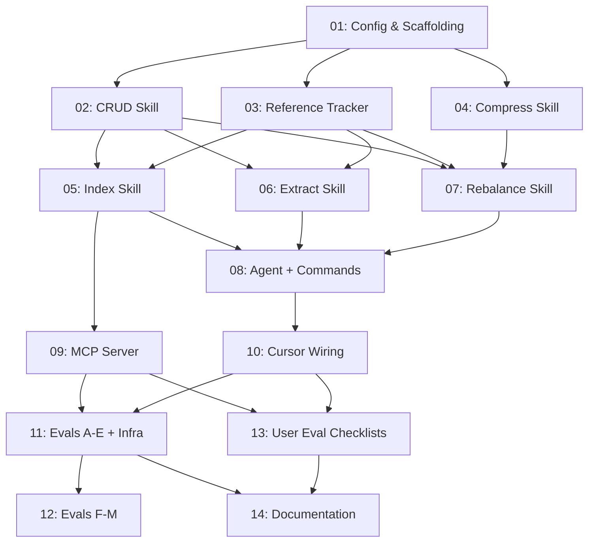

# Plan: CRUX Memories System

## Status
Ready for Review

## Overview

Implement the full CRUX Memories system as specified in `docs/crux-memories.md`. This is a generalised, repo-agnostic memory system providing:

- **6 skills** for memory CRUD, reference tracking, indexing, extraction, rebalancing, and compression
- **1 agent** (`crux-cursor-memory-manager`) orchestrating all memory operations
- **2 commands** (`/crux-dream`, `/crux-mindreader`) as user entry points
- **Cursor platform wiring** (rule, hooks) — Claude Code and Generic platforms documented in spec only
- **MCP server** (`crux_mcp_server`) with HTTP+stdio modes, modular for future CRUX tools
- **Python eval suite** covering all 14 evaluation categories from the spec
- **Configuration** (`.crux/crux-memories.json`) and directory scaffolding (`memories/`)

The system uses `plan` as its `unitOfWork` (configured, not hard-coded).

## Key Decisions

1. **Python structure**: Separate top-level directories — `crux_mcp_server/` for the MCP server, `evals/` for Python tests
2. **Dependencies**: Each Python directory has its own `requirements.txt` (`crux_mcp_server/`, `evals/`)
3. **Platform wiring**: Cursor only as real files; Claude Code and Generic documented in the spec
4. **Index script**: Co-located at `.cursor/skills/crux-skill-memory-index/scripts/memory-index.py`
5. **MCP server**: `crux_mcp_server/` at root, named `crux_mcp_server`, decomposed/modular structure, HTTP+stdio via `-t` param, memory tools as first module
6. **unitOfWork**: `plan` (configurable in `.crux/crux-memories.json`)

## Requirements

1. All components described in `docs/crux-memories.md` Sections 1-7 must be implemented
2. Config schema matches Section 2 with `unitOfWork` set to `plan`
3. Memory file format, frontmatter, and naming conventions per Section 1
4. Dream and REM sleep workflows per Section 1
5. Reference tracking externalised to `.crux/reference-tracking/*.refs.yml`
6. Memory index built by Python script, output to `.crux/memory-index.yml`
7. MCP server implements `memory-search`, `memory-read`, `memory-stats` tools
8. MCP server supports both HTTP and stdio transport via `-t` parameter
9. MCP server is modular — memory tools are the first module, architecture supports adding other CRUX tools
10. All 14 eval categories (A-N) from Section 8 implemented as Python tests
11. Cursor platform wiring: rule, hooks, commands
12. Documentation updated: README.md, CONTRIBUTORS.md, AGENTS.md

## Subtask Manifest

Dependencies are **direct only** — transitive dependencies are not listed. If subtask B depends on A, and C depends on B, then C does not list A.

| ID | File | Subagent | Dependencies | Phase | Status |
|----|------|----------|-------------|-------|--------|
| 01 | `subtask-01-memories-config-scaffolding-20260403.md` | generalPurpose | — | 1 | Done |
| 02 | `subtask-02-memories-crud-skill-20260403.md` | generalPurpose | 01 | 2 | Done |
| 03 | `subtask-03-memories-reference-tracker-skill-20260403.md` | generalPurpose | 01 | 2 | Done |
| 04 | `subtask-04-memories-compress-skill-20260403.md` | generalPurpose | 01 | 2 | Done |
| 05 | `subtask-05-memories-index-skill-20260403.md` | generalPurpose | 02, 03 | 3 | Done |
| 06 | `subtask-06-memories-extract-skill-20260403.md` | generalPurpose | 02, 03 | 3 | Done |
| 07 | `subtask-07-memories-rebalance-skill-20260403.md` | generalPurpose | 02, 03, 04 | 3 | Done |
| 08 | `subtask-08-memories-agent-commands-20260403.md` | generalPurpose | 05, 06, 07 | 4 | Done |
| 09 | `subtask-09-memories-mcp-server-20260403.md` | generalPurpose | 05 | 4 | Done |
| 10 | `subtask-10-memories-cursor-wiring-20260403.md` | generalPurpose | 08 | 5 | Done |
| 11 | `subtask-11-memories-evals-20260403.md` | generalPurpose | 09, 10 | 6 | Done |
| 12 | `subtask-12-memories-evals-integration-20260403.md` | generalPurpose | 11 | 7 | Done |
| 13 | `subtask-13-memories-evals-user-checklists-20260403.md` | generalPurpose | 09, 10 | 6 | Done |
| 14 | `subtask-14-memories-documentation-20260403.md` | docs-sync-agent | 11, 13 | 7 | Done |

## Subtask Dependency Graph

Edges show direct dependencies only (matching the manifest).

## Execution Order

### Phase 1
| ID | Subagent | Description |
|----|----------|-------------|
| 01 | generalPurpose | Config schema, `.crux/crux-memories.json`, `memories/` directory tree, `.gitignore` |

### Phase 2 (Parallel, after Phase 1)
| ID | Subagent | Description |
|----|----------|-------------|
| 02 | generalPurpose | Memory CRUD skill — create, read, update, delete with frontmatter management |
| 03 | generalPurpose | Reference tracker skill — `.refs.yml` lifecycle, strength sync |
| 04 | generalPurpose | Compress skill — adaptive CRUX compression of memory files |

### Phase 3 (Parallel, after Phase 2)
| ID | Subagent | Description |
|----|----------|-------------|
| 05 | generalPurpose | Index skill — Python script building `.crux/memory-index.yml` from memory corpus |
| 06 | generalPurpose | Extract skill — analyse execution artifacts, propose candidate facts, detect conflicts |
| 07 | generalPurpose | Rebalance skill — promote, demote, archive, consolidate based on strength and usage |

### Phase 4 (Parallel, after Phase 3)
| ID | Subagent | Description |
|----|----------|-------------|
| 08 | generalPurpose | Agent definition (`crux-cursor-memory-manager`) + commands (`/crux-dream`, `/crux-mindreader`) |
| 09 | generalPurpose | MCP server (`crux_mcp_server`) — modular, HTTP+stdio, memory tools |

### Phase 5 (after Phase 4)
| ID | Subagent | Description |
|----|----------|-------------|
| 10 | generalPurpose | Cursor wiring — integration rule, session-start hook, post-dream hook |

### Phase 6 (Parallel, after Phase 5)
| ID | Subagent | Description |
|----|----------|-------------|
| 11 | generalPurpose | Eval infrastructure + test categories A-E + `scripts/test.sh` update |
| 13 | generalPurpose | User eval checklists (J, N, interactive B/C scenarios) |

### Phase 7 (Parallel, after Phase 6)
| ID | Subagent | Description |
|----|----------|-------------|
| 12 | generalPurpose | Eval test categories F-M |
| 14 | docs-sync-agent | Documentation updates — README.md, CONTRIBUTORS.md, AGENTS.md |

## Definition of Done
- [ ] All 14 subtasks completed
- [ ] All Python tests passing (`pytest evals/`)
- [ ] No linter errors in modified files
- [ ] Documentation updated (README.md, CONTRIBUTORS.md, AGENTS.md)
- [ ] CRUX files updated for any modified source rules
- [ ] `.crux/crux-memories.json` config validates against spec schema
- [ ] `memories/` directory tree matches spec structure
- [ ] MCP server starts in both HTTP and stdio modes
- [ ] All 6 skills have SKILL.md with clear instructions
- [ ] Agent definition references all skills correctly
- [ ] Commands invoke agent correctly
- [ ] Cursor hooks detect memory-enabled config and behave accordingly

## Rollback

All changes are on the `feat/memories` branch. To revert, reset the branch to pre-execution state. No changes are made to `main` until the plan is complete and merged.

## Execution Notes
[Filled in during/after execution]
