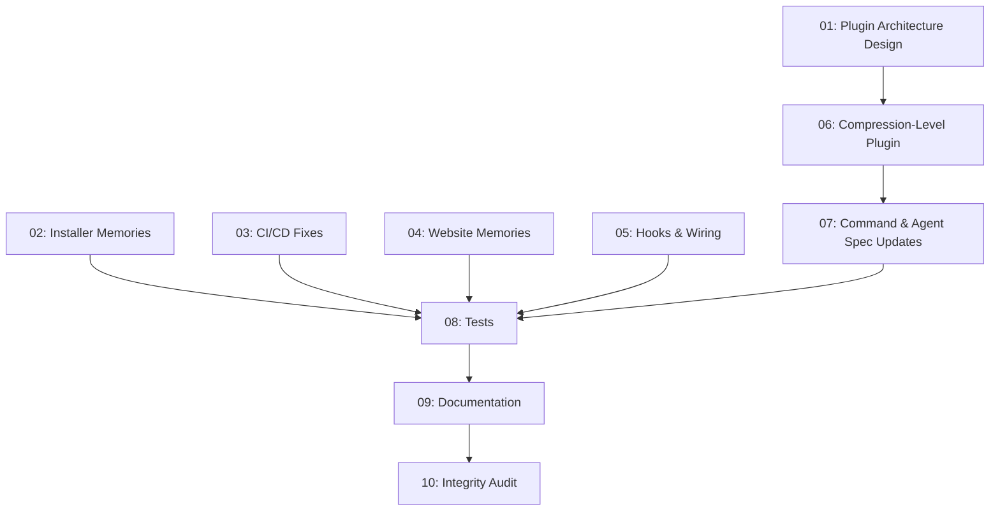

# Plan: Memories & Plugin Integration

## Status
Draft

## Overview

Two workstreams to bring CRUX-Compress to full feature integration maturity:

1. **Memories Integration Completeness** — Audit and fix gaps in the installer, CI/CD, website, hooks, and documentation so the memories feature (disabled by default) is fully discoverable and correctly wired across all project touchpoints.

2. **Compression Level Plugin Refactor** — Extend the existing plugin architecture with a "default-enabled" mechanism, then refactor the compression percentage/ratio enforcement into a `compression-level` reference plugin. This establishes the plugin system as a first-class extensibility pattern without breaking any existing workflows.

## Gap Analysis (from exploration)

### Memories Integration Gaps

| Area | Current State | Gap |
|------|--------------|-----|
| **Installer (`install.py`)** | No memory-related files in `RELEASE_FILES` | Config, skills, commands, agent not installable |
| **CI/CD (`test.yml`)** | References `install.sh` (doesn't exist), `bats tests/*.bats` (no bats files), `pytest plugins/zoto-spec-system/tests/` (may not exist) | Broken/misleading CI steps |
| **Website (`index.html`)** | No CRUX Memories section; only `M{...}` notation mention | Missing feature visibility |
| **hooks.json** | `crux-post-dream.py` exists but not registered | By design (invoked programmatically), but needs documentation clarity |
| **`.cursor/mcp.json`** | Not committed to repo | MCP semantic search documented but not wired as default |
| **Memory corpus** | Empty `memories/`, empty index | Correct for disabled-by-default |
| **Previous plan DoD** | Subtasks marked Done but DoD checkboxes unchecked | Plan closure incomplete |

### Compression Level Gaps

| Area | Current State | Gap |
|------|--------------|-----|
| **`crux-utils.py`** | `--ratio` hardcodes 20% target | Should be configurable; 20% ≠ spec default of 25% |
| **Plugin registry** | 3 plugins, none default-enabled | No mechanism for `enabledByDefault` |
| **Level enforcement** | Spread across CRUX.md spec, command, agent | No clean plugin boundary |
| **CONTRIBUTORS.md** | No plugin section | Missing contributor guidance |

## Key Decisions

1. **Installer scope for memories**: Add memory components as optional post-install enablement, not in the core distribution zip. Install `.crux/crux-memories.json` (with `enableMemories: false`) and a setup guide. Do not add memory skills/commands to the dist zip (they remain dev-time components per existing CONTRIBUTORS guidance).
   - Rationale: Keeps the core installer lightweight; memories are opt-in by nature.

2. **Plugin default-enabled mechanism**: Add `enabledByDefault: true|false` field to registry entries. When no explicit `--plugin` flags are present, load all `enabledByDefault: true` plugins. When explicit `--plugin` flags are specified, load only those (opt-in overrides defaults). Optionally support `--no-plugin <name>` to disable a specific default.
   - Rationale: Zero breaking changes — existing commands work identically; the default plugin produces the same output as the current hardcoded behavior.

3. **What moves into the compression-level plugin**: The **ratio validation and metrics generation** (checking `afterTokens/beforeTokens` against target, writing `cruxLevel`/`beforeTokens`/`afterTokens`/`reducedBy` to frontmatter). The **level resolution** (CLI → frontmatter → default 25/80) stays in the core orchestrator as it's needed before compression begins.
   - Rationale: Clean separation — core handles "what level to target," plugin handles "did we meet it and what are the metrics."

4. **crux-utils.py fix**: Make `--ratio` accept `--target <n>` parameter (default 25). This fixes the 20% ≠ 25% spec mismatch and makes the tool plugin-friendly.
   - Rationale: Bugfix + extensibility in one change.

5. **CRUX.md**: Do NOT modify. The spec's `target_ratio ≤ level/100` quality gate is implementation-agnostic — whether checked by core or plugin doesn't affect the spec.
   - Rationale: CRUX.md is read-only per foundational rules.

6. **CI/CD fixes**: Update `test.yml` to reference `install.py` (not `install.sh`), remove bats references, conditionally run plugin tests.
   - Rationale: Align CI with actual repository state.

7. **Website memories section**: Add a feature card similar to existing compression types. Brief, note opt-in nature, link to README.
   - Rationale: Feature discoverability without overloading the landing page.

8. **hooks.json for crux-post-dream.py**: Do NOT register. It is invoked programmatically by the `/crux-dream` workflow, not as a Cursor event. Document this explicitly in the hook file header.
   - Rationale: Matches existing design intent; avoids confusing event-driven hooks with workflow-invoked scripts.

## Requirements

1. All memories-related gaps in installer, CI, website, hooks are addressed
2. Plugin `enabledByDefault` mechanism is implemented in registry schema and command spec
3. `compression-level` plugin is registered, documented, and functions as reference implementation
4. `crux-utils.py --ratio` accepts configurable `--target` parameter (default 25)
5. Command spec (`crux-compress.md`) updated for default plugin loading
6. Agent spec (`crux-cursor-rule-manager.md`) updated to delegate metrics to plugin when active
7. All existing commands continue to work identically (zero breaking changes)
8. Tests cover both workstreams: memory integration points and plugin backward compatibility
9. Documentation updated across README.md, CONTRIBUTORS.md, website

## Subtask Manifest

| ID | File | Subagent | Dependencies | Phase | Status |
|----|------|----------|-------------|-------|--------|
| 01 | `subtask-01-mpi-plugin-architecture-design-20260404.md` | generalPurpose | — | 1 | Pending |
| 02 | `subtask-02-mpi-installer-memories-20260404.md` | generalPurpose | — | 1 | Pending |
| 03 | `subtask-03-mpi-cicd-fixes-20260404.md` | generalPurpose | — | 1 | Pending |
| 04 | `subtask-04-mpi-website-memories-20260404.md` | generalPurpose | — | 1 | Pending |
| 05 | `subtask-05-mpi-hooks-wiring-20260404.md` | generalPurpose | — | 1 | Pending |
| 06 | `subtask-06-mpi-compression-level-plugin-20260404.md` | generalPurpose | 01 | 2 | Pending |
| 07 | `subtask-07-mpi-command-agent-spec-updates-20260404.md` | generalPurpose | 06 | 3 | Pending |
| 08 | `subtask-08-mpi-tests-20260404.md` | generalPurpose | 02, 03, 04, 05, 07 | 4 | Pending |
| 09 | `subtask-09-mpi-documentation-20260404.md` | docs-sync-agent | 08 | 5 | Pending |
| 10 | `subtask-10-mpi-integrity-audit-20260404.md` | integrity-expert | 09 | 6 | Pending |

## Subtask Dependency Graph

## Execution Order

### Phase 1 (Parallel)
| ID | Subagent | Description |
|----|----------|-------------|
| 01 | generalPurpose | Design `enabledByDefault` plugin mechanism, `compression-level` plugin interface, registry schema extension |
| 02 | generalPurpose | Add optional memory components to `install.py`, update completion report |
| 03 | generalPurpose | Fix `test.yml`: install.sh→install.py, remove bats refs, conditional plugin tests |
| 04 | generalPurpose | Add CRUX Memories section to website landing page |
| 05 | generalPurpose | Clarify hook invocation model, verify MCP documentation, close memories plan DoD |

### Phase 2 (after Phase 1)
| ID | Subagent | Description |
|----|----------|-------------|
| 06 | generalPurpose | Implement `compression-level` plugin: registry entry, `crux-utils.py` configurable target, plugin behavior spec |

### Phase 3 (after Phase 2)
| ID | Subagent | Description |
|----|----------|-------------|
| 07 | generalPurpose | Update `crux-compress.md` for default plugin loading; update `crux-cursor-rule-manager.md` to delegate metrics to plugin |

### Phase 4 (after all implementation)
| ID | Subagent | Description |
|----|----------|-------------|
| 08 | generalPurpose | Add eval tests for plugin backward compat, installer memory support, CI pipeline validity |

### Phase 5 (after tests)
| ID | Subagent | Description |
|----|----------|-------------|
| 09 | docs-sync-agent | Update README.md, CONTRIBUTORS.md for plugin system and memories integration |

### Phase 6 (after docs)
| ID | Subagent | Description |
|----|----------|-------------|
| 10 | integrity-expert | Full integrity audit: CRUX sync, test pass, lint clean, backward compat verification |

## Definition of Done
- [ ] All 10 subtasks completed
- [ ] All tests passing (`python3 scripts/test.py`)
- [ ] No linter errors in modified files
- [ ] Documentation updated (README.md, CONTRIBUTORS.md)
- [ ] CRUX files updated for any modified source rules
- [ ] Existing `/crux-compress` commands produce identical output (backward compat)
- [ ] `compression-level` plugin is registered and enabled by default
- [ ] `crux-utils.py --ratio` accepts `--target` parameter
- [ ] Website includes memories section
- [ ] CI/CD workflow runs cleanly against actual repo state
- [ ] Installer can optionally set up memory system components

## Execution Notes
[Filled in during/after execution]
