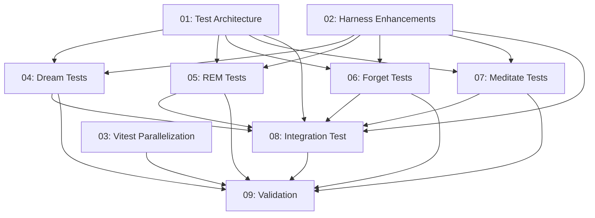

# Spec: SDK Eval Suite Expansion — Full CRUX Memories Coverage

## Status
Draft

## Overview

Expand the TypeScript SDK eval suite at `evals/sdk/` from 3 test files (24 tests covering J/O/P) to 8 test files (~57 tests, ≈60 with margin) covering **every CRUX Memories feature that relies on LLM agent interaction**. The authoritative test scenarios come from `evals/USER_EVAL_CHECKLISTS.md`.

**Test count breakdown**: J(10) + O(7) + P(8) existing = 25 + B(8) + C(8) + R(6) + Q(6) + N(4) new = 32. Total ≈ 57. Per-subtask minimums are floors; the final count of ~60 is approximate and may vary as subtask 01 validates the architecture.

Checklist categories N2 (Claude Code wiring verification) and N3 (Generic platform shell script verification) are **excluded** — they are structural/file-verification checks that do not involve LLM agent interaction and are already covered by the Python evals. Existing J/O/P tests are included for regression validation, not modification.

The spec also optimizes for:
- **Correctness**: Resilient assertions against non-deterministic agent output using OR-patterns, structural checks, and file-system ground truth
- **Performance**: Minimizing wall-clock time via Vitest multi-fork parallelization, batched assertions per agent turn, and shared worktrees within describe blocks

## Key Decisions

- **Decision 1: Categories to add** — B (Dream), C (REM Sleep), Q (Meditate), R (Forget), N (Cross-Platform integration). These are the five checklist categories that rely on LLM interaction and currently lack SDK tests.
- **Decision 2: Dream fixtures** — `createSpecFixture()` helper creates a mock completed spec directory with `_execution-state.yml`, subtask files with execution notes, and optional dream summary files. This avoids needing a real spec execution.
- **Decision 3: Meditate simplification** — Q1 and Q2 test facet derivation + subagent spawning + consolidated output. Q3 tests code-reference facets. We verify the high-level flow (subagent spawning, facet count, memory references in output) rather than tracing every recursion level — full 3-level verification is prohibitively expensive at 5-10 minutes per test.
- **Decision 4: REM Sleep aged fixtures** — `seedAgedMemory()` helper backdates `created`/`modified` fields and tracker `last_referenced` to simulate memories older than `demoteAfterDaysUnreferenced` (90 days) and `archiveAfterDaysUnreferenced` (180 days).
- **Decision 5: Parallelization** — Switch from `singleFork: true` to `maxForks: 2` (conservative start to avoid API rate limiting). Each test file already creates its own isolated worktree, so there is no shared state between files. Increase to `maxForks: 3-4` after validation confirms no rate-limit issues. Expected wall-clock reduction: ~50+ minutes sequential → ~25-30 minutes parallel (with `maxForks: 2`).
- **Decision 6: New harness helpers** — `createSpecFixture()`, `seedAgedMemory()`, `createConflictingMemories()`, `createTrackerFixture()`, `createOrphanedTracker()`, `assertMemoryDeleted()`, `assertMemoryExists()`, `countMemoryFiles()`, `listTrackerFiles()`.
- **Decision 7: Timeout budget** — 240s default (unchanged), 300s for multi-turn Dream/REM/Forget, 480s for Meditate, 600s for N1 integration.
- **Decision 8: N1 integration scope** — Tests the Cursor full flow (Dream → post-dream index rebuild → Recall → Remember → Forget → Amnesia toggle) in a single multi-turn agent session. Meditate and REM are excluded from N1 to keep it under 10 minutes. They are covered individually in their own test files.
- **Decision 10: N2/N3 exclusion** — Checklist scenarios N2 (Claude Code wiring) and N3 (Generic platform shell scripts) are structural/file-verification checks that do not involve LLM agent interaction. They are out of scope for the SDK eval suite. The existing Python evals already cover config parsing and file structure validation.
- **Decision 11: Dream/REM non-interactive directives** — The SDK uses single-turn `agent.send()` which cannot interactively accept/reject candidates. **All prompts must be fully non-interactive directives** that embed acceptance/rejection intent directly in the command text (e.g., "accept all candidate facts and write the dream summary"). The agent cannot receive follow-up input. Tests focus on ground-truth assertions (files created/moved) rather than prompt-response flow.
- **Decision 12: Expensive test gating (default: skip)** — Meditate and Integration tests are gated behind an `SDK_EVAL_SKIP_EXPENSIVE` environment variable that **defaults to `"true"`**. When `"true"` (or unset), these suites are skipped via `describe.skipIf()`. To run expensive tests, explicitly set `SDK_EVAL_SKIP_EXPENSIVE=false`. This prevents accidental API spend during routine runs while still allowing explicit invocation via `SDK_EVAL_SKIP_EXPENSIVE=false pnpm test:meditate` or `pnpm test:integration`.
- **Decision 13: Exponential backoff retry on rate-limit** — The harness provides `withRetry()` and `sendWithRetry()` helpers that wrap `agent.send()` with exponential backoff (base 2s, max 60s, up to 5 retries) on rate-limit errors (HTTP 429 / "rate limit" / "too many requests"). Non-rate-limit errors are thrown immediately. This mitigates API rate limiting when running concurrent test forks.
- **Decision 14: Global test execution max duration** — The `SDK_EVAL_MAX_DURATION_MS` environment variable (default: `3600000` = 60 minutes) sets an absolute wall-clock deadline for the entire test suite. When reached, the vitest setup forcefully terminates the process with exit code 1, logging the last known state. This prevents runaway test sessions from accumulating unbounded API costs.
- **Decision 9: Agent assignments** — All implementation subtasks use `crux-software-engineer` per AGENTS.md. Architecture/design review uses `crux-platform-architect`.

## Requirements

1. Every checklist scenario in `evals/USER_EVAL_CHECKLISTS.md` categories B, C, J, O, P, Q, R, N1 must have corresponding SDK tests
2. Tests must use the existing harness infrastructure (`collectRun`, `assertOutputContains`, `createIsolatedWorkspace`, etc.)
3. Assertions must be resilient to non-deterministic agent output (OR-patterns, case-insensitive, multiple synonym acceptance)
4. File-system assertions must verify ground truth (memory files created/deleted, index rebuilt, trackers cleaned up)
5. Total wall-clock time for the full suite (~60 tests) must be under 30 minutes with parallel forks
6. No test may modify the real repository — all tests use isolated git worktrees in `/tmp/`
7. Each new test file must have a corresponding `test:<category>` npm script in `package.json`
8. Tests must not trigger global test suites — only targeted assertions on directly affected files

## Subtask Manifest

Every subtask is listed here with its file, assigned agent, dependencies, and phase.
Subtask IDs are numbered in dependency order — lower IDs never depend on higher IDs.

| ID | File | Subagent | Dependencies | Phase | Status |
|----|------|----------|-------------|-------|--------|
| 01 | `subtask-01-sdk-eval-test-architecture-20260426.md` | crux-platform-architect | — | 1 | Pending |
| 02 | `subtask-02-sdk-eval-harness-enhancements-20260426.md` | crux-software-engineer | — | 1 | Pending |
| 03 | `subtask-03-sdk-eval-vitest-parallelization-20260426.md` | crux-software-engineer | — | 1 | Pending |
| 04 | `subtask-04-sdk-eval-dream-tests-20260426.md` | crux-software-engineer | 01, 02 | 2 | Pending |
| 05 | `subtask-05-sdk-eval-rem-tests-20260426.md` | crux-software-engineer | 01, 02 | 2 | Pending |
| 06 | `subtask-06-sdk-eval-forget-tests-20260426.md` | crux-software-engineer | 01, 02 | 2 | Pending |
| 07 | `subtask-07-sdk-eval-meditate-tests-20260426.md` | crux-software-engineer | 01, 02 | 2 | Pending |
| 08 | `subtask-08-sdk-eval-integration-test-20260426.md` | crux-software-engineer | 01, 02, 04, 05, 06, 07 | 3 | Pending |
| 09 | `subtask-09-sdk-eval-validation-profiling-20260426.md` | crux-software-engineer | 03, 04, 05, 06, 07, 08 | 4 | Pending |

## Subtask Dependency Graph

## Execution Order

Phases are derived from the dependency graph. Subtasks within a phase have no
dependencies on each other and may run in parallel. A phase starts only after
all subtasks in prior phases are complete.

### Phase 1 (Parallel)
| ID | Subagent | Description |
|----|----------|-------------|
| 01 | crux-platform-architect | Design test architecture, assertion patterns, fixture strategy, timeout budget, and correctness/performance trade-offs |
| 02 | crux-software-engineer | Add new fixture/assertion helpers to `helpers/harness.ts` and export from `helpers/index.ts` |
| 03 | crux-software-engineer | Update `vitest.config.ts` for multi-fork execution, add npm scripts to `package.json` |

### Phase 2 (after Phase 1)
| ID | Subagent | Description |
|----|----------|-------------|
| 04 | crux-software-engineer | Create `tests/b-dream.test.ts` covering B1, B2, B3 scenarios |
| 05 | crux-software-engineer | Create `tests/c-rem.test.ts` covering C1, C2, C3 scenarios |
| 06 | crux-software-engineer | Create `tests/r-forget.test.ts` covering R1, R2 scenarios |
| 07 | crux-software-engineer | Create `tests/q-meditate.test.ts` covering Q1, Q2, Q3 scenarios |

### Phase 3 (after Phase 2)
| ID | Subagent | Description |
|----|----------|-------------|
| 08 | crux-software-engineer | Create `tests/n-integration.test.ts` for N1 Cursor full-flow test |

### Phase 4 (after Phase 3)
| ID | Subagent | Description |
|----|----------|-------------|
| 09 | crux-software-engineer | Run full suite with parallel forks, profile wall-clock times, document results, fix any issues |

## Definition of Done
- [ ] All subtasks completed
- [ ] All new tests pass (run via `pnpm test` in `evals/sdk/`)
- [ ] Existing 24 tests (J, O, P) continue to pass
- [ ] No linter errors in modified files
- [ ] Full suite runs in under 30 minutes with parallel forks
- [ ] Every checklist scenario in B, C, Q, R, N1 has at least one corresponding SDK test
- [ ] `package.json` has `test:<category>` scripts for all 8 test files

## Execution Notes
[Filled in during/after execution]
