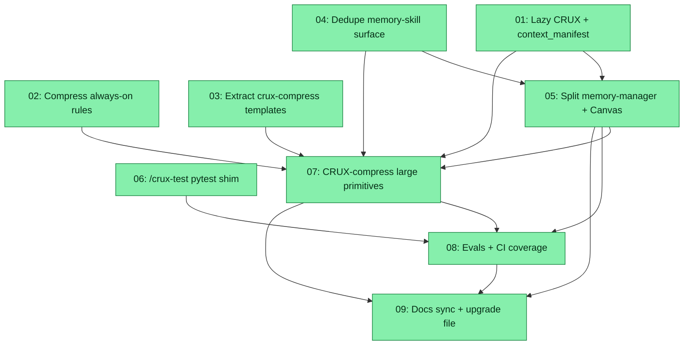

# Spec: Context Token Reduction — Skills, Commands, Agents, Rules

## Status
Ready for Review

## Overview

The `analysis/context-token-reduction-report.md` audit found that a realistic `/z-spec-execute` pass loads **~270K tokens** of system+spec context, with `CRUX.md` alone accounting for **~70K tokens of repeated per-subagent loads**. This spec implements the **high-value, low-to-medium-risk** context-token reductions identified in that report — Options 1, 2, 3, 4, 5, 6, 7, 8, and 10 — while explicitly leaving Option 9 (hook / slash-command `contextLoadout` platform work) **out of scope**.

The work is split into nine subtasks arranged in five phases so that:
1. Cheap prose-only edits and template extractions land first and produce a leaner surface to compress.
2. The medium-risk `crux-cursor-memory-manager` split lands after its inputs (lazy-CRUX baseline + memory-skill dedupe) are final.
3. CRUX compression of the largest primitives runs last against the final source shape so we never have to compress twice.
4. Evals (Phase 4) then docs + upgrade file (Phase 5) close out the change.

The primary consumer-facing surface — `AGENTS.md <CRUX>` block, `_CRUX-RULE.mdc`, and every file listed in `.crux/dist-manifest.json` — is treated as a hard boundary. Any change that requires a new dist file is flagged explicitly and paired with a spec-local `upgrade-*.sh` so pre-spec installs can move forward without a shim.

**Analysis inputs**
- `analysis/context-token-reduction-report.md` (primary — options, redundancy catalogue, sequencing).
- `analysis/context-usage-hash-ids-and-hooks.md` (context for the additive `context_manifest` protocol in Subtask 01; Opt 9 hook loadout work is **out of scope**).

## Key Decisions

- **KD-1 — Scope**: Adopt Options 1, 2, 3, 4, 5, 6, 7, 8, 10. Option 9 (slash-command / hook `contextLoadout` platform work) is **explicitly out of scope** for this spec.
- **KD-2 — Compression approach for agents/commands/skills (Opt 2)**: **USER OVERRIDE (registration_model, 2026-07-13):** Non-registering editable source + generated compressed loadable that Cursor registers. **Commands/agents:** SoT = `<name>.source.mdx`; compressed loadable = `<name>.md` (frontmatter preserved; body = CRUX; generated banner/`sourceChecksum` as appropriate). **Skills:** SoT = `SKILL.mdx`; compressed loadable = `SKILL.md`. Remove mistaken `<name>.crux.md` / `SKILL.crux.md` companions for agents/commands/skills (rules still use `.crux.mdc`). Edit SoT only; regenerate loadable. Confidence ≥ 90%. Prior approach (c) and overrides #1–#3 naming variants are superseded. [memory:CRUX Compressed File Protection] [memory:Skill and Agent References by name]
- **KD-3 — Memory-manager split (Opt 4) BC**: Split `crux-cursor-memory-manager` into thin mode-scoped agents (`crux-memory-dream`, `crux-memory-rem`, `crux-memory-recall`, `crux-memory-remember`, `crux-memory-forget`). The umbrella `crux-cursor-memory-manager.md` is retained **only** as a documented, temporary dispatcher/shim per `spec-implementation-hygiene.mdc` Rule 2 exception (single spec, upgrade file provided). All in-repo callers (commands + evals + AGENTS.md tables) are re-pointed in the same change set. The shim is removed after one minor release once thin agents ship in the dist zip; deprecation notices name **behavior and removal criteria**, never a spec id (hygiene Rule 1).
- **KD-4 — `context_manifest` protocol (Opt 5) is additive and promise-based**: The parent passes a compact JSON stanza in the subagent task prompt (`context_manifest: { agents_md: "loaded", crux_md: "loaded"|"not_loaded", … }`). Subagents read it and skip redundant loads. If the manifest is absent, subagents fall back to today's behavior (load per prompt). No hook or Cursor platform dependency.
- **KD-5 — Dist manifest changes gated on explicit later user approval**: Any new file that consumers must receive (extracted templates, new thin agents, `_memory-shared.md`) is flagged in the owning subtask's Definition of Done with the exact `SOURCE_DIST_FILES` addition required and a request for the user to approve `scripts/create-crux-zip.py` edits at review time. The spec **does not** modify `scripts/create-crux-zip.py` itself.
- **KD-6 — Upgrade file(s) per spec-implementation-hygiene Rule 3**: Every subtask that requires action on an existing install (regenerate CRUX, re-point command references, rename memory-manager references, ship new template files, re-run indexer) contributes idempotent steps to a single spec-local `upgrade-context-token-reduction.sh` aggregated in Subtask 09. The script is `--yes`-gated by default so re-runs are safe.
- **KD-7 — Version bump**: This spec is a `feat` set. Per `version-bump.crux.mdc`, a **minor** version bump applies on the commit that lands the spec. The bump is called out in the DoD but performed by the release engineer at merge time — not during spec execution.
- **KD-8 — Repo-internal agents may be optimized aggressively**: `crux-platform-architect`, `crux-software-engineer`, `integrity-expert`, `docs-sync-agent` are non-dist and can be reshaped (lazy-CRUX, compressed) without BC concerns for consumers.
- **KD-9 — `/crux-test` (Opt 8) is non-dist**: `.cursor/commands/crux-test.md` is not in `.crux/dist-manifest.json`. Replacing it with a pytest shim requires no consumer-facing change.
- **KD-10 — Sequencing**: Compress last. Prose/extraction/split subtasks (S01–S05) run before the CRUX compression subtask (S07) so we compress the leanest possible source once. S06 (`/crux-test` shim) is Explicitly skipped by S07 and may run in parallel with S07.
- **KD-11 — Opt 1 × Opt 2 decompression safety**: Registered loadable paths (`<name>.md` / `SKILL.md`) carry generated CRUX bodies; editable SoT lives in `<name>.source.mdx` / `SKILL.mdx`. `_CRUX-RULE.mdc` **must retain** the CRUX Decompression — CRITICAL primer (and Path Construction / Compressed File Protection) so agents can decompress loadable CRUX. Do **not** put fat plaintext into registering `.md`/`SKILL.md` after compression; edit SoT only.

## Requirements

1. Lazy-load `CRUX.md`: only agents that actually read/write/validate CRUX notation retain the unconditional load (Opt 1). Update the `<CRUX>` **preamble** load cue and align foundational rule #1 so both say: interpret CRUX already in context; load `CRUX.md` only when work touches CRUX notation. Consumer-facing wording preserved in the shipped `<CRUX>` block.
2. `context_manifest` prelude protocol (Opt 5) documented in AGENTS.md and honored by all long agents; fallback path preserved.
3. Always-on rule surface (`_CRUX-RULE.mdc`, `spec-agent-allocation.md`, memory rules) compressed and de-overlapped (Opt 7).
4. Extract Canvas template and `/crux-compress` per-source-type subagent prompts into lazily-loaded template files (Opt 6).
5. Memory skill shared surface (config table, Pattern A/B, Related blocks, "What This Skill Does NOT Do") consolidated into a single `_memory-shared.md` and cross-referenced from each skill (Opt 3 + Opt 10).
6. `crux-cursor-memory-manager` split into mode-scoped thin agents with documented umbrella shim (Opt 4); all commands / evals / AGENTS.md tables re-pointed in the same change set.
7. Selected agents/commands/skills CRUX-compressed with confidence ≥ 90% (Opt 2); source paths preserved; evals retuned; token savings recorded.
8. `/crux-test` replaced by a thin shim invoking a pytest-driven eval suite (Opt 8); test cases live in code, not prose.
9. New / updated evals cover: (a) no unconditional `CRUX.md` load in non-CRUX agents, (b) `context_manifest` is passed and honored, (c) template files load only on their cold paths, (d) split memory-manager thin agents resolve and behave correctly per mode, (e) compressed primitives semantically preserve the source, (f) `/crux-test` shim runs the pytest suite end-to-end.
10. `upgrade-context-token-reduction.sh` in the spec directory is idempotent and captures every action a pre-spec install must take.
11. Documentation synchronized per `docs-sync.crux.mdc`: README / CONTRIBUTORS / web content updated to reflect new agent surface, template locations, and pytest-driven `/crux-test`.
12. No modification to `scripts/create-crux-zip.py` during this spec. Any file that must be added to the dist manifest is flagged for explicit later user approval.

## Subtask Manifest

| ID | File | Subagent | Dependencies | Phase | Status |
|----|------|----------|-------------|-------|--------|
| 01 | `subtask-01-lazy-cruxmd-and-context-manifest-20260713.md` | crux-platform-architect | — | 1 | Done |
| 02 | `subtask-02-compress-always-on-rules-20260713.md` | crux-cursor-rule-manager | — | 1 | Done |
| 03 | `subtask-03-extract-crux-compress-templates-20260713.md` | crux-platform-architect | — | 1 | Done |
| 04 | `subtask-04-dedupe-memory-skill-shared-surface-20260713.md` | crux-platform-architect | — | 1 | Done |
| 05 | `subtask-05-split-memory-manager-and-canvas-template-20260713.md` | crux-platform-architect | 01, 04 | 2 | Done |
| 06 | `subtask-06-crux-test-pytest-shim-20260713.md` | crux-software-engineer | — | 1 | Done |
| 07 | `subtask-07-crux-compress-large-primitives-20260713.md` | crux-cursor-rule-manager | 01, 02, 03, 04, 05 | 3 | Done |
| 08 | `subtask-08-evals-and-ci-coverage-20260713.md` | crux-software-engineer | 05, 06, 07 | 4 | Done |
| 09 | `subtask-09-docs-sync-and-upgrade-file-20260713.md` | crux-software-engineer | 05, 07, 08 | 5 | Done |

## Subtask Dependency Graph

## Execution Order

Phases are derived from the dependency graph. Subtasks within a phase share no file-write conflicts and may run in parallel (subject to `spec.parallelLimit`, default 4).

### Phase 1 (Parallel — up to 4 concurrent per config)
| ID | Subagent | Description |
|----|----------|-------------|
| 01 | crux-platform-architect | Rewrite per-agent "load CRUX.md" prompts to be conditional; add `context_manifest` prelude protocol to AGENTS.md; slim foundational rule #1 |
| 02 | crux-cursor-rule-manager | CRUX-compress `spec-agent-allocation.md`; slim `_CRUX-RULE.mdc`; audit + trim memory-integration ↔ mcp-context overlap |
| 03 | crux-platform-architect | Extract the five "When invoked with…" per-source-type subagent prompts from `crux-compress.md` into a lazily-loaded template file |
| 04 | crux-platform-architect | Consolidate memory-skill config tables, Pattern A/B references, `## Related` and `## What This Skill Does NOT Do` blocks into `.cursor/skills/_memory-shared.md` |
| 06 | crux-software-engineer | Replace `crux-test.md` body with a thin pytest-shim; move test cases into `evals/` |

### Phase 2 (after Phase 1)
| ID | Subagent | Description |
|----|----------|-------------|
| 05 | crux-platform-architect | Split `crux-cursor-memory-manager` into `crux-memory-{dream,rem,recall,remember,forget}`; retain umbrella as documented temporary shim; extract Canvas template into `crux-memory-recall` or a template file; re-point all in-repo callers |

### Phase 3 (after Phase 2)
| ID | Subagent | Description |
|----|----------|-------------|
| 07 | crux-cursor-rule-manager | Wave-compress: `crux-meditate.md` → `crux-cursor-meditation-guide.md` → `crux-compress.md` → post-split memory agents → meditation skills → memory-skill files (post-dedupe). Confidence ≥ 90% per file. Roll back any file that fails semantic equivalence checks |

### Phase 4 (after Phase 3)
| ID | Subagent | Description |
|----|----------|-------------|
| 08 | crux-software-engineer | Write / update evals: lazy-CRUX enforcement, `context_manifest` honoring, template lazy-load, memory-agent split resolution, compressed-primitive semantic parity, `/crux-test` shim |

### Phase 5 (after Phase 4)
| ID | Subagent | Description |
|----|----------|-------------|
| 09 | crux-software-engineer | Write idempotent `upgrade-context-token-reduction.sh`; surgically update README / CONTRIBUTORS / web per `docs-sync.crux.mdc`; note version bump; enumerate dist-manifest additions awaiting user approval; produce execution report |

## Definition of Done

- [x] All nine subtasks marked completed with judge verdict `verified`
- [x] `pnpm --filter zoto-spec-system-runtime run spec-onstop-check -- --human --repo-root .` (or `tsx plugins/zoto-spec-system/scripts/spec-onstop-check.ts --human --repo-root .` if invoked directly) returns exit `0`
- [x] Full `python3 scripts/test.py` suite passes (BATS + pytest); evals under `evals/` pass
- [x] `python3 -m evals.<crux_command_suite>` (from Subtask 06) passes and matches previous `/crux-test` semantic coverage
- [x] No linter errors in files modified by any subtask
- [x] `specs/20260713-context-token-reduction/upgrade-context-token-reduction.sh` is idempotent, `--yes`-gated, and passes `bash -n` (syntax) plus one dry-run against a scratch copy
- [x] Any file the subtasks propose adding to the dist zip is listed in the execution report under a **Dist manifest additions — awaiting user approval** section, with the exact `SOURCE_DIST_FILES` diff. `scripts/create-crux-zip.py` is **not** modified as part of the spec.
- [x] `AGENTS.md` `<CRUX agents="always">` block edits remain consumer-safe (no repo-internal-only agents leak into the block; no reference to non-dist files)
- [x] Docs synchronized per `docs-sync.crux.mdc` (README, CONTRIBUTORS, `web/compress.md/` where relevant)
- [x] Baseline vs post-spec token-cost measurement recorded in the execution report for at least three canonical workflows: (a) trivial Q&A, (b) `/crux-dream <spec>`, (c) a 10-subtask `/z-spec-execute` dry-run
- [x] Version bump per `version-bump.crux.mdc` noted in the commit message body (minor bump — `feat`); actual `.crux/crux.json` bump left to the release commit at merge time, not performed inside the spec

## Execution Notes

_Started: 2026-07-13 07:10:15 UTC_
_Execution complete (pending user approval): 2026-07-13_

### KD-2 override timeline
1. Spec originally specified report approach (c) in-place CRUX bodies on registering paths.
2. User override #1: adjacent `.crux.md` with registering `.md` as SoT — Wave 1–2 companions existed; compress.md HEAD restore lost post-S03 dispatchers.
3. User override #2: proposed `.mdx`/`.crux.md` (blocked — registration mismatch).
4. User override #3: skills `SKILL.mdx`→`SKILL.md`; commands/agents briefly `.mdx`→`.crux.md`.
5. **Authoritative (registration_model answer):** commands/agents `<name>.source.mdx` → compressed `<name>.md`; skills `SKILL.mdx` → `SKILL.md`; remove agent/command `.crux.md` companions.

### Final layout (S07)
Wave 1–2: eight targets use `<name>.source.mdx` (SoT) + `<name>.md` (CRUX loadable); KD-11 bootstrap on loadables; Waves 3–5 deferred.

### Final verification
- All S01–S09 `completed` + judge `verified`
- `python3 scripts/test.py` → 863 passed, 11 skipped
- `python3 scripts/run_crux_command_suite.py` → pass
- Upgrade script `bash -n` + dry-run OK
- `scripts/create-crux-zip.py` unmodified
- Execution report: `execution-report-context-token-reduction-20260713.md`
- Dist-manifest additions awaiting user approval (see execution report)
- Memory extension disabled in config — no `/crux-dream` nudge

[memory:CRUX Compressed File Protection] [memory:Skill and Agent References by name]

